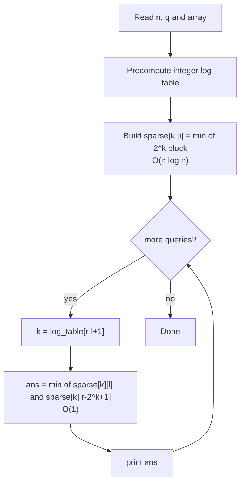
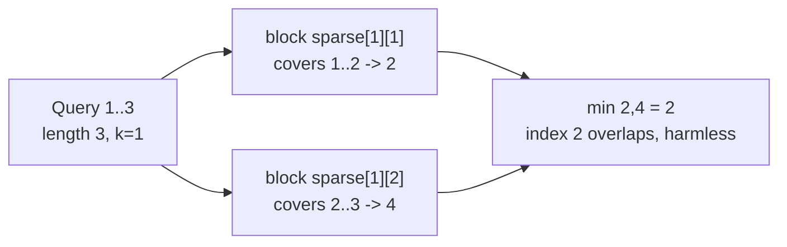

# CSES 1647 — Static Range Minimum Queries

| Field      | Value                                               |
| ---------- | --------------------------------------------------- |
| Source     | CSES Problem Set                                    |
| Difficulty | Easy–Medium                                          |
| Topics     | Sparse table, Idempotent RMQ, Range minimum         |
| Link       | https://cses.fi/problemset/task/1647                |

---

## Problem Statement

You are given an array of $n$ integers. Your task is to process $q$ queries of
the form: *what is the minimum value in the range $[a, b]$* (1-indexed,
inclusive)?

The array is **static** — there are no updates between queries. This is the
defining setting for a sparse table.

Constraints (typical CSES limits):

$$
1 \le n, q \le 2 \cdot 10^5, \qquad 1 \le x_i \le 10^9.
$$

```text
Input
8 4
3 2 4 5 1 1 5 3
2 4
5 6
1 8
3 3

Output
2
1
1
4
```

Query `2 4` → min of values at positions 2..4 = $\min(2,4,5) = 2$.
Query `1 8` → min of the whole array $= 1$.

## Approach (WHY)

Many queries, no updates, operation is $\min$ (idempotent) → **sparse table**
is the textbook fit. Precompute `sparse[k][i]` = minimum of the $2^k$ elements
starting at $i$ in $O(n \log n)$, then answer each query in $O(1)$ by combining
the two power-of-two blocks that cover $[l, r]$.

Overlap between the two blocks is harmless because $\min(x, x) = x$
(idempotency), so we do not need a disjoint decomposition.



## Solution

Read input with fast I/O (CSES inputs are large). Convert the 1-indexed query
$[a, b]$ to 0-indexed $[a-1, b-1]$.

### Python

```python
import sys

def main():
    data = sys.stdin.buffer.read().split()
    idx = 0
    n = int(data[idx]); q = int(data[idx + 1]); idx += 2
    a = [int(data[idx + i]) for i in range(n)]
    idx += n

    # integer log table
    log = [0] * (n + 1)
    for i in range(2, n + 1):
        log[i] = log[i >> 1] + 1

    K = log[n] + 1
    sparse = [a[:]]                       # row 0: length-1 intervals
    for k in range(1, K):
        half = 1 << (k - 1)
        prev = sparse[k - 1]
        row = [min(prev[i], prev[i + half])
               for i in range(n - (1 << k) + 1)]
        sparse.append(row)

    out = []
    for _ in range(q):
        l = int(data[idx]) - 1
        r = int(data[idx + 1]) - 1
        idx += 2
        k = log[r - l + 1]
        out.append(min(sparse[k][l], sparse[k][r - (1 << k) + 1]))

    sys.stdout.write("\n".join(map(str, out)) + "\n")

if __name__ == "__main__":
    main()
```

### C++

```cpp
#include <bits/stdc++.h>
using namespace std;

int main() {
    ios::sync_with_stdio(false);
    cin.tie(nullptr);

    int n, q;
    cin >> n >> q;
    vector<long long> a(n);
    for (auto& x : a) cin >> x;

    vector<int> logv(n + 1, 0);
    for (int i = 2; i <= n; ++i)
        logv[i] = logv[i >> 1] + 1;

    int K = logv[n] + 1;
    vector<vector<long long>> sparse(K);
    sparse[0] = a;                              // row 0
    for (int k = 1; k < K; ++k) {
        int half = 1 << (k - 1);
        int span = 1 << k;
        sparse[k].resize(n - span + 1);
        for (int i = 0; i + span <= n; ++i)
            sparse[k][i] = min(sparse[k - 1][i], sparse[k - 1][i + half]);
    }

    string out;
    while (q--) {
        int l, r;
        cin >> l >> r;
        --l; --r;                               // to 0-indexed
        int k = logv[r - l + 1];
        long long ans = min(sparse[k][l], sparse[k][r - (1 << k) + 1]);
        out += to_string(ans);
        out += '\n';
    }
    cout << out;
    return 0;
}
```

## Iteration Trace

Array (0-indexed): `[3, 2, 4, 5, 1, 1, 5, 3]`, so $n = 8$, $K = 4$.

Building selected rows:

| Row $k$ | Length $2^k$ | `sparse[k]` values                          |
| ------- | ------------ | ------------------------------------------- |
| $0$     | $1$          | `3 2 4 5 1 1 5 3`                            |
| $1$     | $2$          | `2 2 4 1 1 1 3`                             |
| $2$     | $4$          | `2 1 1 1 1`                                 |
| $3$     | $8$          | `1`                                         |

Answering the sample queries (converted to 0-indexed):

| Query $[l,r]$ | $L=r-l+1$ | $k=\log L$ | blocks combined                        | answer |
| ------------- | --------- | ---------- | -------------------------------------- | ------ |
| $[1,3]$       | $3$       | $1$        | `sparse[1][1]=2`, `sparse[1][2]=4`     | $2$    |
| $[4,5]$       | $2$       | $1$        | `sparse[1][4]=1`, `sparse[1][4]=1`     | $1$    |
| $[0,7]$       | $8$       | $3$        | `sparse[3][0]=1`, `sparse[3][0]=1`     | $1$    |
| $[2,2]$       | $1$       | $0$        | `sparse[0][2]=4`, `sparse[0][2]=4`     | $4$    |



## Complexity

Build dominates preprocessing; each query is constant time.

$$
T_\text{build} = O(n \log n), \qquad
T_\text{query} = O(1), \qquad
S = O(n \log n).
$$

| Phase        | Time          | Space         |
| ------------ | ------------- | ------------- |
| Log table    | $O(n)$        | $O(n)$        |
| Build table  | $O(n \log n)$ | $O(n \log n)$ |
| Each query   | $O(1)$        | —             |
| All $q$ queries | $O(q)$     | —             |

## Takeaway

Static array + idempotent operation ($\min$) + many queries is the *signature*
of a sparse table. Precompute power-of-two block minima once, then every query
collapses to one `min` of two overlapping blocks — the overlap costs nothing
thanks to idempotency.
