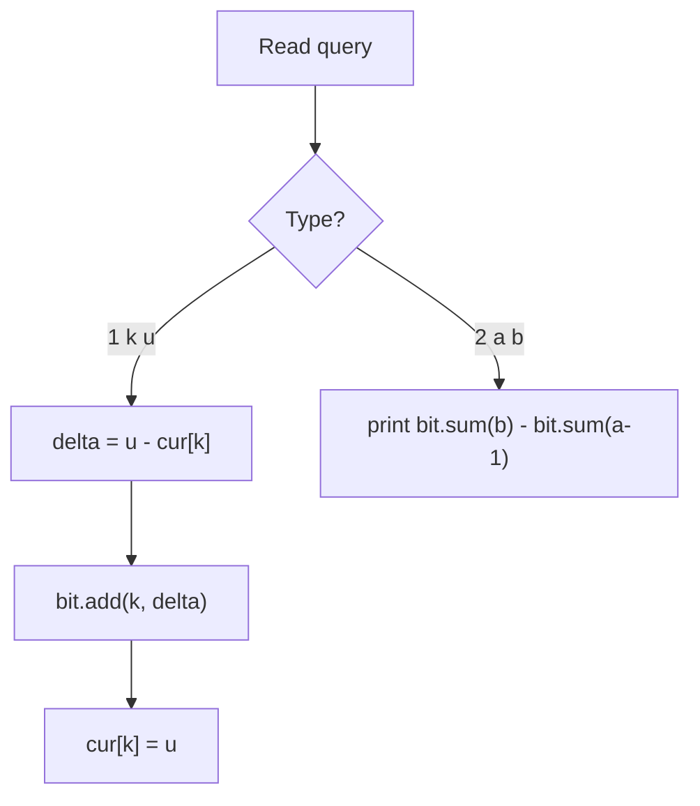
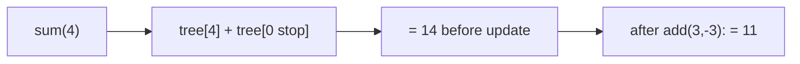

# Dynamic Range Sum Queries (Fenwick / BIT)

| Meta | Value |
|------|-------|
| Source | CSES Problem Set — Range Queries |
| Difficulty | Medium |
| Topics | Fenwick Tree / BIT, Point Update, Range Query |
| Link | https://cses.fi/problemset/task/1648 |

---

## Problem Statement

You are given an array of $n$ integers and must process $q$ queries of two kinds:

1. `1 k u` — set the value at position $k$ to $u$ (**point update**).
2. `2 a b` — print the sum of values in the range $[a, b]$ (**range query**).

Constraints: $1 \le n, q \le 2 \cdot 10^5$ and values up to $10^9$, so we need
$O(\log n)$ per operation. A Fenwick tree handles both in $O(\log n)$.

Note: type 1 is an **assignment**, not an add. To apply it to a BIT (which adds deltas) we update
by `u - old[k]` and remember the new value.

```
Input
8 4
3 2 4 5 1 1 5 3
2 1 4
2 5 6
1 3 1
2 1 4

Output
14
2
11
```

Explanation: $3+2+4+5 = 14$, then $1+1 = 2$. After setting position 3 to 1, the array is
$[3,2,1,5,\dots]$ so $3+2+1+5 = 11$.

---

## Approach (WHY)

A prefix-sum array answers a range query in $O(1)$ but needs an $O(n)$ rebuild on every update.
A Fenwick tree balances both at $O(\log n)$ by storing partial block sums indexed by the
**lowbit** trick. A range sum is the difference of two prefix sums:

$$
\text{sum}(a, b) = \text{prefix}(b) - \text{prefix}(a - 1)
$$

For the assignment query we convert to a delta: `add(k, u - current[k])` then `current[k] = u`.



---

## Solution

### Python

```python
import sys


class BIT:
    def __init__(self, n: int) -> None:
        self.n = n
        self.tree = [0] * (n + 1)

    def add(self, i: int, delta: int) -> None:
        while i <= self.n:
            self.tree[i] += delta
            i += i & (-i)

    def sum(self, i: int) -> int:
        s = 0
        while i > 0:
            s += self.tree[i]
            i -= i & (-i)
        return s

    def range_sum(self, a: int, b: int) -> int:
        return self.sum(b) - self.sum(a - 1)


def main() -> None:
    data = sys.stdin.buffer.read().split()
    idx = 0
    n = int(data[idx]); idx += 1
    q = int(data[idx]); idx += 1

    cur = [0] * (n + 1)
    bit = BIT(n)
    for i in range(1, n + 1):
        cur[i] = int(data[idx]); idx += 1
        bit.add(i, cur[i])

    out = []
    for _ in range(q):
        t = int(data[idx]); idx += 1
        if t == 1:
            k = int(data[idx]); idx += 1
            u = int(data[idx]); idx += 1
            bit.add(k, u - cur[k])
            cur[k] = u
        else:
            a = int(data[idx]); idx += 1
            b = int(data[idx]); idx += 1
            out.append(str(bit.range_sum(a, b)))

    sys.stdout.write("\n".join(out) + ("\n" if out else ""))


main()
```

### C++

```cpp
#include <bits/stdc++.h>
using namespace std;

struct BIT {
    int n;
    vector<long long> tree;

    BIT(int n) : n(n), tree(n + 1, 0) {}

    void add(int i, long long delta) {
        for (; i <= n; i += i & (-i))
            tree[i] += delta;
    }

    long long sum(int i) {
        long long s = 0;
        for (; i > 0; i -= i & (-i))
            s += tree[i];
        return s;
    }

    long long range_sum(int a, int b) {
        return sum(b) - sum(a - 1);
    }
};

int main() {
    ios::sync_with_stdio(false);
    cin.tie(nullptr);

    int n, q;
    cin >> n >> q;

    vector<long long> cur(n + 1, 0);
    BIT bit(n);
    for (int i = 1; i <= n; i++) {
        cin >> cur[i];
        bit.add(i, cur[i]);
    }

    string out;
    for (int t = 0; t < q; t++) {
        int type;
        cin >> type;
        if (type == 1) {
            int k; long long u;
            cin >> k >> u;
            bit.add(k, u - cur[k]);
            cur[k] = u;
        } else {
            int a, b;
            cin >> a >> b;
            out += to_string(bit.range_sum(a, b));
            out += '\n';
        }
    }
    cout << out;
    return 0;
}
```

---

## Iteration Trace

Array starts as `[_,3,2,4,5,1,1,5,3]` (1-indexed). The BIT cells after building:

| Step | Action | Effect |
|------|--------|--------|
| build | add 1..8 | `tree[1]=3, tree[2]=5, tree[4]=14, tree[8]=24, ...` |
| `2 1 4` | `sum(4) - sum(0)` | $14 - 0 = 14$ |
| `2 5 6` | `sum(6) - sum(4)` | $16 - 14 = 2$ |
| `1 3 1` | `add(3, 1 - 4) = add(3, -3)` | `cur[3] = 1` |
| `2 1 4` | `sum(4) - sum(0)` | $11 - 0 = 11$ |



---

## Complexity

Each query touches $O(\log n)$ BIT cells; there are $q$ queries and an $O(n \log n)$ (or $O(n)$
linear) build.

$$
T = O\big((n + q)\log n\big), \qquad S = O(n)
$$

| Operation | Time |
|-----------|------|
| Build | $O(n \log n)$ |
| Point update | $O(\log n)$ |
| Range query | $O(\log n)$ |
| Total | $O((n + q)\log n)$ |

---

## Takeaway

A Fenwick tree is the shortest, fastest structure for **point update + prefix/range sum**. The
only twist here is converting an assignment into an additive delta by tracking the current value.
