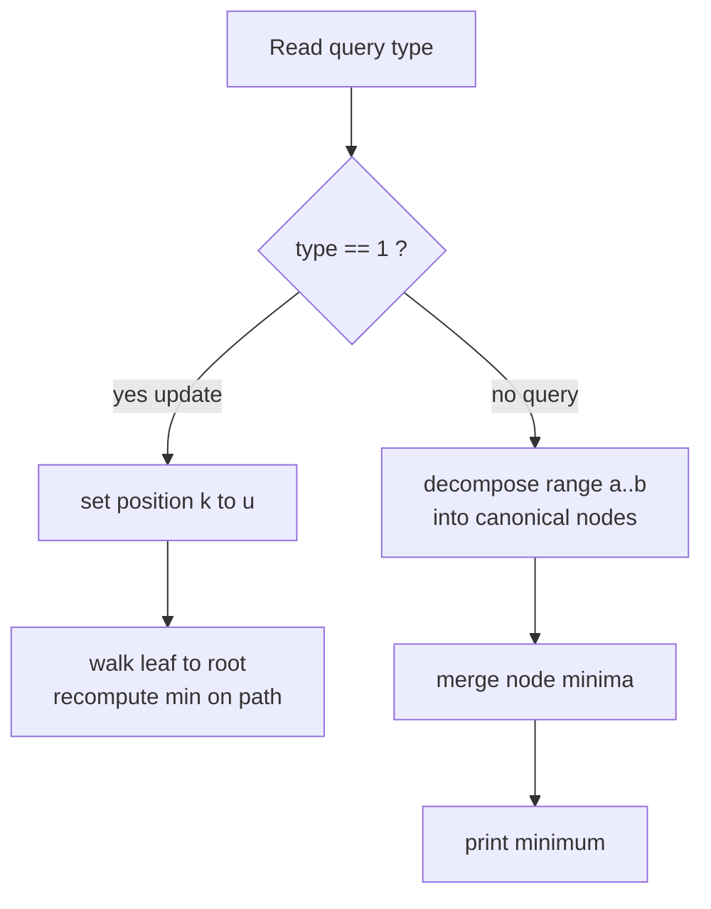

# CSES 1649 — Dynamic Range Minimum Queries

| Field | Value |
|-------|-------|
| Source | CSES Problem Set (Range Queries) |
| Difficulty | Medium |
| Topics | Segment tree, point update, range minimum query |
| Link | https://cses.fi/problemset/task/1649 |

---

## Problem Statement

You are given an array of $n$ integers. Process $q$ queries of two kinds:

- `1 k u` — set the value at position $k$ to $u$ (point update).
- `2 a b` — print the **minimum** value in the range $[a, b]$ (range query).

Constraints: $1 \le n, q \le 2 \cdot 10^5$ and values fit in a 32-bit range but can be summed/compared safely with 64-bit. Positions are $1$-indexed.

We need an operation that, for every query, runs in $O(\log n)$. Since updates and range-min queries are interleaved, a static sparse table will not do — we need a **segment tree** over the $\min$ operation.

```
Input
8 4
3 2 4 5 1 1 5 3
2 1 4
2 5 6
1 3 1
2 1 4

Output
2
1
1
```

Explanation: $\min(3,2,4,5) = 2$; $\min(1,1) = 1$; after setting position $3$ to $1$, the array is `3 2 1 5 1 1 5 3`, so $\min(3,2,1,5) = 1$.

---

## Approach (WHY)

The merge operation here is $\min$, which is **associative** with identity $+\infty$:

$$
\min(\min(a, b), c) = \min(a, \min(b, c)), \qquad \min(a, +\infty) = a.
$$

That is exactly the requirement for a segment tree. Each node stores the minimum of its segment; an update touches one root-to-leaf path, and a range-min query decomposes $[a, b]$ into $O(\log n)$ canonical nodes.



We use the inclusive recursive form. The identity returned for a non-overlapping segment is a large sentinel `INF` so it never wins a $\min$.

---

## Solution

### Python

```python
import sys
input = sys.stdin.readline

class MinSegTree:
    def __init__(self, data):
        self.n = len(data)
        self.INF = float('inf')
        self.tree = [self.INF] * (2 * self.n)
        for i in range(self.n):
            self.tree[self.n + i] = data[i]
        for i in range(self.n - 1, 0, -1):
            self.tree[i] = min(self.tree[2 * i], self.tree[2 * i + 1])

    def update(self, i, v):
        i += self.n
        self.tree[i] = v
        i //= 2
        while i >= 1:
            self.tree[i] = min(self.tree[2 * i], self.tree[2 * i + 1])
            i //= 2

    def query(self, l, r):              # half-open [l, r)
        res = self.INF
        l += self.n
        r += self.n
        while l < r:
            if l & 1:
                res = min(res, self.tree[l]); l += 1
            if r & 1:
                r -= 1; res = min(res, self.tree[r])
            l //= 2
            r //= 2
        return res

def main():
    data = sys.stdin.buffer.read().split()
    idx = 0
    n = int(data[idx]); idx += 1
    q = int(data[idx]); idx += 1
    arr = [int(data[idx + i]) for i in range(n)]
    idx += n
    st = MinSegTree(arr)
    out = []
    for _ in range(q):
        t = int(data[idx]); a = int(data[idx + 1]); b = int(data[idx + 2])
        idx += 3
        if t == 1:
            st.update(a - 1, b)         # 1-indexed -> 0-indexed
        else:
            out.append(str(st.query(a - 1, b)))   # [a-1, b) == inclusive [a, b]
    print('\n'.join(out))

main()
```

### C++

```cpp
#include <bits/stdc++.h>
using namespace std;

struct MinSegTree {
    int n;
    const long long INF = 1e18;
    vector<long long> tree;

    MinSegTree(const vector<long long>& data) {
        n = (int)data.size();
        tree.assign(2 * n, INF);
        for (int i = 0; i < n; ++i) tree[n + i] = data[i];
        for (int i = n - 1; i >= 1; --i)
            tree[i] = min(tree[2 * i], tree[2 * i + 1]);
    }

    void update(int i, long long v) {
        i += n;
        tree[i] = v;
        for (i /= 2; i >= 1; i /= 2)
            tree[i] = min(tree[2 * i], tree[2 * i + 1]);
    }

    long long query(int l, int r) {        // half-open [l, r)
        long long res = INF;
        for (l += n, r += n; l < r; l /= 2, r /= 2) {
            if (l & 1) res = min(res, tree[l++]);
            if (r & 1) res = min(res, tree[--r]);
        }
        return res;
    }
};

int main() {
    ios::sync_with_stdio(false);
    cin.tie(nullptr);

    int n, q;
    cin >> n >> q;
    vector<long long> arr(n);
    for (auto& x : arr) cin >> x;

    MinSegTree st(arr);
    string out;
    while (q--) {
        int t; long long a, b;
        cin >> t >> a >> b;
        if (t == 1) {
            st.update((int)a - 1, b);          // 1-indexed -> 0-indexed
        } else {
            out += to_string(st.query((int)a - 1, (int)b));  // inclusive [a, b]
            out += '\n';
        }
    }
    cout << out;
    return 0;
}
```

---

## Iteration Trace

Array `3 2 4 5 1 1 5 3` ($n = 8$), iterative tree positions `8..15` are the leaves.

| Step | Operation | Action | Result |
|------|-----------|--------|--------|
| 1 | `2 1 4` | query `[0,4)` → merge leaves at positions 8..11 minima | $\min(3,2,4,5) = 2$ |
| 2 | `2 5 6` | query `[4,6)` → minima of positions 12,13 | $\min(1,1) = 1$ |
| 3 | `1 3 1` | update index 2 to 1, pull path $10 \to 5 \to 2 \to 1$ | array `3 2 1 5 1 1 5 3` |
| 4 | `2 1 4` | query `[0,4)` again | $\min(3,2,1,5) = 1$ |

---

## Complexity

Build is $O(n)$. Each of the $q$ operations (update or query) is $O(\log n)$:

$$
T = O(n + q \log n), \qquad \text{Space} = O(n).
$$

| Phase | Time | Space |
|-------|------|-------|
| Build | $O(n)$ | $O(n)$ |
| Update | $O(\log n)$ | $O(1)$ |
| Query | $O(\log n)$ | $O(1)$ |
| Total ($q$ ops) | $O(n + q \log n)$ | $O(n)$ |

---

## Takeaway

Range-min with point updates is the textbook segment tree on the associative $\min$ operation. The iterative bottom-up tree keeps the code short and the constant factor low — ideal for the tight CSES limits. Remember to convert 1-indexed input to 0-indexed and to use a large `INF` identity so non-overlapping segments never affect the minimum.
