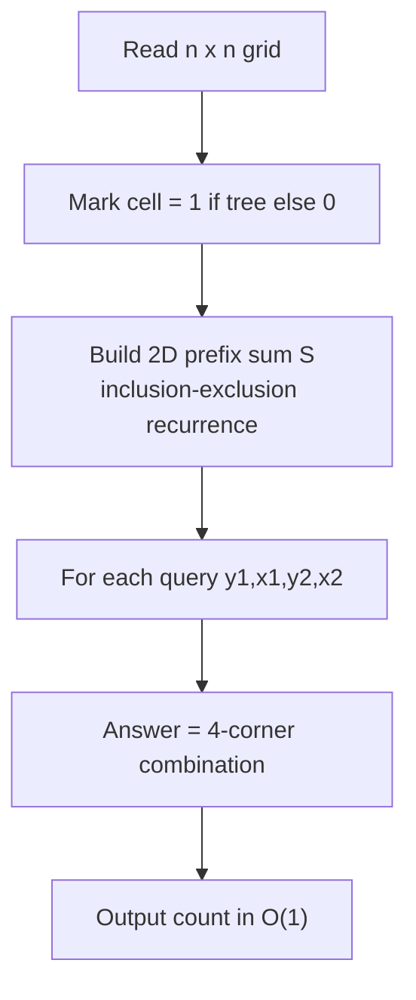

# Forest Queries (CSES — 2D Prefix Sums)

| Meta | Value |
|------|-------|
| Source | CSES Problem Set — Range Queries |
| Difficulty | Easy / Medium |
| Topics | 2D Prefix Sums, Inclusion–Exclusion, Static Range Query |
| Link | https://cses.fi/problemset/task/1652 |

---

## Problem Statement

You are given an $n \times n$ grid representing a forest. Each cell is either a tree (`*`) or empty
(`.`). You must answer $q$ queries. Each query gives the corners of a sub-rectangle and asks **how many
trees** lie inside it.

Each query has $(y_1, x_1, y_2, x_2)$: the top-left cell $(y_1, x_1)$ and bottom-right cell
$(y_2, x_2)$, both inclusive and **1-indexed**.

- $1 \le n \le 1000$
- $1 \le q \le 2 \times 10^5$
- $1 \le y_1 \le y_2 \le n$, $\quad 1 \le x_1 \le x_2 \le n$

```
Input:
4 3
.*..
*.**
**..
****
2 2 3 4
3 1 3 1
1 1 2 2

Output:
3
1
2
```

The first query covers rows 2–3, cols 2–4 → 3 trees. The third covers rows 1–2, cols 1–2 → 2 trees.

---

## Approach (WHY)

With up to $2 \times 10^5$ queries on a $1000 \times 1000$ grid, scanning each rectangle per query is
$O(q \cdot n^2)$ — far too slow. Since the grid is **static** (no updates), precompute a **2D prefix
sum** $S$ where $S[i][j]$ is the number of trees in the rectangle from $(1,1)$ to $(i,j)$.

Build with the inclusion–exclusion recurrence, then answer each query in $O(1)$ by combining four
prefix corners. The grid is already 1-indexed in the input, which matches the natural $S$ layout with a
zero top row and left column.

$$
S[i][j] = a[i][j] + S[i-1][j] + S[i][j-1] - S[i-1][j-1]
$$

$$
\text{count} = S[y_2][x_2] - S[y_1-1][x_2] - S[y_2][x_1-1] + S[y_1-1][x_1-1]
$$



---

## Solution

### Python

```python
import sys

def main():
    data = sys.stdin.buffer.read().split()
    idx = 0
    n = int(data[idx]); idx += 1
    q = int(data[idx]); idx += 1

    # S has size (n+1) x (n+1) with a zero border at row/col 0.
    S = [[0] * (n + 1) for _ in range(n + 1)]
    for i in range(1, n + 1):
        row = data[idx].decode(); idx += 1
        for j in range(1, n + 1):
            cell = 1 if row[j - 1] == '*' else 0
            S[i][j] = cell + S[i - 1][j] + S[i][j - 1] - S[i - 1][j - 1]

    out = []
    for _ in range(q):
        y1 = int(data[idx]); x1 = int(data[idx + 1])
        y2 = int(data[idx + 2]); x2 = int(data[idx + 3])
        idx += 4
        count = S[y2][x2] - S[y1 - 1][x2] - S[y2][x1 - 1] + S[y1 - 1][x1 - 1]
        out.append(str(count))

    sys.stdout.write("\n".join(out) + "\n")

main()
```

### C++

```cpp
#include <bits/stdc++.h>
using namespace std;

int main() {
    ios::sync_with_stdio(false);
    cin.tie(nullptr);

    int n, q;
    cin >> n >> q;

    // S has size (n+1) x (n+1) with a zero border at row/col 0.
    vector<vector<int>> S(n + 1, vector<int>(n + 1, 0));
    for (int i = 1; i <= n; ++i) {
        string row;
        cin >> row;
        for (int j = 1; j <= n; ++j) {
            int cell = (row[j - 1] == '*') ? 1 : 0;
            S[i][j] = cell + S[i - 1][j] + S[i][j - 1] - S[i - 1][j - 1];
        }
    }

    string out;
    for (int t = 0; t < q; ++t) {
        int y1, x1, y2, x2;
        cin >> y1 >> x1 >> y2 >> x2;
        int count = S[y2][x2] - S[y1 - 1][x2] - S[y2][x1 - 1] + S[y1 - 1][x1 - 1];
        out += to_string(count);
        out += '\n';
    }
    cout << out;
    return 0;
}
```

---

## Iteration Trace

Grid (1-indexed, `*` = 1):

```
. * . .
* . * *
* * . .
* * * *
```

Prefix sum $S$ (row/col 0 omitted, all zeros):

| i\j | 1 | 2 | 3 | 4 |
|-----|---|---|---|---|
| **1** | 0 | 1 | 1 | 1 |
| **2** | 1 | 2 | 3 | 4 |
| **3** | 2 | 4 | 5 | 6 |
| **4** | 3 | 6 | 8 | 10 |

Query `2 2 3 4` → rows 2–3, cols 2–4:

$$
S[3][4] - S[1][4] - S[3][1] + S[1][1] = 6 - 1 - 2 + 0 = 3 \ \checkmark
$$

| Query | Formula | Value |
|-------|---------|-------|
| `2 2 3 4` | $6 - 1 - 2 + 0$ | 3 |
| `3 1 3 1` | $S[3][1]-S[2][1]-S[3][0]+S[2][0] = 2-1-0+0$ | 1 |
| `1 1 2 2` | $S[2][2]-S[0][2]-S[2][0]+S[0][0] = 2-0-0+0$ | 2 |

---

## Complexity

Build is one pass over the grid; each query is four array reads.

$$
T_{\text{build}} = O(n^2), \qquad T_{\text{query}} = O(1), \qquad T_{\text{total}} = O(n^2 + q)
$$

| Phase | Time | Space |
|-------|------|-------|
| Build prefix sum | $O(n^2)$ | $O(n^2)$ |
| Per query | $O(1)$ | — |
| Total | $O(n^2 + q)$ | $O(n^2)$ |

---

## Takeaway

When a grid is **static** and you face many rectangle-sum queries, a 2D prefix sum turns each query
into a constant-time four-corner inclusion–exclusion. Remember the sign pattern
$+\,-\,-\,+$ and the off-by-one: subtract the row *above* ($y_1-1$) and the column to the *left*
($x_1-1$), then add back the doubly-removed top-left corner.
