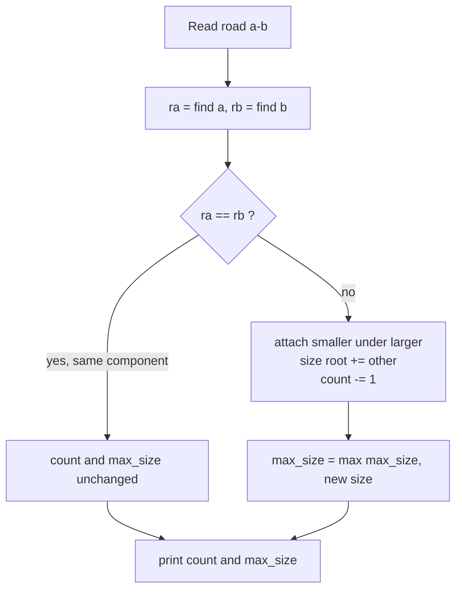
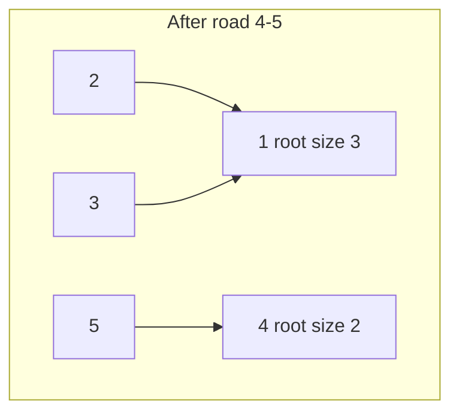

# CSES 1676 — Road Construction

| | |
|---|---|
| **Source** | CSES Problem Set (Graph Algorithms) |
| **Difficulty** | Easy–Medium |
| **Topics** | DSU / Union-Find, component count, component size |
| **Link** | https://cses.fi/problemset/task/1676 |

---

## Problem Statement

There are $n$ cities and initially **no roads** between them. You are given $m$ roads to build, one per day. After building each road you must report:

1. the **number of connected components** (groups of cities reachable from each other), and
2. the **size of the largest component**.

Constraints (typical): $1 \le n, m \le 10^5$. Cities are numbered $1 \ldots n$.

Each road connects two cities $a$ and $b$. A road may connect cities already in the same component (then nothing changes).

```
Input
5 3
1 2
1 3
4 5

Output
4 2
3 3
2 3
```

Explanation: start with $5$ singleton components.
- Build $1\!-\!2$: components $= 4$, largest $= 2$.
- Build $1\!-\!3$: component $\{1,2,3\}$, components $= 3$, largest $= 3$.
- Build $4\!-\!5$: components $\{1,2,3\}, \{4,5\}$, components $= 2$, largest $= 3$.

## Approach (WHY)

Roads are only ever **added** — this is **incremental connectivity**, the textbook use case for plain DSU. We never delete edges, so path compression + union by size is ideal and gives $O(\alpha(n))$ per operation.

Maintain two running statistics:

- `count` — start at $n$, decrement on each **successful** merge (the two endpoints were in different components).
- `max_size` — the largest component size seen so far; after a merge, the new root's size can only grow, so update `max_size` with it. It is **monotonically non-decreasing**, so a merge that does nothing leaves both stats unchanged.



## Solution

### Python

```python
import sys


def main() -> None:
    data = sys.stdin.buffer.read().split()
    idx = 0
    n = int(data[idx]); idx += 1
    m = int(data[idx]); idx += 1

    parent = list(range(n + 1))
    size = [1] * (n + 1)
    count = n
    max_size = 1

    def find(x: int) -> int:
        while parent[x] != x:
            parent[x] = parent[parent[x]]   # path halving
            x = parent[x]
        return x

    out = []
    for _ in range(m):
        a = int(data[idx]); idx += 1
        b = int(data[idx]); idx += 1
        ra, rb = find(a), find(b)
        if ra != rb:
            if size[ra] < size[rb]:
                ra, rb = rb, ra
            parent[rb] = ra
            size[ra] += size[rb]
            count -= 1
            if size[ra] > max_size:
                max_size = size[ra]
        out.append(f"{count} {max_size}")

    sys.stdout.write("\n".join(out) + "\n")


main()
```

### C++

```cpp
#include <bits/stdc++.h>
using namespace std;

int parent_[100005], sz[100005];

int find(int x) {
    while (parent_[x] != x) {
        parent_[x] = parent_[parent_[x]];   // path halving
        x = parent_[x];
    }
    return x;
}

int main() {
    ios::sync_with_stdio(false);
    cin.tie(nullptr);

    int n, m;
    cin >> n >> m;
    for (int i = 1; i <= n; ++i) { parent_[i] = i; sz[i] = 1; }

    int count = n;
    long long max_size = 1;

    string out;
    out.reserve((size_t)m * 8);
    for (int i = 0; i < m; ++i) {
        int a, b;
        cin >> a >> b;
        int ra = find(a), rb = find(b);
        if (ra != rb) {
            if (sz[ra] < sz[rb]) swap(ra, rb);
            parent_[rb] = ra;
            sz[ra] += sz[rb];
            --count;
            if (sz[ra] > max_size) max_size = sz[ra];
        }
        out += to_string(count);
        out += ' ';
        out += to_string(max_size);
        out += '\n';
    }
    cout << out;
    return 0;
}
```

## Iteration Trace

For $n = 5$ and roads $1\!-\!2,\ 1\!-\!3,\ 4\!-\!5$:

| Step | Road | find a | find b | Merged? | Components after | Largest size | Output |
|---|---|---|---|---|---|---|---|
| init | — | — | — | — | 5 | 1 | — |
| 1 | 1–2 | 1 | 2 | yes | 4 | 2 | `4 2` |
| 2 | 1–3 | 1 | 3 | yes | 3 | 3 | `3 3` |
| 3 | 4–5 | 4 | 5 | yes | 2 | 3 | `2 3` |

If a later road connected two already-joined cities (e.g. another `1–3`), the row would show **Merged? no** and repeat the previous output unchanged.



## Complexity

Let $n$ be cities and $m$ roads. Total time is

$$
O\bigl((n + m)\,\alpha(n)\bigr) \approx O(n + m),
$$

since the inverse-Ackermann factor $\alpha(n) \le 4$ for all realistic $n$.

| Resource | Bound |
|---|---|
| Time | $O((n + m)\,\alpha(n))$ |
| Space | $O(n)$ |

## Takeaway

Incremental (add-only) connectivity with live statistics is the canonical DSU job: keep `count` and `max_size` as you merge, update them **only on a successful union**, and remember `max_size` is monotonic so a no-op road simply re-prints the previous answer.
