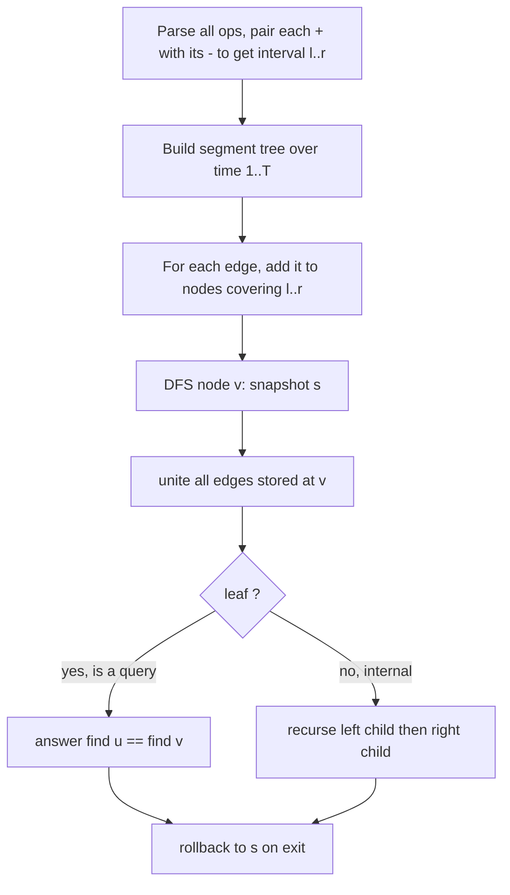
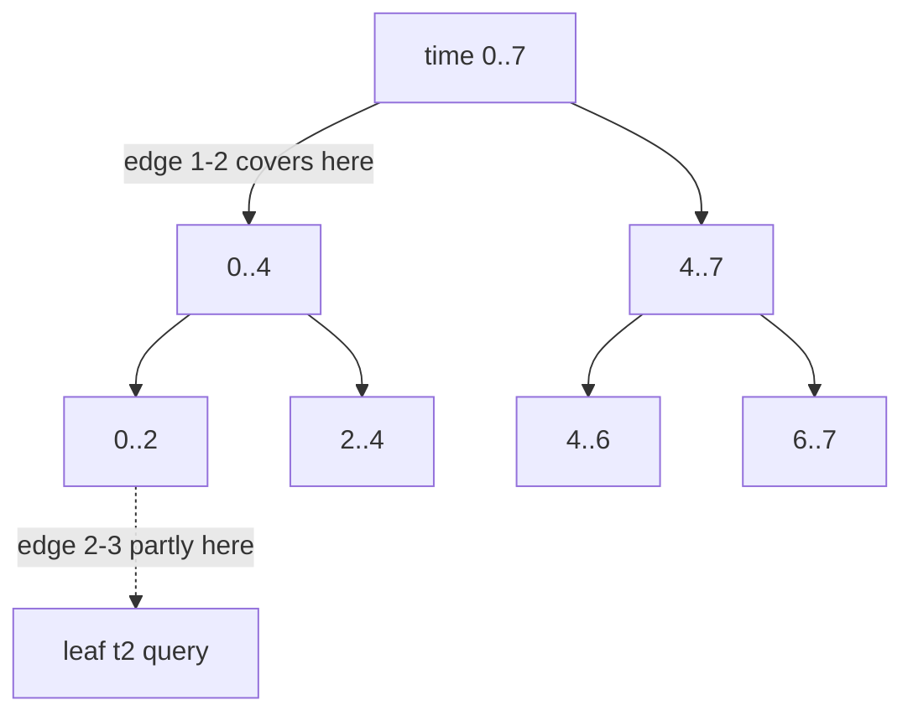

# Offline Dynamic Connectivity — Segment Tree on Time + DSU with Rollback

| | |
|---|---|
| **Source** | CSES Problem Set (technique problem) |
| **Difficulty** | Hard |
| **Topics** | Offline dynamic connectivity, segment tree on time, DSU with rollback |
| **Link** | https://cses.fi/problemset/ |

---

## Problem Statement

We are given $n$ vertices and a timeline of $T$ moments. Edges appear and disappear over time, and at certain moments we must answer connectivity queries. Concretely, process a script of operations indexed by time $t = 1 \ldots T$:

- `+ u v` — add an undirected edge $\{u, v\}$ (guaranteed not currently present).
- `- u v` — remove the edge $\{u, v\}$ (guaranteed currently present).
- `? u v` — report whether $u$ and $v$ are **connected** using only the edges present **at this moment**.

Each edge that is added at time $l$ and removed at time $r$ is **alive during the half-open interval** $[l, r)$. If an edge is never removed, it is alive until $T$.

Constraints (typical): $1 \le n \le 10^5$, $1 \le T \le 2\cdot 10^5$.

```
Input
4 7
+ 1 2
+ 2 3
? 1 3
- 2 3
? 1 3
+ 3 4
? 1 4

Output
YES
NO
NO
```

Explanation:
- At $t=3$: edges $\{1,2\},\{2,3\}$ present → $1$ and $3$ connected → `YES`.
- At $t=5$: edge $\{2,3\}$ removed → only $\{1,2\}$ → $1$ and $3$ not connected → `NO`.
- At $t=7$: edges $\{1,2\},\{3,4\}$ present → $1$ and $4$ in different components → `NO`.

## Approach (WHY)

Plain DSU only **adds** edges; it has no way to delete one. The standard **offline** trick removes the need for deletion entirely:

1. Compute each edge's **alive interval** $[l, r)$ on the time axis (open when added, closed when removed or at $T$).
2. Build a **segment tree over time**, with one leaf per time index $1 \ldots T$.
3. **Insert** each edge into the $O(\log T)$ canonical segment-tree nodes whose ranges exactly cover $[l, r)$. The edge "lives" on those nodes.
4. **DFS** the segment tree:
   - On **entering** a node: take a `snapshot`, then `unite` every edge stored at that node.
   - At a **leaf** that is a `?` query: answer using `find` (with the unions of all ancestors currently applied).
   - On **leaving** a node: `rollback` to the snapshot, undoing exactly this node's unions.

Why **rollback DSU** specifically? The DFS descends into the left child, then the right child. The left subtree's edges must **not** leak into the right subtree, so after finishing a subtree we must *undo* its unions — which path compression cannot do. Rollback DSU (union by rank, no compression) makes every `unite` reversible in $O(\log n)$.



## Solution

### Python

```python
import sys
from typing import List, Tuple


def main() -> None:
    input_data = sys.stdin.buffer.read().split()
    idx = 0
    n = int(input_data[idx]); idx += 1
    T = int(input_data[idx]); idx += 1

    # Parse operations.
    ops: List[Tuple[str, int, int]] = []
    for _ in range(T):
        op = input_data[idx].decode(); idx += 1
        u = int(input_data[idx]); idx += 1
        v = int(input_data[idx]); idx += 1
        ops.append((op, u, v))

    # Determine alive interval [l, r) for each added edge.
    # active maps a normalized edge -> time it was added.
    active = {}
    edge_intervals: List[Tuple[int, int, int, int]] = []  # (l, r, u, v)
    queries: List[Tuple[int, int, int]] = []              # (time, u, v)

    for t, (op, u, v) in enumerate(ops):
        if op == '+':
            key = (min(u, v), max(u, v))
            active[key] = t
        elif op == '-':
            key = (min(u, v), max(u, v))
            l = active.pop(key)
            edge_intervals.append((l, t, u, v))           # alive [l, t)
        else:  # '?'
            queries.append((t, u, v))
    # Edges never removed live until T.
    for key, l in active.items():
        edge_intervals.append((l, T, key[0], key[1]))

    # Segment tree over time: store edges on covering nodes.
    seg: List[List[Tuple[int, int]]] = [[] for _ in range(4 * max(T, 1))]

    def add_edge(node: int, ns: int, ne: int, l: int, r: int, u: int, v: int) -> None:
        # Insert edge over [l, r) into segment node covering [ns, ne).
        if r <= ns or ne <= l:
            return
        if l <= ns and ne <= r:
            seg[node].append((u, v))
            return
        mid = (ns + ne) // 2
        add_edge(2 * node, ns, mid, l, r, u, v)
        add_edge(2 * node + 1, mid, ne, l, r, u, v)

    for l, r, u, v in edge_intervals:
        if l < r:
            add_edge(1, 0, T, l, r, u, v)

    # Rollback DSU (union by rank, no path compression).
    parent = list(range(n + 1))
    rank = [0] * (n + 1)
    history: List[Tuple[int, int]] = []

    def find(x: int) -> int:
        while parent[x] != x:
            x = parent[x]
        return x

    def unite(a: int, b: int) -> None:
        ra, rb = find(a), find(b)
        if ra == rb:
            history.append((-1, -1))
            return
        if rank[ra] < rank[rb]:
            ra, rb = rb, ra
        history.append((rb, rank[ra]))
        parent[rb] = ra
        if rank[ra] == rank[rb]:
            rank[ra] += 1

    def rollback(until: int) -> None:
        while len(history) > until:
            child, old_rank = history.pop()
            if child == -1:
                continue
            root = parent[child]
            parent[child] = child
            rank[root] = old_rank

    # Map query time -> (u, v) for O(1) leaf lookup.
    query_at = {}
    for qt, u, v in queries:
        query_at[qt] = (u, v)

    answers: List[Tuple[int, str]] = []

    def dfs(node: int, ns: int, ne: int) -> None:
        snap = len(history)
        for (u, v) in seg[node]:
            unite(u, v)
        if ne - ns == 1:
            if ns in query_at:
                u, v = query_at[ns]
                answers.append((ns, "YES" if find(u) == find(v) else "NO"))
        else:
            mid = (ns + ne) // 2
            dfs(2 * node, ns, mid)
            dfs(2 * node + 1, mid, ne)
        rollback(snap)

    if T > 0:
        dfs(1, 0, T)

    answers.sort()
    sys.stdout.write("\n".join(a for _, a in answers) + ("\n" if answers else ""))


main()
```

### C++

```cpp
#include <bits/stdc++.h>
using namespace std;

int n, T;
vector<vector<pair<int,int>>> seg;     // edges stored on each segment node

vector<int> parent_, rnk;
vector<pair<int,int>> history_;         // (child_root, old_rank_of_new_root)

int find(int x) {                       // NO path compression
    while (parent_[x] != x) x = parent_[x];
    return x;
}

void unite(int a, int b) {
    int ra = find(a), rb = find(b);
    if (ra == rb) { history_.push_back({-1, -1}); return; }
    if (rnk[ra] < rnk[rb]) swap(ra, rb);
    history_.push_back({rb, rnk[ra]});
    parent_[rb] = ra;
    if (rnk[ra] == rnk[rb]) ++rnk[ra];
}

void rollback(int until) {
    while ((int)history_.size() > until) {
        auto [child, old_rank] = history_.back();
        history_.pop_back();
        if (child == -1) continue;
        int root = parent_[child];
        parent_[child] = child;
        rnk[root] = old_rank;
    }
}

void add_edge(int node, int ns, int ne, int l, int r, int u, int v) {
    if (r <= ns || ne <= l) return;
    if (l <= ns && ne <= r) { seg[node].push_back({u, v}); return; }
    int mid = (ns + ne) / 2;
    add_edge(2 * node, ns, mid, l, r, u, v);
    add_edge(2 * node + 1, mid, ne, l, r, u, v);
}

// query_u[t], query_v[t] are -1 if time t is not a query.
vector<int> query_u, query_v;
vector<string> answer;                  // answer[t] for query times

void dfs(int node, int ns, int ne) {
    int snap = (int)history_.size();
    for (auto& e : seg[node]) unite(e.first, e.second);
    if (ne - ns == 1) {
        if (query_u[ns] != -1) {
            int u = query_u[ns], v = query_v[ns];
            answer[ns] = (find(u) == find(v)) ? "YES" : "NO";
        }
    } else {
        int mid = (ns + ne) / 2;
        dfs(2 * node, ns, mid);
        dfs(2 * node + 1, mid, ne);
    }
    rollback(snap);
}

int main() {
    ios::sync_with_stdio(false);
    cin.tie(nullptr);

    cin >> n >> T;
    seg.assign(4 * max(T, 1), {});
    query_u.assign(T, -1);
    query_v.assign(T, -1);
    answer.assign(T, "");

    map<pair<int,int>, int> active;     // edge -> time added
    vector<array<int,4>> intervals;     // (l, r, u, v)

    for (int t = 0; t < T; ++t) {
        char op;
        int u, v;
        cin >> op >> u >> v;
        if (op == '+') {
            active[{min(u, v), max(u, v)}] = t;
        } else if (op == '-') {
            auto key = make_pair(min(u, v), max(u, v));
            int l = active[key];
            active.erase(key);
            intervals.push_back({l, t, u, v});       // alive [l, t)
        } else {                                     // '?'
            query_u[t] = u;
            query_v[t] = v;
        }
    }
    for (auto& kv : active) {
        intervals.push_back({kv.second, T, kv.first.first, kv.first.second});
    }

    for (auto& e : intervals) {
        if (e[0] < e[1]) add_edge(1, 0, T, e[0], e[1], e[2], e[3]);
    }

    parent_.resize(n + 1);
    rnk.assign(n + 1, 0);
    iota(parent_.begin(), parent_.end(), 0);

    if (T > 0) dfs(1, 0, T);

    string out;
    for (int t = 0; t < T; ++t) {
        if (query_u[t] != -1) { out += answer[t]; out += '\n'; }
    }
    cout << out;
    return 0;
}
```

## Iteration Trace

For the sample ($n=4$, ops indexed $t = 0 \ldots 6$):

| t | Op | Effect | Edge interval produced |
|---|---|---|---|
| 0 | `+ 1 2` | add $\{1,2\}$ | (pending) |
| 1 | `+ 2 3` | add $\{2,3\}$ | (pending) |
| 2 | `? 1 3` | query | — |
| 3 | `- 2 3` | remove $\{2,3\}$ | $\{2,3\}$ alive $[1,3)$ |
| 4 | `? 1 3` | query | — |
| 5 | `+ 3 4` | add $\{3,4\}$ | (pending) |
| 6 | `? 1 4` | query | — |
| end | — | flush actives | $\{1,2\}\,[0,7)$, $\{3,4\}\,[5,7)$ |

Edges on the time axis, and the answers each query sees:

| Query time | Edges alive | $u,v$ | Connected? | Output |
|---|---|---|---|---|
| 2 | $\{1,2\},\{2,3\}$ | 1,3 | yes via 2 | `YES` |
| 4 | $\{1,2\}$ | 1,3 | no | `NO` |
| 6 | $\{1,2\},\{3,4\}$ | 1,4 | no | `NO` |



## Complexity

Each edge alive on interval $[l, r)$ is pushed onto $O(\log T)$ segment-tree nodes. The DFS performs each stored `unite` once and `rollback`s it once; rollback DSU costs $O(\log n)$ per operation. With $E$ edge-intervals and $T$ time steps:

$$
O\bigl((E + T)\,\log T \,\cdot \log n\bigr) \quad\text{time}, \qquad O\bigl((E)\log T + n\bigr)\ \text{space.}
$$

| Resource | Bound |
|---|---|
| Time | $O((E + T)\log T \log n)$ |
| Space | $O(E \log T + n)$ |

## Takeaway

When edges are **deleted** as well as added, go **offline**: place each edge on its alive interval over a **segment tree on time**, then DFS while applying and **rolling back** unions. Rollback DSU (rank only, no compression) is exactly what makes the "undo on subtree exit" step possible.
