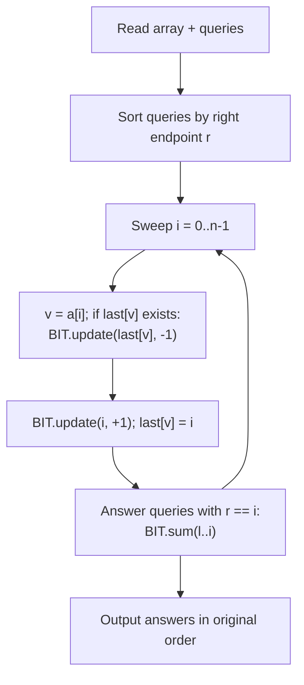
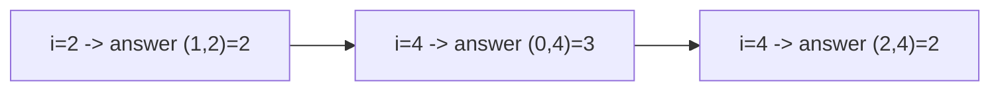

# CSES 1734 — Range Distinct Values

| Field      | Value                                               |
| ---------- | --------------------------------------------------- |
| Source     | CSES Problem Set                                    |
| Difficulty | Medium                                              |
| Topics     | Offline queries, BIT/Fenwick, Mo's algorithm        |
| Link       | https://cses.fi/problemset/task/1734                |

---

## Problem Statement

You are given an array of $n$ integers. Process $q$ queries: for each query
$(a, b)$, report the number of **distinct** values in the subarray $a_a, \dots,
a_b$ (1-indexed, inclusive).

Constraints (CSES limits):

$$
1 \le n, q \le 2 \cdot 10^5, \qquad 1 \le x_i \le 10^9.
$$

The large $n, q$ and 1-second limit mean the intended solution is the
$O((n+q)\log n)$ **offline-sort + BIT** approach. Mo's algorithm at
$O((n+q)\sqrt n)$ also passes with a fast implementation.

```text
Input
5 3
1 1 2 1 3
1 5
2 4
3 5

Output
3
2
3
```

Query `1 5` → distinct $\{1,2,3\}$ → $3$. Query `2 4` → $\{1,2\}$ → $2$.

## Approach (WHY)

Two solid offline strategies — we present both, then implement the primary one
fully in both languages.

### Idea A — Offline sort by right end + BIT (primary)

Sort queries by their right endpoint $r$. Sweep $i$ from left to right; when we
process index $i$, we want a BIT where, for every distinct value, only its
**most recent** occurrence is marked with a $1$. Then the count of distinct
values in $[l, i]$ is the prefix-range sum $\text{sum}(l, i)$.

Maintain `last[value]` = the previous index where this value appeared. When we
reach index $i$ with value $v$:

- if $v$ appeared before at position $p = \text{last}[v]$, set BIT at $p$ to $0$
  (un-mark the stale occurrence),
- set BIT at $i$ to $1$, and update $\text{last}[v] = i$.

After processing index $i$, answer every query whose right end is $i$ with
$\text{BIT.sum}(l, i)$. Each value contributes exactly one marked position
(its latest occurrence $\le i$), so the range sum is precisely the distinct
count. This is $O((n + q)\log n)$.

### Idea B — Mo's algorithm

Exactly the DQUERY pattern: sort queries by (block of $l$, then $r$ with the
even/odd trick), sweep `curL/curR`, maintain `freq` and a running `distinct` via
$O(1)$ add/remove. Total $O((n+q)\sqrt n)$. Simpler to reason about but with a
larger constant; needs value compression for the `freq` array since
$x_i \le 10^9$.

We implement **Idea A** fully (it is the canonical CSES solution), and include a
Mo's `add/remove` core for reference.



## Solution

### Python

```python
import sys
from math import isqrt

def main():
    data = sys.stdin.buffer.read().split()
    idx = 0
    n = int(data[idx]); q = int(data[idx + 1]); idx += 2
    a = [int(data[idx + i]) for i in range(n)]; idx += n

    queries = []
    for i in range(q):
        l = int(data[idx]) - 1          # to 0-indexed
        r = int(data[idx + 1]) - 1
        idx += 2
        queries.append((r, l, i))       # sort key = r first

    queries.sort()                       # by right endpoint ascending

    bit = [0] * (n + 1)                  # 1-indexed Fenwick

    def bit_update(i, delta):            # i is 0-indexed position
        i += 1
        while i <= n:
            bit[i] += delta
            i += i & (-i)

    def bit_prefix(i):                   # sum of [0..i], i 0-indexed
        i += 1
        s = 0
        while i > 0:
            s += bit[i]
            i -= i & (-i)
        return s

    last = {}
    ans = [0] * q
    qptr = 0
    for i in range(n):
        v = a[i]
        if v in last:
            bit_update(last[v], -1)      # un-mark stale occurrence
        bit_update(i, 1)
        last[v] = i
        while qptr < q and queries[qptr][0] == i:
            r, l, qi = queries[qptr]
            ans[qi] = bit_prefix(r) - (bit_prefix(l - 1) if l > 0 else 0)
            qptr += 1

    sys.stdout.write("\n".join(map(str, ans)) + "\n")

main()
```

### C++

```cpp
#include <bits/stdc++.h>
using namespace std;

int n;
vector<long long> bit;          // 1-indexed Fenwick

void bit_update(int i, int delta) {     // i is 0-indexed position
    for (++i; i <= n; i += i & (-i)) bit[i] += delta;
}

long long bit_prefix(int i) {            // sum of [0..i], i 0-indexed
    long long s = 0;
    for (++i; i > 0; i -= i & (-i)) s += bit[i];
    return s;
}

int main() {
    ios::sync_with_stdio(false);
    cin.tie(nullptr);

    int q;
    cin >> n >> q;
    vector<int> a(n);
    for (int i = 0; i < n; i++) cin >> a[i];

    struct Query { int r, l, idx; };
    vector<Query> qs(q);
    for (int i = 0; i < q; i++) {
        int l, r; cin >> l >> r;
        qs[i] = {r - 1, l - 1, i};      // to 0-indexed
    }
    sort(qs.begin(), qs.end(), [](const Query& x, const Query& y) {
        return x.r < y.r;               // by right endpoint
    });

    bit.assign(n + 1, 0);
    unordered_map<int, int> last;
    last.reserve(n * 2);
    vector<long long> ans(q);

    int qptr = 0;
    for (int i = 0; i < n; i++) {
        int v = a[i];
        auto it = last.find(v);
        if (it != last.end()) bit_update(it->second, -1);   // un-mark stale
        bit_update(i, 1);
        last[v] = i;
        while (qptr < q && qs[qptr].r == i) {
            int l = qs[qptr].l, r = qs[qptr].r, qi = qs[qptr].idx;
            long long res = bit_prefix(r) - (l > 0 ? bit_prefix(l - 1) : 0);
            ans[qi] = res;
            qptr++;
        }
    }

    for (int i = 0; i < q; i++) cout << ans[i] << '\n';
    return 0;
}
```

For reference, the **Mo's algorithm** add/remove core (Idea B), after
coordinate-compressing values into `[0, m)`:

```python
freq = [0] * m
distinct = 0
def add(x):
    global distinct
    if freq[x] == 0: distinct += 1
    freq[x] += 1
def remove(x):
    global distinct
    freq[x] -= 1
    if freq[x] == 0: distinct -= 1
```

```cpp
vector<int> freq(m, 0);
int distinct = 0;
auto add = [&](int x) { if (freq[x]++ == 0) distinct++; };
auto rem = [&](int x) { if (--freq[x] == 0) distinct--; };
```

## Iteration Trace

Idea A on `a = [1, 1, 2, 1, 3]` (0-indexed). BIT marks the latest occurrence of
each value. Queries sorted by $r$: `(r=2,l=1)`, `(r=4,l=0)`, `(r=4,l=2)`.

| i | v=a[i] | action | marked positions (value) | answered queries |
|---|--------|--------|--------------------------|------------------|
| 0 | 1 | mark 0 | {0:1} | — |
| 1 | 1 | unmark 0, mark 1 | {1:1} | — |
| 2 | 2 | mark 2 | {1:1, 2:2} | (l=1,r=2): sum[1..2]=2 |
| 3 | 1 | unmark 1, mark 3 | {2:2, 3:1} | — |
| 4 | 3 | mark 4 | {2:2, 3:1, 4:3} | (l=0,r=4)=3, (l=2,r=4)=2 |

Answers restored to original order: `3, 2, 3`.



## Complexity

**Idea A (primary):** sorting $O(q \log q)$, then $n$ BIT updates and $q$ BIT
queries each $O(\log n)$:

$$
O\big((n + q)\log n\big).
$$

**Idea B (Mo's):** $O(q \log q + (n+q)\sqrt n)$.

| Approach | Time | Space |
|----------|------|-------|
| Sort + BIT | $O((n+q)\log n)$ | $O(n + q)$ |
| Mo's algorithm | $O((n+q)\sqrt n)$ | $O(n + q)$ |

## Complexity Table

| Operation | Sort+BIT | Mo's |
|-----------|----------|------|
| Sort queries | $O(q \log q)$ | $O(q \log q)$ |
| Core work | $O((n+q)\log n)$ | $O((n+q)\sqrt n)$ |
| Per step | $O(\log n)$ | $O(1)$ |
| Total | $O((n+q)\log n)$ | $O((n+q)\sqrt n)$ |

## Takeaway

"Distinct values in a range" has **two** clean offline solutions. The
*sort-by-right-end + BIT* trick — keep only each value's latest occurrence
marked — is the faster, log-factor canonical answer. Mo's algorithm is the more
general fallback whenever the per-element add/remove is $O(1)$ but no such clever
marking exists.
