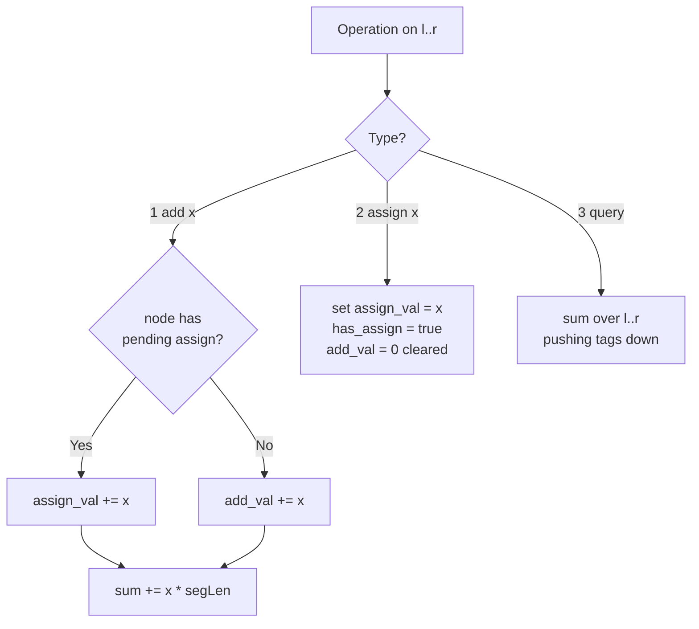

# Range Updates and Sums

| Meta | Value |
|------|-------|
| Source | CSES Problem Set — Range Queries |
| Difficulty | Hard (lazy propagation with two tag types) |
| Topics | Segment Tree, Lazy Propagation, Range Add, Range Assign, Range Sum |
| Link | https://cses.fi/problemset/task/1735 |

---

## Problem Statement

You are given an array of $n$ integers. Process $q$ operations of three kinds:

1. `1 a b x` — **add** $x$ to each value in range $[a, b]$.
2. `2 a b x` — **assign** (set) each value in range $[a, b]$ to $x$.
3. `3 a b` — **output the sum** of values in range $[a, b]$.

Constraints: $1 \le n, q \le 2\cdot10^5$, values up to $10^9$. Both update types operate on a
range, so a naive $O(n)$ update is too slow — we need $O(\log n)$ per operation via **lazy
propagation carrying both an add tag and an assign tag**.

```
n = 5, array = [3, 2, 4, 5, 1]

3 1 5    -> sum[1..5] = 15
2 1 4 2  -> array = [2, 2, 2, 2, 1]
1 2 5 1  -> array = [2, 3, 3, 3, 2]
3 1 5    -> sum[1..5] = 13
```

---

## Approach (WHY)

Each leaf can be hit by both adds and assigns interleaved. The trick is that **an assignment
overwrites everything before it**, so a pending `assign` makes any pending `add` irrelevant —
but adds that arrive *after* an assign must accumulate on top of the assigned value.

So every node carries two tags:

- `assign_val` + `has_assign` flag — "first set the whole segment to this value."
- `add_val` — "then add this amount to every element."

Applied to a segment of length $\ell$, the node's sum becomes:

$$\text{sum} \;=\; \begin{cases} (\text{assign\_val} + \text{add\_val})\cdot \ell & \text{has\_assign} \\[4pt] \text{old\_sum} + \text{add\_val}\cdot \ell & \text{otherwise} \end{cases}$$

When pushing down, flush the **assign first**, then the **add**, so children end up consistent.



---

## Solution

### Python

```python
import sys
input = sys.stdin.buffer.read

class AddAssignSumSeg:
    def __init__(self, data):
        self.n = len(data)
        self.tree = [0] * (4 * self.n)
        self.add = [0] * (4 * self.n)
        self.assign = [0] * (4 * self.n)
        self.has_assign = [False] * (4 * self.n)
        self._build(data, 1, 0, self.n - 1)

    def _build(self, data, node, nl, nr):
        if nl == nr:
            self.tree[node] = data[nl]
            return
        mid = (nl + nr) // 2
        self._build(data, 2 * node, nl, mid)
        self._build(data, 2 * node + 1, mid + 1, nr)
        self.tree[node] = self.tree[2 * node] + self.tree[2 * node + 1]

    def _apply_assign(self, node, seg_len, v):
        self.tree[node] = v * seg_len
        self.assign[node] = v
        self.has_assign[node] = True
        self.add[node] = 0

    def _apply_add(self, node, seg_len, v):
        self.tree[node] += v * seg_len
        if self.has_assign[node]:
            self.assign[node] += v
        else:
            self.add[node] += v

    def _push_down(self, node, nl, nr):
        mid = (nl + nr) // 2
        l_len, r_len = mid - nl + 1, nr - mid
        if self.has_assign[node]:
            self._apply_assign(2 * node, l_len, self.assign[node])
            self._apply_assign(2 * node + 1, r_len, self.assign[node])
            self.has_assign[node] = False
        if self.add[node] != 0:
            self._apply_add(2 * node, l_len, self.add[node])
            self._apply_add(2 * node + 1, r_len, self.add[node])
            self.add[node] = 0

    def range_add(self, l, r, v, node=1, nl=0, nr=None):
        if nr is None:
            nr = self.n - 1
        if r < nl or nr < l:
            return
        if l <= nl and nr <= r:
            self._apply_add(node, nr - nl + 1, v)
            return
        self._push_down(node, nl, nr)
        mid = (nl + nr) // 2
        self.range_add(l, r, v, 2 * node, nl, mid)
        self.range_add(l, r, v, 2 * node + 1, mid + 1, nr)
        self.tree[node] = self.tree[2 * node] + self.tree[2 * node + 1]

    def range_assign(self, l, r, v, node=1, nl=0, nr=None):
        if nr is None:
            nr = self.n - 1
        if r < nl or nr < l:
            return
        if l <= nl and nr <= r:
            self._apply_assign(node, nr - nl + 1, v)
            return
        self._push_down(node, nl, nr)
        mid = (nl + nr) // 2
        self.range_assign(l, r, v, 2 * node, nl, mid)
        self.range_assign(l, r, v, 2 * node + 1, mid + 1, nr)
        self.tree[node] = self.tree[2 * node] + self.tree[2 * node + 1]

    def query(self, l, r, node=1, nl=0, nr=None):
        if nr is None:
            nr = self.n - 1
        if r < nl or nr < l:
            return 0
        if l <= nl and nr <= r:
            return self.tree[node]
        self._push_down(node, nl, nr)
        mid = (nl + nr) // 2
        return (self.query(l, r, 2 * node, nl, mid)
                + self.query(l, r, 2 * node + 1, mid + 1, nr))


def main():
    data = input().split()
    idx = 0
    n = int(data[idx]); idx += 1
    q = int(data[idx]); idx += 1
    arr = [int(data[idx + i]) for i in range(n)]
    idx += n
    seg = AddAssignSumSeg(arr)
    out = []
    for _ in range(q):
        t = int(data[idx]); idx += 1
        if t == 1:
            a = int(data[idx]); b = int(data[idx + 1]); x = int(data[idx + 2])
            idx += 3
            seg.range_add(a - 1, b - 1, x)
        elif t == 2:
            a = int(data[idx]); b = int(data[idx + 1]); x = int(data[idx + 2])
            idx += 3
            seg.range_assign(a - 1, b - 1, x)
        else:
            a = int(data[idx]); b = int(data[idx + 1])
            idx += 2
            out.append(str(seg.query(a - 1, b - 1)))
    print("\n".join(out))


if __name__ == "__main__":
    main()
```

### C++

```cpp
#include <bits/stdc++.h>
using namespace std;

struct AddAssignSumSeg {
    int n;
    vector<long long> tree, addTag, assignTag;
    vector<char> hasAssign;

    AddAssignSumSeg(const vector<long long>& data) {
        n = (int)data.size();
        tree.assign(4 * n, 0);
        addTag.assign(4 * n, 0);
        assignTag.assign(4 * n, 0);
        hasAssign.assign(4 * n, 0);
        build(data, 1, 0, n - 1);
    }

    void build(const vector<long long>& data, int node, int nl, int nr) {
        if (nl == nr) { tree[node] = data[nl]; return; }
        int mid = (nl + nr) / 2;
        build(data, 2 * node, nl, mid);
        build(data, 2 * node + 1, mid + 1, nr);
        tree[node] = tree[2 * node] + tree[2 * node + 1];
    }

    void applyAssign(int node, long long segLen, long long v) {
        tree[node] = v * segLen;
        assignTag[node] = v;
        hasAssign[node] = 1;
        addTag[node] = 0;
    }

    void applyAdd(int node, long long segLen, long long v) {
        tree[node] += v * segLen;
        if (hasAssign[node]) assignTag[node] += v;
        else addTag[node] += v;
    }

    void pushDown(int node, int nl, int nr) {
        int mid = (nl + nr) / 2;
        long long lLen = mid - nl + 1, rLen = nr - mid;
        if (hasAssign[node]) {
            applyAssign(2 * node, lLen, assignTag[node]);
            applyAssign(2 * node + 1, rLen, assignTag[node]);
            hasAssign[node] = 0;
        }
        if (addTag[node] != 0) {
            applyAdd(2 * node, lLen, addTag[node]);
            applyAdd(2 * node + 1, rLen, addTag[node]);
            addTag[node] = 0;
        }
    }

    void rangeAdd(int l, int r, long long v, int node = 1, int nl = 0, int nr = -1) {
        if (nr == -1) nr = n - 1;
        if (r < nl || nr < l) return;
        if (l <= nl && nr <= r) { applyAdd(node, nr - nl + 1, v); return; }
        pushDown(node, nl, nr);
        int mid = (nl + nr) / 2;
        rangeAdd(l, r, v, 2 * node, nl, mid);
        rangeAdd(l, r, v, 2 * node + 1, mid + 1, nr);
        tree[node] = tree[2 * node] + tree[2 * node + 1];
    }

    void rangeAssign(int l, int r, long long v, int node = 1, int nl = 0, int nr = -1) {
        if (nr == -1) nr = n - 1;
        if (r < nl || nr < l) return;
        if (l <= nl && nr <= r) { applyAssign(node, nr - nl + 1, v); return; }
        pushDown(node, nl, nr);
        int mid = (nl + nr) / 2;
        rangeAssign(l, r, v, 2 * node, nl, mid);
        rangeAssign(l, r, v, 2 * node + 1, mid + 1, nr);
        tree[node] = tree[2 * node] + tree[2 * node + 1];
    }

    long long query(int l, int r, int node = 1, int nl = 0, int nr = -1) {
        if (nr == -1) nr = n - 1;
        if (r < nl || nr < l) return 0;
        if (l <= nl && nr <= r) return tree[node];
        pushDown(node, nl, nr);
        int mid = (nl + nr) / 2;
        return query(l, r, 2 * node, nl, mid)
             + query(l, r, 2 * node + 1, mid + 1, nr);
    }
};

int main() {
    ios::sync_with_stdio(false);
    cin.tie(nullptr);
    int n, q;
    cin >> n >> q;
    vector<long long> arr(n);
    for (auto& x : arr) cin >> x;
    AddAssignSumSeg seg(arr);
    string out;
    while (q--) {
        int t;
        cin >> t;
        if (t == 1) {
            int a, b; long long x;
            cin >> a >> b >> x;
            seg.rangeAdd(a - 1, b - 1, x);
        } else if (t == 2) {
            int a, b; long long x;
            cin >> a >> b >> x;
            seg.rangeAssign(a - 1, b - 1, x);
        } else {
            int a, b;
            cin >> a >> b;
            out += to_string(seg.query(a - 1, b - 1));
            out += '\n';
        }
    }
    cout << out;
    return 0;
}
```

---

## Iteration Trace

Array `[3, 2, 4, 5, 1]` (0-indexed internally). Operations from the example:

| Step | Operation | Array state | Result |
|------|-----------|-------------|--------|
| 0 | initial | `[3, 2, 4, 5, 1]` | — |
| 1 | `3 1 5` query | `[3, 2, 4, 5, 1]` | $3+2+4+5+1 = 15$ |
| 2 | `2 1 4 2` assign 2 to [1,4] | `[2, 2, 2, 2, 1]` | — |
| 3 | `1 2 5 1` add 1 to [2,5] | `[2, 3, 3, 3, 2]` | — |
| 4 | `3 1 5` query | `[2, 3, 3, 3, 2]` | $2+3+3+3+2 = 13$ |

Note how step 3's add lands partly on cells assigned in step 2: the add folds onto the assigned
values exactly because `apply_add` adds to `assign_val` when `has_assign` is set.

---

## Complexity

With the tree built in $O(n)$ and every update/query costing $O(\log n)$:

$$T = O\big((n + q)\log n\big), \qquad M = O(n)$$

| Operation | Time | Space |
|-----------|------|-------|
| Build | $O(n)$ | $O(n)$ |
| Range add | $O(\log n)$ | — |
| Range assign | $O(\log n)$ | — |
| Range sum query | $O(\log n)$ | — |
| Total ($q$ ops) | $O((n+q)\log n)$ | $O(n)$ |

---

## Takeaway

When two range-update types coexist, decide their **interaction order**: an assignment dominates
and clears the pending add; a later add either folds into the pending assign value or accumulates
on its own. Always push the assign tag down **before** the add tag so children stay consistent,
and remember to multiply by segment length for sum aggregates. Use `long long` — sums here reach
$2\cdot10^{14}$.
