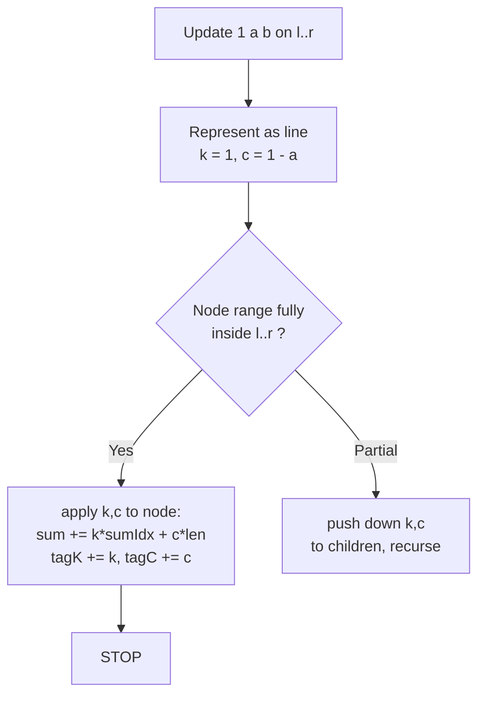
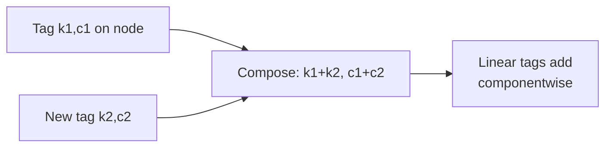

# Polynomial Queries

| Meta | Value |
|------|-------|
| Source | CSES Problem Set — Range Queries |
| Difficulty | Hard (lazy propagation with arithmetic-progression updates) |
| Topics | Segment Tree, Lazy Propagation, Arithmetic Progression, Range Sum |
| Link | https://cses.fi/problemset/task/1736 |

---

## Problem Statement

You are given an array of $n$ integers. Process $q$ operations of two kinds:

1. `1 a b` — for range $[a, b]$, add an **arithmetic progression** $1, 2, 3, \dots$ to the
   elements: position $a$ gets $+1$, position $a+1$ gets $+2$, …, position $b$ gets
   $+(b - a + 1)$.
2. `2 a b` — **output the sum** of values in range $[a, b]$.

Constraints: $1 \le n, q \le 2\cdot10^5$. A naive update is $O(n)$; we need $O(\log n)$ using
lazy propagation where the pending tag is a **ramp** (linear function of position), not a
constant.

```
n = 5, array = [0, 0, 0, 0, 0]

1 2 4    -> add 1,2,3 to positions 2,3,4 -> [0, 1, 2, 3, 0]
2 1 5    -> sum = 0+1+2+3+0 = 6
1 1 5    -> add 1,2,3,4,5            -> [1, 3, 5, 7, 5]
2 1 5    -> sum = 1+3+5+7+5 = 21
```

---

## Approach (WHY)

The update adds, to the leaf at absolute position $i$ inside $[a, b]$, the amount $(i - a + 1)$.
That is a **linear function of $i$**: $f(i) = i - (a - 1)$. Linear functions are closed under
addition, so a node can store its pending update as a single line

$$f(i) = k\cdot i + c$$

with two coefficients `k` (slope) and `c` (intercept). For the operation `1 a b`, every covered
position gets $f(i) = 1\cdot i + (1 - a)$, i.e. $k = 1$, $c = 1 - a$.

**Applying a line to a node** covering positions $[nl, nr]$ adds to its sum

$$\sum_{i=nl}^{nr} (k\, i + c) \;=\; k\cdot\!\!\sum_{i=nl}^{nr} i \;+\; c\,(nr - nl + 1) \;=\; k\cdot\frac{(nl+nr)(nr-nl+1)}{2} + c\,(nr-nl+1).$$

The key insight: because the line is expressed in terms of **absolute index $i$**, the *same*
`(k, c)` tag works for a parent and both children — no offset adjustment is needed when pushing
down. Tags simply **add componentwise**: $(k_1, c_1) + (k_2, c_2) = (k_1 + k_2,\, c_1 + c_2)$.



---

## Solution

Both implementations use the closed form for $\sum i$ over a node's index range. We store
absolute indices $0\ldots n-1$, so when we convert the operation `1 a b` to a line we use the
covered position's own index. To keep the math uniform, when an operation covers $[a, b]$ we
add the line $f(i) = i - a + 1$ to each position $i$, i.e. slope $k = 1$, intercept $c = 1 - a$.

### Python

```python
import sys
input = sys.stdin.buffer.read

class PolySeg:
    def __init__(self, data):
        self.n = len(data)
        self.tree = [0] * (4 * self.n)
        self.tk = [0] * (4 * self.n)     # pending slope
        self.tc = [0] * (4 * self.n)     # pending intercept
        self._build(data, 1, 0, self.n - 1)

    @staticmethod
    def _sum_idx(nl, nr):
        # sum of integers nl..nr inclusive
        return (nl + nr) * (nr - nl + 1) // 2

    def _build(self, data, node, nl, nr):
        if nl == nr:
            self.tree[node] = data[nl]
            return
        mid = (nl + nr) // 2
        self._build(data, 2 * node, nl, mid)
        self._build(data, 2 * node + 1, mid + 1, nr)
        self.tree[node] = self.tree[2 * node] + self.tree[2 * node + 1]

    def _apply(self, node, nl, nr, k, c):
        self.tree[node] += k * self._sum_idx(nl, nr) + c * (nr - nl + 1)
        self.tk[node] += k
        self.tc[node] += c

    def _push_down(self, node, nl, nr):
        if self.tk[node] != 0 or self.tc[node] != 0:
            mid = (nl + nr) // 2
            self._apply(2 * node, nl, mid, self.tk[node], self.tc[node])
            self._apply(2 * node + 1, mid + 1, nr, self.tk[node], self.tc[node])
            self.tk[node] = 0
            self.tc[node] = 0

    def update(self, l, r, k, c, node=1, nl=0, nr=None):
        if nr is None:
            nr = self.n - 1
        if r < nl or nr < l:
            return
        if l <= nl and nr <= r:
            self._apply(node, nl, nr, k, c)
            return
        self._push_down(node, nl, nr)
        mid = (nl + nr) // 2
        self.update(l, r, k, c, 2 * node, nl, mid)
        self.update(l, r, k, c, 2 * node + 1, mid + 1, nr)
        self.tree[node] = self.tree[2 * node] + self.tree[2 * node + 1]

    def query(self, l, r, node=1, nl=0, nr=None):
        if nr is None:
            nr = self.n - 1
        if r < nl or nr < l:
            return 0
        if l <= nl and nr <= r:
            return self.tree[node]
        self._push_down(node, nl, nr)
        mid = (nl + nr) // 2
        return (self.query(l, r, 2 * node, nl, mid)
                + self.query(l, r, 2 * node + 1, mid + 1, nr))


def main():
    data = input().split()
    idx = 0
    n = int(data[idx]); idx += 1
    q = int(data[idx]); idx += 1
    arr = [int(data[idx + i]) for i in range(n)]
    idx += n
    seg = PolySeg(arr)
    out = []
    for _ in range(q):
        t = int(data[idx]); idx += 1
        a = int(data[idx]); b = int(data[idx + 1])
        idx += 2
        a -= 1
        b -= 1
        if t == 1:
            # position i in [a, b] gets (i - a + 1): slope 1, intercept 1 - a
            seg.update(a, b, 1, 1 - a)
        else:
            out.append(str(seg.query(a, b)))
    print("\n".join(out))


if __name__ == "__main__":
    main()
```

### C++

```cpp
#include <bits/stdc++.h>
using namespace std;

struct PolySeg {
    int n;
    vector<long long> tree, tk, tc;     // value, pending slope, pending intercept

    PolySeg(const vector<long long>& data) {
        n = (int)data.size();
        tree.assign(4 * n, 0);
        tk.assign(4 * n, 0);
        tc.assign(4 * n, 0);
        build(data, 1, 0, n - 1);
    }

    static long long sumIdx(long long nl, long long nr) {
        return (nl + nr) * (nr - nl + 1) / 2;   // sum of nl..nr
    }

    void build(const vector<long long>& data, int node, int nl, int nr) {
        if (nl == nr) { tree[node] = data[nl]; return; }
        int mid = (nl + nr) / 2;
        build(data, 2 * node, nl, mid);
        build(data, 2 * node + 1, mid + 1, nr);
        tree[node] = tree[2 * node] + tree[2 * node + 1];
    }

    void applyTag(int node, int nl, int nr, long long k, long long c) {
        tree[node] += k * sumIdx(nl, nr) + c * (nr - nl + 1);
        tk[node] += k;
        tc[node] += c;
    }

    void pushDown(int node, int nl, int nr) {
        if (tk[node] != 0 || tc[node] != 0) {
            int mid = (nl + nr) / 2;
            applyTag(2 * node, nl, mid, tk[node], tc[node]);
            applyTag(2 * node + 1, mid + 1, nr, tk[node], tc[node]);
            tk[node] = 0;
            tc[node] = 0;
        }
    }

    void update(int l, int r, long long k, long long c,
                int node = 1, int nl = 0, int nr = -1) {
        if (nr == -1) nr = n - 1;
        if (r < nl || nr < l) return;
        if (l <= nl && nr <= r) { applyTag(node, nl, nr, k, c); return; }
        pushDown(node, nl, nr);
        int mid = (nl + nr) / 2;
        update(l, r, k, c, 2 * node, nl, mid);
        update(l, r, k, c, 2 * node + 1, mid + 1, nr);
        tree[node] = tree[2 * node] + tree[2 * node + 1];
    }

    long long query(int l, int r, int node = 1, int nl = 0, int nr = -1) {
        if (nr == -1) nr = n - 1;
        if (r < nl || nr < l) return 0;
        if (l <= nl && nr <= r) return tree[node];
        pushDown(node, nl, nr);
        int mid = (nl + nr) / 2;
        return query(l, r, 2 * node, nl, mid)
             + query(l, r, 2 * node + 1, mid + 1, nr);
    }
};

int main() {
    ios::sync_with_stdio(false);
    cin.tie(nullptr);
    int n, q;
    cin >> n >> q;
    vector<long long> arr(n);
    for (auto& x : arr) cin >> x;
    PolySeg seg(arr);
    string out;
    while (q--) {
        int t, a, b;
        cin >> t >> a >> b;
        --a; --b;
        if (t == 1) {
            // position i in [a, b] gets (i - a + 1): slope 1, intercept 1 - a
            seg.update(a, b, 1, 1 - (long long)a);
        } else {
            out += to_string(seg.query(a, b));
            out += '\n';
        }
    }
    cout << out;
    return 0;
}
```

---

## Iteration Trace

Array `[0, 0, 0, 0, 0]` (positions shown 1-indexed for clarity):

| Step | Operation | Line $f(i)$ added | Array state | Result |
|------|-----------|-------------------|-------------|--------|
| 0 | initial | — | `[0, 0, 0, 0, 0]` | — |
| 1 | `1 2 4` | $i - 1$ over [2,4] | `[0, 1, 2, 3, 0]` | — |
| 2 | `2 1 5` | — | `[0, 1, 2, 3, 0]` | $0+1+2+3+0 = 6$ |
| 3 | `1 1 5` | $i - 0$ over [1,5] | `[1, 3, 5, 7, 5]` | — |
| 4 | `2 1 5` | — | `[1, 3, 5, 7, 5]` | $1+3+5+7+5 = 21$ |

In step 1 the line is $f(i) = i - 1$ (0-indexed intercept $1-a$), giving $f(2)=1, f(3)=2,
f(4)=3$. Two overlapping ramp updates simply add their slopes and intercepts at each node.



---

## Complexity

Each ramp update is captured by two coefficients applied at $O(\log n)$ nodes:

$$T = O\big((n + q)\log n\big), \qquad M = O(n)$$

| Operation | Time | Space |
|-----------|------|-------|
| Build | $O(n)$ | $O(n)$ |
| Range progression update | $O(\log n)$ | — |
| Range sum query | $O(\log n)$ | — |
| Total ($q$ ops) | $O((n+q)\log n)$ | $O(n)$ |

---

## Takeaway

A lazy tag does not have to be a constant — it can be **any function class closed under
composition**. Here the class is *linear functions of the absolute index*, encoded by a slope
and intercept that simply add when composed. Expressing the ramp in absolute index coordinates
lets the same tag flow unchanged from parent to children. Use the closed form $\sum_{i=nl}^{nr}
i = \frac{(nl+nr)(nr-nl+1)}{2}$ and `long long` to avoid overflow.
