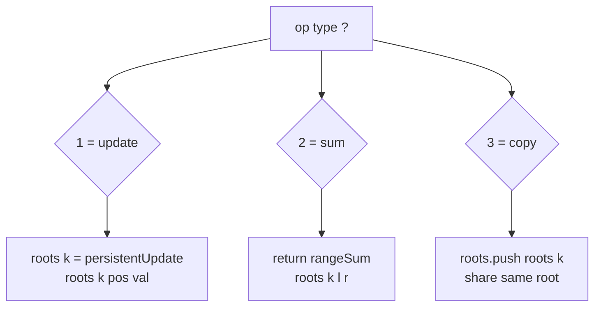
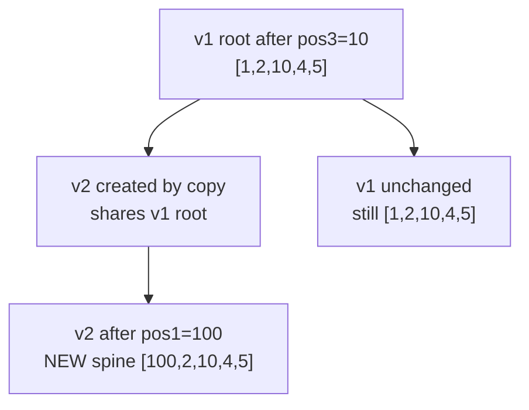

# CSES Range Queries and Copies (Persistent Segment Tree)

| Field | Value |
| --- | --- |
| Source | CSES Problem Set |
| Difficulty | Hard |
| Topics | Persistent segment tree, point update, range sum, versioning |
| Link | https://cses.fi/problemset/task/1737 |

---

## Problem Statement

You are given an array of $n$ integers. Initially there is a single version of the
array, numbered $1$. You must process $q$ operations of three kinds, where each
operation refers to a **version** $k$:

1. `1 k a x` — in version $k$, set the value at position $a$ to $x$.
2. `2 k a b` — report the sum of values in range $[a, b]$ of version $k$.
3. `3 k` — create a **copy** of version $k$ as a new version (appended to the
   list of versions).

All updates modify the targeted version **in place from the user's view**, but
older copies created earlier must remain unchanged. This is exactly partial
persistence: each `1` operation produces a fresh root for version $k$, and each
`3` operation registers a new version that shares the same tree.

```text
Input:
n = 5, q = 6
a = [1, 2, 3, 4, 5]
ops:
  2 1 1 5      # sum of version 1 over [1,5] = 15
  1 1 3 10     # version 1: a[3] = 10  -> [1,2,10,4,5]
  3 1          # version 2 = copy of version 1
  2 2 1 5      # sum of version 2 over [1,5] = 22
  1 2 1 100    # version 2: a[1] = 100 -> [100,2,10,4,5]
  2 1 1 5      # version 1 unchanged -> 22

Output:
15
22
22
```

## Approach (WHY)

Each version is a separate root in a persistent segment tree built once over the
array positions. The three operations map cleanly:

- **Build** the base tree → this is version $1$'s root.
- **Update** `1 k a x`: do a persistent point update from `roots[k]`. Since CSES
  semantics keep editing the *same* version, we **overwrite** `roots[k]` with the
  new root. Path copying guarantees any *copies made earlier* still point at the
  old nodes and are untouched.
- **Sum** `2 k a b`: ordinary range-sum descent starting at `roots[k]`.
- **Copy** `3 k`: append `roots[k]` again — a copy is just another reference to
  the **same** root. Later edits to either version path-copy away, so the share
  is safe.

The reason this works: a persistent update never mutates existing nodes. Two
versions can share a root; when one of them is later updated, only the new spine
is allocated and the other version keeps reading the original nodes.



## Solution

### Python

```python
import sys
input = sys.stdin.readline

class PersistentSumTree:
    def __init__(self, n, max_nodes):
        self.left = [0] * max_nodes
        self.right = [0] * max_nodes
        self.val = [0] * max_nodes      # subtree sum
        self.tot = 1                    # next free id (0 = null)
        self.n = n
        self.roots = []

    def _new(self):
        node = self.tot
        self.tot += 1
        return node

    def build(self, arr, lo, hi):
        node = self._new()
        if lo == hi:
            self.val[node] = arr[lo]
            return node
        mid = (lo + hi) // 2
        self.left[node] = self.build(arr, lo, mid)
        self.right[node] = self.build(arr, mid + 1, hi)
        self.val[node] = self.val[self.left[node]] + self.val[self.right[node]]
        return node

    def update(self, prev, lo, hi, pos, new_val):
        cur = self._new()
        if lo == hi:
            self.val[cur] = new_val
            return cur
        mid = (lo + hi) // 2
        if pos <= mid:
            self.left[cur] = self.update(self.left[prev], lo, mid, pos, new_val)
            self.right[cur] = self.right[prev]
        else:
            self.left[cur] = self.left[prev]
            self.right[cur] = self.update(self.right[prev], mid + 1, hi, pos, new_val)
        self.val[cur] = self.val[self.left[cur]] + self.val[self.right[cur]]
        return cur

    def range_sum(self, node, lo, hi, ql, qr):
        if qr < lo or hi < ql:
            return 0
        if ql <= lo and hi <= qr:
            return self.val[node]
        mid = (lo + hi) // 2
        return (self.range_sum(self.left[node], lo, mid, ql, qr) +
                self.range_sum(self.right[node], mid + 1, hi, ql, qr))


def main():
    sys.setrecursionlimit(1 << 20)
    n, q = map(int, input().split())
    a = list(map(int, input().split()))

    LOG = max(1, n.bit_length() + 1)
    # base build uses ~2n nodes; each update adds LOG+1 nodes
    pst = PersistentSumTree(n, 2 * n + q * (LOG + 2) + 10)

    base = pst.build(a, 0, n - 1)
    pst.roots.append(base)          # version 1 at index 0

    out = []
    for _ in range(q):
        parts = input().split()
        t = parts[0]
        if t == '1':
            k, pos, x = int(parts[1]), int(parts[2]), int(parts[3])
            k -= 1
            pst.roots[k] = pst.update(pst.roots[k], 0, n - 1, pos - 1, x)
        elif t == '2':
            k, l, r = int(parts[1]), int(parts[2]), int(parts[3])
            k -= 1
            out.append(str(pst.range_sum(pst.roots[k], 0, n - 1, l - 1, r - 1)))
        else:  # '3'
            k = int(parts[1]) - 1
            pst.roots.append(pst.roots[k])
    sys.stdout.write("\n".join(out) + "\n")


if __name__ == "__main__":
    main()
```

### C++

```cpp
#include <bits/stdc++.h>
using namespace std;

struct PersistentSumTree {
    vector<int> lc, rc;
    vector<long long> val;     // subtree sum
    int tot;                   // next free id (0 = null)
    int n;
    vector<int> roots;

    PersistentSumTree(int n, long long maxNodes) : n(n) {
        lc.assign(maxNodes, 0);
        rc.assign(maxNodes, 0);
        val.assign(maxNodes, 0);
        tot = 1;               // index 0 reserved as null
    }

    int newNode() { return tot++; }

    int build(const vector<long long>& a, int lo, int hi) {
        int node = newNode();
        if (lo == hi) {
            val[node] = a[lo];
            return node;
        }
        int mid = (lo + hi) / 2;
        lc[node] = build(a, lo, mid);
        rc[node] = build(a, mid + 1, hi);
        val[node] = val[lc[node]] + val[rc[node]];
        return node;
    }

    int update(int prev, int lo, int hi, int pos, long long newVal) {
        int cur = newNode();
        if (lo == hi) {
            val[cur] = newVal;
            return cur;
        }
        int mid = (lo + hi) / 2;
        if (pos <= mid) {
            lc[cur] = update(lc[prev], lo, mid, pos, newVal);
            rc[cur] = rc[prev];
        } else {
            lc[cur] = lc[prev];
            rc[cur] = update(rc[prev], mid + 1, hi, pos, newVal);
        }
        val[cur] = val[lc[cur]] + val[rc[cur]];
        return cur;
    }

    long long rangeSum(int node, int lo, int hi, int ql, int qr) {
        if (qr < lo || hi < ql) return 0;
        if (ql <= lo && hi <= qr) return val[node];
        int mid = (lo + hi) / 2;
        return rangeSum(lc[node], lo, mid, ql, qr) +
               rangeSum(rc[node], mid + 1, hi, ql, qr);
    }
};

int main() {
    ios::sync_with_stdio(false);
    cin.tie(nullptr);

    int n, q;
    cin >> n >> q;
    vector<long long> a(n);
    for (int i = 0; i < n; i++) cin >> a[i];

    int LOG = 1;
    while ((1 << LOG) < max(1, n)) LOG++;
    long long maxNodes = 2LL * n + (long long)q * (LOG + 2) + 10;
    PersistentSumTree pst(n, maxNodes);

    int base = pst.build(a, 0, n - 1);
    pst.roots.push_back(base);     // version 1 at index 0

    for (int i = 0; i < q; i++) {
        int t;
        cin >> t;
        if (t == 1) {
            int k, pos; long long x;
            cin >> k >> pos >> x;
            k--;
            pst.roots[k] = pst.update(pst.roots[k], 0, n - 1, pos - 1, x);
        } else if (t == 2) {
            int k, l, r;
            cin >> k >> l >> r;
            k--;
            cout << pst.rangeSum(pst.roots[k], 0, n - 1, l - 1, r - 1) << "\n";
        } else { // t == 3
            int k;
            cin >> k;
            k--;
            pst.roots.push_back(pst.roots[k]);
        }
    }
    return 0;
}
```

## Iteration Trace

Using the sample `a = [1,2,3,4,5]`. Column "roots" lists each version's root id
(conceptual). Notice version 1 is unaffected by the later edit to version 2.

| Op | Action | Effect on versions | Output |
| --- | --- | --- | --- |
| `2 1 1 5` | sum v1 `[1,5]` | reads base root | `15` |
| `1 1 3 10` | set v1 pos3=10 | v1 gets a new root (path copied) | — |
| `3 1` | copy v1 | v2 := same root as v1 (shared) | — |
| `2 2 1 5` | sum v2 `[1,5]` | `1+2+10+4+5` | `22` |
| `1 2 1 100` | set v2 pos1=100 | v2 path-copies; **v1 keeps old root** | — |
| `2 1 1 5` | sum v1 `[1,5]` | v1 still `[1,2,10,4,5]` | `22` |



Each operation costs one root-to-leaf path:

$$
T_{\text{op}} = O(\log n), \qquad
T_{\text{total}} = O\big((n + q)\log n\big).
$$

## Complexity

| Phase | Time | Memory |
| --- | --- | --- |
| Build base version | $O(n)$ | $O(n)$ |
| Point update (op 1) | $O(\log n)$ | $O(\log n)$ new nodes |
| Range sum (op 2) | $O(\log n)$ | $O(1)$ |
| Copy (op 3) | $O(1)$ | $O(1)$ (shares root) |
| **Total** | $O\big((n+q)\log n\big)$ | $O\big((n+q)\log n\big)$ |

## Takeaway

A **copy is free** in a persistent structure — it is literally another pointer to
an existing root. The persistence invariant ("never mutate a shared node") is
what lets two versions diverge later without interfering: each subsequent update
path-copies only the $O(\log n)$ nodes it must change. Pre-size your node arrays
to $2n + q(\log n + 2)$ and you will never overflow.
