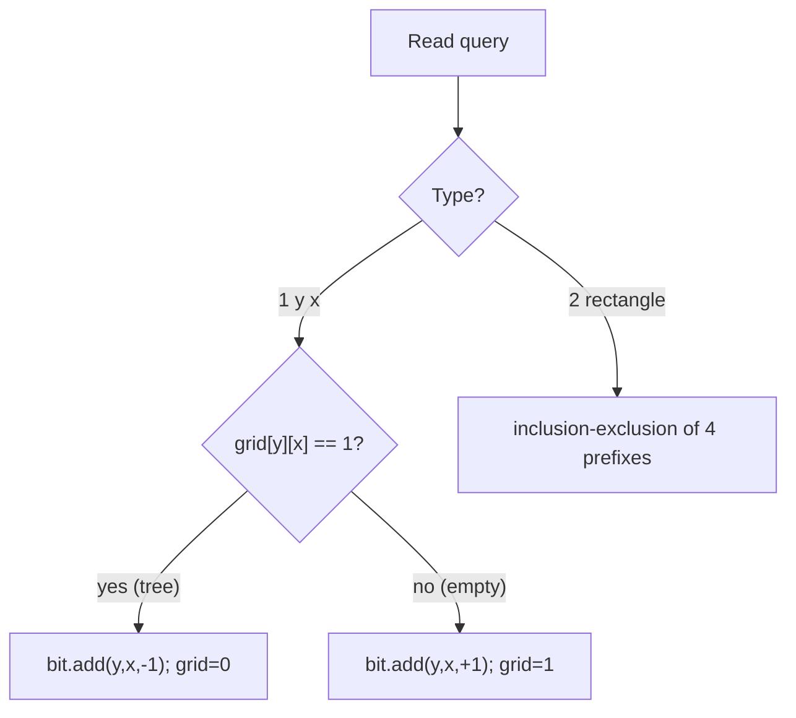
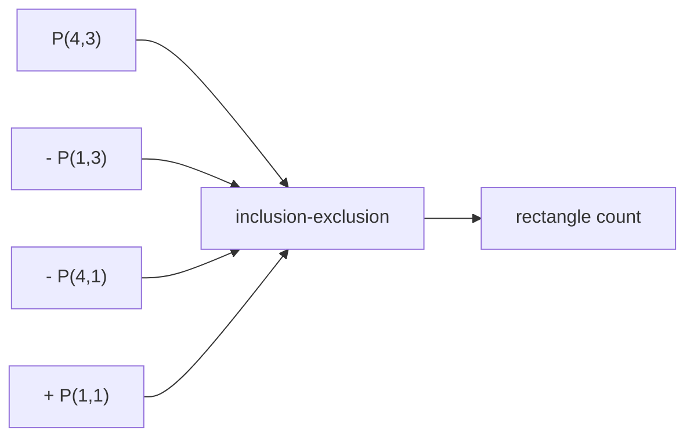

# Forest Queries II (2D Fenwick / BIT)

| Meta | Value |
|------|-------|
| Source | CSES Problem Set — Range Queries |
| Difficulty | Hard |
| Topics | 2D Fenwick Tree / BIT, Point Update, 2D Prefix Sum |
| Link | https://cses.fi/problemset/task/1739 |

---

## Problem Statement

You are given an $n \times n$ grid where each cell is either a tree (`*`) or empty (`.`).
Process $q$ queries of two kinds:

1. `1 y x` — toggle the cell $(y, x)$ (tree $\to$ empty or empty $\to$ tree).
2. `2 y_1\ x_1\ y_2\ x_2` — count the number of trees inside the rectangle with corners
   $(y_1, x_1)$ and $(y_2, x_2)$.

Constraints: $1 \le n \le 1000$, $1 \le q \le 2 \cdot 10^5$. A static 2D prefix sum cannot
handle updates, so we use a **2D Fenwick tree**: point update and rectangle sum, each in
$O(\log^2 n)$.

A rectangle count uses inclusion–exclusion over four prefix sums:

$$
\text{cnt} = P(y_2, x_2) - P(y_1 - 1, x_2) - P(y_2, x_1 - 1) + P(y_1 - 1, x_1 - 1)
$$

```
Input
4 3
.*..
*.**
**..
****
3 2 2 4 3
1 3 3
2 2 2 4 3

Output
3
4
```

The first query counts trees in rows 2..4, cols 2..4. The toggle at $(3,3)$ turns an empty cell
into a tree, so the second count increases.

---

## Approach (WHY)

Each cell stores 0 or 1. A toggle flips a single cell, which is a **point update** of $\pm 1$.
A rectangle count is a 2D prefix-sum query. A 2D BIT supports both by nesting the 1D lowbit walk
over rows and columns.

For a toggle we add `+1` if the cell was empty (becoming a tree) or `-1` if it was a tree
(becoming empty). We keep the current grid bits to know the direction.



---

## Solution

### Python

```python
import sys


class BIT2D:
    def __init__(self, n: int) -> None:
        self.n = n
        self.tree = [[0] * (n + 1) for _ in range(n + 1)]

    def add(self, x: int, y: int, delta: int) -> None:
        i = x
        while i <= self.n:
            j = y
            while j <= self.n:
                self.tree[i][j] += delta
                j += j & (-j)
            i += i & (-i)

    def sum(self, x: int, y: int) -> int:
        s = 0
        i = x
        while i > 0:
            j = y
            while j > 0:
                s += self.tree[i][j]
                j -= j & (-j)
            i -= i & (-i)
        return s

    def rect_sum(self, x1: int, y1: int, x2: int, y2: int) -> int:
        return (self.sum(x2, y2) - self.sum(x1 - 1, y2)
                - self.sum(x2, y1 - 1) + self.sum(x1 - 1, y1 - 1))


def main() -> None:
    data = sys.stdin.buffer.read().split()
    idx = 0
    n = int(data[idx]); idx += 1
    q = int(data[idx]); idx += 1

    grid = [[0] * (n + 1) for _ in range(n + 1)]
    bit = BIT2D(n)

    for r in range(1, n + 1):
        row = data[idx].decode(); idx += 1
        for c in range(1, n + 1):
            if row[c - 1] == '*':
                grid[r][c] = 1
                bit.add(r, c, 1)

    out = []
    for _ in range(q):
        t = int(data[idx]); idx += 1
        if t == 1:
            y = int(data[idx]); idx += 1
            x = int(data[idx]); idx += 1
            if grid[y][x] == 1:
                grid[y][x] = 0
                bit.add(y, x, -1)
            else:
                grid[y][x] = 1
                bit.add(y, x, 1)
        else:
            y1 = int(data[idx]); idx += 1
            x1 = int(data[idx]); idx += 1
            y2 = int(data[idx]); idx += 1
            x2 = int(data[idx]); idx += 1
            out.append(str(bit.rect_sum(y1, x1, y2, x2)))

    sys.stdout.write("\n".join(out) + ("\n" if out else ""))


main()
```

### C++

```cpp
#include <bits/stdc++.h>
using namespace std;

struct BIT2D {
    int n;
    vector<vector<int>> tree;

    BIT2D(int n) : n(n), tree(n + 1, vector<int>(n + 1, 0)) {}

    void add(int x, int y, int delta) {
        for (int i = x; i <= n; i += i & (-i))
            for (int j = y; j <= n; j += j & (-j))
                tree[i][j] += delta;
    }

    long long sum(int x, int y) {
        long long s = 0;
        for (int i = x; i > 0; i -= i & (-i))
            for (int j = y; j > 0; j -= j & (-j))
                s += tree[i][j];
        return s;
    }

    long long rect_sum(int x1, int y1, int x2, int y2) {
        return sum(x2, y2) - sum(x1 - 1, y2)
             - sum(x2, y1 - 1) + sum(x1 - 1, y1 - 1);
    }
};

int main() {
    ios::sync_with_stdio(false);
    cin.tie(nullptr);

    int n, q;
    cin >> n >> q;

    vector<vector<int>> grid(n + 1, vector<int>(n + 1, 0));
    BIT2D bit(n);

    for (int r = 1; r <= n; r++) {
        string row;
        cin >> row;
        for (int c = 1; c <= n; c++) {
            if (row[c - 1] == '*') {
                grid[r][c] = 1;
                bit.add(r, c, 1);
            }
        }
    }

    string out;
    for (int t = 0; t < q; t++) {
        int type;
        cin >> type;
        if (type == 1) {
            int y, x;
            cin >> y >> x;
            if (grid[y][x] == 1) {
                grid[y][x] = 0;
                bit.add(y, x, -1);
            } else {
                grid[y][x] = 1;
                bit.add(y, x, 1);
            }
        } else {
            int y1, x1, y2, x2;
            cin >> y1 >> x1 >> y2 >> x2;
            out += to_string(bit.rect_sum(y1, x1, y2, x2));
            out += '\n';
        }
    }
    cout << out;
    return 0;
}
```

---

## Iteration Trace

Grid (1-indexed rows/cols), `*` = 1:

```
row1: . * . .
row2: * . * *
row3: * * . .
row4: * * * *
```

| Step | Action | Result |
|------|--------|--------|
| `2 2 2 4 3` | trees in rows 2..4, cols 2..3 | $3$ |
| `1 3 3` | grid[3][3] empty → add +1 | grid[3][3] = 1 |
| `2 2 2 4 3` | recount same rectangle | $4$ |

The rectangle (rows 2..4, cols 2..3) cells: `(2,2)=0,(2,3)=1,(3,2)=1,(3,3)=0,(4,2)=1,(4,3)=1`
→ sum 3. After toggling $(3,3)$ to 1 the count becomes 4.



---

## Complexity

Each 2D update or query walks $O(\log n)$ row steps times $O(\log n)$ column steps.

$$
T = O\big(n^2 + q \log^2 n\big), \qquad S = O(n^2)
$$

| Operation | Time |
|-----------|------|
| Build (per cell add) | $O(n^2 \log^2 n)$ |
| Toggle (point update) | $O(\log^2 n)$ |
| Rectangle query | $O(\log^2 n)$ |
| Total | $O(n^2 \log^2 n + q \log^2 n)$ |

---

## Takeaway

A 2D Fenwick tree extends the 1D lowbit walk to both axes. Toggling is a $\pm 1$ point update and
rectangle counts use inclusion–exclusion over four 2D prefix sums.
