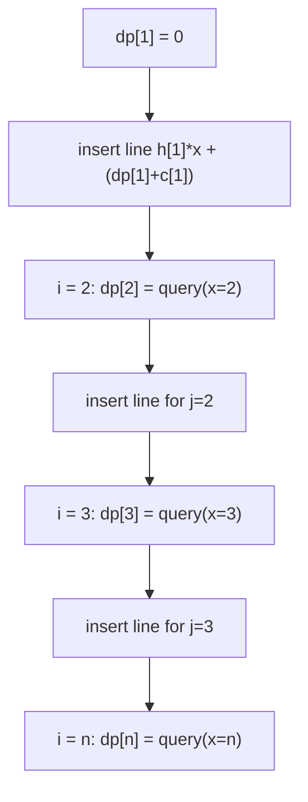

# Cost of Convex (Building Costs DP via Li Chao Tree)

| Meta | Value |
|------|-------|
| Source | CSES-style (self-contained convex DP) — filed as task 2085 |
| Difficulty | Hard |
| Topics | DP optimization, Li Chao Tree, Convex Hull Trick |
| Link | https://cses.fi/problemset/ (self-contained statement below) |

---

## Problem Statement

You are constructing $n$ buildings in a line, indexed $1 \dots n$. Building $i$ has a
**height** $h_i$. You process them left to right. Whenever you "open" a construction
**phase** starting at some building $j$ and ending right before building $i$, the
cost of that phase depends on the height $h_j$ of its **first** building and the
index $i$ where it ends:

$$
\text{phaseCost}(j, i) = h_j \cdot i + c_j,
$$

where $c_j$ is a fixed setup constant attached to building $j$. Let $dp[i]$ be the
minimum total cost to have finished everything up to (but not including) position
$i$. Starting from $dp[1] = 0$, the transition is

$$
dp[i] = \min_{1 \le j < i} \big( dp[j] + h_j \cdot i + c_j \big).
$$

Output $dp[n]$ (the cost to reach the final position). Each previous building $j$
contributes a **line** $y = h_j \cdot x + (dp[j] + c_j)$ evaluated at $x = i$, so this
is exactly a "minimum over lines at a point" problem.

Constraints: $1 \le n \le 2\cdot10^5$, $1 \le h_i \le 10^9$, $0 \le c_i \le 10^9$.

```text
Input
n = 4
h = [2, 5, 1, 3]      (1-indexed heights h[1..4])
c = [0, 1, 4, 2]

We compute dp[1..4], answer = dp[4].

dp[1] = 0                                  (base; phase may start here)
line from j=1: y = 2*x + (0 + 0)   = 2x

dp[2] = min over j<2 at x=2:
        j=1: 2*2 + 0 = 4           -> dp[2] = 4
line from j=2: y = 5*x + (4 + 1)   = 5x + 5

dp[3] = min over j<3 at x=3:
        j=1: 2*3 + 0     = 6
        j=2: 5*3 + 5     = 20      -> dp[3] = 6
line from j=3: y = 1*x + (6 + 4)   = x + 10

dp[4] = min over j<4 at x=4:
        j=1: 2*4 + 0     = 8
        j=2: 5*4 + 5     = 25
        j=3: 1*4 + 10    = 14      -> dp[4] = 8

Output
8
```

---

## Approach (WHY)

The naive transition is $O(n^2)$: for each $i$ we scan all $j < i$. But each term
$dp[j] + h_j \cdot i + c_j$ is **linear in $i$** with slope $h_j$ and intercept
$dp[j] + c_j$. So "minimize over $j$ at the current $i$" is "evaluate a set of lines
at $x = i$ and take the minimum."

Why a **Li Chao tree** rather than a monotonic CHT? The slopes $h_j$ arrive in
**arbitrary order** (heights are unsorted), and although the query points $x = i$ are
increasing, the classic CHT also needs sorted insertion slopes for $O(1)$ amortized
inserts. Li Chao handles arbitrary insertion order in clean $O(\log n)$ per operation
with no hull bookkeeping. Because the query coordinates are exactly the indices
$1 \dots n$, we use the **array/index version** over the discretized domain
`xs = [1, 2, ..., n]`.

We insert state $j$'s line as soon as $dp[j]$ is known, then compute $dp[i]$ as one
query at $x = i$, guaranteeing each line is only ever queried *after* it is inserted.



---

## Solution

### Python

```python
import sys
from typing import List

INF = float("inf")


class LiChaoMin:
    """Min Li Chao tree over a discretized x-domain xs (sorted, unique)."""

    def __init__(self, xs: List[int]) -> None:
        self.xs = xs
        self.n = len(xs)
        size = 4 * self.n
        self.m = [0] * size
        self.b = [INF] * size  # INF intercept => empty line

    def _f(self, idx: int, x: int) -> float:
        return self.m[idx] * x + self.b[idx]

    def insert(self, m: int, b: int) -> None:
        self._insert(1, 0, self.n - 1, m, b)

    def _insert(self, node: int, lo: int, hi: int, m: int, b: int) -> None:
        mid = (lo + hi) // 2
        xl, xm = self.xs[lo], self.xs[mid]
        if m * xm + b < self._f(node, xm):
            self.m[node], m = m, self.m[node]
            self.b[node], b = b, self.b[node]
        if lo == hi:
            return
        if m * xl + b < self._f(node, xl):
            self._insert(2 * node, lo, mid, m, b)
        else:
            self._insert(2 * node + 1, mid + 1, hi, m, b)

    def query(self, x_index: int) -> float:
        node, lo, hi = 1, 0, self.n - 1
        x = self.xs[x_index]
        res = self._f(node, x)
        while lo != hi:
            mid = (lo + hi) // 2
            if x_index <= mid:
                node, hi = 2 * node, mid
            else:
                node, lo = 2 * node + 1, mid + 1
            res = min(res, self._f(node, x))
        return res


def solve(n: int, h: List[int], c: List[int]) -> int:
    # 1-indexed inputs h[1..n], c[1..n]; query coordinates are indices 1..n.
    xs = list(range(1, n + 1))
    index_of = {x: i for i, x in enumerate(xs)}
    tree = LiChaoMin(xs)

    dp = [0] * (n + 1)
    dp[1] = 0
    tree.insert(h[1], dp[1] + c[1])  # line for j = 1
    for i in range(2, n + 1):
        dp[i] = int(tree.query(index_of[i]))
        tree.insert(h[i], dp[i] + c[i])  # line for j = i
    return dp[n]


def main() -> None:
    data = sys.stdin.buffer.read().split()
    if not data:
        return
    idx = 0
    n = int(data[idx]); idx += 1
    h = [0] * (n + 1)
    c = [0] * (n + 1)
    for i in range(1, n + 1):
        h[i] = int(data[idx]); idx += 1
    for i in range(1, n + 1):
        c[i] = int(data[idx]); idx += 1
    print(solve(n, h, c))


main()
```

### C++

```cpp
#include <bits/stdc++.h>
using namespace std;

const long long INF = 1e18;

struct LiChaoMin {
    // Min Li Chao tree over a discretized x-domain xs (sorted, unique).
    vector<long long> xs;
    int n;
    vector<long long> m, b;  // stored line per node: f(x) = m*x + b

    LiChaoMin(const vector<long long>& xs_) : xs(xs_), n((int)xs_.size()) {
        m.assign(4 * n, 0);
        b.assign(4 * n, INF);  // empty line => f(x) = INF
    }

    long long f(int idx, long long x) const { return m[idx] * x + b[idx]; }

    void insert(long long nm, long long nb) { insert(1, 0, n - 1, nm, nb); }

    void insert(int node, int lo, int hi, long long nm, long long nb) {
        int mid = (lo + hi) / 2;
        long long xl = xs[lo], xm = xs[mid];
        if (nm * xm + nb < f(node, xm)) {     // new line lower at midpoint
            swap(nm, m[node]);
            swap(nb, b[node]);
        }
        if (lo == hi) return;
        if (nm * xl + nb < f(node, xl))       // loser wins on the left
            insert(2 * node, lo, mid, nm, nb);
        else
            insert(2 * node + 1, mid + 1, hi, nm, nb);
    }

    long long query(int xIndex) const {
        int node = 1, lo = 0, hi = n - 1;
        long long x = xs[xIndex];
        long long res = f(node, x);
        while (lo != hi) {
            int mid = (lo + hi) / 2;
            if (xIndex <= mid) { node = 2 * node;     hi = mid; }
            else               { node = 2 * node + 1; lo = mid + 1; }
            res = min(res, f(node, x));
        }
        return res;
    }
};

long long solve(int n, const vector<long long>& h, const vector<long long>& c) {
    // 1-indexed h[1..n], c[1..n]; query coordinates are indices 1..n.
    vector<long long> xs(n);
    for (int i = 0; i < n; i++) xs[i] = i + 1;   // coordinates 1..n, already sorted
    auto idxOf = [&](long long x) { return (int)(x - 1); };

    LiChaoMin tree(xs);
    vector<long long> dp(n + 1, 0);
    dp[1] = 0;
    tree.insert(h[1], dp[1] + c[1]);             // line for j = 1
    for (int i = 2; i <= n; i++) {
        dp[i] = tree.query(idxOf(i));
        tree.insert(h[i], dp[i] + c[i]);         // line for j = i
    }
    return dp[n];
}

int main() {
    ios::sync_with_stdio(false);
    cin.tie(nullptr);
    int n;
    if (!(cin >> n)) return 0;
    vector<long long> h(n + 1), c(n + 1);
    for (int i = 1; i <= n; i++) cin >> h[i];
    for (int i = 1; i <= n; i++) cin >> c[i];
    cout << solve(n, h, c) << "\n";
    return 0;
}
```

---

## Trace (n = 4, h = [2,5,1,3], c = [0,1,4,2])

| Step | Action | Lines in tree (slope, intercept) | Result |
|------|--------|----------------------------------|--------|
| init | `dp[1]=0`, insert j=1 | $(2,\,0)$ | — |
| i=2  | query x=2 → $2\cdot2+0=4$ | — | `dp[2]=4` |
|      | insert j=2 | $(2,0),\,(5,5)$ | — |
| i=3  | query x=3 → min($2\cdot3+0$, $5\cdot3+5$) = min(6,20) | — | `dp[3]=6` |
|      | insert j=3 | $(2,0),(5,5),(1,10)$ | — |
| i=4  | query x=4 → min($8$, $25$, $14$) | — | `dp[4]=8` |

Answer: `dp[4] = 8`, matching the worked example.

---

## Math & Complexity

Each state contributes one line $y = h_j x + (dp[j] + c_j)$. The transition value is

$$
dp[i] = \min_{j < i} \big( h_j \cdot i + (dp[j] + c_j) \big),
$$

a pointwise minimum of linear functions evaluated at $x = i$. Inserting a line and
querying a point are each $O(\log n)$, and we do $O(n)$ of each:

$$
T(n) = O(n \log n), \qquad S(n) = O(n).
$$

Overflow note: $h_j \cdot i$ can reach $10^9 \cdot 2\cdot10^5 = 2\cdot10^{14}$, and
accumulated $dp$ can grow over many phases — comfortably within `long long`
($< 9.2\times10^{18}$), so `const long long INF = 1e18` is a safe sentinel.

---

## Takeaway

When a DP transition has the shape $dp[i] = \min_j (\text{slope}_j \cdot x_i +
\text{intercept}_j)$ and the slopes arrive **unsorted**, reach for a **Li Chao tree**:
insert each finished state as a line, answer each new state with one point query, and
turn an $O(n^2)$ DP into $O(n \log n)$ — no hull maintenance required.
