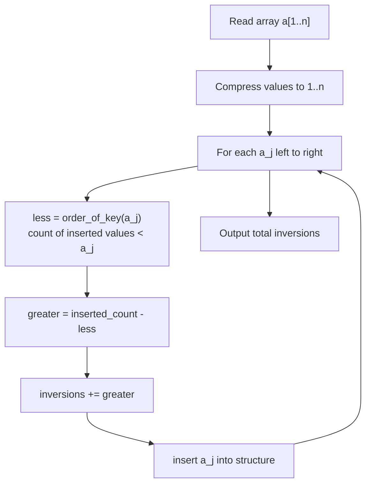

# CSES 2169 — Counting Inversions (Policy Tree / Order Statistics)

| | |
|---|---|
| **Source** | CSES Problem Set (classic; also appears as SPOJ INVCNT, CSES sorting tasks) |
| **Difficulty** | Medium |
| **Topics** | Order-statistics tree, Fenwick/BIT, coordinate compression, divide & conquer |
| **Link** | https://cses.fi/problemset/ |

---

## Problem Statement

Given an array $a$ of $n$ integers, count the number of **inversions** — pairs of indices
$(i, j)$ such that

$$
i < j \quad\text{and}\quad a_i > a_j.
$$

An inversion measures how "far" the array is from being sorted ascending. A sorted array has $0$
inversions; a strictly descending array has $\binom{n}{2}$.

```
Input:
5
2 4 1 3 5

Output:
3
```

The three inversions are $(2,4{:}1)$, $(2{:}1)$… concretely the pairs of *values*
$(2,1)$, $(4,1)$, $(4,3)$.

---

## Approach (WHY)

Process the array **left to right**, maintaining an order-statistics structure of the values seen
so far. When we reach $a_j$, every already-inserted value that is **greater than** $a_j$ forms an
inversion with it.

If `cnt` elements are currently inserted and `order_of_key(a_j)` counts those strictly less than
$a_j$, then (assuming distinct values for a moment) the number greater than $a_j$ is
`cnt - order_of_key(a_j)`. Summing this over all $j$ gives the total inversion count.

Equivalently, with a Fenwick tree over compressed coordinates we add `j_so_far - prefix(a_j)`.



The total is a sum of $n$ rank queries, each $O(\log n)$, so the algorithm runs in $O(n \log n)$.

---

## Solution

### Python

A Fenwick tree over compressed coordinates is the most reliable pure-Python route. `SortedList`
also works and is shown as an alternative.

```python
import sys

def count_inversions(a):
    # Coordinate compression: map values to 1..m
    vals = sorted(set(a))
    comp = {v: i + 1 for i, v in enumerate(vals)}
    m = len(vals)

    tree = [0] * (m + 1)

    def update(i):
        while i <= m:
            tree[i] += 1
            i += i & (-i)

    def prefix(i):                 # count of inserted values <= i
        s = 0
        while i > 0:
            s += tree[i]
            i -= i & (-i)
        return s

    inversions = 0
    inserted = 0
    for x in a:
        c = comp[x]
        less_or_eq = prefix(c)     # values <= x already inserted
        greater = inserted - less_or_eq
        inversions += greater
        update(c)
        inserted += 1
    return inversions

def main():
    data = sys.stdin.buffer.read().split()
    n = int(data[0])
    a = list(map(int, data[1:1 + n]))
    print(count_inversions(a))

main()
```

```cpp
#include <bits/stdc++.h>
#include <ext/pb_ds/assoc_container.hpp>
#include <ext/pb_ds/tree_policy.hpp>
using namespace std;
using namespace __gnu_pbds;

// Multiset of (value, unique_id) so equal values do not collide.
typedef tree<pair<long long,int>, null_type, less<pair<long long,int>>,
             rb_tree_tag, tree_order_statistics_node_update> ordered_multiset;

int main() {
    ios_base::sync_with_stdio(false);
    cin.tie(nullptr);

    int n;
    if (!(cin >> n)) return 0;
    vector<long long> a(n);
    for (auto &x : a) cin >> x;

    ordered_multiset s;
    long long inversions = 0;
    for (int j = 0; j < n; ++j) {
        // count already-inserted elements with value < a[j]:
        long long less = s.order_of_key({a[j], INT_MIN});
        long long greater = (long long)s.size() - less - 0; // equal values: see note
        // elements <= a[j] = order_of_key({a[j], INT_MAX}); greater = size - that
        long long less_or_eq = s.order_of_key({a[j], INT_MAX});
        greater = (long long)s.size() - less_or_eq;
        inversions += greater;
        s.insert({a[j], j});
    }

    cout << inversions << "\n";
    return 0;
}
```

> Note: by inserting `(value, id)` and querying `order_of_key({a[j], INT_MAX})` we count every
> element with value `<= a[j]`; subtracting from the current size gives the count of strictly
> greater values, which is exactly the inversions contributed by position `j`.

---

## Iteration Trace

Array `a = [2, 4, 1, 3, 5]`, inserting left to right. `greater` = elements already inserted that
are strictly larger than the current value.

| j | a[j] | inserted before | values > a[j] before | greater added | running inversions |
|---|------|-----------------|----------------------|---------------|--------------------|
| 0 | 2    | {}              | —                    | 0             | 0                  |
| 1 | 4    | {2}             | —                    | 0             | 0                  |
| 2 | 1    | {2,4}           | {2,4}                | 2             | 2                  |
| 3 | 3    | {1,2,4}         | {4}                  | 1             | 3                  |
| 4 | 5    | {1,2,3,4}       | —                    | 0             | 3                  |

Total inversions = **3**.

---

## Complexity

The work is dominated by $n$ Fenwick/policy-tree operations:

$$
T(n) = O(n \log n), \qquad S(n) = O(n).
$$

| Approach | Time | Space |
|---|---|---|
| Fenwick over compressed coords (Python) | $O(n \log n)$ | $O(n)$ |
| PBDS ordered multiset (C++) | $O(n \log n)$ | $O(n)$ |
| Merge-sort inversion count | $O(n \log n)$ | $O(n)$ |
| Brute force (all pairs) | $O(n^2)$ | $O(1)$ |

---

## Takeaway

Counting inversions is the canonical "rank as you go" problem: sweep the array, and at each step
ask *how many previously seen values exceed the current one*. Whether you phrase it as an
order-statistics tree (`order_of_key`) or a Fenwick tree over compressed coordinates, the engine is
the same $O(\log n)$ rank query, giving an overall $O(n \log n)$ solution.
