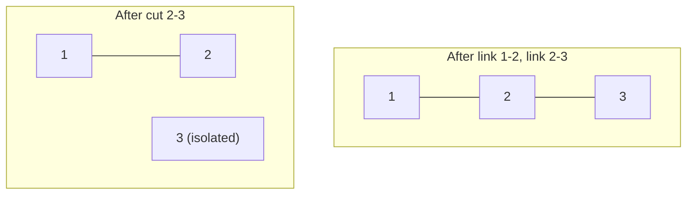

# Online Dynamic Connectivity with a Link-Cut Tree

| Field | Value |
| --- | --- |
| Source | Self-contained (classic dynamic-forest connectivity) |
| Difficulty | Hard |
| Topics | Link-Cut Tree, splay trees, dynamic forest, online queries |
| Link | https://en.wikipedia.org/wiki/Link/cut_tree |

---

## Problem Statement

You maintain a **forest** (an acyclic undirected graph) on $n$ vertices that
starts with **no edges**. Process $q$ operations **online** (you must answer each
query before reading the next):

- `link u v` — add an edge between `u` and `v`. It is guaranteed (or you must
  verify) that `u` and `v` are in **different** trees, so the forest stays acyclic.
- `cut u v` — remove the existing edge `u`–`v`.
- `conn u v` — output `YES` if `u` and `v` are currently connected, else `NO`.

All operations must run in amortized $O(\log n)$.

```text
Input:
n = 5, q = 7
link 1 2
link 2 3
conn 1 3     -> YES   (path 1-2-3)
conn 1 4     -> NO
cut 2 3
conn 1 3     -> NO
link 3 4

Output:
YES
NO
NO
```

## Approach (WHY)

A Disjoint-Set Union (DSU) handles `link` + `conn` beautifully but **cannot
`cut`** — union-find has no efficient delete. The moment edges can disappear, we
need a structure that represents the *actual tree shape* so an edge removal
splits connectivity correctly. That is precisely the **Link-Cut Tree**.

Key reductions:

1. **`conn u v`** ⇒ compare the **represented-tree roots**: `findRoot(u) ==
   findRoot(v)`. Two vertices are connected iff their auxiliary splay trees are
   reachable through path-parent pointers, which `findRoot` follows after an
   `access`.
2. **`link u v`** ⇒ `makeRoot(u)` (re-root `u`'s tree so `u` has no parent), then
   set `u`'s path-parent to `v`. Re-rooting is the lazy-reverse trick that keeps
   the operation $O(\log n)$.
3. **`cut u v`** ⇒ `makeRoot(u); access(v)`. Now the path `u..v` is one splay
   tree; if the edge truly exists, `v`'s left child is `u` and they are adjacent,
   so we sever the two pointers.

Because every operation is one or two `access`-based primitives, each costs
amortized $O(\log n)$ by the splay-tree access lemma. No values or path
aggregates are needed here, so the node payload is trivial — only the structural
pointers (`ch`, `fa`, `rev`) matter.

## Solution

### Python

```python
import sys


class LinkCutTree:
    """Structure-only LCT: link / cut / connected in amortized O(log n)."""

    def __init__(self, n):
        size = n + 1                       # node 0 = null sentinel
        self.ch = [[0, 0] for _ in range(size)]
        self.fa = [0] * size
        self.rev = [False] * size

    def is_root(self, x):
        f = self.fa[x]
        return self.ch[f][0] != x and self.ch[f][1] != x

    def apply_rev(self, x):
        if x == 0:
            return
        self.ch[x][0], self.ch[x][1] = self.ch[x][1], self.ch[x][0]
        self.rev[x] = not self.rev[x]

    def push_down(self, x):
        if self.rev[x]:
            self.apply_rev(self.ch[x][0])
            self.apply_rev(self.ch[x][1])
            self.rev[x] = False

    def rotate(self, x):
        y = self.fa[x]
        z = self.fa[y]
        k = 1 if self.ch[y][1] == x else 0
        if not self.is_root(y):
            self.ch[z][1 if self.ch[z][1] == y else 0] = x
        self.fa[x] = z
        self.ch[y][k] = self.ch[x][k ^ 1]
        if self.ch[x][k ^ 1]:
            self.fa[self.ch[x][k ^ 1]] = y
        self.ch[x][k ^ 1] = y
        self.fa[y] = x

    def splay(self, x):
        stack = [x]
        y = x
        while not self.is_root(y):
            y = self.fa[y]
            stack.append(y)
        while stack:
            self.push_down(stack.pop())
        while not self.is_root(x):
            y = self.fa[x]
            z = self.fa[y]
            if not self.is_root(y):
                if (self.ch[y][1] == x) ^ (self.ch[z][1] == y):
                    self.rotate(x)
                else:
                    self.rotate(y)
            self.rotate(x)

    def access(self, x):
        last = 0
        y = x
        while y:
            self.splay(y)
            self.ch[y][1] = last
            last = y
            y = self.fa[y]
        self.splay(x)
        return last

    def make_root(self, x):
        self.access(x)
        self.apply_rev(x)

    def find_root(self, x):
        self.access(x)
        while self.ch[x][0]:
            self.push_down(x)
            x = self.ch[x][0]
        self.splay(x)
        return x

    def connected(self, x, y):
        if x == y:
            return True
        return self.find_root(x) == self.find_root(y)

    def link(self, x, y):
        self.make_root(x)
        if self.find_root(y) != x:
            self.fa[x] = y

    def cut(self, x, y):
        self.make_root(x)
        if (self.find_root(y) == x and self.fa[y] == x
                and self.ch[y][0] == 0):
            self.fa[y] = 0
            self.ch[x][1] = 0


def main():
    data = sys.stdin.read().split()
    idx = 0
    n = int(data[idx]); idx += 1
    q = int(data[idx]); idx += 1
    lct = LinkCutTree(n)
    out = []
    for _ in range(q):
        op = data[idx]; idx += 1
        u = int(data[idx]); idx += 1
        v = int(data[idx]); idx += 1
        if op == "link":
            lct.link(u, v)
        elif op == "cut":
            lct.cut(u, v)
        else:  # conn
            out.append("YES" if lct.connected(u, v) else "NO")
    sys.stdout.write("\n".join(out) + "\n")


if __name__ == "__main__":
    main()
```

### C++

```cpp
#include <bits/stdc++.h>
using namespace std;

struct LinkCutTree {
    // Structure-only LCT: link / cut / connected in amortized O(log n).
    vector<array<int, 2>> ch;
    vector<int> fa;
    vector<char> rev;

    LinkCutTree(int n) {
        int size = n + 1;                  // node 0 = null sentinel
        ch.assign(size, {0, 0});
        fa.assign(size, 0);
        rev.assign(size, 0);
    }

    bool isRoot(int x) {
        int f = fa[x];
        return ch[f][0] != x && ch[f][1] != x;
    }

    void applyRev(int x) {
        if (x == 0) return;
        swap(ch[x][0], ch[x][1]);
        rev[x] ^= 1;
    }

    void pushDown(int x) {
        if (rev[x]) {
            applyRev(ch[x][0]);
            applyRev(ch[x][1]);
            rev[x] = 0;
        }
    }

    void rotate(int x) {
        int y = fa[x], z = fa[y];
        int k = (ch[y][1] == x);
        if (!isRoot(y)) ch[z][ch[z][1] == y] = x;
        fa[x] = z;
        ch[y][k] = ch[x][k ^ 1];
        if (ch[x][k ^ 1]) fa[ch[x][k ^ 1]] = y;
        ch[x][k ^ 1] = y;
        fa[y] = x;
    }

    void splay(int x) {
        static vector<int> stk;
        stk.clear();
        int y = x;
        stk.push_back(y);
        while (!isRoot(y)) {
            y = fa[y];
            stk.push_back(y);
        }
        while (!stk.empty()) {
            pushDown(stk.back());
            stk.pop_back();
        }
        while (!isRoot(x)) {
            int yy = fa[x], zz = fa[yy];
            if (!isRoot(yy)) {
                if ((ch[yy][1] == x) ^ (ch[zz][1] == yy)) rotate(x);
                else rotate(yy);
            }
            rotate(x);
        }
    }

    int access(int x) {
        int last = 0;
        for (int y = x; y; y = fa[y]) {
            splay(y);
            ch[y][1] = last;
            last = y;
        }
        splay(x);
        return last;
    }

    void makeRoot(int x) {
        access(x);
        applyRev(x);
    }

    int findRoot(int x) {
        access(x);
        while (ch[x][0]) {
            pushDown(x);
            x = ch[x][0];
        }
        splay(x);
        return x;
    }

    bool connected(int x, int y) {
        if (x == y) return true;
        return findRoot(x) == findRoot(y);
    }

    void link(int x, int y) {
        makeRoot(x);
        if (findRoot(y) != x) fa[x] = y;
    }

    void cut(int x, int y) {
        makeRoot(x);
        if (findRoot(y) == x && fa[y] == x && ch[y][0] == 0) {
            fa[y] = 0;
            ch[x][1] = 0;
        }
    }
};

int main() {
    ios::sync_with_stdio(false);
    cin.tie(nullptr);
    int n, q;
    if (!(cin >> n >> q)) return 0;
    LinkCutTree lct(n);
    string op;
    int u, v;
    string out;
    for (int i = 0; i < q; i++) {
        cin >> op >> u >> v;
        if (op == "link") lct.link(u, v);
        else if (op == "cut") lct.cut(u, v);
        else out += lct.connected(u, v) ? "YES\n" : "NO\n";
    }
    cout << out;
    return 0;
}
```

## Iteration Trace

Run the sample. `R(x)` denotes `findRoot(x)`.

| Op | Action | Effect | Output |
| --- | --- | --- | --- |
| `link 1 2` | `makeRoot(1)`, `fa[1]=2` | tree `{1,2}` | — |
| `link 2 3` | `makeRoot(2)`, `fa[2]=3` | tree `{1,2,3}` | — |
| `conn 1 3` | `R(1)==R(3)` | same tree | **YES** |
| `conn 1 4` | `R(1) != R(4)` | `4` is isolated | **NO** |
| `cut 2 3` | `makeRoot(2); access(3)`; `3`'s left child is `2`, adjacent → sever | trees `{1,2}`, `{3}` | — |
| `conn 1 3` | `R(1) != R(3)` | now disconnected | **NO** |
| `link 3 4` | `makeRoot(3)`, `fa[3]=4` | tree `{3,4}` | — |

After `cut 2 3`, vertex `1` keeps its edge to `2` but loses reach to `3`, so the
third `conn` flips from `YES` to `NO` — exactly the behavior DSU could not provide.



## Math / Complexity

Each operation is a constant number of `access` calls. By the splay-tree
**access lemma**, the amortized number of rotations and preferred-child changes
across any sequence of $m$ operations on $n$ nodes is $O(m \log n)$, so:

$$
T_{\text{op}} = O(\log n) \ \text{amortized}, \qquad
T_{\text{total}} = O\big((n + q)\log n\big), \qquad
\text{memory} = O(n).
$$

## Takeaway

When connectivity must survive **edge deletions**, DSU is not enough — you need a
structure that mirrors the true tree shape. The Link-Cut Tree answers
`link` / `cut` / `connected` in amortized $O(\log n)$ by storing each preferred
path as a splay tree and re-rooting on demand with a lazy reverse flag. Strip the
payload to nothing and the same machinery becomes a pure **online dynamic forest**.
