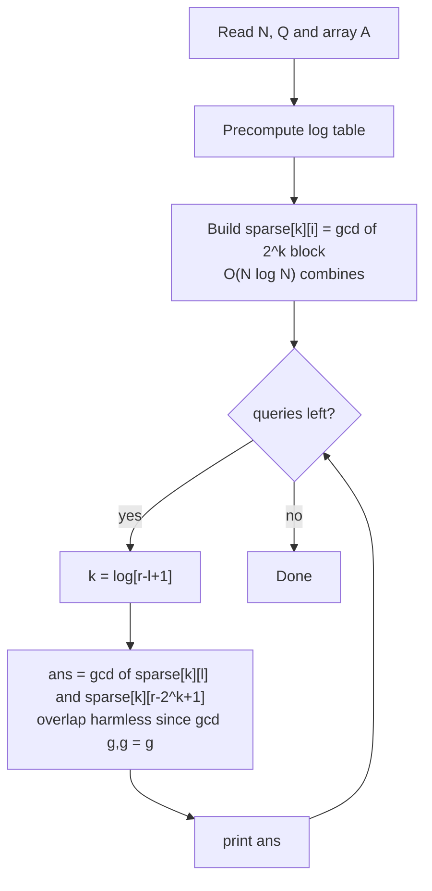
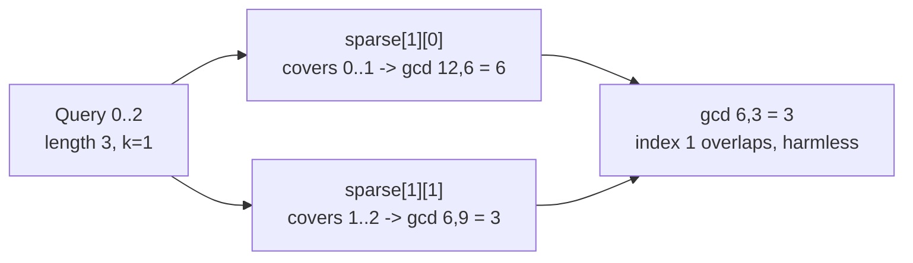

# Range GCD Queries — Sparse Table

| Field      | Value                                                |
| ---------- | ---------------------------------------------------- |
| Source     | Classic (self-contained statement)                   |
| Difficulty | Medium                                               |
| Topics     | Sparse table, Idempotent operations, GCD, Number theory |
| Link       | https://cp-algorithms.com/data_structures/sparse-table.html |

---

## Problem Statement

You are given a static array $A$ of $N$ positive integers (0-indexed). Process
$Q$ queries; each query gives a range $[l, r]$ (inclusive) and asks for

$$
\gcd\bigl(A[l],\, A[l+1],\, \ldots,\, A[r]\bigr),
$$

the greatest common divisor of all elements in the range. The array is never
modified between queries.

Constraints:

$$
1 \le N \le 2 \cdot 10^5, \qquad 1 \le Q \le 2 \cdot 10^5, \qquad 1 \le A_i \le 10^9.
$$

```text
Input
6 3
12 6 9 18 24 8
0 2
1 4
3 5

Output
3
3
2
```

Query `0 2` → $\gcd(12, 6, 9) = 3$.
Query `1 4` → $\gcd(6, 9, 18, 24) = 3$.
Query `3 5` → $\gcd(18, 24, 8) = 2$.

## Approach (WHY)

GCD is **associative** and, crucially, **idempotent**:

$$
\gcd(x, x) = x.
$$

That makes it a perfect fit for the sparse table $O(1)$ query. When the left and
right power-of-two blocks overlap, the shared elements are folded into the GCD
twice — but $\gcd(g, g) = g$, so the double-counting changes nothing. We
precompute `sparse[k][i]` = GCD of the $2^k$ elements starting at $i$ in
$O(N \log N)$, then answer each query in $O(1)$.

Only the `combine` function changes versus RMQ: swap `min` for `gcd`. Note GCD
is more expensive per combine — each `gcd` is $O(\log \max A)$ — but that factor
is the same for build and query and does not change the asymptotic story for the
$O(1)$ query (it is $O(\log \max A)$ strictly, treated as a small constant
factor here).



## Solution

### Python

```python
import sys
from math import gcd

def main():
    data = sys.stdin.buffer.read().split()
    idx = 0
    n = int(data[idx]); q = int(data[idx + 1]); idx += 2
    a = [int(data[idx + i]) for i in range(n)]
    idx += n

    log = [0] * (n + 1)
    for i in range(2, n + 1):
        log[i] = log[i >> 1] + 1

    K = log[n] + 1
    sparse = [a[:]]                          # row 0
    for k in range(1, K):
        half = 1 << (k - 1)
        prev = sparse[k - 1]
        row = [gcd(prev[i], prev[i + half])
               for i in range(n - (1 << k) + 1)]
        sparse.append(row)

    out = []
    for _ in range(q):
        l = int(data[idx]); r = int(data[idx + 1]); idx += 2
        k = log[r - l + 1]
        out.append(gcd(sparse[k][l], sparse[k][r - (1 << k) + 1]))

    sys.stdout.write("\n".join(map(str, out)) + "\n")

if __name__ == "__main__":
    main()
```

### C++

```cpp
#include <bits/stdc++.h>
using namespace std;

int main() {
    ios::sync_with_stdio(false);
    cin.tie(nullptr);

    int n, q;
    cin >> n >> q;
    vector<long long> a(n);
    for (auto& x : a) cin >> x;

    vector<int> logv(n + 1, 0);
    for (int i = 2; i <= n; ++i)
        logv[i] = logv[i >> 1] + 1;

    int K = logv[n] + 1;
    vector<vector<long long>> sparse(K);
    sparse[0] = a;                              // row 0
    for (int k = 1; k < K; ++k) {
        int half = 1 << (k - 1);
        int span = 1 << k;
        sparse[k].resize(n - span + 1);
        for (int i = 0; i + span <= n; ++i)
            sparse[k][i] = std::gcd(sparse[k - 1][i], sparse[k - 1][i + half]);
    }

    string out;
    while (q--) {
        int l, r;
        cin >> l >> r;                          // 0-indexed inclusive
        int k = logv[r - l + 1];
        long long ans = std::gcd(sparse[k][l], sparse[k][r - (1 << k) + 1]);
        out += to_string(ans);
        out += '\n';
    }
    cout << out;
    return 0;
}
```

## Iteration Trace

Array: `[12, 6, 9, 18, 24, 8]`, $n = 6$, $K = 3$.

Building the rows (each cell is the GCD of its $2^k$ block):

| Row $k$ | Length $2^k$ | `sparse[k]` values     |
| ------- | ------------ | ---------------------- |
| $0$     | $1$          | `12 6 9 18 24 8`       |
| $1$     | $2$          | `6 3 9 6 8`            |
| $2$     | $4$          | `3 3 1`                |

Row 1 sample: `gcd(12,6)=6`, `gcd(6,9)=3`, `gcd(9,18)=9`, `gcd(18,24)=6`,
`gcd(24,8)=8`. Row 2 sample: `gcd(6,9)=3`, `gcd(3,6)=3`, `gcd(9,8)=1`.

Answering the sample queries:

| Query $[l,r]$ | $L$ | $k$ | blocks combined                     | answer |
| ------------- | --- | --- | ----------------------------------- | ------ |
| $[0,2]$       | $3$ | $1$ | `sparse[1][0]=6`, `sparse[1][1]=3`  | $\gcd(6,3)=3$ |
| $[1,4]$       | $4$ | $2$ | `sparse[2][1]=3`, `sparse[2][1]=3`  | $\gcd(3,3)=3$ |
| $[3,5]$       | $3$ | $1$ | `sparse[1][3]=6`, `sparse[1][4]=8`  | $\gcd(6,8)=2$ |



## Complexity

Let $V = \max A_i$. Each `gcd` costs $O(\log V)$.

$$
T_\text{build} = O(N \log N \log V), \qquad
T_\text{query} = O(\log V), \qquad
S = O(N \log N).
$$

| Phase           | Time                   | Space         |
| --------------- | ---------------------- | ------------- |
| Build table     | $O(N \log N \log V)$   | $O(N \log N)$ |
| Each query      | $O(\log V)$            | —             |
| All $Q$ queries | $O(Q \log V)$          | —             |

The structural query is still "$O(1)$ combines" — the $\log V$ factor is the
intrinsic cost of a single GCD, not of the sparse-table mechanism.

## Takeaway

Range GCD is RMQ with the `combine` swapped from `min` to `gcd`. Because GCD is
idempotent — $\gcd(g, g) = g$ — the two overlapping power-of-two blocks compose
correctly, giving the same $O(1)$-combine query. Any idempotent operation
(min, max, gcd, AND, OR) plugs into the identical template.
