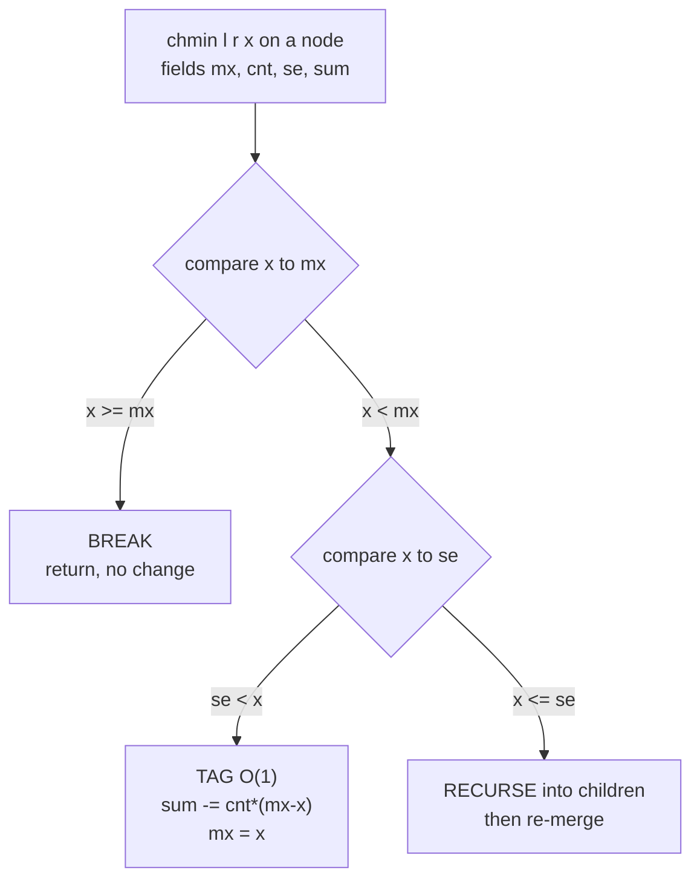

# Gorgeous Sequence (HDU 5306) — Range chmin, Range Max, Range Sum

| Meta | Value |
|------|-------|
| Source | HDU 5306 — "Gorgeous Sequence" (BestCoder) |
| Difficulty | Hard |
| Topics | Segment Tree Beats, Range chmin, Range Max, Range Sum |
| Link | https://acm.hdu.edu.cn/showproblem.php?pid=5306 |

---

## Problem Statement

You are given a sequence $a_1, a_2, \dots, a_n$ and must process $m$ operations of three kinds:

- `0 l r x` — for every $i \in [l, r]$, set $a_i \leftarrow \min(a_i, x)$ (**range chmin**).
- `1 l r` — output $\max_{i \in [l,r]} a_i$ (**range max**).
- `2 l r` — output $\sum_{i \in [l,r]} a_i$ (**range sum**).

Constraints: $n, m \le 10^6$ across the test, values are non-negative and fit in 32 bits, but a range sum can reach $\sim 10^{15}$, so use 64-bit accumulation.

This is **the canonical Segment Tree Beats problem** — the one that introduced the technique.

```text
n=5, a = [1, 2, 3, 4, 5]

0 1 5 3      chmin whole array to 3  -> [1, 2, 3, 3, 3]
2 1 5        sum  = 1+2+3+3+3        -> 12
1 2 4        max of [2,3,3]          -> 3
0 2 4 1      chmin [2..4] to 1       -> [1, 1, 1, 1, 3]
2 1 5        sum  = 1+1+1+1+3        -> 7
```

Output:
```text
12
3
7
```

---

## Approach (WHY)

A plain lazy segment tree cannot push a `chmin(x)` tag, because the effect on a node's **sum** depends on *how many* elements exceed $x$ — information a single sum cannot supply.

Segment Tree Beats stores per node the **max** `mx`, the **count of the max** `mxc`, and the **strict second max** `se`. The `chmin(x)` then has three cases:

1. **Break** — if $\text{mx} \le x$, nothing in the segment exceeds $x$; return immediately.
2. **Tag** — if $\text{se} < x < \text{mx}$, only the `mxc` maxima are affected. Update $\text{sum} \mathrel{-}= \text{mxc}(\text{mx}-x)$, set $\text{mx} \leftarrow x$, and stop. This is the $O(1)$ heart of the method.
3. **Recurse** — if $x \le \text{se}$, the clamp reaches below the second max, so descend into both children and re-merge.

The recurse case is rare: each one *merges* distinct value-classes, and a potential argument bounds the total work at $O((n+m)\log n)$ amortized for this chmin-only variant. Range max and range sum are ordinary segment-tree queries.

---

## Solution

```python
import sys
input = sys.stdin.buffer.read

class GorgeousSeq:
    NEG = -1

    def __init__(self, a):
        self.n = len(a)
        s = 4 * self.n
        self.sum = [0]*s
        self.mx  = [0]*s
        self.se  = [-1]*s     # strict second max; -1 acts as -infinity (values >= 0)
        self.cnt = [0]*s
        self._build(1, 0, self.n-1, a)

    def _pull(self, p):
        l, r = 2*p, 2*p+1
        self.sum[p] = self.sum[l] + self.sum[r]
        if self.mx[l] == self.mx[r]:
            self.mx[p] = self.mx[l]
            self.cnt[p] = self.cnt[l] + self.cnt[r]
            self.se[p] = max(self.se[l], self.se[r])
        elif self.mx[l] > self.mx[r]:
            self.mx[p] = self.mx[l]
            self.cnt[p] = self.cnt[l]
            self.se[p] = max(self.se[l], self.mx[r])
        else:
            self.mx[p] = self.mx[r]
            self.cnt[p] = self.cnt[r]
            self.se[p] = max(self.se[r], self.mx[l])

    def _build(self, p, l, r, a):
        if l == r:
            self.sum[p] = self.mx[p] = a[l]
            self.cnt[p] = 1
            self.se[p] = -1
            return
        m = (l + r)//2
        self._build(2*p, l, m, a)
        self._build(2*p+1, m+1, r, a)
        self._pull(p)

    def _apply(self, p, x):
        if x < self.mx[p]:
            self.sum[p] -= (self.mx[p] - x) * self.cnt[p]
            self.mx[p] = x

    def _push(self, p):
        self._apply(2*p, self.mx[p])
        self._apply(2*p+1, self.mx[p])

    def chmin(self, ql, qr, x): self._chmin(1, 0, self.n-1, ql, qr, x)
    def qmax(self, ql, qr):     return self._qmax(1, 0, self.n-1, ql, qr)
    def qsum(self, ql, qr):     return self._qsum(1, 0, self.n-1, ql, qr)

    def _chmin(self, p, l, r, ql, qr, x):
        if qr < l or r < ql or self.mx[p] <= x:        # break
            return
        if ql <= l and r <= qr and self.se[p] < x:     # tag
            self._apply(p, x)
            return
        m = (l + r)//2; self._push(p)                  # recurse
        self._chmin(2*p, l, m, ql, qr, x)
        self._chmin(2*p+1, m+1, r, ql, qr, x)
        self._pull(p)

    def _qmax(self, p, l, r, ql, qr):
        if qr < l or r < ql: return -1
        if ql <= l and r <= qr: return self.mx[p]
        m = (l + r)//2; self._push(p)
        return max(self._qmax(2*p, l, m, ql, qr),
                   self._qmax(2*p+1, m+1, r, ql, qr))

    def _qsum(self, p, l, r, ql, qr):
        if qr < l or r < ql: return 0
        if ql <= l and r <= qr: return self.sum[p]
        m = (l + r)//2; self._push(p)
        return self._qsum(2*p, l, m, ql, qr) + self._qsum(2*p+1, m+1, r, ql, qr)
```

```cpp
#include <bits/stdc++.h>
using namespace std;
const long long INF = 1e18;

struct GorgeousSeq {
    int n;
    vector<long long> sum, mx, se;
    vector<long long> cnt;

    GorgeousSeq(const vector<long long>& a) {
        n = (int)a.size();
        int s = 4 * n;
        sum.assign(s, 0); mx.assign(s, 0); se.assign(s, -1); cnt.assign(s, 0);
        build(1, 0, n - 1, a);
    }

    void pull(int p) {
        int l = 2*p, r = 2*p+1;
        sum[p] = sum[l] + sum[r];
        if (mx[l] == mx[r]) { mx[p] = mx[l]; cnt[p] = cnt[l] + cnt[r]; se[p] = max(se[l], se[r]); }
        else if (mx[l] > mx[r]) { mx[p] = mx[l]; cnt[p] = cnt[l]; se[p] = max(se[l], mx[r]); }
        else { mx[p] = mx[r]; cnt[p] = cnt[r]; se[p] = max(se[r], mx[l]); }
    }

    void build(int p, int l, int r, const vector<long long>& a) {
        if (l == r) { sum[p] = mx[p] = a[l]; cnt[p] = 1; se[p] = -1; return; }
        int m = (l + r) >> 1;
        build(2*p, l, m, a);
        build(2*p+1, m+1, r, a);
        pull(p);
    }

    void apply_chmin(int p, long long x) {
        if (x < mx[p]) {
            sum[p] -= (__int128)(mx[p] - x) * cnt[p];
            mx[p] = x;
        }
    }

    void push(int p) {
        apply_chmin(2*p, mx[p]);
        apply_chmin(2*p+1, mx[p]);
    }

    void chmin(int p, int l, int r, int ql, int qr, long long x) {
        if (qr < l || r < ql || mx[p] <= x) return;                  // break
        if (ql <= l && r <= qr && se[p] < x) { apply_chmin(p, x); return; } // tag
        int m = (l + r) >> 1; push(p);                               // recurse
        chmin(2*p, l, m, ql, qr, x);
        chmin(2*p+1, m+1, r, ql, qr, x);
        pull(p);
    }

    long long qmax(int p, int l, int r, int ql, int qr) {
        if (qr < l || r < ql) return -1;
        if (ql <= l && r <= qr) return mx[p];
        int m = (l + r) >> 1; push(p);
        return max(qmax(2*p, l, m, ql, qr), qmax(2*p+1, m+1, r, ql, qr));
    }

    long long qsum(int p, int l, int r, int ql, int qr) {
        if (qr < l || r < ql) return 0;
        if (ql <= l && r <= qr) return sum[p];
        int m = (l + r) >> 1; push(p);
        return qsum(2*p, l, m, ql, qr) + qsum(2*p+1, m+1, r, ql, qr);
    }
};
```

---

## Trace / Walkthrough

Start with $a = [1,2,3,4,5]$. Root: `mx=5, cnt=1, se=4, sum=15`.

**`0 1 5 3` (chmin whole array to 3):** at the root, $\text{mx}=5 > 3$ so not a break; but $\text{se}=4 \ge 3$, so the **tag** test fails and we **recurse**. Descending, the right subtree holding $[4,5]$ keeps clamping until leaves $4\to3$ and $5\to3$. New array $[1,2,3,3,3]$, root `sum=12, mx=3, cnt=3, se=2`.

**`2 1 5` (sum):** returns `12` directly from the root.

**`1 2 4` (max of indices 2..4 → values 2,3,3):** ordinary max query → `3`.

**`0 2 4 1` (chmin [2..4] to 1):** clamps values $2,3,3$ down to $1$ → array $[1,1,1,1,3]$.

**`2 1 5` (sum):** $1+1+1+1+3 = 7$.

The first chmin recursed (because the second max blocked a single tag), but later chmins on already-clamped regions hit the **break** case instantly — the amortized payoff in action.

---

## Mermaid



---

## Math / Complexity

Let $A$ be the value range. The chmin-only beats structure costs $O((n+m)\log n)$ amortized via the potential

$$\Phi = \sum_{v}\big(\text{distinct max-classes in subtree } v\big),$$

which starts at $O(n\log n)$, never goes negative, and drops by at least one each time a chmin *recurses* (because a recurse merges value classes). Range max and range sum are plain $O(\log n)$ queries. Total time $O((n+m)\log n)$, space $O(n)$. Sums up to $\sim 10^{15}$ require 64-bit integers; in C++ use `__int128` for the intermediate product to be fully safe.

---

## Key Takeaway

Storing **max, count-of-max, strict-second-max** turns the non-distributive `chmin` into a three-way *break / tag / recurse* decision; the rare recurse case is amortized away, making range chmin + range max + range sum all efficient.
