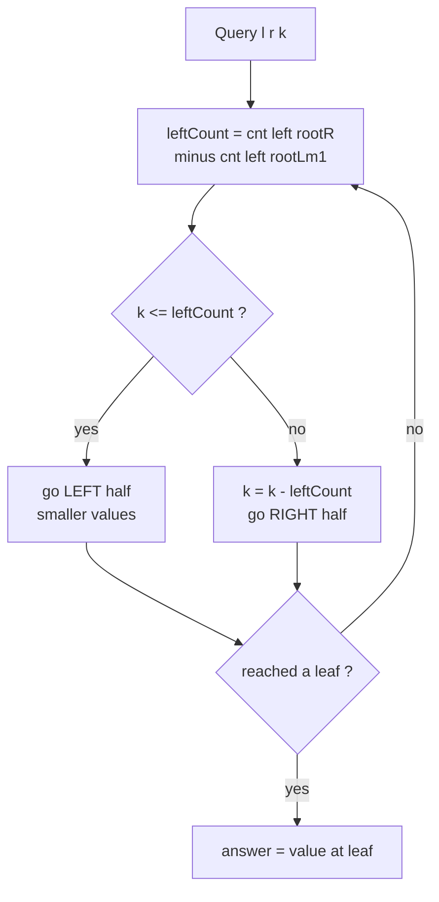
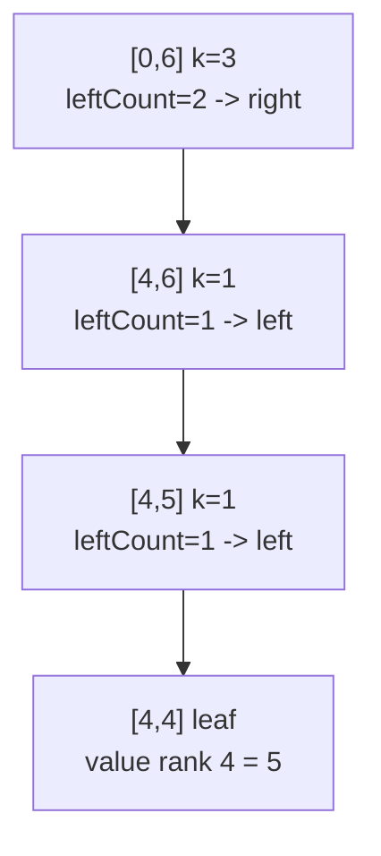

# K-th Smallest Number in Range (Persistent Segment Tree)

| Field | Value |
| --- | --- |
| Source | SPOJ MKTHNUM / Codeforces classic |
| Difficulty | Hard |
| Topics | Persistent segment tree, coordinate compression, order statistics |
| Link | https://www.spoj.com/problems/MKTHNUM/ |

---

## Problem Statement

You are given an array $a[1..n]$ of integers. Answer $q$ queries. Each query is a
triple $(l, r, k)$ asking for the **$k$-th smallest value** among the elements
$a_l, a_{l+1}, \dots, a_r$ (with $1 \le l \le r \le n$ and
$1 \le k \le r - l + 1$).

Formally, sort the multiset $\{a_l, \dots, a_r\}$ in non-decreasing order; output
the element at 1-based position $k$.

```text
Input:
n = 7, q = 3
a = [1, 5, 2, 6, 3, 7, 4]
queries:
  (2, 5, 3)   # subarray [5,2,6,3] sorted -> [2,3,5,6], 3rd -> 5
  (4, 4, 1)   # subarray [6] -> 1st -> 6
  (1, 7, 4)   # whole array sorted -> [1,2,3,4,5,6,7], 4th -> 4

Output:
5
6
4
```

## Approach (WHY)

Naively sorting each subarray is $O(q \cdot n \log n)$ — far too slow. The key
insight is to build a **persistent segment tree over the value domain** and
exploit the prefix-difference trick.

1. **Compress values.** Map the distinct sorted values to ranks $0 \dots m-1$.
2. **Prefix versions.** `version[i]` is a histogram of the first $i$ elements:
   inserting $a_i$ (a single `+1`) into `version[i-1]`. Each insertion
   path-copies only $O(\log m)$ nodes, so all $n$ versions cost
   $O(n \log m)$ memory.
3. **Range = difference of versions.** The count of $a[l..r]$ values inside any
   value range is `version[r] − version[l-1]`, because

$$
\text{count}_{[l,r]} = \text{prefix}_r - \text{prefix}_{l-1}.
$$

4. **Descend for the k-th.** At each node, the number of in-range elements in the
   left (smaller) value half is the difference of the left children's counts. If
   $k \le c_{\text{left}}$ recurse left, else subtract and recurse right.



## Solution

### Python

```python
import sys
input = sys.stdin.readline

class KthSmallest:
    def __init__(self, values, max_nodes):
        self.left = [0] * max_nodes
        self.right = [0] * max_nodes
        self.cnt = [0] * max_nodes      # count stored per node
        self.tot = 1                    # next free id (0 = null)
        self.m = len(values)
        self.roots = [0]                # version 0 = empty histogram

    def _new(self):
        node = self.tot
        self.tot += 1
        return node

    def insert(self, prev, lo, hi, pos):
        cur = self._new()
        self.cnt[cur] = self.cnt[prev] + 1
        if lo == hi:
            return cur
        mid = (lo + hi) // 2
        if pos <= mid:
            self.left[cur] = self.insert(self.left[prev], lo, mid, pos)
            self.right[cur] = self.right[prev]
        else:
            self.left[cur] = self.left[prev]
            self.right[cur] = self.insert(self.right[prev], mid + 1, hi, pos)
        return cur

    def kth(self, u, v, lo, hi, k):
        # u = root[l-1], v = root[r]
        if lo == hi:
            return lo
        mid = (lo + hi) // 2
        left_count = self.cnt[self.left[v]] - self.cnt[self.left[u]]
        if k <= left_count:
            return self.kth(self.left[u], self.left[v], lo, mid, k)
        return self.kth(self.right[u], self.right[v], mid + 1, hi, k - left_count)


def main():
    sys.setrecursionlimit(1 << 20)
    n, q = map(int, input().split())
    a = list(map(int, input().split()))

    # coordinate compression
    sorted_vals = sorted(set(a))
    rank = {v: i for i, v in enumerate(sorted_vals)}
    m = len(sorted_vals)

    LOG = max(1, (m).bit_length() + 1)
    pst = KthSmallest(sorted_vals, (n + 1) * (LOG + 2) + 10)

    for i, x in enumerate(a):
        new_root = pst.insert(pst.roots[i], 0, m - 1, rank[x])
        pst.roots.append(new_root)

    out = []
    for _ in range(q):
        l, r, k = map(int, input().split())
        idx = pst.kth(pst.roots[l - 1], pst.roots[r], 0, m - 1, k)
        out.append(str(sorted_vals[idx]))
    sys.stdout.write("\n".join(out) + "\n")


if __name__ == "__main__":
    main()
```

### C++

```cpp
#include <bits/stdc++.h>
using namespace std;

struct KthSmallest {
    vector<int> lc, rc, cnt;   // children ids and count per node
    int tot;                   // next free id (0 = null)
    int m;
    vector<int> roots;         // version roots

    KthSmallest(int m, int maxNodes) : m(m) {
        lc.assign(maxNodes, 0);
        rc.assign(maxNodes, 0);
        cnt.assign(maxNodes, 0);
        tot = 1;               // index 0 reserved as null
        roots.push_back(0);    // version 0 = empty histogram
    }

    int newNode() { return tot++; }

    int insert(int prev, int lo, int hi, int pos) {
        int cur = newNode();
        cnt[cur] = cnt[prev] + 1;
        if (lo == hi) return cur;
        int mid = (lo + hi) / 2;
        if (pos <= mid) {
            lc[cur] = insert(lc[prev], lo, mid, pos);
            rc[cur] = rc[prev];
        } else {
            lc[cur] = lc[prev];
            rc[cur] = insert(rc[prev], mid + 1, hi, pos);
        }
        return cur;
    }

    int kth(int u, int v, int lo, int hi, int k) {
        // u = root[l-1], v = root[r]
        if (lo == hi) return lo;
        int mid = (lo + hi) / 2;
        int leftCount = cnt[lc[v]] - cnt[lc[u]];
        if (k <= leftCount) return kth(lc[u], lc[v], lo, mid, k);
        return kth(rc[u], rc[v], mid + 1, hi, k - leftCount);
    }
};

int main() {
    ios::sync_with_stdio(false);
    cin.tie(nullptr);

    int n, q;
    cin >> n >> q;
    vector<int> a(n);
    for (int i = 0; i < n; i++) cin >> a[i];

    // coordinate compression
    vector<int> sortedVals(a);
    sort(sortedVals.begin(), sortedVals.end());
    sortedVals.erase(unique(sortedVals.begin(), sortedVals.end()), sortedVals.end());
    int m = (int)sortedVals.size();
    auto rankOf = [&](int x) {
        return int(lower_bound(sortedVals.begin(), sortedVals.end(), x) - sortedVals.begin());
    };

    int LOG = 1;
    while ((1 << LOG) < m) LOG++;
    KthSmallest pst(m, (long long)(n + 1) * (LOG + 2) + 10);

    for (int i = 0; i < n; i++) {
        int newRoot = pst.insert(pst.roots[i], 0, m - 1, rankOf(a[i]));
        pst.roots.push_back(newRoot);
    }

    for (int i = 0; i < q; i++) {
        int l, r, k;
        cin >> l >> r >> k;
        int idx = pst.kth(pst.roots[l - 1], pst.roots[r], 0, m - 1, k);
        cout << sortedVals[idx] << "\n";
    }
    return 0;
}
```

## Iteration Trace

Query $(l, r, k) = (2, 5, 3)$ on `a = [1,5,2,6,3,7,4]`. Compressed values are
`[1,2,3,4,5,6,7]` → ranks `0..6`. We descend `u = root[1]` (prefix of `[1]`) and
`v = root[5]` (prefix of `[1,5,2,6,3]`). The in-range multiset is `[5,2,6,3]`.

| Step | Value range `[lo,hi]` | `leftCount = cnt[lc v] − cnt[lc u]` | Compare to `k` | Action | New `k` |
| --- | --- | --- | --- | --- | --- |
| 1 | `[0,6]` | values `≤3` in range = `{2,3}` → 2 | `3 > 2` | go right | `3 − 2 = 1` |
| 2 | `[4,6]` | values in `{5}` half = `{5}` → 1 | `1 ≤ 1` | go left | `1` |
| 3 | `[4,5]` | values `=5` (rank 4) → 1 | `1 ≤ 1` | go left | `1` |
| 4 | `[4,4]` | leaf | — | return rank 4 | — |

Rank 4 maps back to value `5`. ✔



Each query touches one node per level, so its cost is the tree height:

$$
T_{\text{query}} = O(\log m), \qquad
T_{\text{total}} = O\big((n + q)\log m\big).
$$

## Complexity

| Phase | Time | Memory |
| --- | --- | --- |
| Coordinate compression | $O(n \log n)$ | $O(n)$ |
| Build $n$ prefix versions | $O(n \log m)$ | $O(n \log m)$ |
| Each k-th query | $O(\log m)$ | $O(1)$ |
| All $q$ queries | $O(q \log m)$ | $O(1)$ |
| **Total** | $O\big((n+q)\log m\big)$ | $O\big(n \log m\big)$ |

## Takeaway

The persistent segment tree turns "order statistics on a subarray" into two
prefix histograms whose **difference** is itself a valid histogram. Because each
prefix differs from the last by one insertion, all $n$ versions fit in
$O(n \log m)$ memory, and every query is a single $O(\log m)$ descent over the
two version roots. Master the `version[r] − version[l-1]` idiom — it recurs in
nearly every persistent-segment-tree problem.
