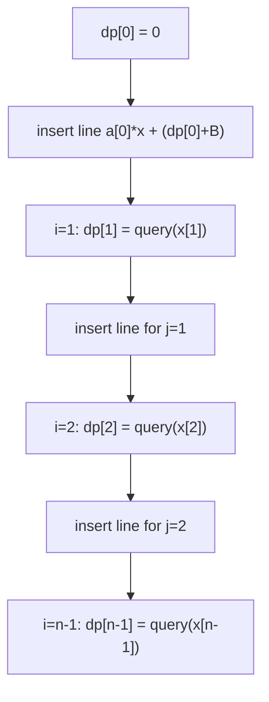

# Maximize/Minimize DP With Lines (Li Chao Tree)

| Meta | Value |
|------|-------|
| Source | Self-contained DP optimization problem |
| Difficulty | Hard |
| Topics | DP optimization, Li Chao Tree, Convex Hull Trick |
| Link | (self-contained statement below) |

---

## Problem Statement

You are given three integer arrays of length $n$ (0-indexed): a coefficient array
$a[0 \dots n-1]$, a query-coordinate array $x[0 \dots n-1]$, and a per-state additive
constant $B$. Define a DP over states $0 \dots n-1$:

$$
dp[0] = 0, \qquad
dp[i] = \min_{0 \le j < i} \big( dp[j] + a[j] \cdot x[i] + B \big) \quad (i \ge 1).
$$

Each earlier state $j$ contributes the **line** $y = a[j] \cdot x + (dp[j] + B)$, and
$dp[i]$ asks for the minimum of those lines at the point $x = x[i]$. The $x[i]$ values
may be **large** (up to $10^9$ in absolute value) and are **not sorted**, and the
slopes $a[j]$ also arrive unsorted — so we cannot use a monotonic CHT and instead use
a **dynamic Li Chao tree** over the full coordinate range. Output $dp[n-1]$.

Constraints: $1 \le n \le 2\cdot10^5$, $-10^9 \le a[i], x[i] \le 10^9$,
$0 \le B \le 10^9$.

```text
Input
n = 4
a = [3, -1, 2, 0]
x = [5, 2, 8, 4]
B = 1

dp[0] = 0
line from j=0: y = 3*x + (0 + 1)      = 3x + 1

dp[1] (x=2): j=0 -> 3*2 + 1 = 7        -> dp[1] = 7
line from j=1: y = -1*x + (7 + 1)      = -x + 8

dp[2] (x=8): j=0 -> 3*8+1 = 25
             j=1 -> -8+8  = 0          -> dp[2] = 0
line from j=2: y = 2*x + (0 + 1)       = 2x + 1

dp[3] (x=4): j=0 -> 3*4+1 = 13
             j=1 -> -4+8  = 4
             j=2 -> 2*4+1 = 9          -> dp[3] = 4

Output
4
```

---

## Approach (WHY)

The transition $dp[i] = \min_{j<i}(dp[j] + a[j]\,x[i] + B)$ is a textbook
**minimum-of-lines-at-a-point** recurrence. Treat each finished state $j$ as a line
with slope $a[j]$ and intercept $dp[j] + B$. Then $dp[i]$ is just that line family
evaluated at $x = x[i]$ and minimized.

Two facts force the **dynamic / pointer Li Chao tree** rather than the array version
or a monotonic CHT:

- The query coordinates $x[i]$ can be **anywhere** in $[-10^9, 10^9]$ and are not
  known to be monotone, so we want a structure over the continuous range without
  pre-discretizing (we could discretize, but the dynamic version avoids the extra
  sort/map and is the natural fit when coordinates are "large and arbitrary").
- The slopes arrive in **arbitrary order**, which breaks the monotonic-slope
  precondition of the deque CHT.

We insert state $j$'s line the moment $dp[j]$ is finalized, then each $dp[i]$ is one
$O(\log(R-L))$ query. Because coordinates can be negative, we use floor-style
midpoint splitting so the recursion partitions $[lo, hi]$ correctly.



---

## Solution

### Python

```python
import sys
from typing import List, Optional

INF = float("inf")


class Node:
    __slots__ = ("m", "b", "left", "right")

    def __init__(self, m: int = 0, b: int = INF) -> None:
        self.m = m
        self.b = b
        self.left: Optional["Node"] = None
        self.right: Optional["Node"] = None


class LiChaoDynamic:
    """Min Li Chao tree over a large continuous coordinate range [lo, hi]."""

    def __init__(self, lo: int, hi: int) -> None:
        self.lo = lo
        self.hi = hi
        self.root = Node()

    @staticmethod
    def _f(node: Node, x: int) -> float:
        return node.m * x + node.b

    @staticmethod
    def _mid(lo: int, hi: int) -> int:
        # floor division keeps mid in [lo, hi) even for negative ranges
        return lo + (hi - lo) // 2

    def insert(self, m: int, b: int) -> None:
        self.root = self._insert(self.root, self.lo, self.hi, m, b)

    def _insert(self, node: Optional[Node], lo: int, hi: int, m: int, b: int) -> Node:
        if node is None:
            return Node(m, b)
        mid = self._mid(lo, hi)
        if m * mid + b < self._f(node, mid):
            node.m, m = m, node.m
            node.b, b = b, node.b
        if lo == hi:
            return node
        if m * lo + b < self._f(node, lo):
            node.left = self._insert(node.left, lo, mid, m, b)
        else:
            node.right = self._insert(node.right, mid + 1, hi, m, b)
        return node

    def query(self, x: int) -> float:
        node, lo, hi = self.root, self.lo, self.hi
        res = INF
        while node is not None:
            res = min(res, self._f(node, x))
            if lo == hi:
                break
            mid = self._mid(lo, hi)
            if x <= mid:
                node, hi = node.left, mid
            else:
                node, lo = node.right, mid + 1
        return res


def solve(n: int, a: List[int], x: List[int], B: int) -> int:
    LO, HI = -10**9, 10**9
    tree = LiChaoDynamic(LO, HI)

    dp = [0] * n
    dp[0] = 0
    tree.insert(a[0], dp[0] + B)  # line for j = 0
    for i in range(1, n):
        dp[i] = int(tree.query(x[i]))
        tree.insert(a[i], dp[i] + B)  # line for j = i
    return dp[n - 1]


def main() -> None:
    data = sys.stdin.buffer.read().split()
    if not data:
        return
    idx = 0
    n = int(data[idx]); idx += 1
    a = [int(data[idx + k]) for k in range(n)]; idx += n
    x = [int(data[idx + k]) for k in range(n)]; idx += n
    B = int(data[idx]); idx += 1
    print(solve(n, a, x, B))


main()
```

### C++

```cpp
#include <bits/stdc++.h>
using namespace std;

const long long INF = 1e18;

struct Node {
    long long m, b;     // stored line: f(x) = m*x + b
    Node *left, *right;
    Node(long long m_ = 0, long long b_ = INF)
        : m(m_), b(b_), left(nullptr), right(nullptr) {}
};

struct LiChaoDynamic {
    // Min Li Chao tree over a large continuous range [lo, hi].
    long long lo, hi;
    Node* root;

    LiChaoDynamic(long long lo_, long long hi_)
        : lo(lo_), hi(hi_), root(new Node()) {}

    static long long f(Node* node, long long x) { return node->m * x + node->b; }

    static long long midpoint(long long lo, long long hi) {
        // floor-style mid keeps mid in [lo, hi) even for negative ranges
        return lo + (hi - lo) / 2;
    }

    void insert(long long m, long long b) { root = insert(root, lo, hi, m, b); }

    Node* insert(Node* node, long long lo, long long hi, long long m, long long b) {
        if (node == nullptr) return new Node(m, b);
        long long mid = midpoint(lo, hi);
        // use __int128 in the comparison to be safe against overflow
        if ((__int128)m * mid + b < (__int128)node->m * mid + node->b) {
            swap(m, node->m);
            swap(b, node->b);
        }
        if (lo == hi) return node;
        if ((__int128)m * lo + b < (__int128)node->m * lo + node->b)
            node->left = insert(node->left, lo, mid, m, b);
        else
            node->right = insert(node->right, mid + 1, hi, m, b);
        return node;
    }

    long long query(long long x) const {
        Node* node = root;
        long long curLo = lo, curHi = hi, res = INF;
        while (node != nullptr) {
            res = min(res, f(node, x));
            if (curLo == curHi) break;
            long long mid = midpoint(curLo, curHi);
            if (x <= mid) { node = node->left;  curHi = mid; }
            else          { node = node->right; curLo = mid + 1; }
        }
        return res;
    }
};

long long solve(int n, const vector<long long>& a,
                const vector<long long>& x, long long B) {
    const long long LO = -1000000000LL, HI = 1000000000LL;
    LiChaoDynamic tree(LO, HI);

    vector<long long> dp(n, 0);
    dp[0] = 0;
    tree.insert(a[0], dp[0] + B);          // line for j = 0
    for (int i = 1; i < n; i++) {
        dp[i] = tree.query(x[i]);
        tree.insert(a[i], dp[i] + B);      // line for j = i
    }
    return dp[n - 1];
}

int main() {
    ios::sync_with_stdio(false);
    cin.tie(nullptr);
    int n;
    if (!(cin >> n)) return 0;
    vector<long long> a(n), x(n);
    for (int i = 0; i < n; i++) cin >> a[i];
    for (int i = 0; i < n; i++) cin >> x[i];
    long long B;
    cin >> B;
    cout << solve(n, a, x, B) << "\n";
    return 0;
}
```

---

## Trace (n = 4, a = [3,-1,2,0], x = [5,2,8,4], B = 1)

| Step | Action | Lines in tree (slope, intercept) | Result |
|------|--------|----------------------------------|--------|
| init | `dp[0]=0`, insert j=0 | $(3,\,1)$ | — |
| i=1  | query x=2 → $3\cdot2+1=7$ | — | `dp[1]=7` |
|      | insert j=1 | $(3,1),\,(-1,8)$ | — |
| i=2  | query x=8 → min($25$, $0$) | — | `dp[2]=0` |
|      | insert j=2 | $(3,1),(-1,8),(2,1)$ | — |
| i=3  | query x=4 → min($13$, $4$, $9$) | — | `dp[3]=4` |

Answer: `dp[3] = 4`, matching the worked example. Note state $j=1$ with the
**negative** slope $-1$ wins at the large coordinate $x=8$ — exactly the case an
arbitrary-order structure must handle.

---

## Math & Complexity

The recurrence is a pointwise minimum of $n$ lines:

$$
dp[i] = \min_{j < i} \big( a[j] \cdot x[i] + (dp[j] + B) \big).
$$

The dynamic Li Chao tree spans $[L, R] = [-10^9, 10^9]$, so each insert/query touches
$O(\log(R - L)) = O(\log(2\cdot10^9)) \approx 31$ nodes. Over $n$ states:

$$
T(n) = O\big(n \log(R - L)\big), \qquad
S(n) = O\big(n \log(R - L)\big) \text{ allocated nodes}.
$$

Overflow: $a[j] \cdot x[i]$ reaches $10^9 \cdot 10^9 = 10^{18}$, near the `long long`
limit; combined with $dp + B$ it can exceed it. The C++ comparisons use `__int128`
inside `insert` to stay safe; `const long long INF = 1e18` remains a valid sentinel
because real line values stay below it for the given constraints.

---

## Takeaway

For $dp[i] = \min_j(a_j x_i + b_j)$ with **unsorted slopes** and **large, arbitrary
query coordinates**, the **dynamic Li Chao tree** is the cleanest tool: lazily
allocate nodes over the whole coordinate range, insert each finished state as a line,
and answer each state with one logarithmic point query — all without discretization or
hull maintenance, and with `__int128` guarding the midpoint comparisons against
overflow.
