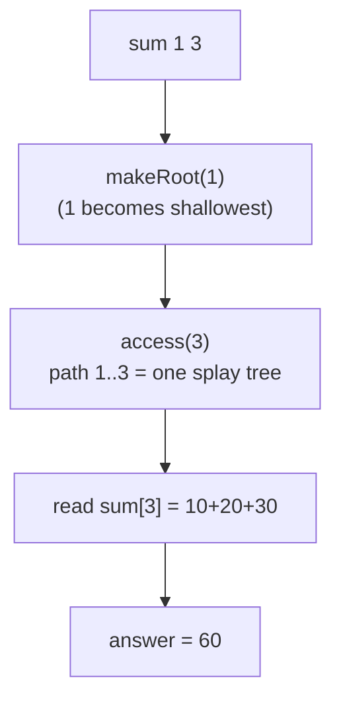

# Path-Sum Queries on a Dynamic Forest (Link-Cut Tree)

| Field | Value |
| --- | --- |
| Source | Self-contained (dynamic-tree path aggregate) |
| Difficulty | Hard |
| Topics | Link-Cut Tree, path aggregate, lazy reverse, point update |
| Link | https://cp-algorithms.com/data_structures/dynamic_tree.html |

---

## Problem Statement

You manage a **forest** on $n$ vertices. Each vertex $i$ has an integer value
$a_i$. Starting from a given set of values (and possibly some initial edges),
process $q$ operations **online**:

- `link u v` — connect trees containing `u` and `v` (they are in different trees).
- `cut u v` — remove the edge `u`–`v`.
- `set u x` — assign $a_u \leftarrow x$ (point update).
- `sum u v` — output the sum of values on the **unique path** from `u` to `v`,
  inclusive. If `u` and `v` are not connected, output `-1`.

```text
Input:
n = 5
a = [10, 20, 30, 40, 50]      # a[1..5]
q = 6
link 1 2
link 2 3
sum 1 3      -> 10 + 20 + 30 = 60
set 2 5      -> a[2] = 5
sum 1 3      -> 10 + 5 + 30  = 45
sum 1 4      -> 1 and 4 disconnected -> -1

Output:
60
45
-1
```

## Approach (WHY)

A static tree would let you answer path sums with Euler tours + a Fenwick tree,
or heavy-light decomposition. But edges appear and disappear here, so the tree
shape is **mutable** — exactly the regime where the **Link-Cut Tree** shines. We
augment the structural LCT with a per-node value `val` and a subtree (= path)
aggregate `sum`.

Why each piece works:

1. **`sum u v`** ⇒ `split(u, v)` = `makeRoot(u); access(v)`. Afterward the
   auxiliary splay tree rooted at `v` contains **exactly** the path `u..v` in
   depth order, so `sum[v]` (the subtree sum maintained by `pushUp`) is the answer.
   If `findRoot(v) != u`, they are disconnected → return `-1`.
2. **`set u x`** ⇒ `splay(u)` brings `u` to the top of its auxiliary tree (no
   stale ancestors above it), assign `val[u] = x`, then `pushUp(u)` to refresh its
   `sum`. All other affected `sum`s are recomputed lazily on the next `access`.
3. **`link` / `cut`** ⇒ identical to plain connectivity, except `pushUp` keeps the
   aggregate consistent as pointers change.

The `rev` lazy flag (path reversal for `makeRoot`) must be **pushed down before
reading children**; combined with `pushUp` after every structural change, the
`sum` field stays correct under arbitrary re-rooting. Every operation is $O(\log
n)$ amortized.

## Solution

### Python

```python
import sys


class LinkCutTree:
    """LCT with path-sum aggregate, point update, link / cut / connectivity."""

    def __init__(self, n, values):
        size = n + 1                       # node 0 = null sentinel (sum 0)
        self.ch = [[0, 0] for _ in range(size)]
        self.fa = [0] * size
        self.val = [0] * size
        self.sum = [0] * size
        self.rev = [False] * size
        for i in range(1, n + 1):
            self.val[i] = values[i - 1]
            self.sum[i] = values[i - 1]

    def is_root(self, x):
        f = self.fa[x]
        return self.ch[f][0] != x and self.ch[f][1] != x

    def push_up(self, x):
        l, r = self.ch[x]
        self.sum[x] = self.sum[l] + self.val[x] + self.sum[r]

    def apply_rev(self, x):
        if x == 0:
            return
        self.ch[x][0], self.ch[x][1] = self.ch[x][1], self.ch[x][0]
        self.rev[x] = not self.rev[x]

    def push_down(self, x):
        if self.rev[x]:
            self.apply_rev(self.ch[x][0])
            self.apply_rev(self.ch[x][1])
            self.rev[x] = False

    def rotate(self, x):
        y = self.fa[x]
        z = self.fa[y]
        k = 1 if self.ch[y][1] == x else 0
        if not self.is_root(y):
            self.ch[z][1 if self.ch[z][1] == y else 0] = x
        self.fa[x] = z
        self.ch[y][k] = self.ch[x][k ^ 1]
        if self.ch[x][k ^ 1]:
            self.fa[self.ch[x][k ^ 1]] = y
        self.ch[x][k ^ 1] = y
        self.fa[y] = x
        self.push_up(y)
        self.push_up(x)

    def splay(self, x):
        stack = [x]
        y = x
        while not self.is_root(y):
            y = self.fa[y]
            stack.append(y)
        while stack:
            self.push_down(stack.pop())
        while not self.is_root(x):
            y = self.fa[x]
            z = self.fa[y]
            if not self.is_root(y):
                if (self.ch[y][1] == x) ^ (self.ch[z][1] == y):
                    self.rotate(x)
                else:
                    self.rotate(y)
            self.rotate(x)

    def access(self, x):
        last = 0
        y = x
        while y:
            self.splay(y)
            self.ch[y][1] = last
            self.push_up(y)
            last = y
            y = self.fa[y]
        self.splay(x)
        return last

    def make_root(self, x):
        self.access(x)
        self.apply_rev(x)

    def find_root(self, x):
        self.access(x)
        while self.ch[x][0]:
            self.push_down(x)
            x = self.ch[x][0]
        self.splay(x)
        return x

    def split(self, x, y):
        self.make_root(x)
        self.access(y)

    def connected(self, x, y):
        if x == y:
            return True
        return self.find_root(x) == self.find_root(y)

    def link(self, x, y):
        self.make_root(x)
        if self.find_root(y) != x:
            self.fa[x] = y

    def cut(self, x, y):
        self.make_root(x)
        if (self.find_root(y) == x and self.fa[y] == x
                and self.ch[y][0] == 0):
            self.fa[y] = 0
            self.ch[x][1] = 0
            self.push_up(x)

    def path_sum(self, x, y):
        if not self.connected(x, y):
            return -1
        self.split(x, y)
        return self.sum[y]

    def set_value(self, x, v):
        self.splay(x)
        self.val[x] = v
        self.push_up(x)


def main():
    data = sys.stdin.read().split()
    idx = 0
    n = int(data[idx]); idx += 1
    values = [int(data[idx + i]) for i in range(n)]
    idx += n
    q = int(data[idx]); idx += 1
    lct = LinkCutTree(n, values)
    out = []
    for _ in range(q):
        op = data[idx]; idx += 1
        u = int(data[idx]); idx += 1
        v = int(data[idx]); idx += 1
        if op == "link":
            lct.link(u, v)
        elif op == "cut":
            lct.cut(u, v)
        elif op == "set":
            lct.set_value(u, v)
        else:  # sum
            out.append(str(lct.path_sum(u, v)))
    sys.stdout.write("\n".join(out) + "\n")


if __name__ == "__main__":
    main()
```

### C++

```cpp
#include <bits/stdc++.h>
using namespace std;

struct LinkCutTree {
    // LCT with path-sum aggregate, point update, link / cut / connectivity.
    vector<array<int, 2>> ch;
    vector<int> fa;
    vector<long long> val, sum;
    vector<char> rev;

    LinkCutTree(int n, const vector<long long>& values) {
        int size = n + 1;                  // node 0 = null sentinel (sum 0)
        ch.assign(size, {0, 0});
        fa.assign(size, 0);
        val.assign(size, 0);
        sum.assign(size, 0);
        rev.assign(size, 0);
        for (int i = 1; i <= n; i++) {
            val[i] = values[i - 1];
            sum[i] = values[i - 1];
        }
    }

    bool isRoot(int x) {
        int f = fa[x];
        return ch[f][0] != x && ch[f][1] != x;
    }

    void pushUp(int x) {
        sum[x] = sum[ch[x][0]] + val[x] + sum[ch[x][1]];
    }

    void applyRev(int x) {
        if (x == 0) return;
        swap(ch[x][0], ch[x][1]);
        rev[x] ^= 1;
    }

    void pushDown(int x) {
        if (rev[x]) {
            applyRev(ch[x][0]);
            applyRev(ch[x][1]);
            rev[x] = 0;
        }
    }

    void rotate(int x) {
        int y = fa[x], z = fa[y];
        int k = (ch[y][1] == x);
        if (!isRoot(y)) ch[z][ch[z][1] == y] = x;
        fa[x] = z;
        ch[y][k] = ch[x][k ^ 1];
        if (ch[x][k ^ 1]) fa[ch[x][k ^ 1]] = y;
        ch[x][k ^ 1] = y;
        fa[y] = x;
        pushUp(y);
        pushUp(x);
    }

    void splay(int x) {
        static vector<int> stk;
        stk.clear();
        int y = x;
        stk.push_back(y);
        while (!isRoot(y)) {
            y = fa[y];
            stk.push_back(y);
        }
        while (!stk.empty()) {
            pushDown(stk.back());
            stk.pop_back();
        }
        while (!isRoot(x)) {
            int yy = fa[x], zz = fa[yy];
            if (!isRoot(yy)) {
                if ((ch[yy][1] == x) ^ (ch[zz][1] == yy)) rotate(x);
                else rotate(yy);
            }
            rotate(x);
        }
    }

    int access(int x) {
        int last = 0;
        for (int y = x; y; y = fa[y]) {
            splay(y);
            ch[y][1] = last;
            pushUp(y);
            last = y;
        }
        splay(x);
        return last;
    }

    void makeRoot(int x) {
        access(x);
        applyRev(x);
    }

    int findRoot(int x) {
        access(x);
        while (ch[x][0]) {
            pushDown(x);
            x = ch[x][0];
        }
        splay(x);
        return x;
    }

    void split(int x, int y) {
        makeRoot(x);
        access(y);
    }

    bool connected(int x, int y) {
        if (x == y) return true;
        return findRoot(x) == findRoot(y);
    }

    void link(int x, int y) {
        makeRoot(x);
        if (findRoot(y) != x) fa[x] = y;
    }

    void cut(int x, int y) {
        makeRoot(x);
        if (findRoot(y) == x && fa[y] == x && ch[y][0] == 0) {
            fa[y] = 0;
            ch[x][1] = 0;
            pushUp(x);
        }
    }

    long long pathSum(int x, int y) {
        if (!connected(x, y)) return -1;
        split(x, y);
        return sum[y];
    }

    void setValue(int x, long long v) {
        splay(x);
        val[x] = v;
        pushUp(x);
    }
};

int main() {
    ios::sync_with_stdio(false);
    cin.tie(nullptr);
    int n;
    if (!(cin >> n)) return 0;
    vector<long long> values(n);
    for (int i = 0; i < n; i++) cin >> values[i];
    int q;
    cin >> q;
    LinkCutTree lct(n, values);
    string op;
    int u, v;
    string out;
    for (int i = 0; i < q; i++) {
        cin >> op >> u >> v;
        if (op == "link") lct.link(u, v);
        else if (op == "cut") lct.cut(u, v);
        else if (op == "set") lct.setValue(u, (long long)v);
        else out += to_string(lct.pathSum(u, v)) + "\n";
    }
    cout << out;
    return 0;
}
```

## Iteration Trace

Values `a = [10,20,30,40,50]`. Walk the sample:

| Op | LCT action | Path / state | Output |
| --- | --- | --- | --- |
| `link 1 2` | `makeRoot(1); fa[1]=2` | tree `{1,2}` | — |
| `link 2 3` | `makeRoot(2); fa[2]=3` | tree `{1,2,3}` | — |
| `sum 1 3` | `split(1,3)`; read `sum[3]` | path `1-2-3` = `10+20+30` | **60** |
| `set 2 5` | `splay(2); val[2]=5; pushUp` | `a[2]=5` | — |
| `sum 1 3` | `split(1,3)`; read `sum[3]` | `10+5+30` | **45** |
| `sum 1 4` | `connected(1,4)?` → no | `4` isolated | **-1** |

After `split(1,3)` the splay tree at `3` is the in-order list `1, 2, 3`, so
`sum[3] = sum[left] + val[3] + sum[right]` folds the whole path. Updating
`val[2]` then re-running `split` recomputes `sum` lazily — no global rebuild.



## Math / Complexity

Let the aggregate be the monoid $(\mathbb{Z}, +, 0)$. After `split(u, v)`, the
auxiliary tree at `v` represents the path $P = u, \dots, v$, and `pushUp`
maintains the invariant

$$
\text{sum}[x] = \sum_{w \in \text{subtree}(x)} a_w
\;\Rightarrow\;
\text{sum}[v] = \sum_{w \in P} a_w .
$$

Every operation is a constant number of `access` calls, so:

$$
T_{\text{op}} = O(\log n)\ \text{amortized}, \qquad
T_{\text{total}} = O\big((n + q)\log n\big), \qquad
\text{memory} = O(n).
$$

## Takeaway

Add a value and an associative `sum` to the structural LCT, keep `pushUp` honest
after every rotation/access, and you get **path sums on a tree whose edges
change**. The same template swaps `+` for `max`, `min`, or `gcd` with no
structural changes — the LCT turns *any* associative path aggregate into an
$O(\log n)$ operation over a fully dynamic forest.
