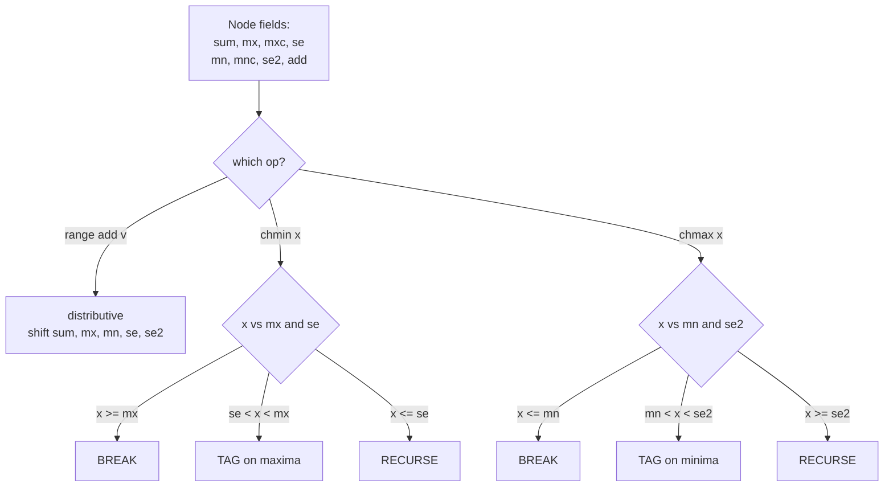

# Range chmin / chmax / add / sum (Full Segment Tree Beats)

| Meta | Value |
|------|-------|
| Source | Synthetic (classic Segment Tree Beats template problem) |
| Difficulty | Hard |
| Topics | Segment Tree Beats, Range chmin, Range chmax, Range Add, Range Sum |
| Link | (self-contained) |

---

## Problem Statement

You are given an array $a_0, a_1, \dots, a_{n-1}$ and must process $q$ operations, each one of:

- `1 l r v` — for every $i \in [l, r]$, do $a_i \leftarrow a_i + v$ (**range add**, $v$ may be negative).
- `2 l r x` — for every $i \in [l, r]$, do $a_i \leftarrow \min(a_i, x)$ (**range chmin**).
- `3 l r x` — for every $i \in [l, r]$, do $a_i \leftarrow \max(a_i, x)$ (**range chmax**).
- `4 l r`   — output $\sum_{i \in [l,r]} a_i$ (**range sum**).

Constraints: $1 \le n, q \le 2\cdot10^5$, $|a_i|, |v|, |x| \le 10^9$. A range sum can reach $\sim 4\cdot10^{14}$, so accumulate in 64-bit.

This is the **full** Segment Tree Beats template: all four operations on one structure.

```text
n=5, a = [4, 2, 7, 1, 5]

3 0 4 3      chmax all to 3   -> [4, 3, 7, 3, 5]
2 0 4 5      chmin all to 5   -> [4, 3, 5, 3, 5]
1 1 3 2      add 2 to [1..3]  -> [4, 5, 7, 5, 5]
4 0 4        sum = 4+5+7+5+5  -> 26
4 2 4        sum = 7+5+5      -> 17
```

Output:
```text
26
17
```

---

## Approach (WHY)

Combining all four operations forces the node to track **both ends** of its value distribution plus a distributive add tag. Each node stores:

- `sum`, and for the max side: `mx`, `mxc` (count of max), `se` (strict second max, $-\infty$ sentinel).
- For the min side: `mn`, `mnc` (count of min), `se2` (strict second min, $+\infty$ sentinel).
- `addv` — a pending range-add lazy tag.

Operation logic:

- **Add** is distributive: shift `sum` by `v*len`, and shift `mx, se, mn, se2` by `v` (leave $\pm\infty$ sentinels). It composes with the clamp tags because adding a constant preserves order.
- **chmin(x)**: *break* if $\text{mx}\le x$; *tag* (only the maxima change) if $\text{se} < x < \text{mx}$; else *recurse*.
- **chmax(x)**: symmetric with the min trio: *break* if $\text{mn}\ge x$; *tag* if $\text{mn} < x < \text{se2}$; else *recurse*.

When a clamp collapses one extreme into the other (single distinct value), we patch the opposite-side fields inside the apply step so both halves stay consistent. The combined amortized cost is $O((n+q)\log^2 n)$: the add operations may re-deepen the potential that the clamps reduce, contributing the extra $\log n$ factor.

---

## Solution

```python
import sys

class Beats:
    INF = float('inf')

    def __init__(self, a):
        self.n = len(a)
        s = 4*self.n
        self.sum  = [0]*s
        self.mx   = [0]*s; self.mxc = [0]*s; self.se  = [-self.INF]*s
        self.mn   = [0]*s; self.mnc = [0]*s; self.se2 = [ self.INF]*s
        self.add  = [0]*s
        self._build(1, 0, self.n-1, a)

    def _pull(self, p):
        l, r = 2*p, 2*p+1
        self.sum[p] = self.sum[l] + self.sum[r]
        if self.mx[l] == self.mx[r]:
            self.mx[p], self.mxc[p] = self.mx[l], self.mxc[l]+self.mxc[r]
            self.se[p] = max(self.se[l], self.se[r])
        elif self.mx[l] > self.mx[r]:
            self.mx[p], self.mxc[p] = self.mx[l], self.mxc[l]
            self.se[p] = max(self.se[l], self.mx[r])
        else:
            self.mx[p], self.mxc[p] = self.mx[r], self.mxc[r]
            self.se[p] = max(self.se[r], self.mx[l])
        if self.mn[l] == self.mn[r]:
            self.mn[p], self.mnc[p] = self.mn[l], self.mnc[l]+self.mnc[r]
            self.se2[p] = min(self.se2[l], self.se2[r])
        elif self.mn[l] < self.mn[r]:
            self.mn[p], self.mnc[p] = self.mn[l], self.mnc[l]
            self.se2[p] = min(self.se2[l], self.mn[r])
        else:
            self.mn[p], self.mnc[p] = self.mn[r], self.mnc[r]
            self.se2[p] = min(self.se2[r], self.mn[l])

    def _build(self, p, l, r, a):
        if l == r:
            v = a[l]
            self.sum[p] = self.mx[p] = self.mn[p] = v
            self.mxc[p] = self.mnc[p] = 1
            self.se[p] = -self.INF; self.se2[p] = self.INF
            return
        m = (l+r)//2
        self._build(2*p, l, m, a); self._build(2*p+1, m+1, r, a)
        self._pull(p)

    def _ap_add(self, p, l, r, v):
        self.sum[p] += v*(r-l+1)
        self.mx[p] += v; self.mn[p] += v
        if self.se[p]  != -self.INF: self.se[p]  += v
        if self.se2[p] !=  self.INF: self.se2[p] += v
        self.add[p] += v

    def _ap_chmin(self, p, x):
        if self.mx[p] <= x: return
        self.sum[p] -= (self.mx[p]-x)*self.mxc[p]
        if self.mn[p]  == self.mx[p]: self.mn[p]  = x
        if self.se2[p] == self.mx[p]: self.se2[p] = x
        if x < self.mn[p]: self.mn[p] = x
        self.mx[p] = x

    def _ap_chmax(self, p, x):
        if self.mn[p] >= x: return
        self.sum[p] += (x-self.mn[p])*self.mnc[p]
        if self.mx[p] == self.mn[p]: self.mx[p] = x
        if self.se[p] == self.mn[p]: self.se[p] = x
        if x > self.mx[p]: self.mx[p] = x
        self.mn[p] = x

    def _push(self, p, l, r):
        m = (l+r)//2; lc, rc = 2*p, 2*p+1
        if self.add[p] != 0:
            self._ap_add(lc, l, m, self.add[p])
            self._ap_add(rc, m+1, r, self.add[p])
            self.add[p] = 0
        self._ap_chmin(lc, self.mx[p]); self._ap_chmin(rc, self.mx[p])
        self._ap_chmax(lc, self.mn[p]); self._ap_chmax(rc, self.mn[p])

    def range_add(self, ql, qr, v): self._radd(1, 0, self.n-1, ql, qr, v)
    def chmin(self, ql, qr, x):     self._rchmin(1, 0, self.n-1, ql, qr, x)
    def chmax(self, ql, qr, x):     self._rchmax(1, 0, self.n-1, ql, qr, x)
    def qsum(self, ql, qr):         return self._qsum(1, 0, self.n-1, ql, qr)

    def _radd(self, p, l, r, ql, qr, v):
        if qr < l or r < ql: return
        if ql <= l and r <= qr: self._ap_add(p, l, r, v); return
        m = (l+r)//2; self._push(p, l, r)
        self._radd(2*p, l, m, ql, qr, v); self._radd(2*p+1, m+1, r, ql, qr, v)
        self._pull(p)

    def _rchmin(self, p, l, r, ql, qr, x):
        if qr < l or r < ql or self.mx[p] <= x: return
        if ql <= l and r <= qr and self.se[p] < x: self._ap_chmin(p, x); return
        m = (l+r)//2; self._push(p, l, r)
        self._rchmin(2*p, l, m, ql, qr, x); self._rchmin(2*p+1, m+1, r, ql, qr, x)
        self._pull(p)

    def _rchmax(self, p, l, r, ql, qr, x):
        if qr < l or r < ql or self.mn[p] >= x: return
        if ql <= l and r <= qr and self.se2[p] > x: self._ap_chmax(p, x); return
        m = (l+r)//2; self._push(p, l, r)
        self._rchmax(2*p, l, m, ql, qr, x); self._rchmax(2*p+1, m+1, r, ql, qr, x)
        self._pull(p)

    def _qsum(self, p, l, r, ql, qr):
        if qr < l or r < ql: return 0
        if ql <= l and r <= qr: return self.sum[p]
        m = (l+r)//2; self._push(p, l, r)
        return self._qsum(2*p, l, m, ql, qr) + self._qsum(2*p+1, m+1, r, ql, qr)
```

```cpp
#include <bits/stdc++.h>
using namespace std;
const long long INF = 1e18;

struct Beats {
    int n;
    vector<long long> sum, mx, se, mn, se2, addv, mxc, mnc;

    Beats(const vector<long long>& a) {
        n = (int)a.size();
        int s = 4*n;
        sum.assign(s,0); mx.assign(s,0); se.assign(s,-INF);
        mn.assign(s,0); se2.assign(s,INF); addv.assign(s,0);
        mxc.assign(s,0); mnc.assign(s,0);
        build(1, 0, n-1, a);
    }

    void pull(int p) {
        int l = 2*p, r = 2*p+1;
        sum[p] = sum[l] + sum[r];
        if (mx[l] == mx[r]) { mx[p]=mx[l]; mxc[p]=mxc[l]+mxc[r]; se[p]=max(se[l],se[r]); }
        else if (mx[l] > mx[r]) { mx[p]=mx[l]; mxc[p]=mxc[l]; se[p]=max(se[l],mx[r]); }
        else { mx[p]=mx[r]; mxc[p]=mxc[r]; se[p]=max(se[r],mx[l]); }
        if (mn[l] == mn[r]) { mn[p]=mn[l]; mnc[p]=mnc[l]+mnc[r]; se2[p]=min(se2[l],se2[r]); }
        else if (mn[l] < mn[r]) { mn[p]=mn[l]; mnc[p]=mnc[l]; se2[p]=min(se2[l],mn[r]); }
        else { mn[p]=mn[r]; mnc[p]=mnc[r]; se2[p]=min(se2[r],mn[l]); }
    }

    void build(int p, int l, int r, const vector<long long>& a) {
        if (l == r) {
            long long v = a[l];
            sum[p]=mx[p]=mn[p]=v; mxc[p]=mnc[p]=1; se[p]=-INF; se2[p]=INF;
            return;
        }
        int m = (l+r)>>1;
        build(2*p, l, m, a); build(2*p+1, m+1, r, a);
        pull(p);
    }

    void ap_add(int p, int l, int r, long long v) {
        sum[p] += v*(long long)(r-l+1);
        mx[p]+=v; mn[p]+=v;
        if (se[p]  != -INF) se[p]  += v;
        if (se2[p] !=  INF) se2[p] += v;
        addv[p] += v;
    }

    void ap_chmin(int p, long long x) {
        if (mx[p] <= x) return;
        sum[p] -= (__int128)(mx[p]-x)*mxc[p];
        if (mn[p]  == mx[p]) mn[p]  = x;
        if (se2[p] == mx[p]) se2[p] = x;
        if (x < mn[p]) mn[p] = x;
        mx[p] = x;
    }

    void ap_chmax(int p, long long x) {
        if (mn[p] >= x) return;
        sum[p] += (__int128)(x-mn[p])*mnc[p];
        if (mx[p] == mn[p]) mx[p] = x;
        if (se[p] == mn[p]) se[p] = x;
        if (x > mx[p]) mx[p] = x;
        mn[p] = x;
    }

    void push(int p, int l, int r) {
        int m = (l+r)>>1, lc = 2*p, rc = 2*p+1;
        if (addv[p] != 0) {
            ap_add(lc, l, m, addv[p]);
            ap_add(rc, m+1, r, addv[p]);
            addv[p] = 0;
        }
        ap_chmin(lc, mx[p]); ap_chmin(rc, mx[p]);
        ap_chmax(lc, mn[p]); ap_chmax(rc, mn[p]);
    }

    void rangeAdd(int p, int l, int r, int ql, int qr, long long v) {
        if (qr < l || r < ql) return;
        if (ql <= l && r <= qr) { ap_add(p, l, r, v); return; }
        int m = (l+r)>>1; push(p, l, r);
        rangeAdd(2*p, l, m, ql, qr, v); rangeAdd(2*p+1, m+1, r, ql, qr, v);
        pull(p);
    }

    void chmin(int p, int l, int r, int ql, int qr, long long x) {
        if (qr < l || r < ql || mx[p] <= x) return;
        if (ql <= l && r <= qr && se[p] < x) { ap_chmin(p, x); return; }
        int m = (l+r)>>1; push(p, l, r);
        chmin(2*p, l, m, ql, qr, x); chmin(2*p+1, m+1, r, ql, qr, x);
        pull(p);
    }

    void chmax(int p, int l, int r, int ql, int qr, long long x) {
        if (qr < l || r < ql || mn[p] >= x) return;
        if (ql <= l && r <= qr && se2[p] > x) { ap_chmax(p, x); return; }
        int m = (l+r)>>1; push(p, l, r);
        chmax(2*p, l, m, ql, qr, x); chmax(2*p+1, m+1, r, ql, qr, x);
        pull(p);
    }

    long long qsum(int p, int l, int r, int ql, int qr) {
        if (qr < l || r < ql) return 0;
        if (ql <= l && r <= qr) return sum[p];
        int m = (l+r)>>1; push(p, l, r);
        return qsum(2*p, l, m, ql, qr) + qsum(2*p+1, m+1, r, ql, qr);
    }
};
```

---

## Trace / Walkthrough

Start $a = [4,2,7,1,5]$. Root: `mx=7, mn=1, sum=19`.

**`3 0 4 3` (chmax all to 3):** raises every element below 3. Only `2` and `1` change → $[4,3,7,3,5]$, `sum=22`. At nodes whose `mn >= 3` this *breaks*; only subtrees containing the small values recurse.

**`2 0 4 5` (chmin all to 5):** lowers `7` to `5` → $[4,3,5,3,5]$, `sum=20`. The node holding the `7` is the only one whose `se < 5 < mx`, so it tags in $O(1)$ once reached.

**`1 1 3 2` (add 2 to indices 1..3):** distributive add → $[4,5,7,5,5]$, `sum=26`. The add shifts `mx, mn, se, se2` of touched nodes by 2 — note `7` reappears because add can split a value class (this is what re-deepens the potential).

**`4 0 4` (sum):** `26`. **`4 2 4` (sum of 7,5,5):** `17`.

The interleaving of clamps (which *merge* classes) and adds (which can *split* them) is exactly why the bound carries an extra $\log n$ over the chmin-only version.

---

## Mermaid



---

## Math / Complexity

With the potential $\Phi = \sum_v d(v)$ counting distinct extreme-value classes per subtree, clamps reduce $\Phi$ on every recurse while range-adds can increase it on the $O(\log n)$ nodes they touch. Balancing the two yields an amortized total of

$$O\big((n+q)\log^2 n\big),$$

with $O(n)$ build and $O(n)$ space. For $n, q \le 2\cdot10^5$ this is fast in C++; sums up to $\sim 4\cdot10^{14}$ fit in `long long`, and `__int128` guards the intermediate clamp products.

---

## Key Takeaway

The full beats node carries **both** extreme trios plus an add tag; add is distributive while chmin/chmax each follow the *break / tag / recurse* rule on their own end — and the clamp-versus-add tug of war on the potential explains the extra $\log n$ factor.
