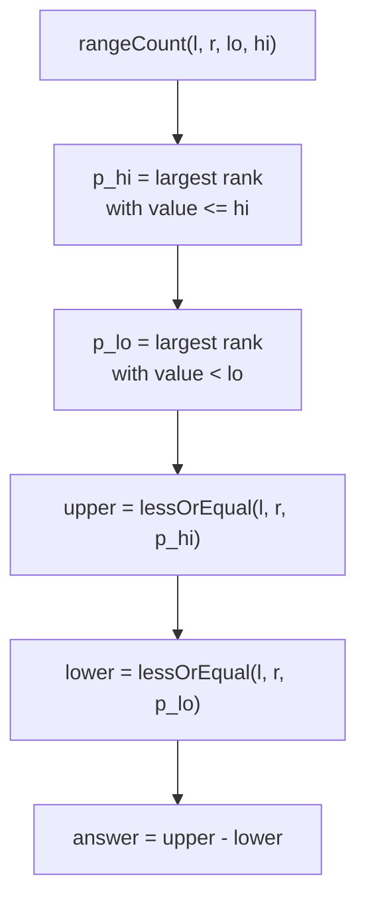

# Count of Values in [lo, hi] within a Range (Wavelet Tree)

| Field | Value |
| --- | --- |
| Source | Self-contained (2D-dominance / range-value counting) |
| Difficulty | Medium-Hard |
| Topics | Wavelet tree, coordinate compression, range value-interval count |
| Link | Self-contained (analogous to "orthogonal range counting" tasks) |

---

## Problem Statement

You are given an array $a[1..n]$ of integers. Answer $q$ **online** queries. Each
query is $(l, r, lo, hi)$ asking: how many elements of $a_l, \dots, a_r$ have a
**value** inside the closed interval $[lo, hi]$?

Formally, output

$$
\#\{\, i : l \le i \le r \ \text{and}\ lo \le a_i \le hi \,\}.
$$

This is a 1-D "orthogonal range count": an index window $[l, r]$ crossed with a
value window $[lo, hi]$.

```text
Input:
n = 8, q = 3
a = [3, 1, 4, 1, 5, 9, 2, 6]
queries:
  (1, 8, 2, 5)   # whole array; values in [2,5] -> {3,4,5,2} -> 4
  (3, 6, 4, 9)   # subarray [4,1,5,9]; values in [4,9] -> {4,5,9} -> 3
  (2, 4, 6, 9)   # subarray [1,4,1]; values in [6,9] -> {} -> 0

Output:
4
3
0
```

## Approach (WHY)

A value-interval count decomposes cleanly into two prefix counts on the wavelet
tree:

$$
\text{rangeCount}(l, r, lo, hi)
= \text{lessOrEqual}(l, r, hi) - \text{lessOrEqual}(l, r, lo - 1).
$$

**Why it works.** "Values in $[lo, hi]$" equals "values $\le hi$" minus "values
$\le lo - 1$". Each `lessOrEqual` is the standard $O(\log \sigma)$ wavelet-tree
descent that accumulates whole left-halves when the threshold exceeds the node's
midpoint. Subtracting the two prefix counts leaves exactly the elements in the
band. Since the tree is static, we build once in $O(n \log \sigma)$ and answer
every $(l, r, lo, hi)$ online in $O(\log \sigma)$.

To support arbitrary $lo, hi$ that may not appear in the array, translate each
bound to a **rank boundary** by binary search: the upper bound becomes the largest
rank with value $\le hi$, and the lower bound becomes the largest rank with value
$\le lo - 1$ (i.e. value $< lo$). If a bound has no qualifying rank, its prefix
count is treated as $0$.

## Solution

### Python

```python
import sys
from bisect import bisect_right, bisect_left
input = sys.stdin.readline


class WaveletTree:
    def __init__(self, arr, lo, hi):
        self.lo = lo
        self.hi = hi
        self.left = None
        self.right = None
        self.cnt = [0]
        if lo == hi or not arr:
            for _ in arr:
                self.cnt.append(self.cnt[-1])
            return
        mid = (lo + hi) // 2
        left_seq, right_seq = [], []
        for v in arr:
            goes_left = 1 if v <= mid else 0
            self.cnt.append(self.cnt[-1] + goes_left)
            (left_seq if goes_left else right_seq).append(v)
        self.left = WaveletTree(left_seq, lo, mid)
        self.right = WaveletTree(right_seq, mid + 1, hi)

    def map_left(self, i):
        return self.cnt[i]

    def map_right(self, i):
        return i - self.cnt[i]

    def less_or_equal(self, l, r, x):
        # count of ranks <= x in inclusive index range [l, r]
        if l > r or x < self.lo:
            return 0
        if x >= self.hi:
            return r - l + 1
        mid = (self.lo + self.hi) // 2
        in_left = self.cnt[r + 1] - self.cnt[l]
        if x <= mid:
            return self.left.less_or_equal(self.map_left(l),
                                           self.map_left(r + 1) - 1, x)
        return in_left + self.right.less_or_equal(self.map_right(l),
                                                  self.map_right(r + 1) - 1, x)

    def range_count(self, l, r, p_hi, p_lo):
        # p_hi = largest rank with value <= hi; p_lo = largest rank with value < lo
        upper = self.less_or_equal(l, r, p_hi) if p_hi >= 0 else 0
        lower = self.less_or_equal(l, r, p_lo) if p_lo >= 0 else 0
        return upper - lower


def main():
    sys.setrecursionlimit(1 << 20)
    n, q = map(int, input().split())
    a = list(map(int, input().split()))

    sorted_vals = sorted(set(a))
    rank = {v: i for i, v in enumerate(sorted_vals)}
    ranks = [rank[v] for v in a]
    wt = WaveletTree(ranks, 0, len(sorted_vals) - 1)

    out = []
    for _ in range(q):
        l, r, lo, hi = map(int, input().split())
        p_hi = bisect_right(sorted_vals, hi) - 1    # largest rank with value <= hi
        p_lo = bisect_left(sorted_vals, lo) - 1     # largest rank with value < lo
        out.append(str(wt.range_count(l - 1, r - 1, p_hi, p_lo)))
    sys.stdout.write("\n".join(out) + "\n")


if __name__ == "__main__":
    main()
```

### C++

```cpp
#include <bits/stdc++.h>
using namespace std;

struct WaveletTree {
    int lo, hi;
    WaveletTree *left = nullptr, *right = nullptr;
    vector<int> cnt;

    WaveletTree(vector<int> arr, int lo, int hi) : lo(lo), hi(hi) {
        cnt.push_back(0);
        if (lo == hi || arr.empty()) {
            for (size_t i = 0; i < arr.size(); i++) cnt.push_back(cnt.back());
            return;
        }
        int mid = (lo + hi) / 2;
        vector<int> leftSeq, rightSeq;
        for (int v : arr) {
            int goesLeft = (v <= mid) ? 1 : 0;
            cnt.push_back(cnt.back() + goesLeft);
            if (goesLeft) leftSeq.push_back(v);
            else rightSeq.push_back(v);
        }
        left = new WaveletTree(move(leftSeq), lo, mid);
        right = new WaveletTree(move(rightSeq), mid + 1, hi);
    }

    int mapLeft(int i) const { return cnt[i]; }
    int mapRight(int i) const { return i - cnt[i]; }

    long long lessOrEqual(int l, int r, int x) const {
        // count of ranks <= x in inclusive index range [l, r]
        if (l > r || x < lo) return 0;
        if (x >= hi) return (long long)(r - l + 1);
        int mid = (lo + hi) / 2;
        long long inLeft = cnt[r + 1] - cnt[l];
        if (x <= mid)
            return left->lessOrEqual(mapLeft(l), mapLeft(r + 1) - 1, x);
        return inLeft + right->lessOrEqual(mapRight(l), mapRight(r + 1) - 1, x);
    }

    long long rangeCount(int l, int r, int pHi, int pLo) const {
        // pHi = largest rank with value <= hi; pLo = largest rank with value < lo
        long long upper = (pHi >= 0) ? lessOrEqual(l, r, pHi) : 0;
        long long lower = (pLo >= 0) ? lessOrEqual(l, r, pLo) : 0;
        return upper - lower;
    }
};

int main() {
    ios::sync_with_stdio(false);
    cin.tie(nullptr);

    int n, q;
    cin >> n >> q;
    vector<int> a(n);
    for (int i = 0; i < n; i++) cin >> a[i];

    vector<int> sortedVals(a);
    sort(sortedVals.begin(), sortedVals.end());
    sortedVals.erase(unique(sortedVals.begin(), sortedVals.end()),
                     sortedVals.end());
    auto rankOf = [&](int x) {
        return int(lower_bound(sortedVals.begin(), sortedVals.end(), x)
                   - sortedVals.begin());
    };
    vector<int> ranks(n);
    for (int i = 0; i < n; i++) ranks[i] = rankOf(a[i]);

    WaveletTree wt(ranks, 0, (int)sortedVals.size() - 1);

    string out;
    for (int i = 0; i < q; i++) {
        int l, r, lo, hi;
        cin >> l >> r >> lo >> hi;
        // pHi = largest rank with value <= hi; pLo = largest rank with value < lo
        int pHi = int(upper_bound(sortedVals.begin(), sortedVals.end(), hi)
                      - sortedVals.begin()) - 1;
        int pLo = int(lower_bound(sortedVals.begin(), sortedVals.end(), lo)
                      - sortedVals.begin()) - 1;
        out += to_string(wt.rangeCount(l - 1, r - 1, pHi, pLo));
        out += '\n';
    }
    cout << out;
    return 0;
}
```

## Trace

Query $(3, 6, 4, 9)$ on $a = [3,1,4,1,5,9,2,6]$, 0-based window $[2, 5]$ over
$\{4,1,5,9\}$. Sorted distinct values $[1,2,3,4,5,6,9]$ give ranks
$1\to0, 2\to1, 3\to2, 4\to3, 5\to4, 6\to5, 9\to6$. Bounds: $hi = 9 \Rightarrow
p_{hi} = 6$; $lo = 4 \Rightarrow p_{lo} = $ rank of largest value $< 4 = 3$, i.e.
rank $2$.

| Term | Computation | Result |
| --- | --- | --- |
| $\text{lessOrEqual}(2,5,6)$ | values $\le 9$: all of $\{4,1,5,9\}$ | 4 |
| $\text{lessOrEqual}(2,5,2)$ | values $\le 3$: just $\{1\}$ | 1 |
| answer | $4 - 1$ | **3** |

Matches the worked example (band $[4,9]$ contains $\{4,5,9\}$).

## Mermaid



## Math / Complexity

Let $\sigma$ be the number of distinct values. Build once:

$$
T_{\text{build}} = O(n \log \sigma), \qquad M = O(n \log \sigma).
$$

Each query runs **two** `lessOrEqual` descents plus two binary searches:

$$
T_{\text{query}} = O(\log \sigma).
$$

Over $q$ queries the total is $O\big((n + q)\log \sigma\big)$ — a static
orthogonal range count with no per-update cost.

## Takeaway

A value-interval count $[lo, hi]$ is just the difference of two prefix counts:
$\text{lessOrEqual}(\cdot, hi) - \text{lessOrEqual}(\cdot, lo-1)$. The wavelet
tree turns this 2-D-feeling query into two independent $O(\log \sigma)$ walks on a
single static structure.
