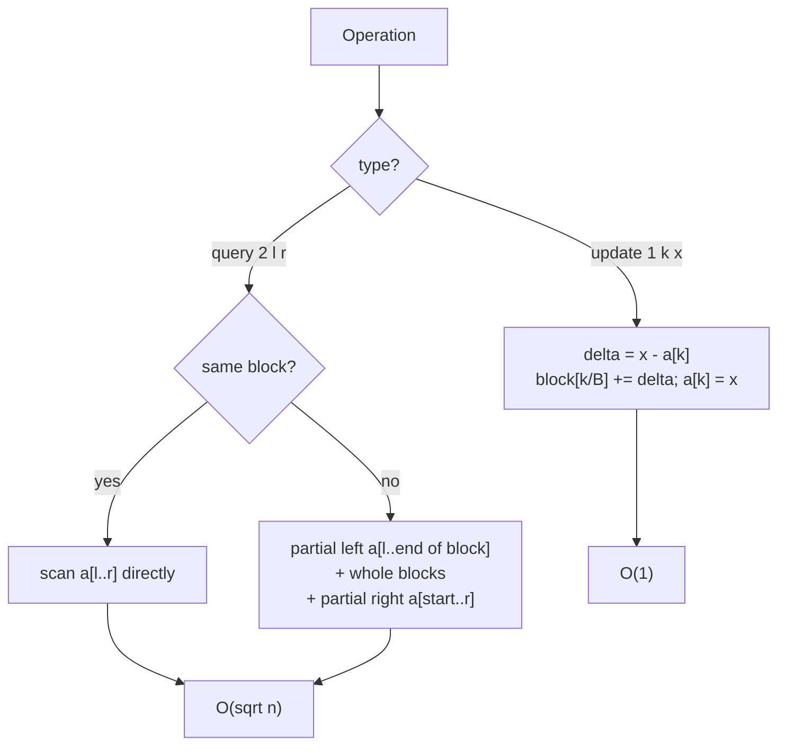
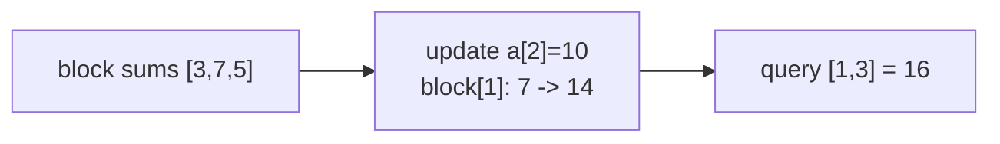

# Range Sum with Point Updates — Sqrt Decomposition

| Field      | Value                                               |
| ---------- | --------------------------------------------------- |
| Source     | Classic (self-contained)                            |
| Difficulty | Easy–Medium                                         |
| Topics     | Sqrt decomposition, Block aggregates, Range sum     |
| Link       | (self-contained — compare with CSES 1648)           |

---

## Problem Statement

You are given an array of $n$ integers. Process $q$ operations of two kinds:

- **Update** `1 k x` — set $a_k = x$.
- **Query** `2 l r` — output the sum $a_l + a_{l+1} + \dots + a_r$ (1-indexed,
  inclusive).

Constraints (representative):

$$
1 \le n, q \le 2 \cdot 10^5, \qquad |a_i|, |x| \le 10^9.
$$

This is the same task a segment tree or Fenwick tree solves in $O(\log n)$ per
operation. Here we solve it with **sqrt decomposition** — simpler code, an
$O(\sqrt n)$ query, and an $O(1)$ update — to contrast the two approaches.

```text
Input
5 3
1 2 3 4 5
2 1 5
1 3 10
2 2 4

Output
15
16
```

Query `2 1 5` → $1+2+3+4+5 = 15$. After `1 3 10` (set $a_3 = 10$),
query `2 2 4` → $2 + 10 + 4 = 16$.

## Approach (WHY)

Split the array into blocks of size $B \approx \sqrt n$ and store each block's
running sum. Then:

- **Update** $a_k = x$: adjust that block's sum by the delta $x - a_k$ in
  $O(1)$, then store $a_k = x$.
- **Query** $[l, r]$: add the two partial ends element-by-element ($O(\sqrt n)$
  total) and add the precomputed sums of every fully covered block (at most
  $\sqrt n$ of them).

**Why sqrt instead of a segment tree?** A segment tree gives $O(\log n)$ but
needs more code (build, recursion or iterative indexing). Sqrt decomposition
trades a worse asymptotic ($O(\sqrt n)$ query) for a flat, easy-to-debug
structure with an $O(1)$ update for sum — often fast enough and far simpler.



## Solution

### Python

```python
import sys
from math import isqrt

def main():
    data = sys.stdin.buffer.read().split()
    idx = 0
    n = int(data[idx]); q = int(data[idx + 1]); idx += 2
    a = [int(data[idx + i]) for i in range(n)]; idx += n

    B = max(1, isqrt(n))
    nb = (n + B - 1) // B
    block = [0] * nb
    for i in range(n):
        block[i // B] += a[i]

    out = []
    for _ in range(q):
        t = int(data[idx]); idx += 1
        if t == 1:                       # update: set a[k] = x   (O(1))
            k = int(data[idx]) - 1
            x = int(data[idx + 1])
            idx += 2
            block[k // B] += x - a[k]
            a[k] = x
        else:                            # query: sum [l, r]      (O(sqrt n))
            l = int(data[idx]) - 1
            r = int(data[idx + 1]) - 1
            idx += 2
            bl, br = l // B, r // B
            res = 0
            if bl == br:
                for i in range(l, r + 1):
                    res += a[i]
            else:
                for i in range(l, (bl + 1) * B):
                    res += a[i]
                for b in range(bl + 1, br):
                    res += block[b]
                for i in range(br * B, r + 1):
                    res += a[i]
            out.append(res)

    sys.stdout.write("\n".join(map(str, out)) + "\n")

main()
```

### C++

```cpp
#include <bits/stdc++.h>
using namespace std;

int main() {
    ios::sync_with_stdio(false);
    cin.tie(nullptr);

    int n, q;
    cin >> n >> q;
    vector<long long> a(n);
    for (int i = 0; i < n; i++) cin >> a[i];

    int B = max(1, (int)sqrt((double)n));
    int nb = (n + B - 1) / B;
    vector<long long> block(nb, 0);
    for (int i = 0; i < n; i++) block[i / B] += a[i];

    while (q--) {
        int t; cin >> t;
        if (t == 1) {                    // update: set a[k] = x   (O(1))
            int k; long long x;
            cin >> k >> x; --k;
            block[k / B] += x - a[k];
            a[k] = x;
        } else {                         // query: sum [l, r]      (O(sqrt n))
            int l, r; cin >> l >> r; --l; --r;
            int bl = l / B, br = r / B;
            long long res = 0;
            if (bl == br) {
                for (int i = l; i <= r; i++) res += a[i];
            } else {
                for (int i = l; i < (bl + 1) * B; i++) res += a[i];
                for (int b = bl + 1; b < br; b++) res += block[b];
                for (int i = br * B; i <= r; i++) res += a[i];
            }
            cout << res << '\n';
        }
    }
    return 0;
}
```

## Iteration Trace

Array `a = [1, 2, 3, 4, 5]`, $B = \lfloor\sqrt 5\rfloor = 2$, blocks:
`[0..1]`, `[2..3]`, `[4]` with sums `block = [3, 7, 5]`.

| Op | Action | Blocks touched | block[] | Result |
|----|--------|----------------|---------|--------|
| `2 1 5` | sum [0,4]: partial a[0..1]=3, whole block[1]=7, partial a[4]=5 | 0,1,2 | [3,7,5] | 15 |
| `1 3 10` | set a[2]=10: delta = 10-3 = +7 → block[1] += 7 | 1 | [3,14,5] | — |
| `2 2 4` | sum [1,3]: partial a[1]=2, whole block[1]=14 ... | — | — | see below |

For `2 2 4` (0-indexed $[1,3]$): `bl = 0, br = 1`, partial left `a[1] = 2`, whole
blocks none between 0 and 1, partial right `a[2..3] = 10 + 4 = 14`. Total
$2 + 14 = 16$.



## Complexity

Build scans the array once: $O(n)$. Each update patches one block sum in $O(1)$.
Each query touches at most $2B$ partial elements plus $n/B$ block sums; with
$B = \sqrt n$ this is

$$
O(B + n / B) = O(\sqrt n).
$$

| Operation | Sqrt decomposition | Segment tree / Fenwick |
|-----------|--------------------|------------------------|
| Build | $O(n)$ | $O(n)$ |
| Point update | $O(1)$ | $O(\log n)$ |
| Range sum | $O(\sqrt n)$ | $O(\log n)$ |
| Code complexity | low | higher |

## Complexity Table

| Aspect | Cost |
|--------|------|
| Build | $O(n)$ |
| Update (set value) | $O(1)$ |
| Range-sum query | $O(\sqrt n)$ |
| Space | $O(n + \sqrt n)$ |

## Takeaway

For range-sum with point updates, sqrt decomposition is the easiest correct
structure to write: an $O(1)$ update and an $O(\sqrt n)$ query, no recursion.
Reach for a Fenwick/segment tree when $O(\log n)$ queries matter or the aggregate
is non-incremental; reach for sqrt decomposition when simplicity wins and
$O(\sqrt n)$ is fast enough — or when the aggregate doesn't fit a Fenwick tree
neatly.
