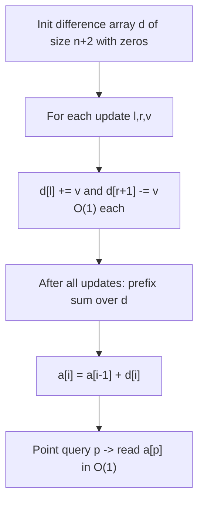

# Range Update, Point Query (CSES-style — 1D Difference Array)

| Meta | Value |
|------|-------|
| Source | CSES Problem Set — Range Queries (offline range-add / point-query) |
| Difficulty | Easy |
| Topics | Difference Array, Offline Range Add, Prefix Sum Finalize |
| Link | https://cses.fi/problemset/ |

---

## Problem Statement

You are given an array $a[1 \dots n]$, initially all zeros. You then process $m$ operations of two
kinds, in order:

- **Update** `1 l r v`: add the value $v$ to every element in positions $l \dots r$ (inclusive).
- **Query** `2 p`: report the current value at position $p$.

All updates may be applied **before** the queries are read (the workload is *offline*), or queries may
be interleaved — but crucially, queries only ask for a **single point**, never a range, and the array
is read after the relevant updates are in place. Output one line per query.

- $1 \le n, m \le 2 \times 10^5$
- $1 \le l \le r \le n$
- $-10^9 \le v \le 10^9$ (cumulative values can reach $\sim 2 \times 10^{14}$ → use 64-bit)

```
Input:
5 5
1 2 4 3
1 1 3 2
2 1
2 3
2 5

Output:
2
5
0
```

After both updates: $a = [2,\,5,\,5,\,3,\,0]$. Position 1 → 2, position 3 → $2+3 = 5$, position 5 → 0.

---

## Approach (WHY)

A naive range update writes $r - l + 1$ cells, costing $O(n)$ per update and $O(nm)$ overall — too slow.
Because **all the range adds can be applied, then the array read**, a **difference array** makes each
update $O(1)$.

Keep $d[1 \dots n+1]$. For an update $(l, r, v)$ set:

$$
d[l] \mathrel{+}= v, \qquad d[r+1] \mathrel{-}= v.
$$

The $+v$ switches the contribution on at $l$; the $-v$ switches it off just past $r$. After all updates,
a single **prefix sum** of $d$ reconstructs the final array, and any point query is then a direct index
read.



If updates and queries were truly interleaved with reads needed *between* updates, you would instead use
a Fenwick tree (range-update / point-query via a single BIT on the difference array). The pure
difference-array form below assumes the phased / offline order shown in the example.

---

## Solution

### Python

```python
import sys

def main():
    data = sys.stdin.buffer.read().split()
    idx = 0
    n = int(data[idx]); idx += 1
    m = int(data[idx]); idx += 1

    # d sized n+2 so d[r+1] is always valid (r can be n).
    d = [0] * (n + 2)
    queries = []  # remember point queries to answer after finalizing

    ops = []
    for _ in range(m):
        kind = int(data[idx]); idx += 1
        if kind == 1:
            l = int(data[idx]); r = int(data[idx + 1]); v = int(data[idx + 2])
            idx += 3
            d[l] += v
            d[r + 1] -= v
            ops.append(None)
        else:
            p = int(data[idx]); idx += 1
            ops.append(p)

    # Finalize: prefix sum turns the difference array into the real array.
    a = [0] * (n + 1)
    for i in range(1, n + 1):
        a[i] = a[i - 1] + d[i]

    out = []
    for p in ops:
        if p is not None:
            out.append(str(a[p]))

    sys.stdout.write("\n".join(out) + "\n")

main()
```

### C++

```cpp
#include <bits/stdc++.h>
using namespace std;

int main() {
    ios::sync_with_stdio(false);
    cin.tie(nullptr);

    int n, m;
    cin >> n >> m;

    // d sized n+2 so d[r+1] is always valid (r can be n).
    vector<long long> d(n + 2, 0);
    vector<int> queries;          // point positions, answered after finalize

    for (int t = 0; t < m; ++t) {
        int kind;
        cin >> kind;
        if (kind == 1) {
            int l, r;
            long long v;
            cin >> l >> r >> v;
            d[l] += v;
            d[r + 1] -= v;
        } else {
            int p;
            cin >> p;
            queries.push_back(p);
        }
    }

    // Finalize: prefix sum turns the difference array into the real array.
    vector<long long> a(n + 1, 0);
    for (int i = 1; i <= n; ++i)
        a[i] = a[i - 1] + d[i];

    string out;
    for (int p : queries) {
        out += to_string(a[p]);
        out += '\n';
    }
    cout << out;
    return 0;
}
```

---

## Iteration Trace

Two updates on $n = 5$: `(l,r,v) = (2,4,3)` then `(1,3,2)`.

Difference array $d$ after stamping each update (indices 1..6):

| Step | d[1] | d[2] | d[3] | d[4] | d[5] | d[6] |
|------|------|------|------|------|------|------|
| start | 0 | 0 | 0 | 0 | 0 | 0 |
| +3 at 2, −3 at 5 | 0 | 3 | 0 | 0 | −3 | 0 |
| +2 at 1, −2 at 4 | 2 | 3 | 0 | −2 | −3 | 0 |

Finalize with a prefix sum:

| i | d[i] | running a[i] |
|---|------|--------------|
| 1 | 2 | 2 |
| 2 | 3 | 5 |
| 3 | 0 | 5 |
| 4 | −2 | 3 |
| 5 | −3 | 0 |

Queries: `2 1` → $a[1]=2$, `2 3` → $a[3]=5$, `2 5` → $a[5]=0$. Matches expected output.

---

## Complexity

Each update is two writes; finalize is one pass; each query is one read.

$$
T_{\text{update}} = O(1), \qquad T_{\text{finalize}} = O(n), \qquad
T_{\text{total}} = O(n + m)
$$

| Phase | Time | Space |
|-------|------|-------|
| Per range update | $O(1)$ | — |
| Finalize (prefix sum) | $O(n)$ | $O(n)$ |
| Per point query | $O(1)$ | — |
| Total | $O(n + m)$ | $O(n)$ |

---

## Takeaway

When every update is a **range add** and reads happen **after** updates, a difference array beats any
tree structure: $O(1)$ per update and a single prefix-sum pass to finalize. Size the buffer to $n+2$ so
the $d[r+1]$ write never overflows, and use `long long` because stacked adds of $\pm 10^9$ easily exceed
32 bits. If reads must interleave between updates, lift the same idea into a Fenwick tree.
