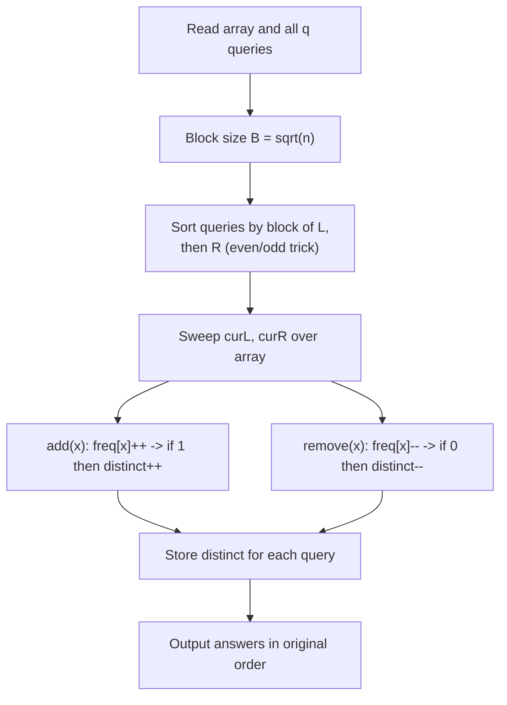
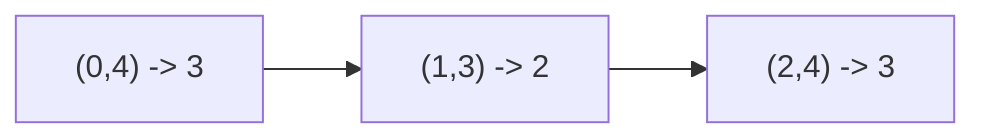

# SPOJ DQUERY — D-query (Distinct Values in a Range)

| Field      | Value                                                  |
| ---------- | ------------------------------------------------------ |
| Source     | SPOJ                                                   |
| Difficulty | Medium                                                 |
| Topics     | Mo's algorithm, Offline queries, Distinct count        |
| Link       | https://www.spoj.com/problems/DQUERY/                  |

---

## Problem Statement

Given a sequence of $n$ integers $a_1, a_2, \dots, a_n$ and $q$ queries, each
query is a pair $(l, r)$. For each query, report the number of **distinct**
values among $a_l, a_{l+1}, \dots, a_r$ (1-indexed, inclusive).

Constraints:

$$
1 \le n \le 3 \cdot 10^4, \qquad 1 \le a_i \le 10^6, \qquad 1 \le q \le 2 \cdot 10^5.
$$

There are no updates, and all queries are available together — a textbook fit
for **Mo's algorithm**.

```text
Input
5
1 1 2 1 3
3
1 5
2 4
3 5

Output
3
2
3
```

Query `1 5` → values $\{1,1,2,1,3\}$ → distinct $\{1,2,3\}$ → $3$.
Query `2 4` → values $\{1,2,1\}$ → distinct $\{1,2\}$ → $2$.

## Approach (WHY)

Distinct-count over arbitrary ranges has no simple online $O(\log n)$ structure,
but it *does* have an $O(1)$ add/remove: keep a frequency table and a running
`distinct` counter. That is exactly the precondition for **Mo's algorithm**.

We sort the $q$ queries by (block of $l$, then $r$ with the even/odd trick),
then sweep two pointers `curL, curR` across the array. Each element entering the
window calls `add` (maybe a new distinct value); each leaving element calls
`remove` (maybe a vanishing value). Total work is $O((n+q)\sqrt n)$.



## Solution

Maintain `freq[value]` and a single integer `distinct`. The frequency table is a
flat array because values fit in $[1, 10^6]$ (no compression needed here).

### Python

```python
import sys
from math import isqrt

def main():
    data = sys.stdin.buffer.read().split()
    idx = 0
    n = int(data[idx]); idx += 1
    a = [int(data[idx + i]) for i in range(n)]; idx += n
    q = int(data[idx]); idx += 1

    queries = []
    for i in range(q):
        l = int(data[idx]) - 1          # to 0-indexed
        r = int(data[idx + 1]) - 1
        idx += 2
        queries.append((l, r, i))

    B = max(1, isqrt(n))
    queries.sort(key=lambda Q: (Q[0] // B,
                                Q[1] if (Q[0] // B) % 2 == 0 else -Q[1]))

    maxv = max(a) + 1 if a else 1
    freq = [0] * maxv
    distinct = 0
    ans = [0] * q

    curL, curR = 0, -1
    for l, r, qi in queries:
        while curR < r:
            curR += 1
            x = a[curR]
            if freq[x] == 0:
                distinct += 1
            freq[x] += 1
        while curL > l:
            curL -= 1
            x = a[curL]
            if freq[x] == 0:
                distinct += 1
            freq[x] += 1
        while curR > r:
            x = a[curR]
            freq[x] -= 1
            if freq[x] == 0:
                distinct -= 1
            curR -= 1
        while curL < l:
            x = a[curL]
            freq[x] -= 1
            if freq[x] == 0:
                distinct -= 1
            curL += 1
        ans[qi] = distinct

    sys.stdout.write("\n".join(map(str, ans)) + "\n")

main()
```

### C++

```cpp
#include <bits/stdc++.h>
using namespace std;

int main() {
    ios::sync_with_stdio(false);
    cin.tie(nullptr);

    int n;
    cin >> n;
    vector<int> a(n);
    int maxv = 0;
    for (int i = 0; i < n; i++) { cin >> a[i]; maxv = max(maxv, a[i]); }

    int q;
    cin >> q;
    struct Query { int l, r, idx; };
    vector<Query> qs(q);
    for (int i = 0; i < q; i++) {
        int l, r; cin >> l >> r;
        qs[i] = {l - 1, r - 1, i};       // to 0-indexed
    }

    int B = max(1, (int)sqrt((double)n));
    sort(qs.begin(), qs.end(), [&](const Query& x, const Query& y) {
        int bx = x.l / B, by = y.l / B;
        if (bx != by) return bx < by;
        return (bx & 1) ? (x.r > y.r) : (x.r < y.r);   // even/odd trick
    });

    vector<int> freq(maxv + 1, 0);
    vector<int> ans(q);
    int distinct = 0;
    int curL = 0, curR = -1;

    auto add = [&](int x) { if (freq[x]++ == 0) distinct++; };
    auto rem = [&](int x) { if (--freq[x] == 0) distinct--; };

    for (const auto& Q : qs) {
        while (curR < Q.r) add(a[++curR]);
        while (curL > Q.l) add(a[--curL]);
        while (curR > Q.r) rem(a[curR--]);
        while (curL < Q.l) rem(a[curL++]);
        ans[Q.idx] = distinct;
    }

    for (int i = 0; i < q; i++) cout << ans[i] << '\n';
    return 0;
}
```

## Iteration Trace

Array `a = [1, 1, 2, 1, 3]` (0-indexed), $B = \lfloor\sqrt 5\rfloor = 2$.
Queries (0-indexed) sorted: `(0,4)` block 0, `(1,3)` block 0, `(2,4)` block 1.

| Step | Query | Pointer moves | freq snapshot | distinct |
|------|-------|---------------|---------------|----------|
| 1 | (0,4) | add a[0..4]: 1,1,2,1,3 | {1:3, 2:1, 3:1} | 3 |
| 2 | (1,3) | rem a[4]=3, rem a[0]=1 | {1:2, 2:1, 3:0} | 2 |
| 3 | (2,4) | add a[4]=3, rem a[1]=1 | {1:1, 2:1, 3:1} | 3 |

Answers, restored to original order: `3, 2, 3`.



## Complexity

Sorting queries is $O(q \log q)$. Each of the four pointers travels a total of
$O((n+q)\sqrt n)$ across all queries, and every step is an $O(1)$ add/remove:

$$
O\big(q \log q + (n + q)\sqrt n\big).
$$

| Aspect | Cost |
|--------|------|
| Time | $O(q \log q + (n+q)\sqrt n)$ |
| Space | $O(n + q + \max a_i)$ |

## Complexity Table

| Operation | Complexity |
|-----------|------------|
| Sort queries | $O(q \log q)$ |
| Pointer sweep | $O((n+q)\sqrt n)$ |
| add / remove | $O(1)$ each |
| Total | $O(q \log q + (n+q)\sqrt n)$ |

## Takeaway

When a range aggregate has a clean $O(1)$ add/remove but no good online
structure, **Mo's algorithm** turns "hard online" into "easy offline." The whole
problem reduces to (1) the query ordering and (2) two tiny functions that nudge a
running answer. Distinct-count is the canonical example.
