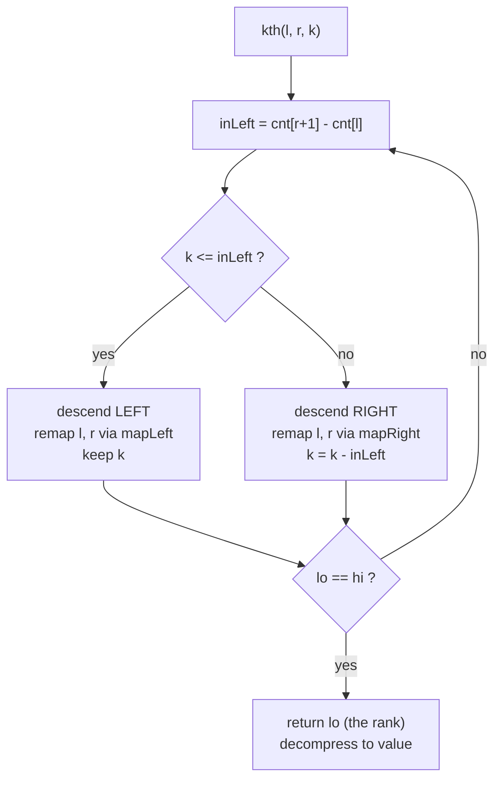

# K-th Number in a Range (Wavelet Tree)

| Field | Value |
| --- | --- |
| Source | SPOJ MKTHNUM ("K-th Number") |
| Difficulty | Hard |
| Topics | Wavelet tree, coordinate compression, range order statistics |
| Link | https://www.spoj.com/problems/MKTHNUM/ |

---

## Problem Statement

You are given an array $a[1..n]$ of integers and $q$ queries. Each query is a
triple $(l, r, k)$ and asks for the **$k$-th smallest** value among
$a_l, a_{l+1}, \dots, a_r$ (1-indexed, so $k = 1$ is the minimum of the window).

Formally, sort the multiset $\{a_l, \dots, a_r\}$ in nondecreasing order and
output the element at position $k$.

```text
Input:
n = 7, q = 3
a = [1, 5, 2, 6, 3, 7, 4]
queries:
  (2, 5, 3)   # window [5,2,6,3] sorted -> [2,3,5,6]; 3rd -> 5
  (4, 4, 1)   # window [6]; 1st -> 6
  (1, 7, 4)   # whole array sorted -> [1,2,3,4,5,6,7]; 4th -> 4

Output:
5
6
4
```

## Approach (WHY)

The k-th-smallest-in-range query is the **defining application** of the wavelet
tree. We build the tree over the **compressed value ranks** $[0, \sigma - 1]$ once,
then answer every query by a single root-to-leaf descent.

**Why it works.** At any node covering value range $[v_{lo}, v_{hi}]$ with
$\text{mid} = \lfloor (v_{lo}+v_{hi})/2 \rfloor$, the prefix-count array gives the
number of window elements whose value is in the **low half**:

$$
\text{inLeft} = \text{cnt}[r{+}1] - \text{cnt}[l].
$$

- If $k \le \text{inLeft}$, the $k$-th smallest is among the low-half elements, so
  we descend **left** after remapping the window through `mapLeft`.
- Otherwise the answer is in the high half; we drop the $\text{inLeft}$ smaller
  elements and look for the $(k - \text{inLeft})$-th smallest in the **right**
  child via `mapRight`.

Each step halves the value range, so after $O(\log \sigma)$ steps we reach a leaf
that represents exactly one rank — that rank decompressed is the answer. Building
is $O(n \log \sigma)$; each query is $O(\log \sigma)$.

## Solution

### Python

```python
import sys
from bisect import bisect_left
input = sys.stdin.readline


class WaveletTree:
    def __init__(self, arr, lo, hi):
        self.lo = lo
        self.hi = hi
        self.left = None
        self.right = None
        self.cnt = [0]
        if lo == hi or not arr:
            for _ in arr:
                self.cnt.append(self.cnt[-1])
            return
        mid = (lo + hi) // 2
        left_seq, right_seq = [], []
        for v in arr:
            goes_left = 1 if v <= mid else 0
            self.cnt.append(self.cnt[-1] + goes_left)
            (left_seq if goes_left else right_seq).append(v)
        self.left = WaveletTree(left_seq, lo, mid)
        self.right = WaveletTree(right_seq, mid + 1, hi)

    def map_left(self, i):
        return self.cnt[i]

    def map_right(self, i):
        return i - self.cnt[i]

    def kth(self, l, r, k):
        if self.lo == self.hi:
            return self.lo
        in_left = self.cnt[r + 1] - self.cnt[l]
        if k <= in_left:
            return self.left.kth(self.map_left(l), self.map_left(r + 1) - 1, k)
        return self.right.kth(self.map_right(l),
                              self.map_right(r + 1) - 1, k - in_left)


def main():
    sys.setrecursionlimit(1 << 20)
    n, q = map(int, input().split())
    a = list(map(int, input().split()))

    sorted_vals = sorted(set(a))
    rank = {v: i for i, v in enumerate(sorted_vals)}
    ranks = [rank[v] for v in a]
    wt = WaveletTree(ranks, 0, len(sorted_vals) - 1)

    out = []
    for _ in range(q):
        l, r, k = map(int, input().split())
        r_idx = wt.kth(l - 1, r - 1, k)     # 0-based inclusive indices
        out.append(str(sorted_vals[r_idx]))  # decompress rank back to value
    sys.stdout.write("\n".join(out) + "\n")


if __name__ == "__main__":
    main()
```

### C++

```cpp
#include <bits/stdc++.h>
using namespace std;

struct WaveletTree {
    int lo, hi;
    WaveletTree *left = nullptr, *right = nullptr;
    vector<int> cnt;

    WaveletTree(vector<int> arr, int lo, int hi) : lo(lo), hi(hi) {
        cnt.push_back(0);
        if (lo == hi || arr.empty()) {
            for (size_t i = 0; i < arr.size(); i++) cnt.push_back(cnt.back());
            return;
        }
        int mid = (lo + hi) / 2;
        vector<int> leftSeq, rightSeq;
        for (int v : arr) {
            int goesLeft = (v <= mid) ? 1 : 0;
            cnt.push_back(cnt.back() + goesLeft);
            if (goesLeft) leftSeq.push_back(v);
            else rightSeq.push_back(v);
        }
        left = new WaveletTree(move(leftSeq), lo, mid);
        right = new WaveletTree(move(rightSeq), mid + 1, hi);
    }

    int mapLeft(int i) const { return cnt[i]; }
    int mapRight(int i) const { return i - cnt[i]; }

    int kth(int l, int r, int k) const {
        if (lo == hi) return lo;
        int inLeft = cnt[r + 1] - cnt[l];
        if (k <= inLeft)
            return left->kth(mapLeft(l), mapLeft(r + 1) - 1, k);
        return right->kth(mapRight(l), mapRight(r + 1) - 1, k - inLeft);
    }
};

int main() {
    ios::sync_with_stdio(false);
    cin.tie(nullptr);

    int n, q;
    cin >> n >> q;
    vector<int> a(n);
    for (int i = 0; i < n; i++) cin >> a[i];

    vector<int> sortedVals(a);
    sort(sortedVals.begin(), sortedVals.end());
    sortedVals.erase(unique(sortedVals.begin(), sortedVals.end()),
                     sortedVals.end());
    auto rankOf = [&](int x) {
        return int(lower_bound(sortedVals.begin(), sortedVals.end(), x)
                   - sortedVals.begin());
    };
    vector<int> ranks(n);
    for (int i = 0; i < n; i++) ranks[i] = rankOf(a[i]);

    WaveletTree wt(ranks, 0, (int)sortedVals.size() - 1);

    string out;
    for (int i = 0; i < q; i++) {
        int l, r, k;
        cin >> l >> r >> k;
        int rIdx = wt.kth(l - 1, r - 1, k);        // 0-based inclusive
        out += to_string(sortedVals[rIdx]);        // decompress rank
        out += '\n';
    }
    cout << out;
    return 0;
}
```

## Trace

Query $(2, 5, 3)$ on $a = [1,5,2,6,3,7,4]$, 0-based window $[1, 4]$ over values
$\{5, 2, 6, 3\}$. Ranks of the sorted distinct values $[1,2,3,4,5,6,7]$ are the
identity, so we trace on the values directly.

| Node range | window $[l, r]$ | inLeft | $k$ | decision |
| --- | --- | --- | --- | --- |
| $[1,7]$ mid=4 | $[1,4]$ | 2 (values 2,3) | 3 | $k>$inLeft → right, $k=1$ |
| $[5,7]$ mid=6 | remapped | 2 (values 5,6) | 1 | $k\le$inLeft → left |
| $[5,6]$ mid=5 | remapped | 1 (value 5) | 1 | $k\le$inLeft → left |
| $[5,5]$ leaf | — | — | — | return 5 |

Answer: **5**, matching the worked example.

## Mermaid



## Math / Complexity

Let $\sigma$ be the number of distinct values. Building the wavelet tree does one
linear stable partition per level:

$$
T_{\text{build}} = O(n \log \sigma), \qquad
M = O(n \log \sigma).
$$

Each `kth` query descends one root-to-leaf path of height $\lceil \log_2 \sigma
\rceil$:

$$
T_{\text{query}} = O(\log \sigma).
$$

Total for $q$ queries: $O\big((n + q)\log \sigma\big)$, comfortably within SPOJ
limits for $n, q \le 10^5$.

## Takeaway

The k-th-smallest-in-range query is the signature use of a wavelet tree: compress
values, build once, then each query is a single $O(\log \sigma)$ descent guided by
$\text{inLeft} = \text{cnt}[r{+}1] - \text{cnt}[l]$ — go left and keep $k$, or go
right and subtract.
