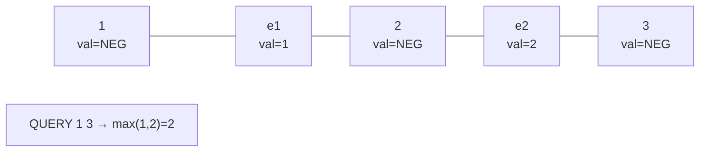

# SPOJ QTREE — Max Edge on a Path with Updates (Link-Cut Tree)

| Field | Value |
| --- | --- |
| Source | SPOJ QTREE |
| Difficulty | Hard |
| Topics | Link-Cut Tree, edges-as-nodes, path max, point update |
| Link | https://www.spoj.com/problems/QTREE/ |

---

## Problem Statement

You are given a tree with $n$ vertices and $n-1$ weighted edges, numbered
$1 \dots n-1$ in input order. Then process a stream of operations until `DONE`:

- `CHANGE i t` — set the weight of the $i$-th edge to $t$.
- `QUERY a b` — output the **maximum edge weight** on the unique path between
  vertices `a` and `b`. If `a == b` the path has no edges; output `0`.
- `DONE` — end of this test case.

There are multiple test cases. The tree is fixed per test case (no link/cut of
the original edges); only weights change.

```text
Input (one test case):
n = 3
edges:  1: (1,2,w=1)
        2: (2,3,w=2)
QUERY 1 2     -> max edge on path 1-2          = 1
QUERY 1 3     -> max edge on path 1-2-3        = max(1,2) = 2
CHANGE 1 3    -> edge 1 weight becomes 3
QUERY 1 3     -> max(3,2)                       = 3
DONE

Output:
1
2
3
```

## Approach (WHY)

An LCT naturally aggregates over **vertices**, but QTREE asks about **edges**.
The classic fix is to **model every edge as its own node**. For edge $i$ joining
$u$ and $v$ with weight $w$, create an extra node $e_i = n + i$ holding
$\text{val}[e_i] = w$, and replace the single edge $u\!-\!v$ with two structural
edges $u\!-\!e_i$ and $e_i\!-\!v$. Now the path between two original vertices
alternates *vertex, edge, vertex, edge, …*, and the **maximum edge weight equals
the maximum `val` along that path** — provided real vertices contribute a value
that never wins the max.

Design decisions:

1. **Vertex sentinel value.** Give every original vertex
   $\text{val} = -\infty$ so it can never be the path maximum; only edge-nodes
   carry meaningful weights. The null node `0` also holds $-\infty$.
2. **Aggregate = max.** Maintain $\text{mx}[x] = \max(\text{mx}[\ell],
   \text{val}[x], \text{mx}[r])$ in `pushUp`.
3. **`CHANGE i t`** ⇒ point update on node $e_i = n+i$: `splay(e_i)`,
   `val[e_i] = t`, `pushUp`.
4. **`QUERY a b`** ⇒ if `a == b` answer `0`; else `split(a, b)` and read
   `mx[b]`, which is the max edge value on the path.

We build the tree once with `link`; because QTREE never removes original edges,
`cut` is unused, but path reversal (`makeRoot`) is still essential to query an
arbitrary `a..b` path. Each `CHANGE` / `QUERY` is amortized $O(\log n)$.

## Solution

### Python

```python
import sys

NEG = -(1 << 62)                           # -infinity sentinel for max


class LinkCutTreeMax:
    """LCT keeping path-max; edges are modeled as nodes, vertices use NEG."""

    def __init__(self, total):
        size = total + 1                   # node 0 = null sentinel
        self.ch = [[0, 0] for _ in range(size)]
        self.fa = [0] * size
        self.val = [NEG] * size            # vertices/null never win the max
        self.mx = [NEG] * size
        self.rev = [False] * size

    def is_root(self, x):
        f = self.fa[x]
        return self.ch[f][0] != x and self.ch[f][1] != x

    def push_up(self, x):
        l, r = self.ch[x]
        self.mx[x] = max(self.mx[l], self.val[x], self.mx[r])

    def apply_rev(self, x):
        if x == 0:
            return
        self.ch[x][0], self.ch[x][1] = self.ch[x][1], self.ch[x][0]
        self.rev[x] = not self.rev[x]

    def push_down(self, x):
        if self.rev[x]:
            self.apply_rev(self.ch[x][0])
            self.apply_rev(self.ch[x][1])
            self.rev[x] = False

    def rotate(self, x):
        y = self.fa[x]
        z = self.fa[y]
        k = 1 if self.ch[y][1] == x else 0
        if not self.is_root(y):
            self.ch[z][1 if self.ch[z][1] == y else 0] = x
        self.fa[x] = z
        self.ch[y][k] = self.ch[x][k ^ 1]
        if self.ch[x][k ^ 1]:
            self.fa[self.ch[x][k ^ 1]] = y
        self.ch[x][k ^ 1] = y
        self.fa[y] = x
        self.push_up(y)
        self.push_up(x)

    def splay(self, x):
        stack = [x]
        y = x
        while not self.is_root(y):
            y = self.fa[y]
            stack.append(y)
        while stack:
            self.push_down(stack.pop())
        while not self.is_root(x):
            y = self.fa[x]
            z = self.fa[y]
            if not self.is_root(y):
                if (self.ch[y][1] == x) ^ (self.ch[z][1] == y):
                    self.rotate(x)
                else:
                    self.rotate(y)
            self.rotate(x)

    def access(self, x):
        last = 0
        y = x
        while y:
            self.splay(y)
            self.ch[y][1] = last
            self.push_up(y)
            last = y
            y = self.fa[y]
        self.splay(x)
        return last

    def make_root(self, x):
        self.access(x)
        self.apply_rev(x)

    def split(self, x, y):
        self.make_root(x)
        self.access(y)

    def link(self, x, y):
        self.make_root(x)
        self.fa[x] = y

    def set_value(self, x, v):
        self.splay(x)
        self.val[x] = v
        self.push_up(x)

    def path_max(self, x, y):
        if x == y:
            return 0
        self.split(x, y)
        return self.mx[y]


def main():
    data = sys.stdin.buffer.read().split()
    idx = 0
    t = int(data[idx]); idx += 1
    out = []
    for _ in range(t):
        n = int(data[idx]); idx += 1
        lct = LinkCutTreeMax(2 * n)        # vertices 1..n, edge-nodes n+1..2n-1
        for i in range(1, n):
            u = int(data[idx]); idx += 1
            v = int(data[idx]); idx += 1
            w = int(data[idx]); idx += 1
            e = n + i                       # node for edge i
            lct.set_value(e, w)
            lct.link(u, e)
            lct.link(e, v)
        while True:
            op = data[idx].decode(); idx += 1
            if op == "DONE":
                break
            if op == "CHANGE":
                i = int(data[idx]); idx += 1
                t_w = int(data[idx]); idx += 1
                lct.set_value(n + i, t_w)
            else:  # QUERY
                a = int(data[idx]); idx += 1
                b = int(data[idx]); idx += 1
                out.append(str(lct.path_max(a, b)))
    sys.stdout.write("\n".join(out) + "\n")


if __name__ == "__main__":
    main()
```

### C++

```cpp
#include <bits/stdc++.h>
using namespace std;

const long long INF = 1e18;
const long long NEG = -INF;                // -infinity sentinel for max

struct LinkCutTreeMax {
    // LCT keeping path-max; edges are modeled as nodes, vertices use NEG.
    vector<array<int, 2>> ch;
    vector<int> fa;
    vector<long long> val, mx;
    vector<char> rev;

    LinkCutTreeMax(int total) {
        int size = total + 1;              // node 0 = null sentinel
        ch.assign(size, {0, 0});
        fa.assign(size, 0);
        val.assign(size, NEG);             // vertices/null never win the max
        mx.assign(size, NEG);
        rev.assign(size, 0);
    }

    bool isRoot(int x) {
        int f = fa[x];
        return ch[f][0] != x && ch[f][1] != x;
    }

    void pushUp(int x) {
        mx[x] = max({mx[ch[x][0]], val[x], mx[ch[x][1]]});
    }

    void applyRev(int x) {
        if (x == 0) return;
        swap(ch[x][0], ch[x][1]);
        rev[x] ^= 1;
    }

    void pushDown(int x) {
        if (rev[x]) {
            applyRev(ch[x][0]);
            applyRev(ch[x][1]);
            rev[x] = 0;
        }
    }

    void rotate(int x) {
        int y = fa[x], z = fa[y];
        int k = (ch[y][1] == x);
        if (!isRoot(y)) ch[z][ch[z][1] == y] = x;
        fa[x] = z;
        ch[y][k] = ch[x][k ^ 1];
        if (ch[x][k ^ 1]) fa[ch[x][k ^ 1]] = y;
        ch[x][k ^ 1] = y;
        fa[y] = x;
        pushUp(y);
        pushUp(x);
    }

    void splay(int x) {
        static vector<int> stk;
        stk.clear();
        int y = x;
        stk.push_back(y);
        while (!isRoot(y)) {
            y = fa[y];
            stk.push_back(y);
        }
        while (!stk.empty()) {
            pushDown(stk.back());
            stk.pop_back();
        }
        while (!isRoot(x)) {
            int yy = fa[x], zz = fa[yy];
            if (!isRoot(yy)) {
                if ((ch[yy][1] == x) ^ (ch[zz][1] == yy)) rotate(x);
                else rotate(yy);
            }
            rotate(x);
        }
    }

    int access(int x) {
        int last = 0;
        for (int y = x; y; y = fa[y]) {
            splay(y);
            ch[y][1] = last;
            pushUp(y);
            last = y;
        }
        splay(x);
        return last;
    }

    void makeRoot(int x) {
        access(x);
        applyRev(x);
    }

    void split(int x, int y) {
        makeRoot(x);
        access(y);
    }

    void link(int x, int y) {
        makeRoot(x);
        fa[x] = y;
    }

    void setValue(int x, long long v) {
        splay(x);
        val[x] = v;
        pushUp(x);
    }

    long long pathMax(int x, int y) {
        if (x == y) return 0;
        split(x, y);
        return mx[y];
    }
};

int main() {
    ios::sync_with_stdio(false);
    cin.tie(nullptr);
    int t;
    if (!(cin >> t)) return 0;
    string out;
    while (t--) {
        int n;
        cin >> n;
        LinkCutTreeMax lct(2 * n);         // vertices 1..n, edge-nodes n+1..2n-1
        for (int i = 1; i < n; i++) {
            int u, v;
            long long w;
            cin >> u >> v >> w;
            int e = n + i;                 // node for edge i
            lct.setValue(e, w);
            lct.link(u, e);
            lct.link(e, v);
        }
        string op;
        while (cin >> op && op != "DONE") {
            if (op == "CHANGE") {
                int i;
                long long w;
                cin >> i >> w;
                lct.setValue(n + i, w);
            } else {                       // QUERY
                int a, b;
                cin >> a >> b;
                out += to_string(lct.pathMax(a, b)) + "\n";
            }
        }
    }
    cout << out;
    return 0;
}
```

## Iteration Trace

Tree: edge `1 = (1,2,1)`, edge `2 = (2,3,2)`. Edge-nodes: `e1 = 3+1 = 4`,
`e2 = 3+2 = 5`. After building, the represented path `1 .. 3` is
`1 — e1 — 2 — e2 — 3` with `val[e1]=1`, `val[e2]=2`, and every real vertex
`val = NEG`.

| Op | LCT action | Path nodes (val) | `mx` read | Output |
| --- | --- | --- | --- | --- |
| `QUERY 1 2` | `split(1,2)` | `1(NEG), e1(1), 2(NEG)` | `max = 1` | **1** |
| `QUERY 1 3` | `split(1,3)` | `1, e1(1), 2, e2(2), 3` | `max(1,2) = 2` | **2** |
| `CHANGE 1 3` | `setValue(e1=4, 3)` | `val[e1] = 3` | — | — |
| `QUERY 1 3` | `split(1,3)` | `e1(3), e2(2)` dominate | `max(3,2) = 3` | **3** |

Because real vertices carry `NEG`, they vanish from the `max`; only the edge
nodes `e1, e2` decide the answer. A `CHANGE` is a single point update on the
corresponding edge node, instantly reflected in the next `QUERY`.



## Math / Complexity

The aggregate is the max-monoid $(\mathbb{Z} \cup \{-\infty\}, \max, -\infty)$.
Modeling each edge as a node doubles the node count to $\le 2n-1$ but keeps the
invariant

$$
\text{mx}[v] = \max_{w \in P(a,b)} \text{val}[w]
= \max_{e \in \text{edges}(a,b)} \text{weight}(e),
$$

since vertices contribute $-\infty$. Each `CHANGE` and `QUERY` is a constant
number of `access` calls:

$$
T_{\text{op}} = O(\log n)\ \text{amortized}, \qquad
T_{\text{total}} = O\big((n + q)\log n\big), \qquad
\text{memory} = O(n).
$$

## Takeaway

QTREE is the textbook reason to remember the **edge-as-node** trick: whenever a
tree problem asks about **edge** quantities but your structure aggregates over
**vertices**, splice an extra node onto each edge and neutralize the real
vertices with an identity value ($-\infty$ for max, $0$ for sum). The Link-Cut
Tree then answers "max edge on the path" with point weight updates in amortized
$O(\log n)$ — and the very same code generalizes to dynamic-MST edge swaps.
