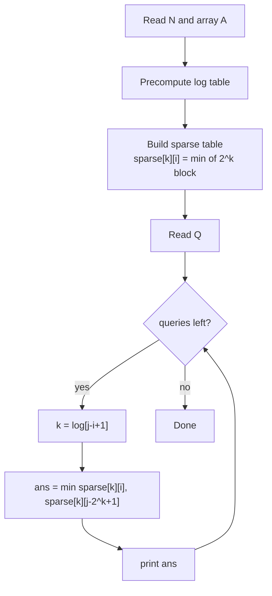
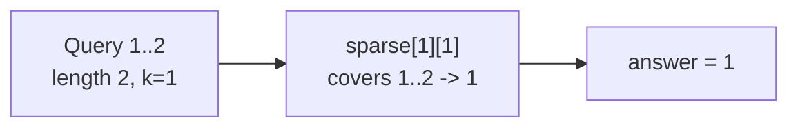

# SPOJ RMQSQ — Range Minimum Query

| Field      | Value                                          |
| ---------- | ---------------------------------------------- |
| Source     | SPOJ                                           |
| Difficulty | Easy                                           |
| Topics     | Sparse table, Idempotent RMQ, Range minimum    |
| Link       | https://www.spoj.com/problems/RMQSQ/           |

---

## Problem Statement

You are given an array $A$ of $N$ integers. Then $Q$ queries follow; each query
gives two 0-indexed positions $i$ and $j$, and you must output the **minimum**
value among $A[i], A[i+1], \ldots, A[j]$.

The array does not change between queries — a classic static RMQ.

Constraints (typical):

$$
1 \le N \le 10^5, \qquad 1 \le Q \le 10^4, \qquad 0 \le i \le j \le N-1.
$$

```text
Input
3
1 4 1
2
1 1
1 2

Output
4
1
```

Query `1 1` → only $A[1] = 4$ → minimum $4$.
Query `1 2` → $\min(A[1], A[2]) = \min(4, 1) = 1$.

## Approach (WHY)

This is the canonical sparse-table problem. The operation is $\min$, which is
**idempotent**, and the array is static, so we precompute power-of-two block
minima once in $O(N \log N)$ and answer each of the $Q$ queries in $O(1)$.

The query indices are already 0-indexed and inclusive, so no conversion is
needed — feed $[i, j]$ straight into the two-block formula with
$k = \lfloor \log_2(j - i + 1) \rfloor$.



## Solution

### Python

```python
import sys

def main():
    data = sys.stdin.buffer.read().split()
    idx = 0
    n = int(data[idx]); idx += 1
    a = [int(data[idx + i]) for i in range(n)]
    idx += n

    log = [0] * (n + 1)
    for i in range(2, n + 1):
        log[i] = log[i >> 1] + 1

    K = log[n] + 1
    sparse = [a[:]]                          # row 0
    for k in range(1, K):
        half = 1 << (k - 1)
        prev = sparse[k - 1]
        row = [min(prev[i], prev[i + half])
               for i in range(n - (1 << k) + 1)]
        sparse.append(row)

    q = int(data[idx]); idx += 1
    out = []
    for _ in range(q):
        i = int(data[idx]); j = int(data[idx + 1]); idx += 2
        k = log[j - i + 1]
        out.append(min(sparse[k][i], sparse[k][j - (1 << k) + 1]))

    sys.stdout.write("\n".join(map(str, out)) + "\n")

if __name__ == "__main__":
    main()
```

### C++

```cpp
#include <bits/stdc++.h>
using namespace std;

int main() {
    ios::sync_with_stdio(false);
    cin.tie(nullptr);

    int n;
    cin >> n;
    vector<long long> a(n);
    for (auto& x : a) cin >> x;

    vector<int> logv(n + 1, 0);
    for (int i = 2; i <= n; ++i)
        logv[i] = logv[i >> 1] + 1;

    int K = logv[n] + 1;
    vector<vector<long long>> sparse(K);
    sparse[0] = a;                              // row 0
    for (int k = 1; k < K; ++k) {
        int half = 1 << (k - 1);
        int span = 1 << k;
        sparse[k].resize(n - span + 1);
        for (int i = 0; i + span <= n; ++i)
            sparse[k][i] = min(sparse[k - 1][i], sparse[k - 1][i + half]);
    }

    int q;
    cin >> q;
    string out;
    while (q--) {
        int i, j;
        cin >> i >> j;                          // already 0-indexed inclusive
        int k = logv[j - i + 1];
        long long ans = min(sparse[k][i], sparse[k][j - (1 << k) + 1]);
        out += to_string(ans);
        out += '\n';
    }
    cout << out;
    return 0;
}
```

## Iteration Trace

Array: `[1, 4, 1]`, $n = 3$, $K = 2$.

| Row $k$ | Length $2^k$ | `sparse[k]` values |
| ------- | ------------ | ------------------ |
| $0$     | $1$          | `1 4 1`            |
| $1$     | $2$          | `1 1`              |

Answering the sample queries:

| Query $[i,j]$ | $L$ | $k$ | blocks combined                    | answer |
| ------------- | --- | --- | ---------------------------------- | ------ |
| $[1,1]$       | $1$ | $0$ | `sparse[0][1]=4`, `sparse[0][1]=4` | $4$    |
| $[1,2]$       | $2$ | $1$ | `sparse[1][1]=1`, `sparse[1][1]=1` | $1$    |



## Complexity

$$
T_\text{build} = O(N \log N), \qquad
T_\text{query} = O(1), \qquad
S = O(N \log N).
$$

| Phase           | Time          | Space         |
| --------------- | ------------- | ------------- |
| Build table     | $O(N \log N)$ | $O(N \log N)$ |
| Each query      | $O(1)$        | —             |
| All $Q$ queries | $O(Q)$        | —             |

## Takeaway

RMQSQ is the "hello world" of sparse tables: static array, $\min$ queries,
0-indexed inclusive bounds. Build power-of-two minima once, then each query is a
single idempotent `min` of two overlapping blocks in $O(1)$.
