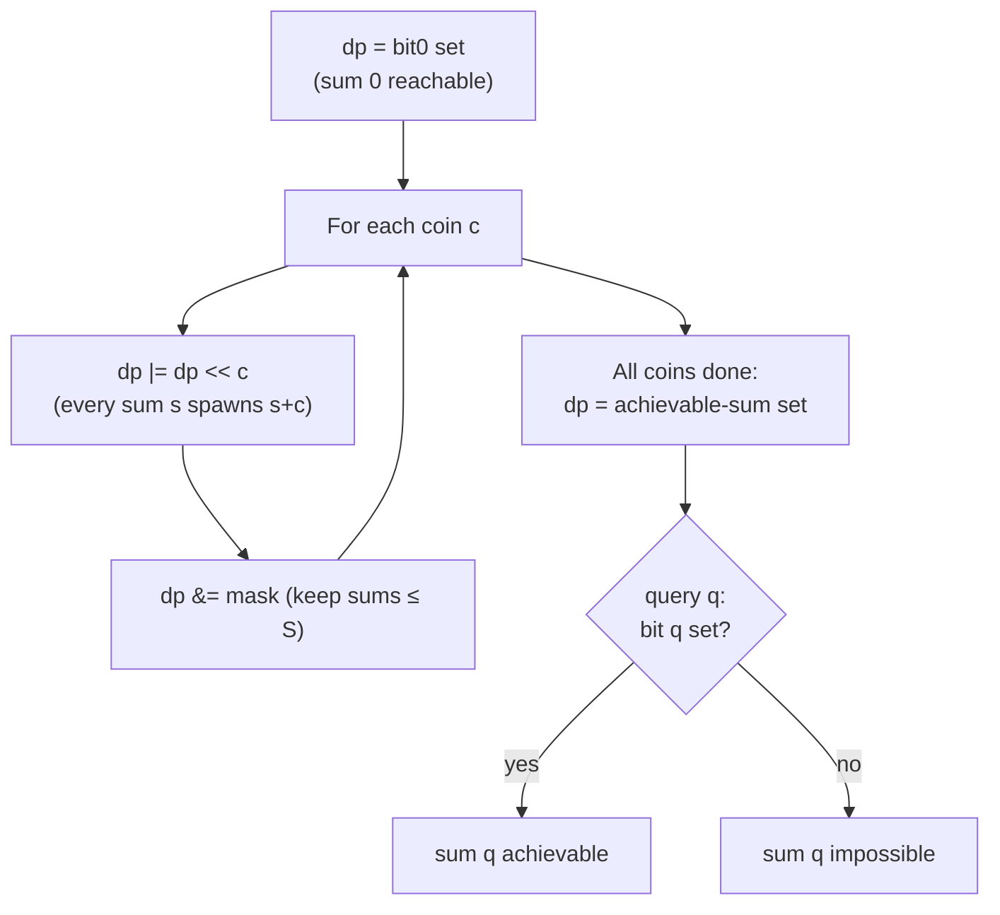

# Subset-Sum: All Reachable Sums via a Shifting Bitset

| Field | Value |
|-------|-------|
| Source | Self-contained (classic) |
| Difficulty | Medium |
| Topics | Dynamic programming, subset sum, bitset optimization, offline queries |
| Link | — |

---

## Problem Statement

You are given a list of `coins` (positive integers) and a bound `S`. Using each coin **at most
once**, determine the full set of sums in $[0, S]$ that can be formed by some subset, then answer
feasibility queries of the form "is sum $q$ achievable?".

We compute one bitset `dp` where bit $s$ means "sum $s$ is reachable", and answer each query in
$O(1)$ by testing a bit.

```text
coins = [1, 2, 5], S = 8

Reachable subset sums:
    {}      -> 0
    {1}     -> 1
    {2}     -> 2
    {1,2}   -> 3
    {5}     -> 5
    {1,5}   -> 6
    {2,5}   -> 7
    {1,2,5} -> 8
Achievable set within [0,8]: {0,1,2,3,5,6,7,8}   (note: 4 is NOT achievable)

Queries:
    q=3 -> yes
    q=4 -> no
    q=8 -> yes
```

---

## Approach (WHY)

Maintain the reachable-sum set as a bit-vector `dp`, bit $s$ = "sum $s$ achievable". Initially only
the empty subset is formed, so bit $0$ is set. Adding a coin $c$ means: every previously reachable
sum $s$ also yields $s + c$. On the bit-vector that is a **left shift by $c$ ORed back**:

$$
dp \mathrel{|}= (dp \ll c).
$$

Because each coin is used at most once, we apply exactly one shift-OR per coin (no nested capacity
loop is needed — the OR already accounts for "take it or leave it"). After processing all coins,
`dp` holds every achievable sum; we mask to width $S+1$ so we ignore sums above the bound and keep
the integer compact.

Each shift-OR is $O(S / 64)$ word operations, so building the full reachability set costs
$O(n \cdot S / 64)$, then every query is a single bit test in $O(1)$.

---

## Implementation

```python
from typing import List

def reachable_sums(coins: List[int], S: int) -> int:
    dp = 1                            # bit 0 set: empty subset sums to 0
    mask = (1 << (S + 1)) - 1         # keep only sums in [0, S]
    for c in coins:
        dp |= (dp << c)
        dp &= mask                    # discard sums above S, cap int growth
    return dp

def can_make(dp: int, q: int) -> bool:
    return (dp >> q) & 1 == 1

dp = reachable_sums([1, 2, 5], 8)
for q in (3, 4, 8):
    print(q, can_make(dp, q))         # 3 True, 4 False, 8 True
```

```cpp
#include <bits/stdc++.h>
using namespace std;

const int MAXS = 100001;   // compile-time upper bound on S+1

bitset<MAXS> reachable_sums(const vector<int>& coins, int S) {
    bitset<MAXS> dp;
    dp[0] = 1;                        // empty subset sums to 0
    for (int c : coins)
        dp |= dp << c;                // /64 speedup; "take or leave" each coin once
    // bits above S are simply ignored when querying q <= S
    (void)S;
    return dp;
}

bool can_make(const bitset<MAXS>& dp, int q) {
    return dp.test(q);
}

int main() {
    vector<int> coins = {1, 2, 5};
    auto dp = reachable_sums(coins, 8);
    for (int q : {3, 4, 8})
        cout << q << " " << boolalpha << can_make(dp, q) << "\n";
    return 0; // 3 true, 4 false, 8 true
}
```

---

## Trace

`coins = [1, 2, 5]`, `S = 8`. `dp` as the set of reachable sums:

```text
init       : {0}
add c=1    : {0} | {0}<<1            = {0,1}
add c=2    : {0,1} | {0,1}<<2        = {0,1,2,3}
add c=5    : {0,1,2,3} | <<5         = {0,1,2,3,5,6,7,8}

query 3 -> bit 3 set   -> yes
query 4 -> bit 4 clear -> no
query 8 -> bit 8 set   -> yes
```

Sum $4$ is never produced because no subset of $\{1,2,5\}$ adds to $4$ — the bit-vector encodes
that gap precisely.

---

## Mermaid



---

## Math & Complexity

The reachable-sum set is built by the recurrence

$$
dp_0 = \{0\}, \qquad dp_i = \big(dp_{i-1} \cup (dp_{i-1} + c_i)\big) \cap [0, S],
$$

where $+c_i$ is realized as the shift $\ll c_i$ and the intersection with $[0,S]$ is the mask.
A sum $q$ is achievable iff bit $q$ of the final $dp$ is set:

$$
q \text{ achievable} \iff \exists\, T \subseteq coins : \sum_{x \in T} x = q.
$$

With $w = 64$:

- **Preprocess:** $O\!\left(\dfrac{n \cdot S}{w}\right)$ for $n$ coins (one shift-OR each).
- **Per query:** $O(1)$ bit test.
- **Space:** $O(S / w)$ words.

---

## Takeaway

A shifting bitset is the canonical way to enumerate all achievable subset sums at once: seed bit
$0$, do one `dp |= dp << c` per coin, and every feasibility query becomes a $O(1)$ bit test — the
entire reachable-sum table built in $O(nS/64)$.
