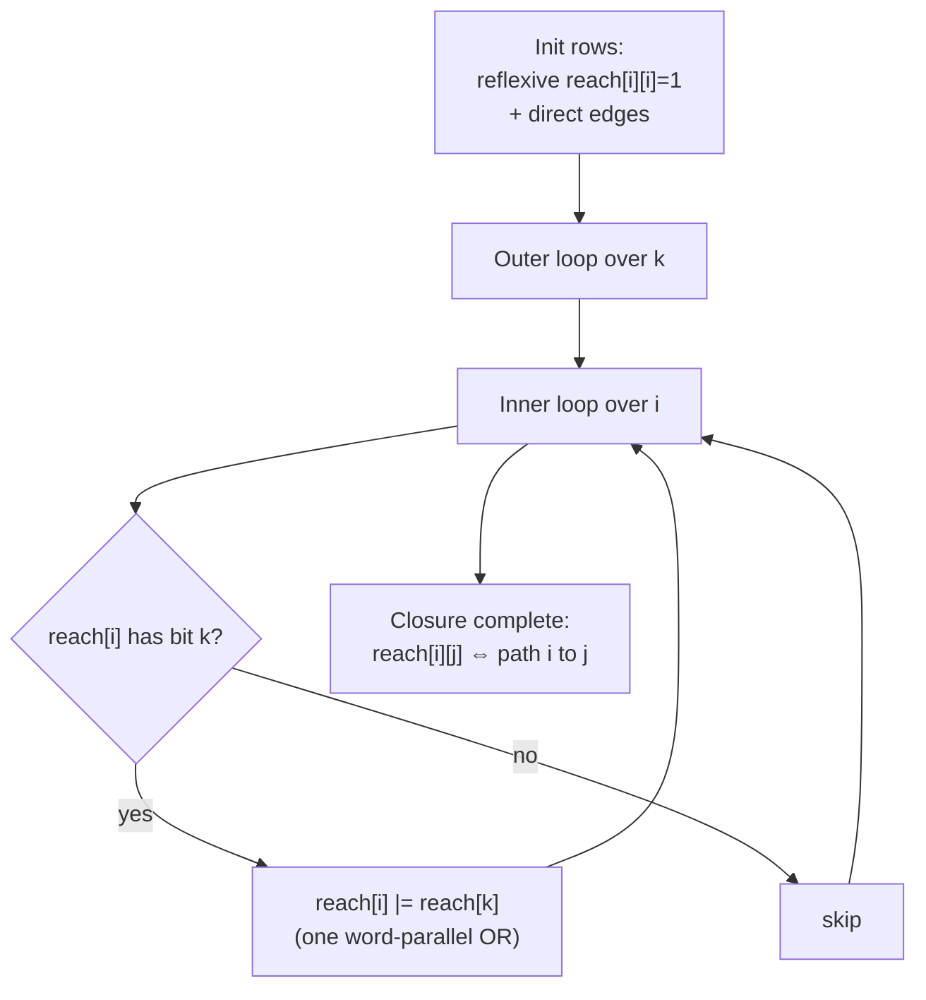

# Transitive Closure via Bitset Rows

| Field | Value |
|-------|-------|
| Source | Self-contained (classic) |
| Difficulty | Medium |
| Topics | Graphs, reachability, transitive closure, bitset optimization |
| Link | — |

---

## Problem Statement

Given a directed graph on $n$ nodes (numbered $0 \ldots n-1$) by its adjacency, compute the
**transitive closure**: an $n \times n$ boolean matrix `reach` where `reach[i][j]` is `true` iff
there is a directed path from $i$ to $j$ (a node is taken to reach itself).

We store each node's reachable set as one **bitset row**, so the whole matrix is $n$ bit-vectors of
$n$ bits each. The goal is to fill in all indirect reachabilities.

```text
Edges (directed):
    0 -> 1
    1 -> 2
    2 -> 3

Direct rows (bit j set = edge i->j):
    row0 = ...0010   (0->1)
    row1 = ...0100   (1->2)
    row2 = ...1000   (2->3)
    row3 = ...0000

Closure (reflexive + transitive):
    0 reaches {0,1,2,3}
    1 reaches {1,2,3}
    2 reaches {2,3}
    3 reaches {3}
```

---

## Approach (WHY)

The scalar Floyd–Warshall closure is

```text
for k: for i: for j:
    reach[i][j] = reach[i][j] OR (reach[i][k] AND reach[k][j])
```

which is $O(n^3)$. The inner `j`-loop only does boolean OR/AND across a full row — and that is
precisely where a bitset wins. Observe: if $i$ can reach $k$, then **every** node $k$ reaches is
also reachable from $i$. So the entire inner loop collapses to a single row OR:

$$
\text{if } reach[i][k]:\quad reach[i] \mathrel{|}= reach[k].
$$

ORing two $n$-bit rows costs $n/64$ word operations instead of $n$, so the algorithm runs in
$O(n^3 / 64)$. We first set the diagonal (`reach[i][i] = 1`) for reflexivity, then run the
$k$/$i$ double loop.

The order matters: fixing $k$ in the outer loop guarantees that when we OR `reach[k]` into
`reach[i]`, `reach[k]` already includes everything reachable through intermediates $< k$ — the
same correctness argument as Floyd–Warshall.

---

## Implementation

```python
from typing import List

def transitive_closure(n: int, edges: List[tuple]) -> List[int]:
    # reach[i] is an int bitmask: bit j set <=> i can reach j
    reach = [0] * n
    for i in range(n):
        reach[i] |= (1 << i)          # reflexive
    for u, v in edges:
        reach[u] |= (1 << v)          # direct edges
    for k in range(n):
        bit_k = 1 << k
        rk = reach[k]
        for i in range(n):
            if reach[i] & bit_k:       # i can reach k
                reach[i] |= rk          # absorb everything k reaches
    return reach

n = 4
edges = [(0, 1), (1, 2), (2, 3)]
closure = transitive_closure(n, edges)
for i, r in enumerate(closure):
    print(i, [j for j in range(n) if (r >> j) & 1])
```

```cpp
#include <bits/stdc++.h>
using namespace std;

const int N = 1024;  // compile-time upper bound on n

vector<bitset<N>> transitive_closure(int n, const vector<pair<int,int>>& edges) {
    vector<bitset<N>> reach(n);
    for (int i = 0; i < n; ++i) reach[i].set(i);    // reflexive
    for (auto& [u, v] : edges) reach[u].set(v);     // direct edges
    for (int k = 0; k < n; ++k)
        for (int i = 0; i < n; ++i)
            if (reach[i].test(k))                    // i can reach k
                reach[i] |= reach[k];                // /64 row OR
    return reach;
}

int main() {
    int n = 4;
    vector<pair<int,int>> edges = {{0,1},{1,2},{2,3}};
    auto reach = transitive_closure(n, edges);
    for (int i = 0; i < n; ++i) {
        cout << i << ":";
        for (int j = 0; j < n; ++j) if (reach[i].test(j)) cout << " " << j;
        cout << "\n";
    }
    return 0;
}
```

---

## Trace

Path graph `0 -> 1 -> 2 -> 3`, rows shown low bit = node 0:

```text
start (reflexive + direct):
    row0 = 0011   ({0,1})
    row1 = 0110   ({1,2})
    row2 = 1100   ({2,3})
    row3 = 1000   ({3})

k=0: no i (other than 0) has bit0 set -> no change
k=1: row0 has bit1 -> row0 |= row1 -> row0 = 0111 ({0,1,2})
k=2: row0 has bit2 -> row0 |= row2 -> row0 = 1111 ({0,1,2,3})
     row1 has bit2 -> row1 |= row2 -> row1 = 1110 ({1,2,3})
k=3: row0/row1/row2 already include bit3 -> no change

final:
    row0 = 1111  row1 = 1110  row2 = 1100  row3 = 1000
```

---

## Mermaid



---

## Math & Complexity

Reachability is the reflexive–transitive closure $R^{*}$ of the edge relation $R$:

$$
R^{*} = \bigcup_{k \ge 0} R^{k}, \qquad
reach[i] = \{\, j : i \rightsquigarrow j \,\}.
$$

The update rule preserves the closure invariant: after processing intermediate $k$,

$$
reach[i] \mathrel{|}= reach[k] \quad \text{whenever } k \in reach[i].
$$

With word width $w = 64$:

- **Time:** $O\!\left(\dfrac{n^3}{w}\right)$ — the $k,i$ loops are $n^2$, each doing an $O(n/w)$ row OR.
- **Space:** $O(n^2 / w)$ words to store $n$ rows.

---

## Takeaway

Transitive closure is "OR the reachable set of $k$ into anyone who reaches $k$." Storing each
reachable set as a bitset row turns the cubic triple loop into $n^2$ word-parallel ORs, an
$O(n^3/64)$ algorithm that is trivial to code and fast on dense graphs.
