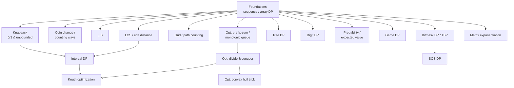

# Dynamic Programming

A complete module on **dynamic programming**, from the foundational patterns to the heavy
optimization techniques used in competitive programming. Each topic has a **concept guide**
(theory built from scratch, many Mermaid diagrams, complexity analysis, pitfalls, patterns) and
**curated problems** solved in **both Python and C++**.

## Structure

```
dynamic_programming/
├── guide/      # one concept guide per topic (diagram-heavy)
└── problems/   # one file per curated problem (Python + C++, traces, diagrams, math)
```

## Topics & Guides

| # | Topic | Guide | Key problems |
|---|-------|-------|--------------|
| 1 | Knapsack (0/1 & unbounded) | [01-knapsack.md](guide/01-knapsack.md) | 0/1 Knapsack, Unbounded Knapsack, Target Sum (494) |
| 2 | Coin change / counting ways | [02-coin-change.md](guide/02-coin-change.md) | Coin Change (322), Coin Change II (518), Ordered combinations |
| 3 | Longest Increasing Subsequence | [03-longest-increasing-subsequence.md](guide/03-longest-increasing-subsequence.md) | LIS (300), Russian Doll Envelopes (354), Bitonic subsequence |
| 4 | LCS / edit distance | [04-lcs-edit-distance.md](guide/04-lcs-edit-distance.md) | LCS (1143), Edit Distance (72), Delete Operation (583) |
| 5 | Grid / path-counting DP | [05-grid-path-counting.md](guide/05-grid-path-counting.md) | Unique Paths (62), Min Path Sum (64), Falling Path (931) |
| 6 | Sequence / array DP | [06-sequence-array-dp.md](guide/06-sequence-array-dp.md) | House Robber (198), Max Subarray (53), Decode Ways (91) |
| 7 | Interval DP | [07-interval-dp.md](guide/07-interval-dp.md) | Burst Balloons (312), Matrix Chain, Longest Palindromic Subseq (516) |
| 8 | Bitmask DP (subset, TSP) | [08-bitmask-dp.md](guide/08-bitmask-dp.md) | TSP, Shortest Path Visiting All Nodes (847), K Equal Subsets (698) |
| 9 | Tree DP | [09-tree-dp.md](guide/09-tree-dp.md) | House Robber III (337), Tree Diameter, Binary Tree Cameras (968) |
| 10 | Digit DP | [10-digit-dp.md](guide/10-digit-dp.md) | Digit-sum count, Number of Digit One (233), No consecutive equal digits |
| 11 | Probability / expected-value DP | [11-probability-expected-value-dp.md](guide/11-probability-expected-value-dp.md) | Knight Probability (688), New 21 Game (837), Expected dice rolls |
| 12 | Game DP (win/lose states) | [12-game-dp.md](guide/12-game-dp.md) | Nim Game (292), Predict the Winner (486), Stone Game (877) |
| 13 | DP opt: prefix-sum & monotonic-queue | [13-dp-opt-prefix-sum-monotonic-queue.md](guide/13-dp-opt-prefix-sum-monotonic-queue.md) | Jump Game VI (1696), Windowed max-sum, Circular Subarray (918) |
| 14 | DP opt: divide & conquer | [14-dp-opt-divide-and-conquer.md](guide/14-dp-opt-divide-and-conquer.md) | Partition cost D&C, Partition for Max Sum (1043), Min-cost k-partitions |
| 15 | DP opt: convex hull trick | [15-dp-opt-convex-hull-trick.md](guide/15-dp-opt-convex-hull-trick.md) | CHT min-linear DP, Building Bridges, Frog jump |
| 16 | DP opt: Knuth optimization | [16-dp-opt-knuth.md](guide/16-dp-opt-knuth.md) | Optimal BST, Merge Stones, File merging |
| 17 | SOS DP (sum over subsets) | [17-sos-dp.md](guide/17-sos-dp.md) | Basic SOS, Count pairs AND = 0, Superset aggregate |
| 18 | Matrix exponentiation | [18-matrix-exponentiation.md](guide/18-matrix-exponentiation.md) | Tribonacci (1137), Fibonacci matrix power, Count length-k paths |

## How the pieces fit together



## Recommended study order

1. **Sequence / array DP** (6) — the mental model: state, transition, base case, order.
2. **Knapsack** (1) and **Coin change** (2) — the canonical "choose/skip" and counting DPs.
3. **LCS / edit distance** (4) and **Grid / path-counting** (5) — 2D tables and traceback.
4. **LIS** (3) — the $O(n\log n)$ patience trick.
5. **Interval DP** (7) — `dp[i][j]` over ranges with a split point.
6. **Bitmask DP** (8), **Tree DP** (9) — DP over richer state spaces.
7. **Digit DP** (10), **Probability/EV DP** (11), **Game DP** (12) — specialized state designs.
8. **Optimizations**: prefix-sum & monotonic queue (13) → divide & conquer (14) →
   convex hull trick (15) → Knuth (16).
9. **SOS DP** (17) and **Matrix exponentiation** (18) — subset transforms and linear recurrences.

## Complexity cheat sheet

| Technique | Typical complexity | Notes |
|-----------|-------------------|-------|
| 0/1 knapsack | $O(nW)$ | 1D rolling array, weight descending |
| Unbounded knapsack / coin change | $O(nW)$ | weight ascending |
| LIS | $O(n\log n)$ | tails array + binary search |
| LCS / edit distance | $O(nm)$ | 2D table, two-row space |
| Grid path DP | $O(nm)$ | rolling row |
| Interval DP | $O(n^3)$ | $O(n^2)$ states, $O(n)$ split |
| Bitmask / TSP | $O(2^n \cdot n^2)$ | masks × endpoints |
| Tree DP | $O(n)$ | post-order DFS |
| Digit DP | $O(\text{digits} \cdot \text{states})$ | tight + leading-zero flags |
| Probability / EV DP | $O(\text{states} \cdot \text{transitions})$ | absorbing-state algebra |
| Game DP | $O(\text{states})$ | minimax / Grundy |
| Prefix-sum / monotonic queue | $O(n)$ | collapses windowed transitions |
| Divide & conquer opt | $O(kn\log n)$ | from $O(kn^2)$ via split monotonicity |
| Convex hull trick | $O(n)$ / $O(n\log n)$ | line envelope; Li Chao for arbitrary queries |
| Knuth optimization | $O(n^2)$ | from $O(n^3)$ via quadrangle inequality |
| SOS DP | $O(n \cdot 2^n)$ | subset zeta transform |
| Matrix exponentiation | $O(m^3 \log n)$ | linear recurrences / walk counts |

---

> Every code sample appears in **both Python and C++**. Problem files follow the repo format:
> meta table → statement → approach (WHY) → Python + C++ → iteration/DP-table trace → Mermaid →
> math → complexity → takeaway. Guides follow: TOC → theory → paired code → many Mermaid diagrams
> → math → complexity → pitfalls → patterns.
