# Knapsack (0/1 &amp; Unbounded) — Complete Guide

> The knapsack family is the gateway to *combinatorial* dynamic programming. You are given items with a **weight** (a cost) and a **value** (a reward), and a bag with a fixed **capacity**. You must choose a subset (0/1) or a multiset (unbounded) of items that maximizes value without exceeding capacity. Almost every "pick-or-skip under a budget" problem is a disguised knapsack, so mastering the recurrence, the rolling-array trick, and the loop-direction rule pays off across hundreds of problems.

## Table of Contents

1. [The Setup](#1-the-setup)
2. [0/1 Knapsack Recurrence](#2-01-knapsack-recurrence)
3. [The 2D Table](#3-the-2d-table)
4. [1D Rolling Array — Descending Weight](#4-1d-rolling-array--descending-weight)
5. [Unbounded Knapsack — Ascending Weight](#5-unbounded-knapsack--ascending-weight)
6. [Why Loop Direction Decides Everything](#6-why-loop-direction-decides-everything)
7. [Space Optimization](#7-space-optimization)
8. [Reconstructing the Chosen Items](#8-reconstructing-the-chosen-items)
9. [Common Variants](#9-common-variants)
10. [Complexity Summary](#10-complexity-summary)
11. [Common Pitfalls](#11-common-pitfalls)
12. [Patterns](#12-patterns)

---

## 1. The Setup

We have $n$ items. Item $i$ has weight $w_i$ and value $v_i$. The bag holds total weight at most $W$.

Define the optimum as a function of how many items we are allowed to consider and how much capacity remains. Let

$$
dp[i][c] = \text{best value using the first } i \text{ items with capacity } c.
$$

The answer is $dp[n][W]$. Everything below is a way to fill this function efficiently.

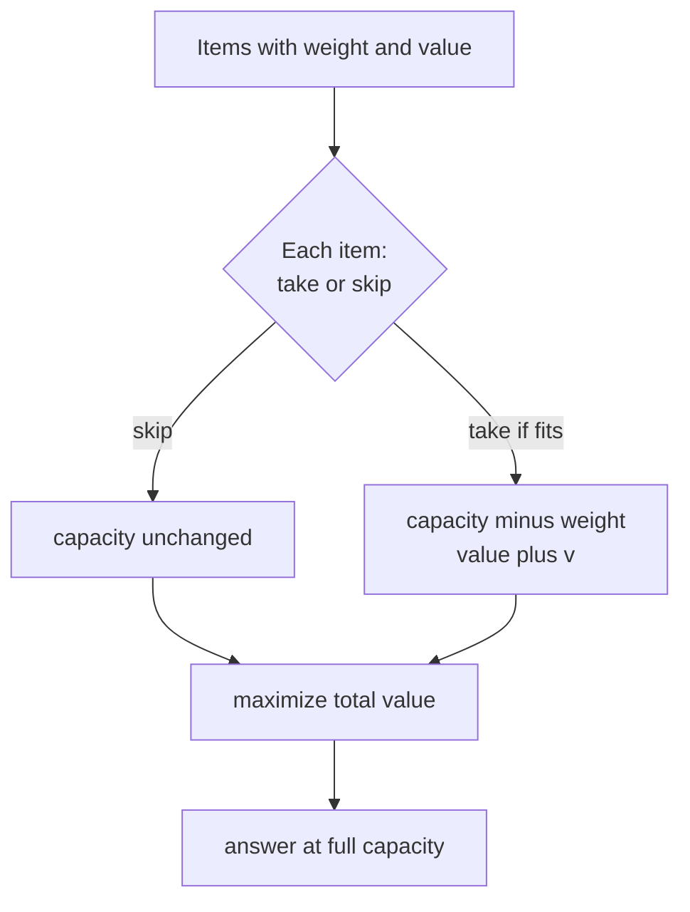

---

## 2. 0/1 Knapsack Recurrence

In **0/1** knapsack each item is used **at most once**. Consider item $i$ (1-indexed). Two choices:

- **Skip it:** value is $dp[i-1][c]$.
- **Take it** (only if $w_i \le c$): value is $dp[i-1][c - w_i] + v_i$.

We take the better of the two:

$$
dp[i][c] =
\begin{cases}
dp[i-1][c] & \text{if } w_i &gt; c \\[4pt]
\max\big(dp[i-1][c],\; dp[i-1][c - w_i] + v_i\big) & \text{if } w_i \le c
\end{cases}
$$

Base case: $dp[0][c] = 0$ for all $c$ (no items, no value).

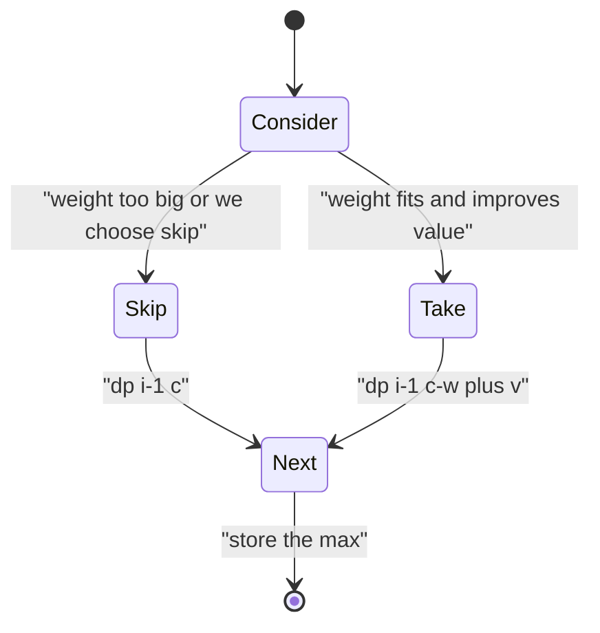

```python
def knap01_2d(weights, values, W):
    n = len(weights)
    dp = [[0] * (W + 1) for _ in range(n + 1)]
    for i in range(1, n + 1):
        w, v = weights[i - 1], values[i - 1]
        for c in range(W + 1):
            dp[i][c] = dp[i - 1][c]
            if w <= c:
                dp[i][c] = max(dp[i][c], dp[i - 1][c - w] + v)
    return dp[n][W]
```

```cpp
#include <bits/stdc++.h>
using namespace std;

long long knap01_2d(vector<long long> weights, vector<long long> values, long long W) {
    int n = weights.size();
    vector<vector<long long>> dp(n + 1, vector<long long>(W + 1, 0));
    for (int i = 1; i <= n; i++) {
        long long w = weights[i - 1], v = values[i - 1];
        for (long long c = 0; c <= W; c++) {
            dp[i][c] = dp[i - 1][c];
            if (w <= c)
                dp[i][c] = max(dp[i][c], dp[i - 1][c - w] + v);
        }
    }
    return dp[n][W];
}
```

---

## 3. The 2D Table

It helps to *see* the table. Rows are items, columns are capacities $0 \dots W$. Each cell looks **up** (skip) and **up-and-left by $w_i$** (take).

Example items: $(w,v) = (1,1),\,(3,4),\,(4,5),\,(5,7)$ with $W = 7$.

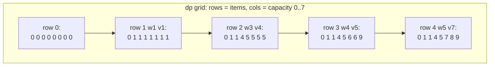

The arrows show data dependency: every row only reads the row directly above it. That single observation is what lets us collapse the table to one row.

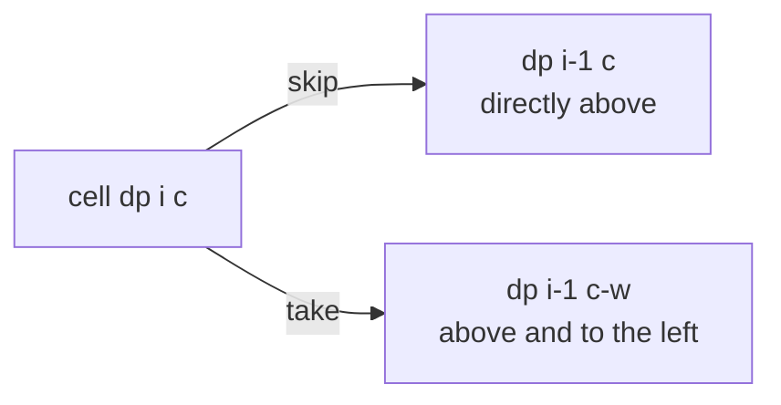

---

## 4. 1D Rolling Array — Descending Weight

Since row $i$ depends only on row $i-1$, keep a single array $dp[c]$ and overwrite it in place. The **catch**: for 0/1 knapsack we must iterate capacity **from high to low**.

Why? When we compute $dp[c]$ we want $dp[c - w]$ to still hold the value from the **previous** item row (item not yet taken). If we walked $c$ ascending, $dp[c - w]$ would already include the current item, allowing us to take it twice — that is the *unbounded* behavior, not 0/1.

$$
dp[c] = \max\big(dp[c],\; dp[c - w_i] + v_i\big), \quad c = W, W-1, \dots, w_i
$$

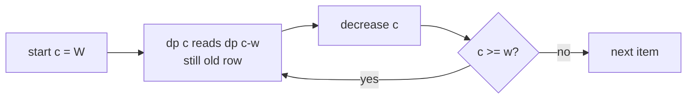

```python
def knap01_1d(weights, values, W):
    dp = [0] * (W + 1)
    for w, v in zip(weights, values):
        for c in range(W, w - 1, -1):      # DESCENDING
            dp[c] = max(dp[c], dp[c - w] + v)
    return dp[W]
```

```cpp
#include <bits/stdc++.h>
using namespace std;

long long knap01_1d(vector<long long> weights, vector<long long> values, long long W) {
    vector<long long> dp(W + 1, 0);
    for (size_t i = 0; i < weights.size(); i++) {
        long long w = weights[i], v = values[i];
        for (long long c = W; c >= w; c--)   // DESCENDING
            dp[c] = max(dp[c], dp[c - w] + v);
    }
    return dp[W];
}
```

---

## 5. Unbounded Knapsack — Ascending Weight

In **unbounded** knapsack each item may be used **any number of times**. The recurrence reuses the **current** row because re-taking the same item is allowed:

$$
dp[c] = \max\big(dp[c],\; dp[c - w_i] + v_i\big), \quad c = w_i, w_i + 1, \dots, W
$$

Same line of code as 0/1 — only the **loop direction flips to ascending**. Walking $c$ upward means $dp[c - w]$ may already include item $i$, so item $i$ can be picked repeatedly.

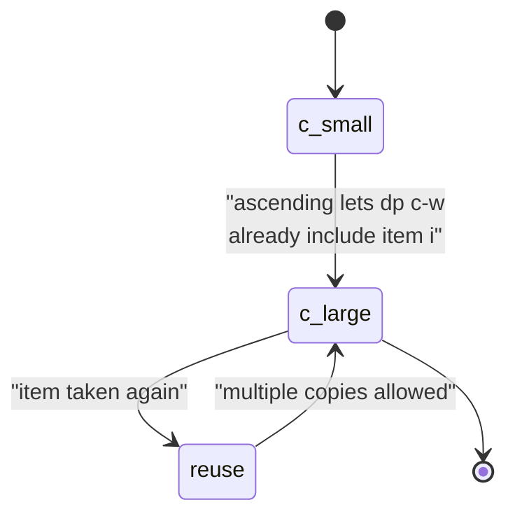

```python
def knap_unbounded(weights, values, W):
    dp = [0] * (W + 1)
    for w, v in zip(weights, values):
        for c in range(w, W + 1):          # ASCENDING
            dp[c] = max(dp[c], dp[c - w] + v)
    return dp[W]
```

```cpp
#include <bits/stdc++.h>
using namespace std;

long long knap_unbounded(vector<long long> weights, vector<long long> values, long long W) {
    vector<long long> dp(W + 1, 0);
    for (size_t i = 0; i < weights.size(); i++) {
        long long w = weights[i], v = values[i];
        for (long long c = w; c <= W; c++)   // ASCENDING
            dp[c] = max(dp[c], dp[c - w] + v);
    }
    return dp[W];
}
```

---

## 6. Why Loop Direction Decides Everything

The single most important idea in this guide: **the same one-line update produces 0/1 or unbounded depending only on the loop direction.**

| Goal | Capacity loop | Reason |
| --- | --- | --- |
| 0/1 (use once) | descending `W → w` | `dp[c-w]` stays at the previous item's value |
| Unbounded (reuse) | ascending `w → W` | `dp[c-w]` may already include item $i$ |

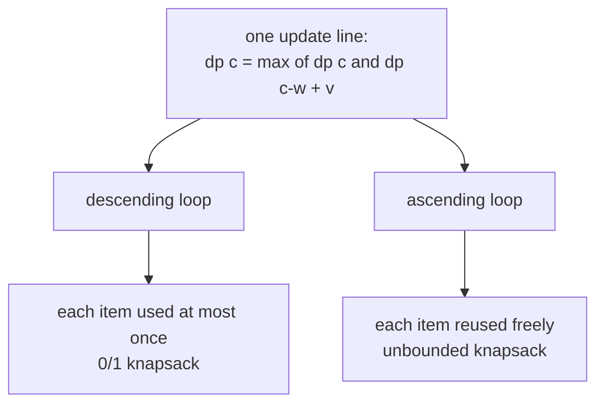

If you remember nothing else, remember this picture.

---

## 7. Space Optimization

The 2D table costs $O(nW)$ memory. The rolling array drops it to $O(W)$ because only the prior row is ever read. For very large $W$ but small total value $V$, you can instead index the DP by **value** and store the **minimum weight** to reach it — an $O(nV)$ alternative used when $W$ is astronomically large.

$$
\text{memory: } O(nW) \;\longrightarrow\; O(W)
$$

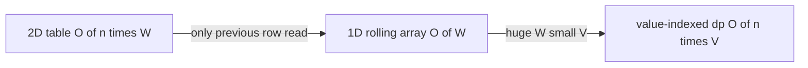

```python
def knap01_by_value(weights, values, W):
    V = sum(values)
    INF = float("inf")
    # min_w[v] = minimum weight to achieve exactly value v
    min_w = [INF] * (V + 1)
    min_w[0] = 0
    for w, v in zip(weights, values):
        for val in range(V, v - 1, -1):    # DESCENDING (0/1)
            if min_w[val - v] + w < min_w[val]:
                min_w[val] = min_w[val - v] + w
    best = 0
    for val in range(V + 1):
        if min_w[val] <= W:
            best = val
    return best
```

```cpp
#include <bits/stdc++.h>
using namespace std;

long long knap01_by_value(vector<long long> weights, vector<long long> values, long long W) {
    long long V = 0;
    for (long long v : values) V += v;
    const long long INF = 1e18;
    vector<long long> min_w(V + 1, INF);
    min_w[0] = 0;
    for (size_t i = 0; i < weights.size(); i++) {
        long long w = weights[i], v = values[i];
        for (long long val = V; val >= v; val--)   // DESCENDING (0/1)
            if (min_w[val - v] + w < min_w[val])
                min_w[val] = min_w[val - v] + w;
    }
    long long best = 0;
    for (long long val = 0; val <= V; val++)
        if (min_w[val] <= W) best = val;
    return best;
}
```

---

## 8. Reconstructing the Chosen Items

The optimum value is rarely enough — we often need *which* items were chosen. Keep the full 2D table and walk **backwards**: at $dp[i][c]$, if it equals $dp[i-1][c]$ the item was skipped; otherwise it was taken, so subtract its weight and value.

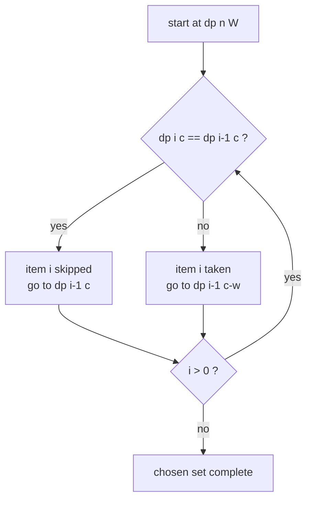

```python
def knap01_reconstruct(weights, values, W):
    n = len(weights)
    dp = [[0] * (W + 1) for _ in range(n + 1)]
    for i in range(1, n + 1):
        w, v = weights[i - 1], values[i - 1]
        for c in range(W + 1):
            dp[i][c] = dp[i - 1][c]
            if w <= c:
                dp[i][c] = max(dp[i][c], dp[i - 1][c - w] + v)
    chosen, c = [], W
    for i in range(n, 0, -1):
        if dp[i][c] != dp[i - 1][c]:
            chosen.append(i - 1)           # this item was taken
            c -= weights[i - 1]
    chosen.reverse()
    return dp[n][W], chosen
```

```cpp
#include <bits/stdc++.h>
using namespace std;

pair<long long, vector<int>> knap01_reconstruct(vector<long long> weights, vector<long long> values, long long W) {
    int n = weights.size();
    vector<vector<long long>> dp(n + 1, vector<long long>(W + 1, 0));
    for (int i = 1; i <= n; i++) {
        long long w = weights[i - 1], v = values[i - 1];
        for (long long c = 0; c <= W; c++) {
            dp[i][c] = dp[i - 1][c];
            if (w <= c)
                dp[i][c] = max(dp[i][c], dp[i - 1][c - w] + v);
        }
    }
    vector<int> chosen;
    long long c = W;
    for (int i = n; i >= 1; i--) {
        if (dp[i][c] != dp[i - 1][c]) {
            chosen.push_back(i - 1);        // this item was taken
            c -= weights[i - 1];
        }
    }
    reverse(chosen.begin(), chosen.end());
    return {dp[n][W], chosen};
}
```

---

## 9. Common Variants

Knapsack is a *template*. Swap the objective or the meaning of the table and you cover a huge family:

- **Subset-sum / partition:** value = weight; ask whether some capacity is *exactly* reachable (boolean DP).
- **Counting subsets (Target Sum, coin combinations):** replace `max` with `+` to **count** ways instead of maximizing.
- **Coin change (min coins):** unbounded knapsack with `min` and an $+\infty$ sentinel.
- **Bounded knapsack:** each item has a count $k_i$; use binary splitting to turn it into 0/1.

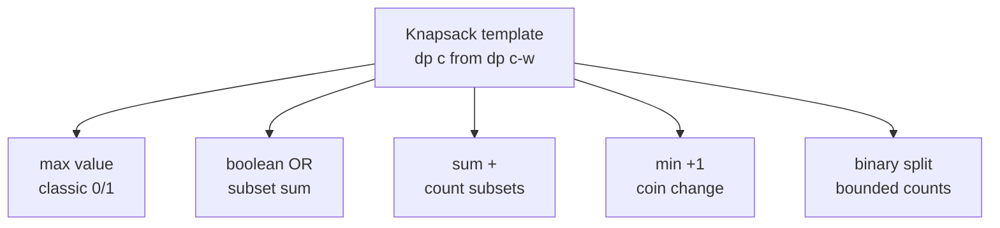

The boolean **subset-sum** variant (which file 4 reduces to) replaces `max` with logical OR:

$$
reach[c] = reach[c] \;\lor\; reach[c - w_i]
$$

```python
def subset_sum(nums, target):
    dp = [False] * (target + 1)
    dp[0] = True
    for x in nums:
        for c in range(target, x - 1, -1):  # DESCENDING (0/1)
            if dp[c - x]:
                dp[c] = True
    return dp[target]
```

```cpp
#include <bits/stdc++.h>
using namespace std;

bool subset_sum(vector<long long> nums, long long target) {
    vector<char> dp(target + 1, false);
    dp[0] = true;
    for (long long x : nums)
        for (long long c = target; c >= x; c--)  // DESCENDING (0/1)
            if (dp[c - x]) dp[c] = true;
    return dp[target];
}
```

A quick mental model of how value grows with capacity for the running example:

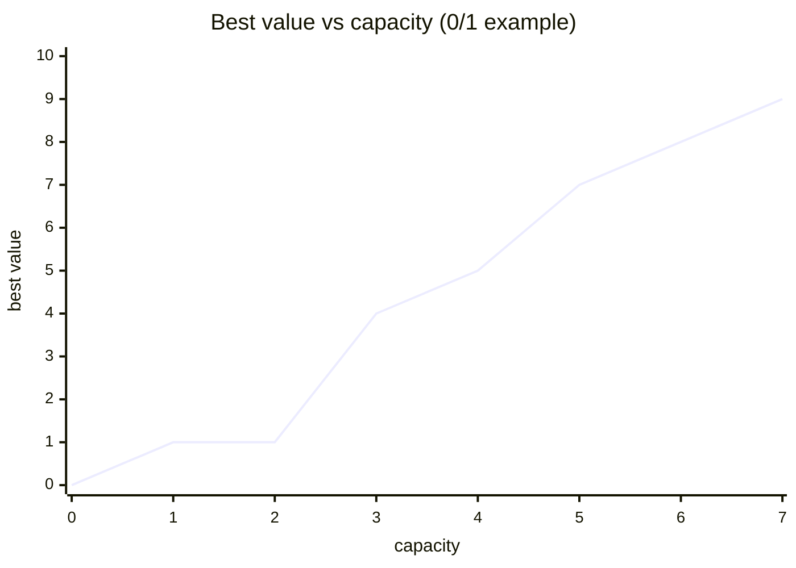

---

## 10. Complexity Summary

| Approach | Time | Space | Item reuse |
| --- | --- | --- | --- |
| 0/1 2D table | $O(nW)$ | $O(nW)$ | once |
| 0/1 rolling array | $O(nW)$ | $O(W)$ | once |
| Unbounded rolling array | $O(nW)$ | $O(W)$ | unlimited |
| Value-indexed (huge $W$) | $O(nV)$ | $O(V)$ | once |
| Reconstruction | $O(nW)$ | $O(nW)$ | once |

Here $n$ = number of items, $W$ = capacity, $V$ = total value. All are **pseudo-polynomial** — linear in the numeric value of $W$, not in its bit length.

---

## 11. Common Pitfalls

- **Wrong loop direction.** Ascending capacity in a 0/1 problem silently turns it into unbounded. Descending in an unbounded problem forbids reuse. This is the #1 bug.
- **Iterating items in the inner loop.** For the *count combinations* variant, items must be the **outer** loop or you over-count permutations.
- **Forgetting the base case.** $dp[0] = 0$ for max problems, `dp[0] = True` for subset-sum, `dp[0] = 1` for counting.
- **Integer overflow.** Counting DP and value sums can exceed 32 bits — use `long long`.
- **Off-by-one in the descending bound.** The C++ loop must be `c >= w`, not `c > w`; the item of weight exactly $c$ must still fit.
- **Negative or zero weights.** A zero-weight item with positive value in unbounded knapsack creates an infinite loop of free value — handle separately.

---

## 12. Patterns

- **"Pick or skip under a budget"** → 0/1 knapsack, descending capacity.
- **"Unlimited copies / make change"** → unbounded knapsack, ascending capacity.
- **"Exactly reach a target"** → subset-sum boolean DP.
- **"Count the number of ways"** → swap `max` for `+`, mind item/capacity loop order.
- **"Minimize count to hit a target"** → `min` DP with an infinity sentinel.
- **"Need the actual items"** → keep the 2D table and backtrack.
- **"Capacity is enormous but values are small"** → flip the table to be value-indexed.
