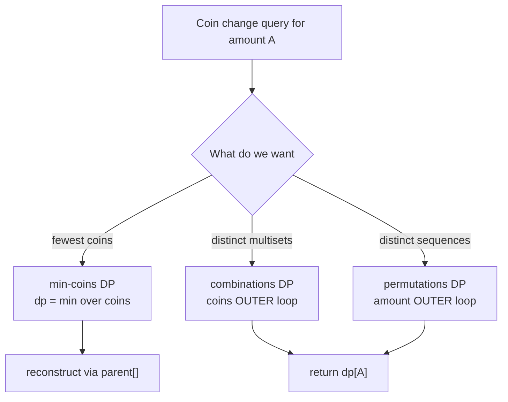
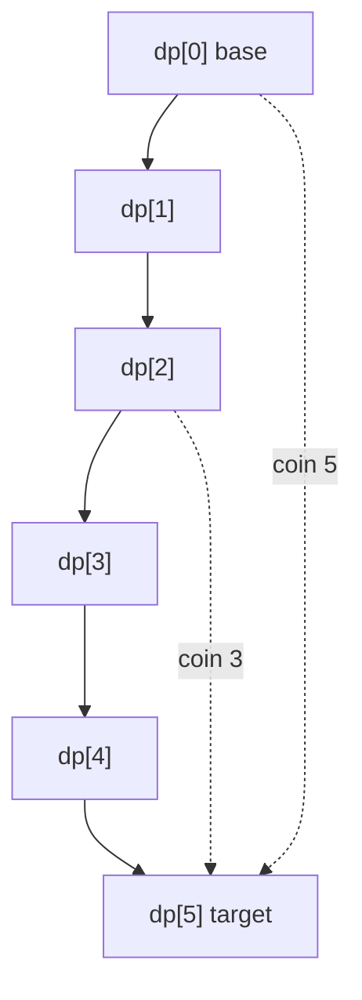
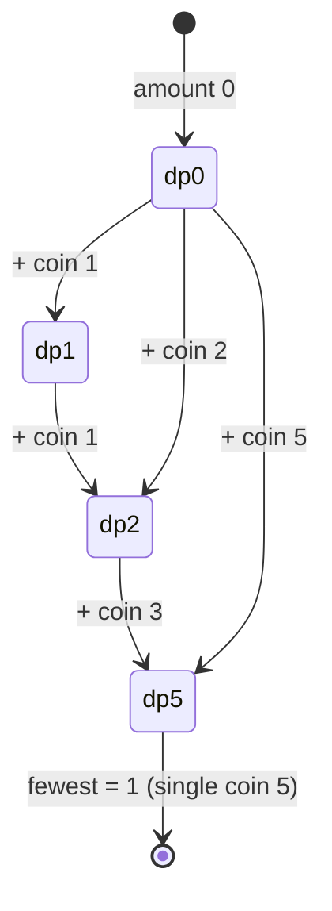
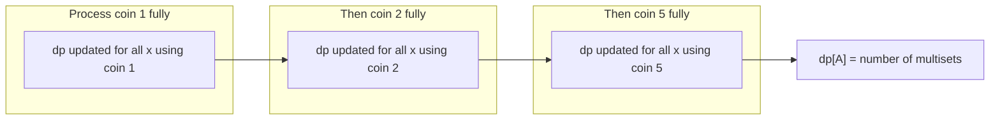
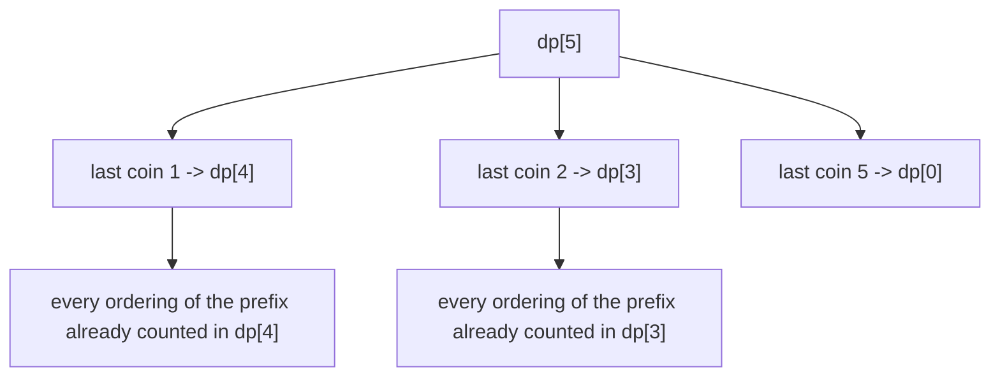
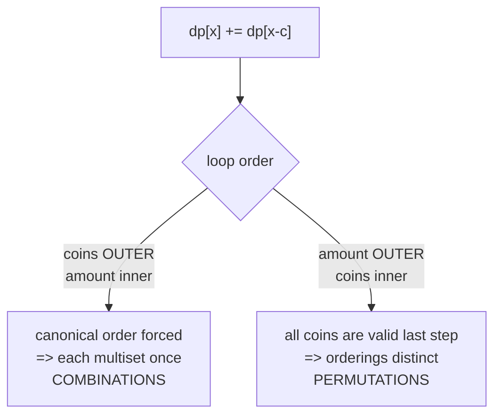
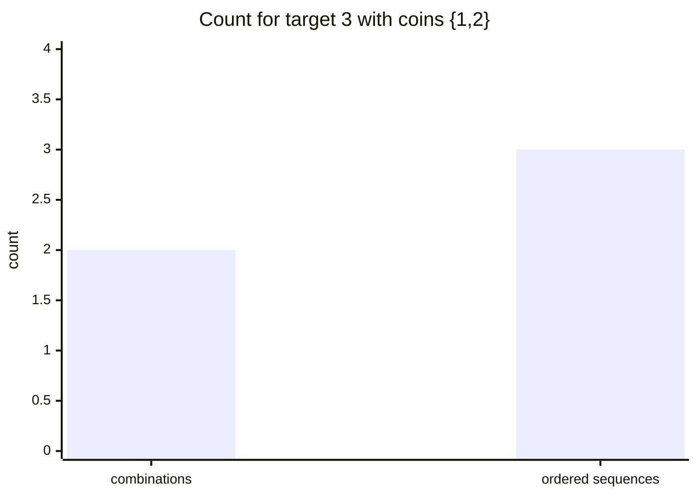
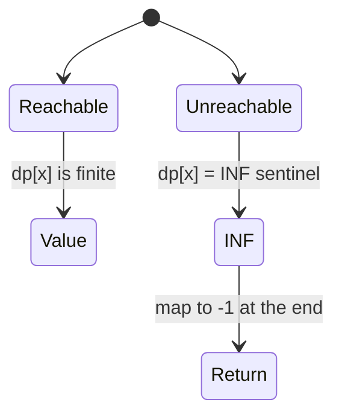
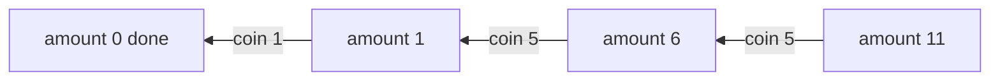

# Coin Change / Counting Ways

> The coin-change family is the canonical playground for **unbounded knapsack** dynamic
> programming. With a single 1D table and a clever choice of loop order, you can answer three
> very different questions: *what is the fewest coins?*, *how many distinct combinations?*, and
> *how many ordered sequences?* This guide builds all three from first principles, dwells on the
> **loop-order subtlety** that trips up almost everyone, and shows how to reconstruct an actual
> answer.

---

## Table of Contents
- [The Three Questions](#the-three-questions)
- [Setup and Notation](#setup-and-notation)
- [Minimum Coins (Unbounded)](#minimum-coins-unbounded)
- [Counting Combinations (Coins Outer)](#counting-combinations-coins-outer)
- [Counting Ordered Sequences (Amount Outer)](#counting-ordered-sequences-amount-outer)
- [Why Loop Order Decides Combinations vs Permutations](#why-loop-order-decides-combinations-vs-permutations)
- [INF Sentinel Handling](#inf-sentinel-handling)
- [Reconstruction](#reconstruction)
- [Complexity Summary](#complexity-summary)
- [Common Pitfalls](#common-pitfalls)
- [Patterns](#patterns)

---

## The Three Questions

Given coin denominations $C = \{c_1, c_2, \dots, c_k\}$ (each usable an **unlimited** number of
times) and a target amount $A$:

| # | Question | Answer type | Loop order |
|---|----------|-------------|------------|
| 1 | Fewest coins to make $A$ | minimization | either order works |
| 2 | Number of **combinations** (order ignored) | counting | **coins outer**, amount inner |
| 3 | Number of **ordered sequences** (order matters) | counting | **amount outer**, coins inner |



The astonishing part: questions 2 and 3 use **identical arithmetic** — only the order of two
nested loops changes the meaning of the answer. Understanding *why* is the heart of this topic.

---

## Setup and Notation

Let $dp[x]$ be the quantity we care about for sub-amount $x$, for $0 \le x \le A$.

The base case is always the empty amount:

$$
dp[0] = \begin{cases} 0 & \text{(min coins: zero coins make amount } 0\text{)} \\ 1 & \text{(counting: exactly one way — choose nothing)} \end{cases}
$$

Every transition considers picking one coin $c$ and reducing the problem to $x - c$:

$$
x \;\longrightarrow\; x - c \quad\text{whenever } x \ge c.
$$



---

## Minimum Coins (Unbounded)

We want the **fewest** coins summing to exactly $A$. The recurrence:

$$
dp[x] = \min_{c \in C,\; c \le x} \big( dp[x - c] + 1 \big), \qquad dp[0] = 0.
$$

If no coin combination reaches $x$, then $dp[x] = \infty$ (a sentinel).

```python
import math

def min_coins(coins, amount):
    INF = math.inf
    dp = [0] + [INF] * amount          # dp[0] = 0, rest unreachable
    for x in range(1, amount + 1):
        for c in coins:
            if c <= x and dp[x - c] + 1 < dp[x]:
                dp[x] = dp[x - c] + 1
    return -1 if dp[amount] == INF else dp[amount]
```

```cpp
#include <bits/stdc++.h>
using namespace std;

int min_coins(vector<int>& coins, int amount) {
    const long long INF = LLONG_MAX / 4;
    vector<long long> dp(amount + 1, INF);
    dp[0] = 0;                          // base case
    for (int x = 1; x <= amount; x++) {
        for (int c : coins) {
            if (c <= x && dp[x - c] + 1 < dp[x])
                dp[x] = dp[x - c] + 1;
        }
    }
    return dp[amount] == INF ? -1 : (int)dp[amount];
}
```

For the min-coins variant the loop order does **not** matter: $\min$ is commutative and
associative, so any visiting order of `(x, c)` that respects `x - c < x` converges to the same
table. We loop amount-outer here simply by convention.



---

## Counting Combinations (Coins Outer)

Now we count **distinct multisets** of coins that sum to $A$. Order does not matter:
$\{1,2\}$ and $\{2,1\}$ are the **same** combination and must be counted once.

$$
dp[x] \mathrel{+}= dp[x - c] \quad\text{for each coin } c, \qquad dp[0] = 1.
$$

The crucial structural choice: **coins on the OUTER loop, amount on the INNER loop.**

```python
def count_combinations(coins, amount):
    dp = [0] * (amount + 1)
    dp[0] = 1                           # one way to make 0: pick nothing
    for c in coins:                     # COINS OUTER
        for x in range(c, amount + 1):  # amount inner
            dp[x] += dp[x - c]
    return dp[amount]
```

```cpp
#include <bits/stdc++.h>
using namespace std;

long long count_combinations(vector<int>& coins, int amount) {
    vector<long long> dp(amount + 1, 0);
    dp[0] = 1;                              // base case
    for (int c : coins) {                   // COINS OUTER
        for (int x = c; x <= amount; x++) { // amount inner
            dp[x] += dp[x - c];
        }
    }
    return dp[amount];
}
```

By fixing one coin entirely before moving on to the next, we impose a **canonical order**: every
combination is built using coin $c_1$ as many times as it appears, *then* coin $c_2$, and so on.
There is exactly one such canonical ordering per multiset, so each combination is counted once.



---

## Counting Ordered Sequences (Amount Outer)

Now order **matters**: $(1,2)$ and $(2,1)$ are two **different** sequences. This counts the number
of ordered tuples of coins whose sum is $A$ (sometimes called *compositions* or *staircase*
counting, as in climbing-stairs style problems).

$$
dp[x] \mathrel{+}= dp[x - c] \quad\text{for each coin } c, \qquad dp[0] = 1.
$$

The arithmetic is **identical** to combinations — but we swap the loops:
**amount on the OUTER loop, coins on the INNER loop.**

```python
def count_sequences(coins, amount):
    dp = [0] * (amount + 1)
    dp[0] = 1
    for x in range(1, amount + 1):      # AMOUNT OUTER
        for c in coins:                 # coins inner
            if c <= x:
                dp[x] += dp[x - c]
    return dp[amount]
```

```cpp
#include <bits/stdc++.h>
using namespace std;

long long count_sequences(vector<int>& coins, int amount) {
    vector<long long> dp(amount + 1, 0);
    dp[0] = 1;
    for (int x = 1; x <= amount; x++) {  // AMOUNT OUTER
        for (int c : coins) {            // coins inner
            if (c <= x)
                dp[x] += dp[x - c];
        }
    }
    return dp[amount];
}
```

Because at each amount $x$ we consider **every** coin as the *last* coin added, sequences ending
in different coins are kept distinct — so $(1,2)$ and $(2,1)$ are both counted.



---

## Why Loop Order Decides Combinations vs Permutations

This is the single most important idea in the whole topic. Same update
$dp[x] \mathrel{+}= dp[x-c]$, two meanings.

| Loop order | What `dp[x-c]` already contains when used | Result |
|------------|-------------------------------------------|--------|
| coins outer, amount inner | only ways using coins **processed so far** | **combinations** (unordered) |
| amount outer, coins inner | ways using **all** coins for the smaller amount | **permutations** (ordered) |

When coins are outer, coin $c$ can only ever be appended *after* the coins already iterated,
freezing a single canonical sequence per multiset. When amount is outer, every coin is a
candidate "last step" for every amount, so all orderings survive.



A concrete contrast with coins $\{1,2\}$, target $3$:



- Combinations $=2$: $\{1,1,1\}$ and $\{1,2\}$.
- Ordered sequences $=3$: $(1,1,1)$, $(1,2)$, $(2,1)$.

---

## INF Sentinel Handling

For the **min-coins** problem, unreachable amounts must hold a sentinel meaning "impossible". Two
safe choices:

- Python: `math.inf` — comparisons and `+1` stay correct (`inf + 1 == inf`).
- C++: a *large but finite* value such as `LLONG_MAX / 4`. Never use raw `LLONG_MAX`, because
  `dp[x-c] + 1` would overflow.

$$
dp[x] = \infty \iff \text{amount } x \text{ cannot be formed.}
$$

```python
import math

def reachable(coins, amount):
    INF = math.inf
    dp = [0] + [INF] * amount
    for x in range(1, amount + 1):
        best = min((dp[x - c] for c in coins if c <= x), default=INF)
        dp[x] = best + 1 if best != INF else INF
    return dp[amount] != INF             # True if amount is formable
```

```cpp
#include <bits/stdc++.h>
using namespace std;

bool reachable(vector<int>& coins, int amount) {
    const long long INF = LLONG_MAX / 4;   // finite, overflow-safe
    vector<long long> dp(amount + 1, INF);
    dp[0] = 0;
    for (int x = 1; x <= amount; x++) {
        long long best = INF;
        for (int c : coins)
            if (c <= x) best = min(best, dp[x - c]);
        if (best != INF) dp[x] = best + 1; // else stays INF
    }
    return dp[amount] != INF;
}
```

For **counting** problems the sentinel is simply $0$ — an unreachable amount has zero ways, and
zero is already the natural additive identity, so no special handling is needed.



---

## Reconstruction

Counting/min tables tell you *how many* or *how few*, but interviews often want the **actual**
coins. Store a `parent` (the coin chosen) for each amount in the min-coins DP, then walk back.

```python
import math

def min_coins_path(coins, amount):
    INF = math.inf
    dp = [0] + [INF] * amount
    parent = [-1] * (amount + 1)
    for x in range(1, amount + 1):
        for c in coins:
            if c <= x and dp[x - c] + 1 < dp[x]:
                dp[x] = dp[x - c] + 1
                parent[x] = c            # remember the coin used
    if dp[amount] == INF:
        return None
    path, x = [], amount
    while x > 0:
        path.append(parent[x])
        x -= parent[x]
    return path
```

```cpp
#include <bits/stdc++.h>
using namespace std;

vector<int> min_coins_path(vector<int>& coins, int amount) {
    const long long INF = LLONG_MAX / 4;
    vector<long long> dp(amount + 1, INF);
    vector<int> parent(amount + 1, -1);
    dp[0] = 0;
    for (int x = 1; x <= amount; x++) {
        for (int c : coins) {
            if (c <= x && dp[x - c] + 1 < dp[x]) {
                dp[x] = dp[x - c] + 1;
                parent[x] = c;           // remember the coin used
            }
        }
    }
    if (dp[amount] == INF) return {};
    vector<int> path;
    for (int x = amount; x > 0; x -= parent[x])
        path.push_back(parent[x]);
    return path;
}
```

The walk-back follows `parent` edges from $A$ down to $0$, emitting one coin per step:



---

## Complexity Summary

Let $k = |C|$ (number of coins) and $A$ the target amount.

| Variant | Recurrence | Time | Space |
|---------|-----------|------|-------|
| Min coins | $dp[x]=\min(dp[x-c]+1)$ | $O(k\cdot A)$ | $O(A)$ |
| Count combinations | $dp[x]\mathrel{+}=dp[x-c]$, coins outer | $O(k\cdot A)$ | $O(A)$ |
| Count ordered sequences | $dp[x]\mathrel{+}=dp[x-c]$, amount outer | $O(k\cdot A)$ | $O(A)$ |
| Reconstruction | adds `parent[]` | $O(k\cdot A)$ time, $O(A)$ extra | $O(A)$ |

All variants share the same asymptotic profile; only the **semantics** differ.

---

## Common Pitfalls

- **Wrong loop order.** Coins-outer counts combinations; amount-outer counts ordered sequences.
  Swapping them silently changes the answer's meaning — no error is thrown.
- **Wrong base case for counting.** `dp[0]` must be `1` (one empty way), not `0`. With `0`, the
  entire table stays zero.
- **Wrong base case for min-coins.** `dp[0]` must be `0`; everything else starts at the INF
  sentinel.
- **Overflow with raw `LLONG_MAX`.** `dp[x-c] + 1` overflows. Use `LLONG_MAX / 4` or similar.
- **Returning the sentinel.** For min-coins, remember to map INF back to `-1` (or "impossible").
- **Integer overflow in counting.** The number of combinations can be huge; prefer `long long`
  (and apply a modulus if the problem demands it).
- **Off-by-one inner range.** When coins are outer, the inner loop starts at `c` (so `x - c >= 0`),
  not at `1`.

---

## Patterns

- **Unbounded knapsack template.** Coin change *is* unbounded knapsack with value $1$ per item;
  the inner loop ascends (`c..A`) so each coin may be reused.
- **0/1 knapsack contrast.** If each coin could be used **once**, the inner loop would **descend**
  (`A..c`) to prevent reuse — a one-character change with a big consequence.
- **Combinations vs permutations switch.** Memorize: *outer loop = the dimension you do NOT want to
  double-count.* Coins outer freezes coin order (combinations); amount outer frees it
  (permutations).
- **Counting = sum, optimizing = min/max.** Swap `+=` for `min`/`max` and adjust the base case to
  morph between counting and optimization on the same skeleton.
- **Reachability as a special case.** Treat min-coins as "is it reachable?" by checking the INF
  sentinel — handy for subset-sum-style feasibility questions.
