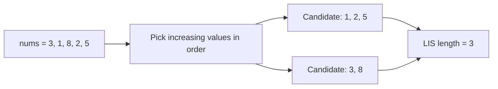
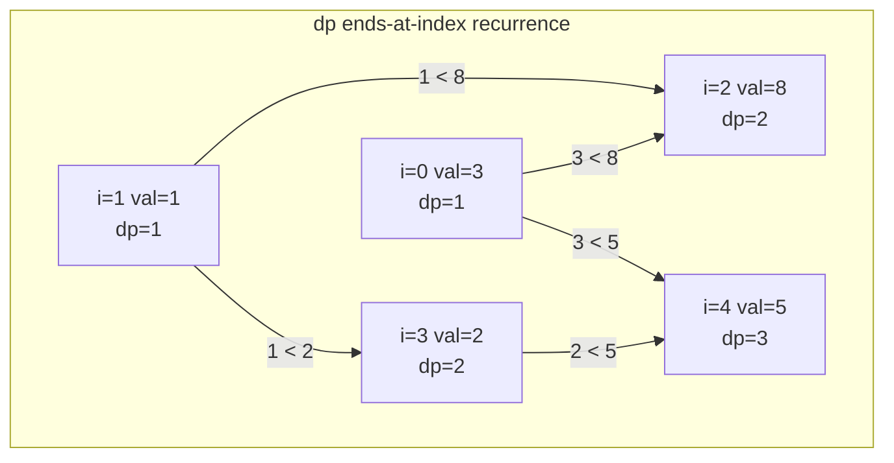
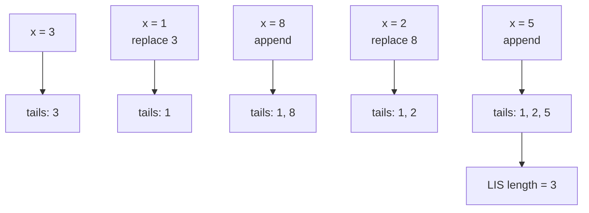
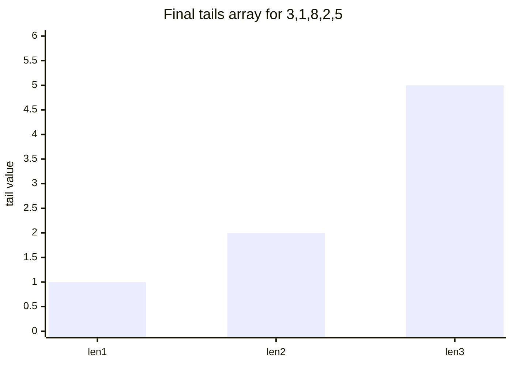
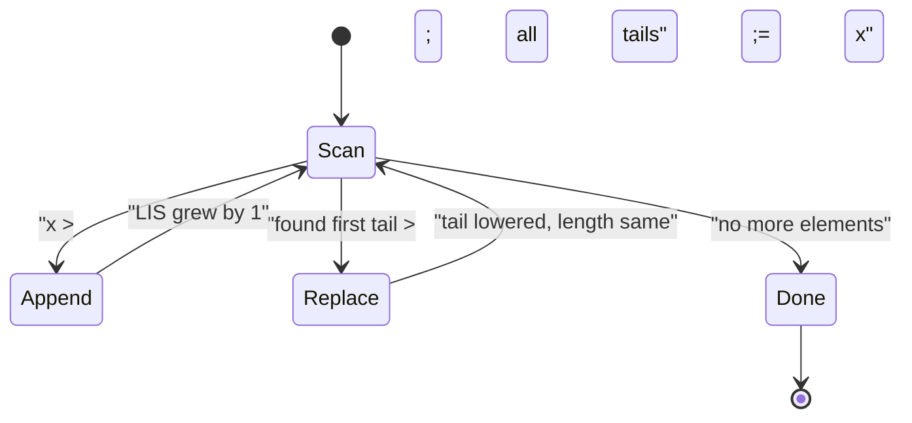
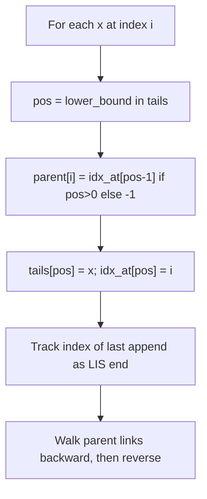
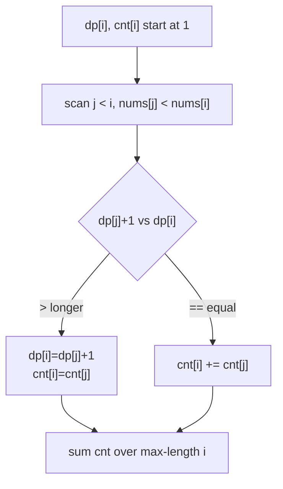
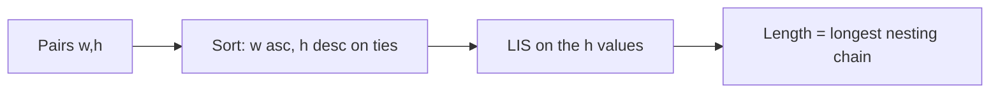

# Longest Increasing Subsequence (LIS) — Complete Guide (Beginner → Advanced)

> Given an array, the **Longest Increasing Subsequence** is the longest subsequence
> (elements kept in original order, not necessarily contiguous) whose values strictly
> increase. LIS is the gateway problem to a whole family of "ordering + optimization"
> techniques: patience sorting, `tails` arrays, binary search on a DP table, and clever
> reductions (Russian Doll Envelopes, Longest Chain, Bitonic Subsequence).
>
> This guide builds LIS from the ground up: the intuitive $O(n^2)$ DP, the elegant
> $O(n \log n)$ patience-sorting method, how to **reconstruct** the actual subsequence,
> how to **count** how many distinct LIS exist, and the most common **variants** you will
> meet in interviews and competitive programming.

---

## Table of Contents
1. [What Is a Subsequence?](#1-what-is-a-subsequence)
2. [The O(n^2) DP](#2-the-on2-dp)
3. [The O(n log n) Patience-Sorting / Tails Method](#3-the-on-log-n-patience-sorting--tails-method)
4. [Why Binary Search Works](#4-why-binary-search-works)
5. [Reconstructing the Actual Subsequence](#5-reconstructing-the-actual-subsequence)
6. [Counting the Number of LIS](#6-counting-the-number-of-lis)
7. [Variants: Non-Decreasing, Bitonic, Longest Chain](#7-variants-non-decreasing-bitonic-longest-chain)
8. [Complexity Summary](#complexity-summary)
9. [Common Pitfalls](#common-pitfalls)
10. [Patterns](#patterns)

---

## 1. What Is a Subsequence?

A **subsequence** is obtained by deleting zero or more elements while keeping the relative
order of the rest. For `nums = [3, 1, 8, 2, 5]`, the sequence `[3, 8]`, `[1, 2, 5]`, and
`[1, 8]` are all subsequences, but `[8, 1]` is **not** (order is broken).

An *increasing* subsequence requires every next element to be **strictly greater**:

$$
i_1 < i_2 < \dots < i_k \quad\text{and}\quad nums[i_1] < nums[i_2] < \dots < nums[i_k]
$$

The LIS of `[3, 1, 8, 2, 5]` has length $3$, e.g. `[1, 2, 5]` or `[3, 8, ...]` — wait,
`[3, 8]` is only length $2$; the best is `[1, 2, 5]`.



> **Strict vs non-strict.** "Increasing" usually means *strictly* increasing
> ($<$). If duplicates are allowed (*non-decreasing*, $\le$), only the binary-search
> bound changes — covered in [§7](#7-variants-non-decreasing-bitonic-longest-chain).

---

## 2. The O(n^2) DP

Define `dp[i]` = the length of the longest increasing subsequence that **ends exactly at
index `i`**. Every increasing subsequence ending at `i` must come from some earlier index
`j < i` with `nums[j] < nums[i]`, so:

$$
dp[i] = 1 + \max\Big(\{\,0\,\} \cup \{\, dp[j] : j < i,\; nums[j] < nums[i] \,\}\Big)
$$

The answer is $\max_i dp[i]$. Each element starts as its own subsequence of length $1$.



```python
def lis_n2(nums):
    if not nums:
        return 0
    n = len(nums)
    dp = [1] * n
    for i in range(n):
        for j in range(i):
            if nums[j] < nums[i]:
                dp[i] = max(dp[i], dp[j] + 1)
    return max(dp)
```

```cpp
#include <bits/stdc++.h>
using namespace std;

int lis_n2(const vector<int>& nums) {
    int n = (int)nums.size();
    if (n == 0) return 0;
    vector<int> dp(n, 1);
    for (int i = 0; i < n; ++i) {
        for (int j = 0; j < i; ++j) {
            if (nums[j] < nums[i]) {
                dp[i] = max(dp[i], dp[j] + 1);
            }
        }
    }
    return *max_element(dp.begin(), dp.end());
}
```

This is $O(n^2)$ time and $O(n)$ space — perfectly fine up to $n \approx 5000$. For larger
$n$ we need the next method.

---

## 3. The O(n log n) Patience-Sorting / Tails Method

Maintain an array `tails`, where `tails[k]` is the **smallest possible tail value** of any
increasing subsequence of length `k + 1` seen so far. The key invariant:

$$
\texttt{tails} \text{ is always sorted in strictly increasing order.}
$$

For each new value `x`:
- Binary-search the **first** position in `tails` whose value is $\ge x$.
- If found, **replace** it with `x` (a shorter-or-equal subsequence now has a smaller tail
  — better for the future).
- If not found (`x` is larger than every tail), **append** `x` (we extended the LIS).

The length of `tails` at the end equals the LIS length. Think of it as the *patience card
game*: deal cards onto piles, each pile's top is non-increasing, place a card on the
leftmost pile whose top is $\ge$ it.



Watch how `tails` evolves as a bar chart of its final state:



```python
from bisect import bisect_left

def lis_nlogn(nums):
    tails = []
    for x in nums:
        pos = bisect_left(tails, x)   # first tail >= x  (strict LIS)
        if pos == len(tails):
            tails.append(x)
        else:
            tails[pos] = x
    return len(tails)
```

```cpp
#include <bits/stdc++.h>
using namespace std;

int lis_nlogn(const vector<int>& nums) {
    vector<int> tails;
    for (int x : nums) {
        auto it = lower_bound(tails.begin(), tails.end(), x); // first >= x
        if (it == tails.end()) tails.push_back(x);
        else *it = x;
    }
    return (int)tails.size();
}
```

> **Important.** `tails` is **not** itself a valid LIS — its values can come from
> different positions. It only tracks *lengths and best tails*. To recover an actual
> subsequence, see [§5](#5-reconstructing-the-actual-subsequence).

---

## 4. Why Binary Search Works

The correctness hinges on two facts:

1. **`tails` stays sorted.** When we replace `tails[pos]` with a smaller `x`, the value at
   `pos` only decreases, and since `tails[pos-1] < x \le tails[pos]_{old}`, sortedness is
   preserved.
2. **`tails[k]` is the minimum tail for length `k+1`.** A smaller tail is never worse: any
   future element that could extend a length-`k+1` subsequence with a larger tail can also
   extend the one with the smaller tail.

Because `tails` is sorted, finding "the first element $\ge x$" is a clean binary search,
giving $O(\log n)$ per element and $O(n \log n)$ overall.



The boundary choice — `lower_bound` (first $\ge x$) vs `upper_bound` (first $> x$) — is the
**only** difference between strict and non-strict LIS:

$$
\text{strict LIS} \Rightarrow \texttt{lower\_bound}(x), \qquad
\text{non-decreasing} \Rightarrow \texttt{upper\_bound}(x)
$$

---

## 5. Reconstructing the Actual Subsequence

The $O(n \log n)$ method can also output a real subsequence if we remember, for each
element, **which length-pile it landed on** and **the predecessor** at that moment.

- `pile[i]` = the index in `tails` where `nums[i]` was placed.
- `parent[i]` = the index currently sitting at `pile - 1` when `nums[i]` was placed.

At the end, the element on the highest pile is the LIS tail; follow `parent` links back.



```python
from bisect import bisect_left

def lis_reconstruct(nums):
    if not nums:
        return []
    tails = []          # tail VALUES
    idx_at = []         # idx_at[k] = original index of tails[k]
    parent = [-1] * len(nums)
    for i, x in enumerate(nums):
        pos = bisect_left(tails, x)
        if pos > 0:
            parent[i] = idx_at[pos - 1]
        if pos == len(tails):
            tails.append(x)
            idx_at.append(i)
        else:
            tails[pos] = x
            idx_at[pos] = i
    # rebuild from the last pile's index
    seq = []
    k = idx_at[-1]
    while k != -1:
        seq.append(nums[k])
        k = parent[k]
    seq.reverse()
    return seq
```

```cpp
#include <bits/stdc++.h>
using namespace std;

vector<int> lis_reconstruct(const vector<int>& nums) {
    int n = (int)nums.size();
    if (n == 0) return {};
    vector<int> tails;          // tail values
    vector<int> idx_at;         // original index of each tail
    vector<int> parent(n, -1);
    for (int i = 0; i < n; ++i) {
        int x = nums[i];
        int pos = (int)(lower_bound(tails.begin(), tails.end(), x) - tails.begin());
        if (pos > 0) parent[i] = idx_at[pos - 1];
        if (pos == (int)tails.size()) {
            tails.push_back(x);
            idx_at.push_back(i);
        } else {
            tails[pos] = x;
            idx_at[pos] = i;
        }
    }
    vector<int> seq;
    for (int k = idx_at.back(); k != -1; k = parent[k]) seq.push_back(nums[k]);
    reverse(seq.begin(), seq.end());
    return seq;
}
```

---

## 6. Counting the Number of LIS

To count **how many distinct LIS** exist, extend the $O(n^2)$ DP with a second array
`cnt[i]` = number of LIS of maximal length ending at `i`.

For each `i`, scan `j < i` with `nums[j] < nums[i]`:
- If `dp[j] + 1 > dp[i]`: we found a strictly longer subsequence — set
  `dp[i] = dp[j] + 1` and `cnt[i] = cnt[j]`.
- If `dp[j] + 1 == dp[i]`: another way to reach the same length — `cnt[i] += cnt[j]`.

The answer sums `cnt[i]` over all `i` whose `dp[i]` equals the global maximum length.

$$
\text{answer} = \sum_{i\,:\,dp[i]=L} cnt[i], \qquad L = \max_i dp[i]
$$



```python
def count_lis(nums):
    if not nums:
        return 0
    n = len(nums)
    dp = [1] * n
    cnt = [1] * n
    for i in range(n):
        for j in range(i):
            if nums[j] < nums[i]:
                if dp[j] + 1 > dp[i]:
                    dp[i] = dp[j] + 1
                    cnt[i] = cnt[j]
                elif dp[j] + 1 == dp[i]:
                    cnt[i] += cnt[j]
    longest = max(dp)
    return sum(c for d, c in zip(dp, cnt) if d == longest)
```

```cpp
#include <bits/stdc++.h>
using namespace std;

int count_lis(const vector<int>& nums) {
    int n = (int)nums.size();
    if (n == 0) return 0;
    vector<int> dp(n, 1), cnt(n, 1);
    for (int i = 0; i < n; ++i) {
        for (int j = 0; j < i; ++j) {
            if (nums[j] < nums[i]) {
                if (dp[j] + 1 > dp[i]) {
                    dp[i] = dp[j] + 1;
                    cnt[i] = cnt[j];
                } else if (dp[j] + 1 == dp[i]) {
                    cnt[i] += cnt[j];
                }
            }
        }
    }
    int longest = *max_element(dp.begin(), dp.end());
    long long total = 0;
    for (int i = 0; i < n; ++i) if (dp[i] == longest) total += cnt[i];
    return (int)total;
}
```

---

## 7. Variants: Non-Decreasing, Bitonic, Longest Chain

**Longest non-decreasing subsequence.** Allow equal values ($\le$). Swap `lower_bound`
for `upper_bound` in the $O(n \log n)$ method (or `<` for `<=` in the $O(n^2)$ DP).

```python
from bisect import bisect_right

def longest_non_decreasing(nums):
    tails = []
    for x in nums:
        pos = bisect_right(tails, x)   # first tail > x
        if pos == len(tails):
            tails.append(x)
        else:
            tails[pos] = x
    return len(tails)
```

```cpp
#include <bits/stdc++.h>
using namespace std;

int longest_non_decreasing(const vector<int>& nums) {
    vector<int> tails;
    for (int x : nums) {
        auto it = upper_bound(tails.begin(), tails.end(), x); // first > x
        if (it == tails.end()) tails.push_back(x);
        else *it = x;
    }
    return (int)tails.size();
}
```

**Longest Bitonic Subsequence.** A bitonic sequence increases then decreases. Compute LIS
ending at each `i` (`inc[i]`) and LIS of the *reversed* tail (`dec[i]`), then maximize
`inc[i] + dec[i] - 1` (the peak is counted twice).

$$
\text{bitonic} = \max_i \big( inc[i] + dec[i] - 1 \big)
$$

```python
def longest_bitonic(nums):
    n = len(nums)
    if n == 0:
        return 0
    inc = [1] * n
    dec = [1] * n
    for i in range(n):
        for j in range(i):
            if nums[j] < nums[i]:
                inc[i] = max(inc[i], inc[j] + 1)
    for i in range(n - 1, -1, -1):
        for j in range(i + 1, n):
            if nums[j] < nums[i]:
                dec[i] = max(dec[i], dec[j] + 1)
    return max(inc[i] + dec[i] - 1 for i in range(n))
```

```cpp
#include <bits/stdc++.h>
using namespace std;

int longest_bitonic(const vector<int>& nums) {
    int n = (int)nums.size();
    if (n == 0) return 0;
    vector<int> inc(n, 1), dec(n, 1);
    for (int i = 0; i < n; ++i)
        for (int j = 0; j < i; ++j)
            if (nums[j] < nums[i]) inc[i] = max(inc[i], inc[j] + 1);
    for (int i = n - 1; i >= 0; --i)
        for (int j = i + 1; j < n; ++j)
            if (nums[j] < nums[i]) dec[i] = max(dec[i], dec[j] + 1);
    int best = 0;
    for (int i = 0; i < n; ++i) best = max(best, inc[i] + dec[i] - 1);
    return best;
}
```

**Longest Chain (e.g. Russian Doll Envelopes).** Each item is a pair; one can nest in
another only if **both** coordinates strictly increase. Sort by the first coordinate
ascending and — for ties — by the second coordinate **descending**, then run LIS on the
second coordinate. The descending tie-break forbids two equal first-coordinates from both
being chosen.



```python
from bisect import bisect_left

def longest_chain(pairs):
    pairs.sort(key=lambda p: (p[0], -p[1]))
    tails = []
    for _, h in pairs:
        pos = bisect_left(tails, h)
        if pos == len(tails):
            tails.append(h)
        else:
            tails[pos] = h
    return len(tails)
```

```cpp
#include <bits/stdc++.h>
using namespace std;

int longest_chain(vector<pair<int,int>>& pairs) {
    sort(pairs.begin(), pairs.end(), [](const pair<int,int>& a, const pair<int,int>& b){
        if (a.first != b.first) return a.first < b.first;
        return a.second > b.second;   // descending on ties
    });
    vector<int> tails;
    for (auto& p : pairs) {
        int h = p.second;
        auto it = lower_bound(tails.begin(), tails.end(), h);
        if (it == tails.end()) tails.push_back(h);
        else *it = h;
    }
    return (int)tails.size();
}
```

---

## Complexity Summary

| Method | Time | Space | Notes |
|--------|------|-------|-------|
| $O(n^2)$ DP | $O(n^2)$ | $O(n)$ | Easiest; also enables counting & reconstruction |
| Patience / tails | $O(n \log n)$ | $O(n)$ | Length only, unless augmented |
| Reconstruction | $O(n \log n)$ | $O(n)$ | Needs `parent` + `idx_at` arrays |
| Counting LIS | $O(n^2)$ | $O(n)$ | `dp[i]` + `cnt[i]`; can be sped with BIT |
| Bitonic | $O(n^2)$ | $O(n)$ | `inc[i] + dec[i] - 1` |
| Longest chain | $O(n \log n)$ | $O(n)$ | Sort then LIS |

---

## Common Pitfalls

- **Confusing subsequence with subarray.** LIS need not be contiguous; Kadane-style
  contiguity logic does not apply.
- **`tails` is not a real LIS.** Its values mix positions; never print it as the answer.
- **Wrong binary-search bound.** Strict LIS uses `lower_bound` (first $\ge x$);
  non-decreasing uses `upper_bound` (first $> x$). Mixing them up gives off-by-one lengths.
- **Russian Doll tie-break.** Forgetting to sort the second coordinate *descending* on
  equal first coordinates lets equal widths nest illegally.
- **Empty input.** Guard `n == 0` so `max_element` / `idx_at.back()` do not crash.
- **Overflow when counting.** Use `long long` for the count accumulator in C++.

---

## Patterns

- **"Longest ordering under a constraint"** → think LIS.
- **"Nest / chain / stack items by two keys"** → sort by one key, LIS on the other, with a
  descending tie-break to enforce strictness.
- **"Increase then decrease" / mountains / valleys** → two-directional LIS (bitonic).
- **Need the actual elements** → augment with `parent` links.
- **Need how many optimal solutions** → pair the length DP with a count DP.
- **$n$ large ($> 10^4$)** → switch from $O(n^2)$ to the $O(n \log n)$ tails method.
