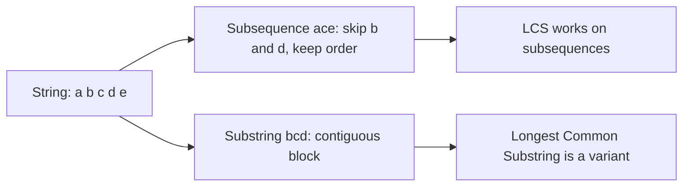
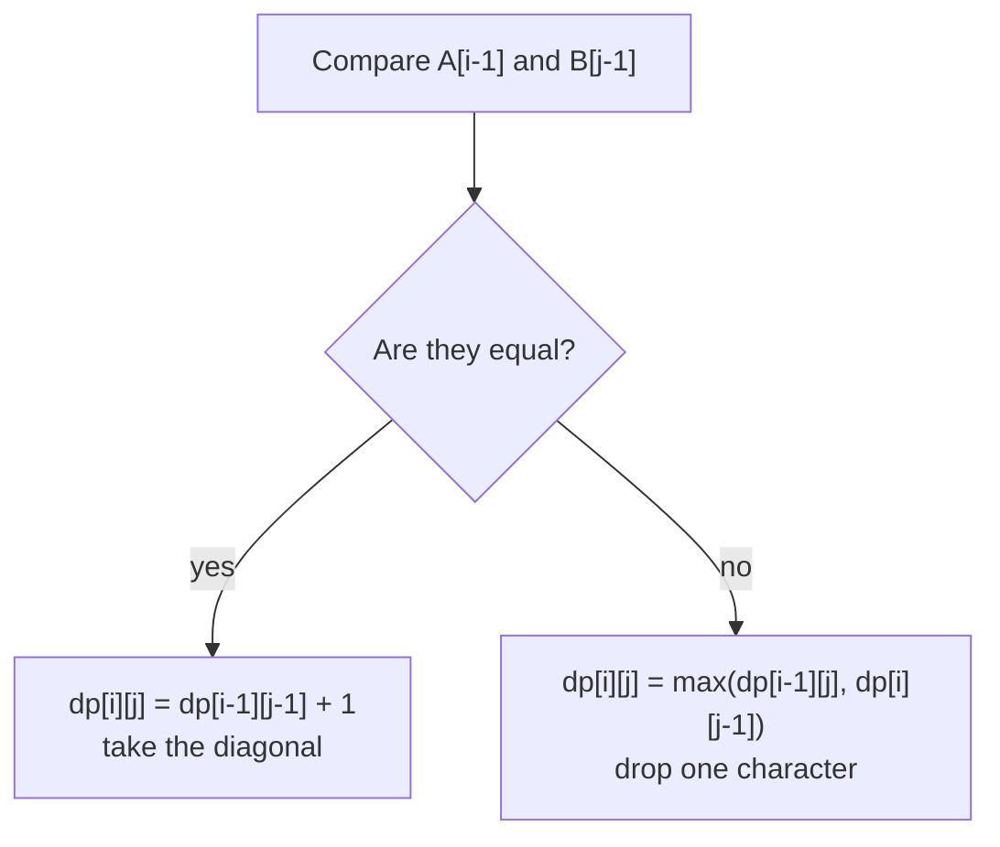
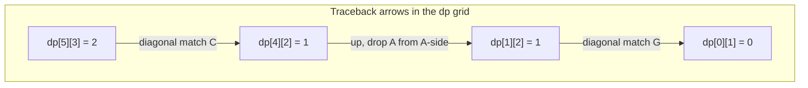
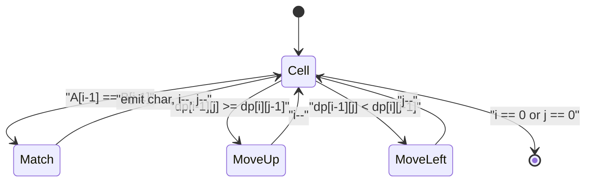
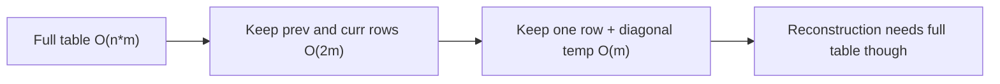
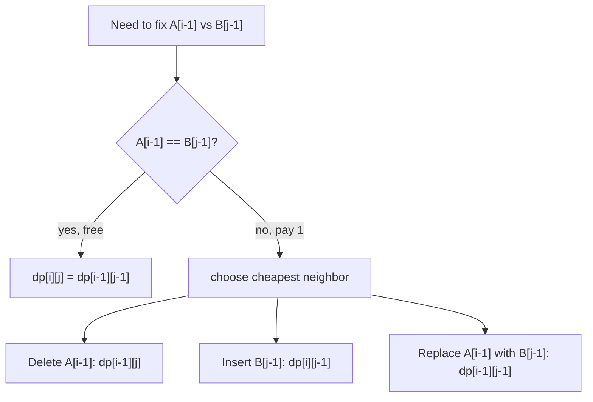
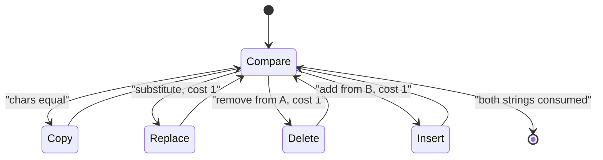
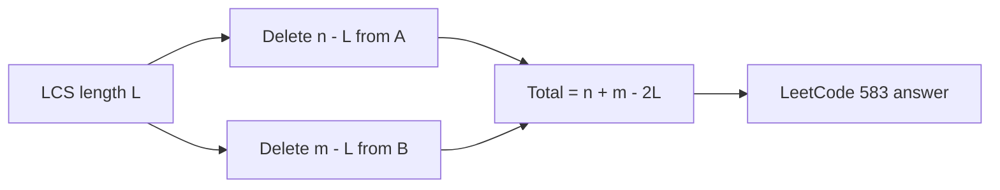
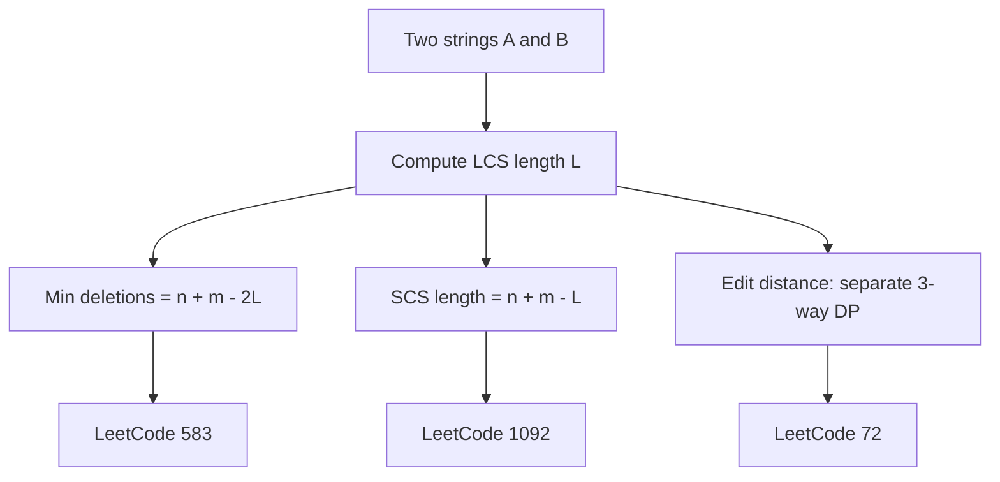

# LCS &amp; Edit Distance — Complete Guide (Beginner → Advanced)

> Two strings, a 2D grid, and a single recurrence that powers a huge family of problems:
> spell-checkers, DNA alignment, `diff` tools, autocorrect, and version control. The
> **Longest Common Subsequence (LCS)** and **Edit Distance (Levenshtein)** are the twin
> pillars of *string DP*. Master the grid once and a dozen variants fall out for free.
>
> This guide teaches you to (1) **derive the LCS recurrence** from the last two characters,
> (2) **reconstruct** the actual subsequence by walking the grid backward, (3) **shrink**
> the table from $O(nm)$ to $O(\min(n,m))$ space, (4) **transform** LCS into edit distance
> and back, and (5) recognize the broader family — longest common *substring*, shortest
> common supersequence, and minimum deletions.

---

## Table of Contents
1. [Subsequence vs Substring](#1-subsequence-vs-substring)
2. [The LCS Recurrence and 2D Table](#2-the-lcs-recurrence-and-2d-table)
3. [Reconstructing the LCS String](#3-reconstructing-the-lcs-string)
4. [Space Optimization: Two Rows → One Row](#4-space-optimization-two-rows--one-row)
5. [Edit Distance (Levenshtein)](#5-edit-distance-levenshtein)
6. [LCS and Minimum Deletions](#6-lcs-and-minimum-deletions)
7. [Variants: Substring &amp; Supersequence](#7-variants-substring--supersequence)
8. [Complexity Summary](#complexity-summary)
9. [Common Pitfalls](#common-pitfalls)
10. [Patterns](#patterns)

---

## 1. Subsequence vs Substring

A **subsequence** keeps the relative order but may skip characters; a **substring** must be
contiguous. For `"abcde"`, the string `"ace"` is a subsequence (not a substring), while
`"bcd"` is both.



Almost every two-string DP shares the same skeleton: a grid `dp[i][j]` that compares the
first $i$ characters of `A` with the first $j$ characters of `B`. The **only** thing that
changes between problems is what we store and how we combine.

---

## 2. The LCS Recurrence and 2D Table

Let `A` have length $n$ and `B` have length $m$. Define

$$
\text{dp}[i][j] = \text{length of LCS of } A[0..i-1] \text{ and } B[0..j-1].
$$

Look at the **last characters** $A[i-1]$ and $B[j-1]$. There are two cases:

$$
\text{dp}[i][j] =
\begin{cases}
\text{dp}[i-1][j-1] + 1 & \text{if } A[i-1] = B[j-1] \\[4pt]
\max\big(\text{dp}[i-1][j],\ \text{dp}[i][j-1]\big) & \text{otherwise}
\end{cases}
$$

The intuition: if the last characters match, they can both belong to the LCS, so we extend
the diagonal answer by one. If they differ, at least one of them is *not* in the LCS, so we
drop one character from either string and take the better result.



The base case is `dp[0][j] = dp[i][0] = 0`: an empty string shares nothing.

```python
def lcs_length(a: str, b: str) -> int:
    n, m = len(a), len(b)
    dp = [[0] * (m + 1) for _ in range(n + 1)]
    for i in range(1, n + 1):
        for j in range(1, m + 1):
            if a[i - 1] == b[j - 1]:
                dp[i][j] = dp[i - 1][j - 1] + 1
            else:
                dp[i][j] = max(dp[i - 1][j], dp[i][j - 1])
    return dp[n][m]
```

```cpp
#include <bits/stdc++.h>
using namespace std;

long long lcs_length(const string& a, const string& b) {
    int n = a.size(), m = b.size();
    vector<vector<long long>> dp(n + 1, vector<long long>(m + 1, 0));
    for (int i = 1; i <= n; i++) {
        for (int j = 1; j <= m; j++) {
            if (a[i - 1] == b[j - 1])
                dp[i][j] = dp[i - 1][j - 1] + 1;
            else
                dp[i][j] = max(dp[i - 1][j], dp[i][j - 1]);
        }
    }
    return dp[n][m];
}
```

### The grid, visualized

For `A = "AGCAT"` and `B = "GAC"` the filled table looks like this. Each cell holds the LCS
length of the corresponding prefixes; arrows show where the value came from.



The final answer sits in the **bottom-right** corner: $\text{dp}[n][m] = 2$ (the LCS is
`"GC"` or `"AC"` depending on path).

---

## 3. Reconstructing the LCS String

The length alone is often not enough — `diff` needs the actual matched characters. Walk
**backward** from `dp[n][m]`:

- If `A[i-1] == B[j-1]`, this character is part of the LCS; move diagonally to `dp[i-1][j-1]`.
- Otherwise move toward the larger neighbor (`up` or `left`).



Because we collect characters from the end, the result is built in reverse and flipped at
the end.

```python
def lcs_string(a: str, b: str) -> str:
    n, m = len(a), len(b)
    dp = [[0] * (m + 1) for _ in range(n + 1)]
    for i in range(1, n + 1):
        for j in range(1, m + 1):
            if a[i - 1] == b[j - 1]:
                dp[i][j] = dp[i - 1][j - 1] + 1
            else:
                dp[i][j] = max(dp[i - 1][j], dp[i][j - 1])

    i, j, out = n, m, []
    while i > 0 and j > 0:
        if a[i - 1] == b[j - 1]:
            out.append(a[i - 1])
            i, j = i - 1, j - 1
        elif dp[i - 1][j] >= dp[i][j - 1]:
            i -= 1
        else:
            j -= 1
    return "".join(reversed(out))
```

```cpp
#include <bits/stdc++.h>
using namespace std;

string lcs_string(const string& a, const string& b) {
    int n = a.size(), m = b.size();
    vector<vector<long long>> dp(n + 1, vector<long long>(m + 1, 0));
    for (int i = 1; i <= n; i++)
        for (int j = 1; j <= m; j++)
            if (a[i - 1] == b[j - 1])
                dp[i][j] = dp[i - 1][j - 1] + 1;
            else
                dp[i][j] = max(dp[i - 1][j], dp[i][j - 1]);

    int i = n, j = m;
    string out;
    while (i > 0 && j > 0) {
        if (a[i - 1] == b[j - 1]) {
            out.push_back(a[i - 1]);
            i--; j--;
        } else if (dp[i - 1][j] >= dp[i][j - 1]) {
            i--;
        } else {
            j--;
        }
    }
    reverse(out.begin(), out.end());
    return out;
}
```

---

## 4. Space Optimization: Two Rows → One Row

Notice that `dp[i][j]` only reads from row `i-1` and the current row `i`. So we never need
the full $n \times m$ table when we only want the **length** — two rows suffice, and with a
single saved diagonal value, **one row** suffices.

$$
\text{space}: O(nm) \;\longrightarrow\; O(2m) \;\longrightarrow\; O(m)
$$



Two-row version:

```python
def lcs_two_rows(a: str, b: str) -> int:
    n, m = len(a), len(b)
    prev = [0] * (m + 1)
    for i in range(1, n + 1):
        curr = [0] * (m + 1)
        for j in range(1, m + 1):
            if a[i - 1] == b[j - 1]:
                curr[j] = prev[j - 1] + 1
            else:
                curr[j] = max(prev[j], curr[j - 1])
        prev = curr
    return prev[m]
```

```cpp
#include <bits/stdc++.h>
using namespace std;

long long lcs_two_rows(const string& a, const string& b) {
    int n = a.size(), m = b.size();
    vector<long long> prev(m + 1, 0), curr(m + 1, 0);
    for (int i = 1; i <= n; i++) {
        fill(curr.begin(), curr.end(), 0LL);
        for (int j = 1; j <= m; j++) {
            if (a[i - 1] == b[j - 1])
                curr[j] = prev[j - 1] + 1;
            else
                curr[j] = max(prev[j], curr[j - 1]);
        }
        prev = curr;
    }
    return prev[m];
}
```

One-row version (keep the overwritten diagonal in a temp):

```python
def lcs_one_row(a: str, b: str) -> int:
    n, m = len(a), len(b)
    dp = [0] * (m + 1)
    for i in range(1, n + 1):
        diag = 0                       # dp[i-1][j-1] before overwrite
        for j in range(1, m + 1):
            tmp = dp[j]                # save old dp[j] = dp[i-1][j]
            if a[i - 1] == b[j - 1]:
                dp[j] = diag + 1
            else:
                dp[j] = max(dp[j], dp[j - 1])
            diag = tmp
    return dp[m]
```

```cpp
#include <bits/stdc++.h>
using namespace std;

long long lcs_one_row(const string& a, const string& b) {
    int n = a.size(), m = b.size();
    vector<long long> dp(m + 1, 0);
    for (int i = 1; i <= n; i++) {
        long long diag = 0;            // dp[i-1][j-1] before overwrite
        for (int j = 1; j <= m; j++) {
            long long tmp = dp[j];     // save old dp[j] = dp[i-1][j]
            if (a[i - 1] == b[j - 1])
                dp[j] = diag + 1;
            else
                dp[j] = max(dp[j], dp[j - 1]);
            diag = tmp;
        }
    }
    return dp[m];
}
```

---

## 5. Edit Distance (Levenshtein)

Edit distance asks the **minimum number of single-character operations** — insert, delete,
or replace — to turn `A` into `B`. Define

$$
\text{dp}[i][j] = \text{min edits to convert } A[0..i-1] \text{ into } B[0..j-1].
$$

When the last characters match, no operation is needed for them — copy the diagonal.
Otherwise we pay $1$ and pick the cheapest of three moves:

$$
\text{dp}[i][j] =
\begin{cases}
\text{dp}[i-1][j-1] & A[i-1] = B[j-1] \\[6pt]
1 + \min\!\big(
\underbrace{\text{dp}[i-1][j]}_{\text{delete}},\;
\underbrace{\text{dp}[i][j-1]}_{\text{insert}},\;
\underbrace{\text{dp}[i-1][j-1]}_{\text{replace}}
\big) & \text{otherwise}
\end{cases}
$$

The three-way choice is the heart of the algorithm:



The base cases differ from LCS: `dp[i][0] = i` (delete all of `A`) and `dp[0][j] = j`
(insert all of `B`).

```python
def edit_distance(a: str, b: str) -> int:
    n, m = len(a), len(b)
    dp = [[0] * (m + 1) for _ in range(n + 1)]
    for i in range(n + 1):
        dp[i][0] = i
    for j in range(m + 1):
        dp[0][j] = j
    for i in range(1, n + 1):
        for j in range(1, m + 1):
            if a[i - 1] == b[j - 1]:
                dp[i][j] = dp[i - 1][j - 1]
            else:
                dp[i][j] = 1 + min(dp[i - 1][j],      # delete
                                   dp[i][j - 1],      # insert
                                   dp[i - 1][j - 1])  # replace
    return dp[n][m]
```

```cpp
#include <bits/stdc++.h>
using namespace std;

long long edit_distance(const string& a, const string& b) {
    int n = a.size(), m = b.size();
    vector<vector<long long>> dp(n + 1, vector<long long>(m + 1, 0));
    for (int i = 0; i <= n; i++) dp[i][0] = i;
    for (int j = 0; j <= m; j++) dp[0][j] = j;
    for (int i = 1; i <= n; i++) {
        for (int j = 1; j <= m; j++) {
            if (a[i - 1] == b[j - 1])
                dp[i][j] = dp[i - 1][j - 1];
            else
                dp[i][j] = 1 + min({dp[i - 1][j],       // delete
                                    dp[i][j - 1],        // insert
                                    dp[i - 1][j - 1]});  // replace
        }
    }
    return dp[n][m];
}
```



---

## 6. LCS and Minimum Deletions

There is a clean bridge between the two ideas. If you may **only delete** characters (no
inserts or replaces) from both strings to make them equal, every character you keep must be
part of a common subsequence — so the best you can keep is the **LCS**. Therefore:

$$
\text{min deletions to make } A,B \text{ equal} = (n - L) + (m - L), \quad L = \text{LCS}(A,B).
$$

And when *insertions and deletions* both cost 1 but replacement is **not** allowed, the edit
distance simplifies to exactly that same quantity:

$$
\text{edit\_distance}_{\text{ins/del only}}(A, B) = n + m - 2\,L.
$$



This is why LeetCode 583 (*Delete Operation for Two Strings*) and the Shortest Common
Supersequence problem are really LCS in disguise.

---

## 7. Variants: Substring &amp; Supersequence

**Longest Common Substring** (contiguous) changes the recurrence: a mismatch resets the run
to $0$ instead of taking a max, and the answer is the global maximum cell.

$$
\text{dp}[i][j] =
\begin{cases}
\text{dp}[i-1][j-1] + 1 & A[i-1] = B[j-1] \\
0 & \text{otherwise}
\end{cases}
\qquad \text{answer} = \max_{i,j}\text{dp}[i][j]
$$

```python
def longest_common_substring(a: str, b: str) -> int:
    n, m = len(a), len(b)
    dp = [[0] * (m + 1) for _ in range(n + 1)]
    best = 0
    for i in range(1, n + 1):
        for j in range(1, m + 1):
            if a[i - 1] == b[j - 1]:
                dp[i][j] = dp[i - 1][j - 1] + 1
                best = max(best, dp[i][j])
            # else stays 0 (reset the run)
    return best
```

```cpp
#include <bits/stdc++.h>
using namespace std;

long long longest_common_substring(const string& a, const string& b) {
    int n = a.size(), m = b.size();
    vector<vector<long long>> dp(n + 1, vector<long long>(m + 1, 0));
    long long best = 0;
    for (int i = 1; i <= n; i++) {
        for (int j = 1; j <= m; j++) {
            if (a[i - 1] == b[j - 1]) {
                dp[i][j] = dp[i - 1][j - 1] + 1;
                best = max(best, dp[i][j]);
            }
            // else stays 0 (reset the run)
        }
    }
    return best;
}
```

**Shortest Common Supersequence (SCS)** length is another LCS corollary — the supersequence
keeps the LCS once and adds every non-shared character from both strings:

$$
\text{SCS length} = n + m - L.
$$

```python
def scs_length(a: str, b: str) -> int:
    n, m = len(a), len(b)
    return n + m - lcs_length(a, b)
```

```cpp
#include <bits/stdc++.h>
using namespace std;

long long scs_length(const string& a, const string& b) {
    int n = a.size(), m = b.size();
    return (long long)n + m - lcs_length(a, b);
}
```



---

## Complexity Summary

| Problem | Time | Space (length only) | Space (with traceback) |
|---|---|---|---|
| LCS length | $O(nm)$ | $O(\min(n,m))$ | $O(nm)$ |
| Reconstruct LCS string | $O(nm)$ | — | $O(nm)$ |
| Edit distance | $O(nm)$ | $O(\min(n,m))$ | $O(nm)$ |
| Min deletions (583) | $O(nm)$ | $O(\min(n,m))$ | $O(nm)$ |
| Longest common substring | $O(nm)$ | $O(\min(n,m))$ | $O(nm)$ |
| Shortest common supersequence | $O(nm)$ | $O(\min(n,m))$ | $O(nm)$ |

For very long strings with a small alphabet, the bit-parallel **Hunt–Szymanski** and
**Myers** algorithms beat $O(nm)$, but $O(nm)$ DP is the universal baseline.

---

## Common Pitfalls

- **Off-by-one on the grid.** The table is `(n+1) x (m+1)`; row/column `0` represents the
  empty prefix. Index into the strings with `A[i-1]`, not `A[i]`.
- **Wrong base cases for edit distance.** They are `dp[i][0] = i` and `dp[0][j] = j`, *not*
  zero. Forgetting this silently undercounts.
- **Confusing substring with subsequence.** A mismatch in LCS takes a `max`; in longest
  common *substring* it **resets to 0**.
- **Tie-breaking in reconstruction.** When `dp[i-1][j] == dp[i][j-1]` you may go either way;
  different valid LCS strings exist. Pick a consistent rule.
- **One-row optimization clobbering the diagonal.** You must cache `dp[j]` *before*
  overwriting it, or the next cell reads a corrupted diagonal.
- **Replace counts as one operation, not two.** A substitution is a single edit, not a
  delete-plus-insert.

---

## Patterns

- **Last-character case split.** Nearly all two-string DPs branch on whether `A[i-1]` equals
  `B[j-1]`. Memorize the two branches and adapt the combine step per problem.
- **Grid DP = layered DAG.** Each cell depends only on up/left/diagonal neighbors, so the
  computation is a topological sweep — fill row by row, left to right.
- **Length first, reconstruction second.** Compute the value table, then walk it backward
  only if you need the actual sequence/alignment.
- **LCS is the hub.** Min deletions, SCS length, and ins/del-only edit distance are all
  arithmetic on the LCS length — reduce to LCS before writing fresh DP.
- **Shrink space when you only need a number.** Two rows or one row + diagonal temp turns
  $O(nm)$ memory into $O(\min(n,m))$.
