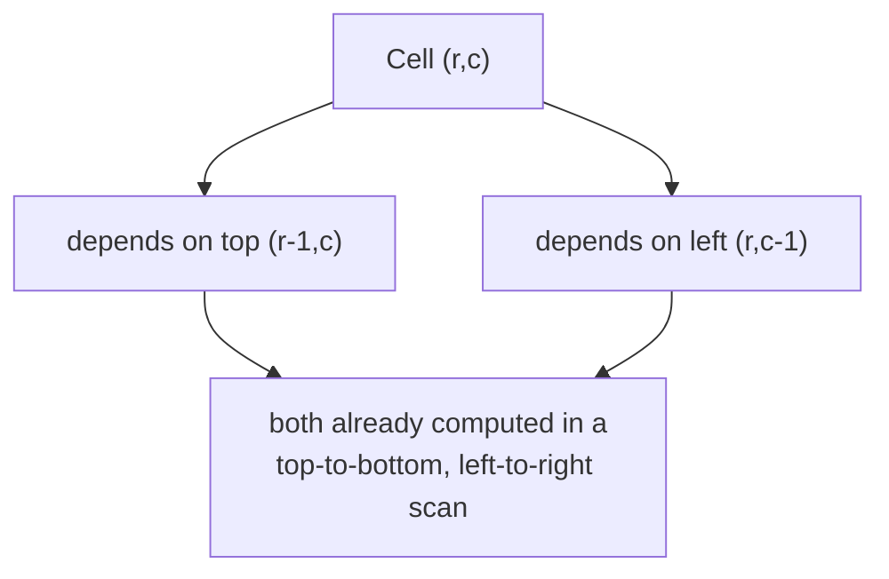
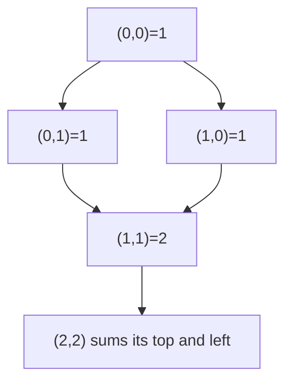
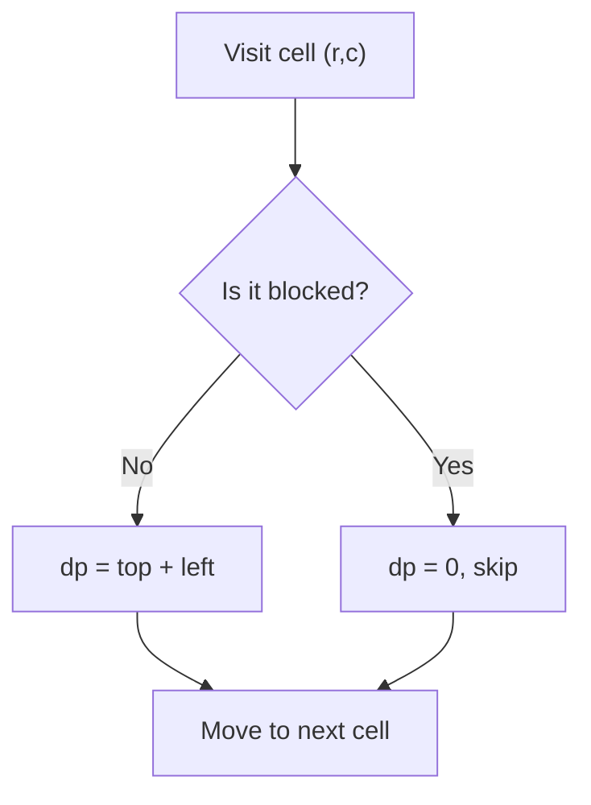
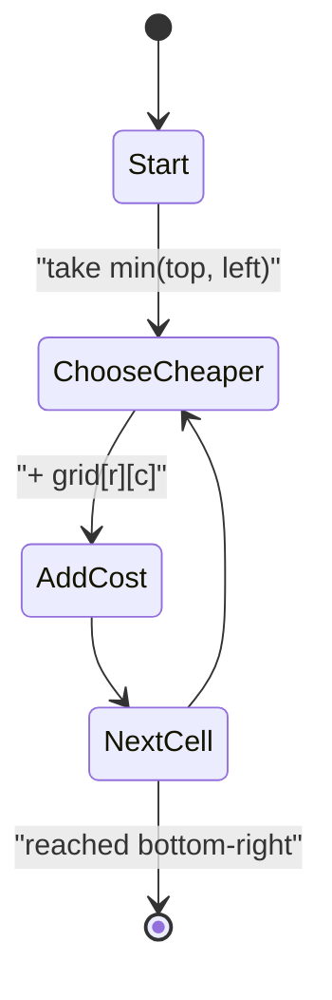
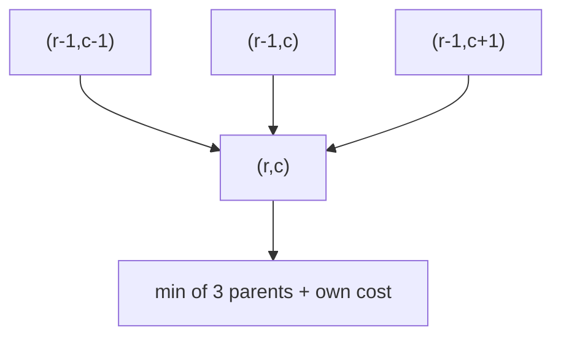
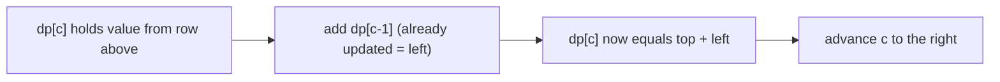
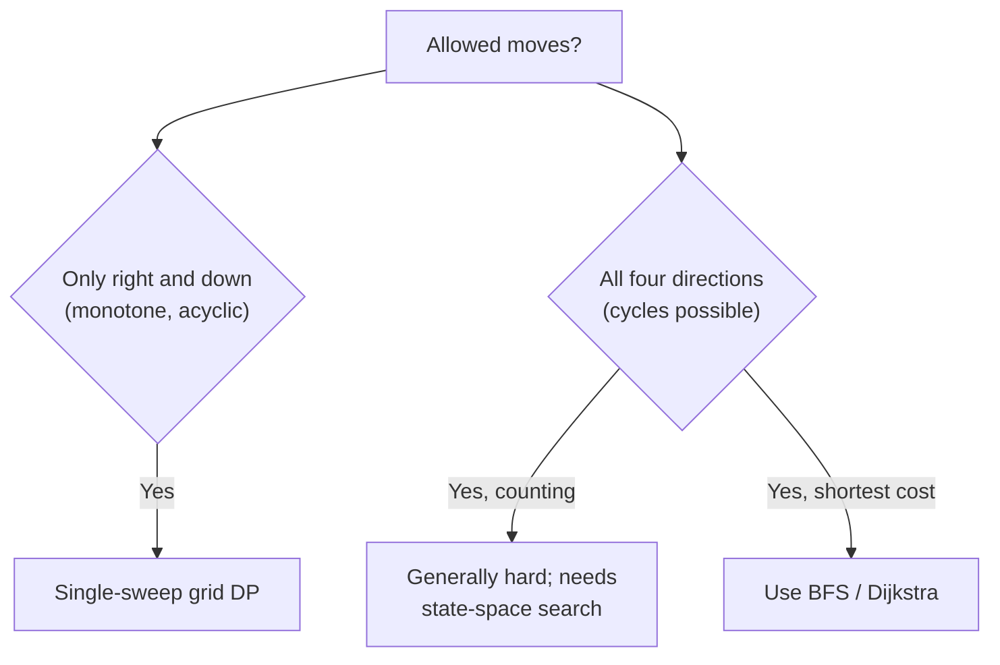
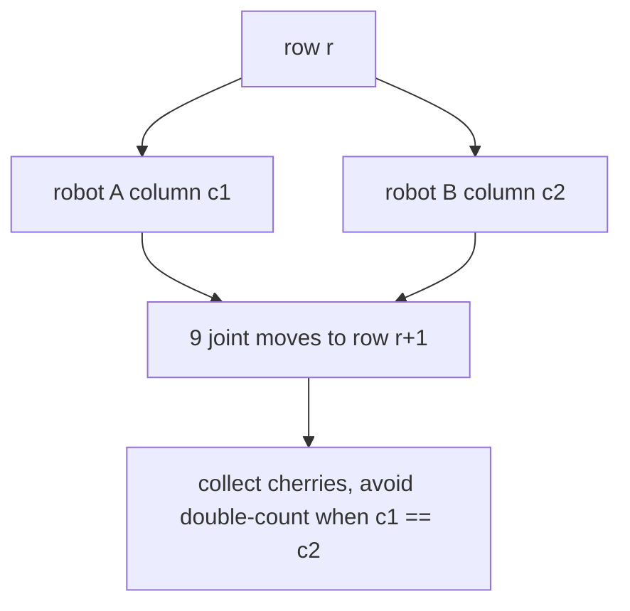

# Grid / Path-Counting DP — Complete Guide (Beginner → Advanced)

> A huge family of dynamic-programming problems lives on a **2D grid**. You start in one
> corner, you may step in a few allowed directions, and you must **count** the number of
> paths, or **optimize** the cost of a path (minimum / maximum sum). The common thread:
> the value of a cell depends only on a handful of **already-solved neighbouring cells**,
> so a single sweep over the grid solves everything.
>
> This guide builds the intuition from the ground up: counting paths with pure
> combinatorics vs DP, handling **obstacles**, computing **min / max path sums**, the
> **falling-path / triangle** variants, shrinking memory with a **1D rolling row**, the
> difference between *only-right/down* movement and *all-4-direction* movement, and finally
> **3D / multi-robot** generalizations.

---

## Table of Contents
1. [The Core Idea](#1-the-core-idea)
2. [Counting Paths: Combinatorial vs DP](#2-counting-paths-combinatorial-vs-dp)
3. [Obstacles on the Grid](#3-obstacles-on-the-grid)
4. [Minimum / Maximum Path Sum](#4-minimum--maximum-path-sum)
5. [Falling Path and Triangle DP](#5-falling-path-and-triangle-dp)
6. [1D Rolling-Row Optimization](#6-1d-rolling-row-optimization)
7. [Paths With Movement Constraints](#7-paths-with-movement-constraints)
8. [3D / Multi-Robot Variants](#8-3d--multi-robot-variants)
9. [Complexity Summary](#complexity-summary)
10. [Common Pitfalls](#common-pitfalls)
11. [Patterns](#patterns)

---

## 1. The Core Idea

Picture an $m \times n$ grid. A robot stands at the top-left cell and may move **right** or
**down** only. Every cell `dp[r][c]` answers one local question — *"how many ways / what is
the best cost to reach this cell?"* — using cells that were already filled.

Because moves go only right and down, a cell depends solely on its **top** and **left**
neighbours, both of which appear *earlier* in a normal row-by-row scan. That ordering is
what makes the DP a single clean pass.



The whole topic reduces to choosing the right **combining function** at each cell:

| Goal | Combine top &amp; left with |
|------|------------------------------|
| Count paths | **sum** |
| Cheapest path | **min** then add cell cost |
| Most valuable path | **max** then add cell cost |

---

## 2. Counting Paths: Combinatorial vs DP

### 2.1 The combinatorial shortcut

If the grid is open (no obstacles) and you may only move right/down, every path from the
top-left to the bottom-right of an $m \times n$ grid makes exactly $m-1$ down-moves and
$n-1$ right-moves in **some order**. Choosing *which* of the total moves are "down" fixes
the path, so the count is a single binomial coefficient:

$$
\text{paths}(m, n) = \binom{(m-1) + (n-1)}{m-1} = \frac{(m+n-2)!}{(m-1)!\,(n-1)!}
$$

```python
from math import comb

def count_paths_formula(m, n):
    return comb(m + n - 2, m - 1)
```

```cpp
#include <bits/stdc++.h>
using namespace std;

long long count_paths_formula(int m, int n) {
    long long result = 1;
    // C(m+n-2, m-1) computed iteratively to avoid overflow
    for (int i = 1; i <= m - 1; ++i) {
        result = result * (n - 1 + i) / i;
    }
    return result;
}
```

### 2.2 The DP version (works once the grid gets messy)

The formula is elegant but breaks the moment obstacles or per-cell rules appear. The DP is
universal. Every cell sums the ways to reach it:

$$
dp[r][c] = dp[r-1][c] + dp[r][c-1]
$$

with the base case `dp[0][0] = 1`, and the top row / left column each equal to $1$ (only one
straight-line way to reach them).



```python
def count_paths_dp(m, n):
    dp = [[0] * n for _ in range(m)]
    for r in range(m):
        for c in range(n):
            if r == 0 and c == 0:
                dp[r][c] = 1
            else:
                top  = dp[r - 1][c] if r > 0 else 0
                left = dp[r][c - 1] if c > 0 else 0
                dp[r][c] = top + left
    return dp[m - 1][n - 1]
```

```cpp
#include <bits/stdc++.h>
using namespace std;

long long count_paths_dp(int m, int n) {
    vector<vector<long long>> dp(m, vector<long long>(n, 0));
    for (int r = 0; r < m; ++r) {
        for (int c = 0; c < n; ++c) {
            if (r == 0 && c == 0) {
                dp[r][c] = 1;
            } else {
                long long top  = (r > 0) ? dp[r - 1][c] : 0;
                long long left = (c > 0) ? dp[r][c - 1] : 0;
                dp[r][c] = top + left;
            }
        }
    }
    return dp[m - 1][n - 1];
}
```

---

## 3. Obstacles on the Grid

Now mark some cells as blocked. A blocked cell can never be stood on, so its path count is
**forced to $0$** and it contributes nothing to its neighbours:

$$
dp[r][c] =
\begin{cases}
0 & \text{if cell } (r,c) \text{ is blocked} \\
dp[r-1][c] + dp[r][c-1] & \text{otherwise}
\end{cases}
$$



```python
def unique_paths_with_obstacles(grid):
    m, n = len(grid), len(grid[0])
    dp = [[0] * n for _ in range(m)]
    for r in range(m):
        for c in range(n):
            if grid[r][c] == 1:          # 1 marks an obstacle
                dp[r][c] = 0
            elif r == 0 and c == 0:
                dp[r][c] = 1
            else:
                top  = dp[r - 1][c] if r > 0 else 0
                left = dp[r][c - 1] if c > 0 else 0
                dp[r][c] = top + left
    return dp[m - 1][n - 1]
```

```cpp
#include <bits/stdc++.h>
using namespace std;

long long unique_paths_with_obstacles(vector<vector<int>>& grid) {
    int m = grid.size(), n = grid[0].size();
    vector<vector<long long>> dp(m, vector<long long>(n, 0));
    for (int r = 0; r < m; ++r) {
        for (int c = 0; c < n; ++c) {
            if (grid[r][c] == 1) {           // 1 marks an obstacle
                dp[r][c] = 0;
            } else if (r == 0 && c == 0) {
                dp[r][c] = 1;
            } else {
                long long top  = (r > 0) ? dp[r - 1][c] : 0;
                long long left = (c > 0) ? dp[r][c - 1] : 0;
                dp[r][c] = top + left;
            }
        }
    }
    return dp[m - 1][n - 1];
}
```

---

## 4. Minimum / Maximum Path Sum

Swap *counting* for *optimizing*. Each cell holds a cost; a path's value is the sum of cells
it visits. To get the **cheapest** path, every cell keeps the best of its two predecessors
and adds its own cost:

$$
dp[r][c] = grid[r][c] + \min\big(dp[r-1][c],\; dp[r][c-1]\big)
$$

For the **maximum** path you simply replace $\min$ with $\max$. Nothing else changes — the
sweep order and dependencies are identical.



```python
def min_path_sum(grid):
    m, n = len(grid), len(grid[0])
    dp = [[0] * n for _ in range(m)]
    for r in range(m):
        for c in range(n):
            if r == 0 and c == 0:
                dp[r][c] = grid[r][c]
            else:
                top  = dp[r - 1][c] if r > 0 else float('inf')
                left = dp[r][c - 1] if c > 0 else float('inf')
                dp[r][c] = grid[r][c] + min(top, left)
    return dp[m - 1][n - 1]
```

```cpp
#include <bits/stdc++.h>
using namespace std;

long long min_path_sum(vector<vector<int>>& grid) {
    int m = grid.size(), n = grid[0].size();
    const long long INF = LLONG_MAX / 4;
    vector<vector<long long>> dp(m, vector<long long>(n, 0));
    for (int r = 0; r < m; ++r) {
        for (int c = 0; c < n; ++c) {
            if (r == 0 && c == 0) {
                dp[r][c] = grid[r][c];
            } else {
                long long top  = (r > 0) ? dp[r - 1][c] : INF;
                long long left = (c > 0) ? dp[r][c - 1] : INF;
                dp[r][c] = grid[r][c] + min(top, left);
            }
        }
    }
    return dp[m - 1][n - 1];
}
```

---

## 5. Falling Path and Triangle DP

In a **falling path**, you start anywhere in the top row and on each step fall to the cell
directly below, or **diagonally** below-left / below-right. So a cell depends on up to
**three** parents in the row above:

$$
dp[r][c] = grid[r][c] + \min\big(dp[r-1][c-1],\; dp[r-1][c],\; dp[r-1][c+1]\big)
$$



```python
def min_falling_path_sum(grid):
    n = len(grid)
    dp = [row[:] for row in grid]
    for r in range(1, n):
        for c in range(n):
            best = dp[r - 1][c]
            if c > 0:
                best = min(best, dp[r - 1][c - 1])
            if c < n - 1:
                best = min(best, dp[r - 1][c + 1])
            dp[r][c] = grid[r][c] + best
    return min(dp[n - 1])
```

```cpp
#include <bits/stdc++.h>
using namespace std;

long long min_falling_path_sum(vector<vector<int>>& grid) {
    int n = grid.size();
    vector<vector<long long>> dp(n, vector<long long>(n));
    for (int r = 0; r < n; ++r)
        for (int c = 0; c < n; ++c)
            dp[r][c] = grid[r][c];
    for (int r = 1; r < n; ++r) {
        for (int c = 0; c < n; ++c) {
            long long best = dp[r - 1][c];
            if (c > 0)     best = min(best, dp[r - 1][c - 1]);
            if (c < n - 1) best = min(best, dp[r - 1][c + 1]);
            dp[r][c] = grid[r][c] + best;
        }
    }
    return *min_element(dp[n - 1].begin(), dp[n - 1].end());
}
```

The **triangle** problem is the same idea on a ragged grid where row $r$ has $r+1$ entries.
Going **bottom-up** keeps indexing painless because each cell has exactly two children
below it:

$$
dp[r][c] = tri[r][c] + \min\big(dp[r+1][c],\; dp[r+1][c+1]\big)
$$

```python
def minimum_total_triangle(triangle):
    dp = triangle[-1][:]                       # start with the last row
    for r in range(len(triangle) - 2, -1, -1):
        for c in range(len(triangle[r])):
            dp[c] = triangle[r][c] + min(dp[c], dp[c + 1])
    return dp[0]
```

```cpp
#include <bits/stdc++.h>
using namespace std;

long long minimum_total_triangle(vector<vector<int>>& triangle) {
    vector<long long> dp(triangle.back().begin(), triangle.back().end());
    for (int r = (int)triangle.size() - 2; r >= 0; --r) {
        for (int c = 0; c < (int)triangle[r].size(); ++c) {
            dp[c] = triangle[r][c] + min(dp[c], dp[c + 1]);
        }
    }
    return dp[0];
}
```

---

## 6. 1D Rolling-Row Optimization

Notice that every recurrence so far reads only the **previous row** (and, for left/right
moves, the current row). That means we never need the full $m \times n$ table — a single row
of length $n$ suffices, dropping memory from $O(mn)$ to $O(n)$.

For right/down counting, the in-place update `dp[c] += dp[c - 1]` works because:
- before the update `dp[c]` still holds the **old** value = the cell **above**, and
- `dp[c - 1]` already holds the **new** value = the cell **to the left**.



```python
def count_paths_rolling(m, n):
    dp = [1] * n                  # top row: exactly one way to each cell
    for _ in range(1, m):
        for c in range(1, n):
            dp[c] += dp[c - 1]    # old dp[c] = top, new dp[c-1] = left
    return dp[n - 1]
```

```cpp
#include <bits/stdc++.h>
using namespace std;

long long count_paths_rolling(int m, int n) {
    vector<long long> dp(n, 1);       // top row: one way to each cell
    for (int r = 1; r < m; ++r) {
        for (int c = 1; c < n; ++c) {
            dp[c] += dp[c - 1];       // old dp[c] = top, new dp[c-1] = left
        }
    }
    return dp[n - 1];
}
```

---

## 7. Paths With Movement Constraints

The clean single-sweep DP works **only because** the movement set is *acyclic*: right and
down moves always increase $r + c$, so cells can be ordered and each is computed once.

If you allow **all four directions** (up/down/left/right), paths may revisit the relationship
between cells in a cycle, so a plain row sweep is invalid. Counting simple paths becomes
`#P`-hard in general; for *shortest* path with non-negative weights you switch to
**Dijkstra / BFS** on the grid graph rather than a DP table.



A handy mental check: **a grid DP is valid exactly when the allowed moves induce a DAG**
over the cells. Right/down (and falling diagonals) satisfy this; free four-directional
movement does not.

```python
from collections import deque

def shortest_grid_path_bfs(grid):
    # 0 = open, 1 = wall; min steps from top-left to bottom-right, 4 directions
    m, n = len(grid), len(grid[0])
    if grid[0][0] == 1 or grid[m - 1][n - 1] == 1:
        return -1
    q = deque([(0, 0, 0)])
    seen = {(0, 0)}
    while q:
        r, c, d = q.popleft()
        if (r, c) == (m - 1, n - 1):
            return d
        for dr, dc in ((1, 0), (-1, 0), (0, 1), (0, -1)):
            nr, nc = r + dr, c + dc
            if 0 <= nr < m and 0 <= nc < n and grid[nr][nc] == 0 and (nr, nc) not in seen:
                seen.add((nr, nc))
                q.append((nr, nc, d + 1))
    return -1
```

```cpp
#include <bits/stdc++.h>
using namespace std;

int shortest_grid_path_bfs(vector<vector<int>>& grid) {
    int m = grid.size(), n = grid[0].size();
    if (grid[0][0] == 1 || grid[m - 1][n - 1] == 1) return -1;
    vector<vector<int>> seen(m, vector<int>(n, 0));
    queue<array<int, 3>> q;
    q.push({0, 0, 0});
    seen[0][0] = 1;
    int dr[] = {1, -1, 0, 0}, dc[] = {0, 0, 1, -1};
    while (!q.empty()) {
        auto [r, c, d] = q.front(); q.pop();
        if (r == m - 1 && c == n - 1) return d;
        for (int k = 0; k < 4; ++k) {
            int nr = r + dr[k], nc = c + dc[k];
            if (nr >= 0 && nr < m && nc >= 0 && nc < n &&
                grid[nr][nc] == 0 && !seen[nr][nc]) {
                seen[nr][nc] = 1;
                q.push({nr, nc, d + 1});
            }
        }
    }
    return -1;
}
```

---

## 8. 3D / Multi-Robot Variants

When **two** robots walk the grid simultaneously (e.g. *Cherry Pickup II*), the state grows:
you track **both** column positions at the same row. Since both robots advance one row per
step, the shared row $r$ plus the two columns $(c_1, c_2)$ form the state:

$$
dp[r][c_1][c_2] = grid[r][c_1] + grid[r][c_2]\,[c_1 \ne c_2] + \max_{\text{moves}} dp[r+1][c_1'][c_2']
$$

Each robot independently chooses one of $3$ diagonal/straight moves, giving $9$ transitions.
This is "grid DP" with an extra dimension — same row-by-row sweep, just a richer state.



```python
from functools import lru_cache

def cherry_pickup_two_robots(grid):
    m, n = len(grid), len(grid[0])

    @lru_cache(maxsize=None)
    def solve(r, c1, c2):
        if r == m:
            return 0
        gain = grid[r][c1] + (grid[r][c2] if c1 != c2 else 0)
        best = 0
        for nc1 in (c1 - 1, c1, c1 + 1):
            for nc2 in (c2 - 1, c2, c2 + 1):
                if 0 <= nc1 < n and 0 <= nc2 < n:
                    best = max(best, solve(r + 1, nc1, nc2))
        return gain + best

    return solve(0, 0, n - 1)
```

```cpp
#include <bits/stdc++.h>
using namespace std;

int M, N;
vector<vector<int>> G;
vector<vector<vector<long long>>> memo;

long long solve(int r, int c1, int c2) {
    if (r == M) return 0;
    long long &cached = memo[r][c1][c2];
    if (cached != -1) return cached;
    long long gain = G[r][c1] + (c1 != c2 ? G[r][c2] : 0);
    long long best = 0;
    for (int nc1 = c1 - 1; nc1 <= c1 + 1; ++nc1)
        for (int nc2 = c2 - 1; nc2 <= c2 + 1; ++nc2)
            if (nc1 >= 0 && nc1 < N && nc2 >= 0 && nc2 < N)
                best = max(best, solve(r + 1, nc1, nc2));
    return cached = gain + best;
}

long long cherry_pickup_two_robots(vector<vector<int>>& grid) {
    G = grid; M = grid.size(); N = grid[0].size();
    memo.assign(M, vector<vector<long long>>(N, vector<long long>(N, -1)));
    return solve(0, 0, N - 1);
}
```

---

## Complexity Summary

| Variant | Time | Space |
|---------|------|-------|
| Count paths (formula) | $O(\min(m,n))$ | $O(1)$ |
| Count paths (DP) | $O(mn)$ | $O(mn)$ or $O(n)$ rolling |
| Paths with obstacles | $O(mn)$ | $O(mn)$ or $O(n)$ |
| Min / max path sum | $O(mn)$ | $O(mn)$ or $O(n)$ |
| Falling path / triangle | $O(n^2)$ | $O(n^2)$ or $O(n)$ |
| 4-direction shortest path | $O(mn)$ BFS | $O(mn)$ |
| Two-robot (3D) | $O(m \cdot n^2)$ | $O(m \cdot n^2)$ or $O(n^2)$ |

---

## Common Pitfalls

- **Forgetting the base row/column.** The top row and left column have a single straight-line
  path; initialize them before the general recurrence.
- **Blocked start or end.** If the source or destination cell is an obstacle, the answer is
  $0$ (or $-1$ for path-cost problems). Check it first.
- **Wrong sentinel for min/max.** Use $+\infty$ for unreachable predecessors in a *min* DP and
  $-\infty$ in a *max* DP, never $0$.
- **Overwriting too early in 1D rolling.** For right/down counting the in-place `dp[c] += dp[c-1]`
  is correct, but for diagonal (falling) updates you must read the **previous** row, so keep a
  separate `prev` array.
- **Applying single-sweep DP to 4-direction movement.** That movement set has cycles; a plain
  grid DP is invalid — use BFS/Dijkstra.
- **Integer overflow.** Path counts grow like binomials; use `long long` in C++ (or apply a
  modulus when the problem asks for one).

---

## Patterns

- **"Count paths top-left to bottom-right, right/down only"** → either the binomial formula or
  the additive grid DP.
- **"Some cells are blocked"** → additive DP with blocked cells forced to $0$.
- **"Minimize / maximize the sum along a path"** → replace addition-of-ways with
  `cost + min(parents)` or `cost + max(parents)`.
- **"Start anywhere in the top row, fall with diagonals"** → three-parent falling-path DP; the
  ragged version is the triangle DP (do it bottom-up).
- **"Reduce memory"** → keep only the previous row (rolling array) — $O(n)$ space.
- **"Free four-direction movement"** → it is a graph search, not a sweep DP; reach for BFS or
  Dijkstra.
- **"Multiple agents / extra dimension"** → add their positions to the state and sweep row by
  row; transitions are the product of each agent's moves.
```