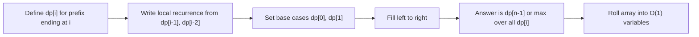
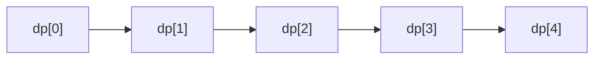
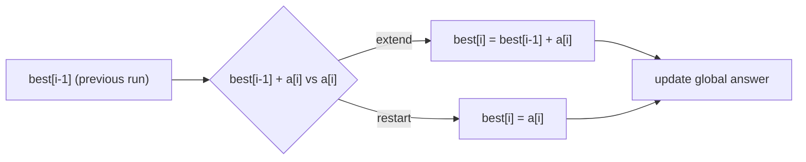
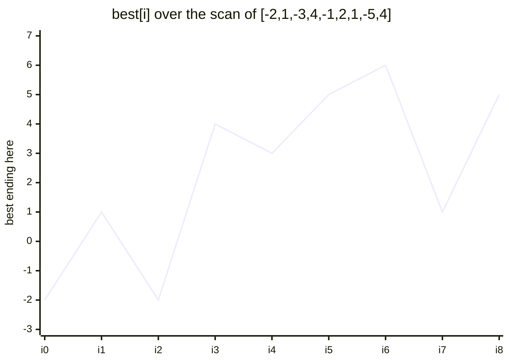
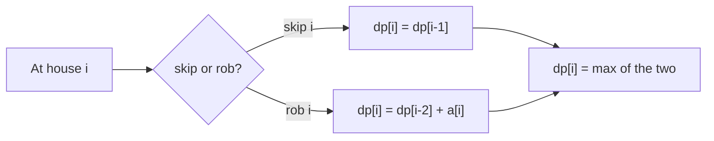
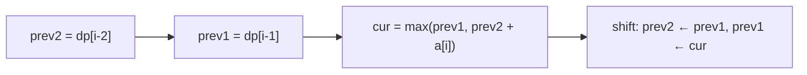
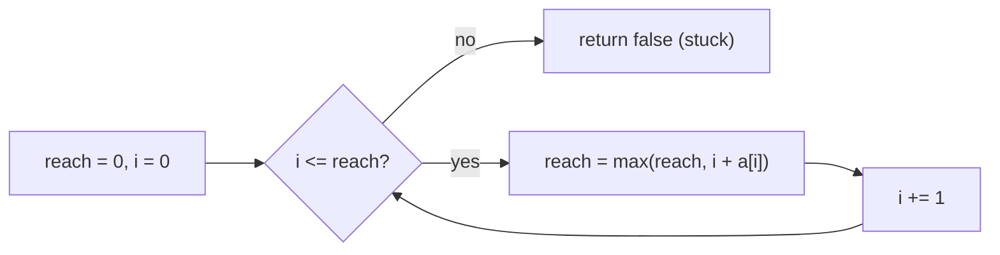
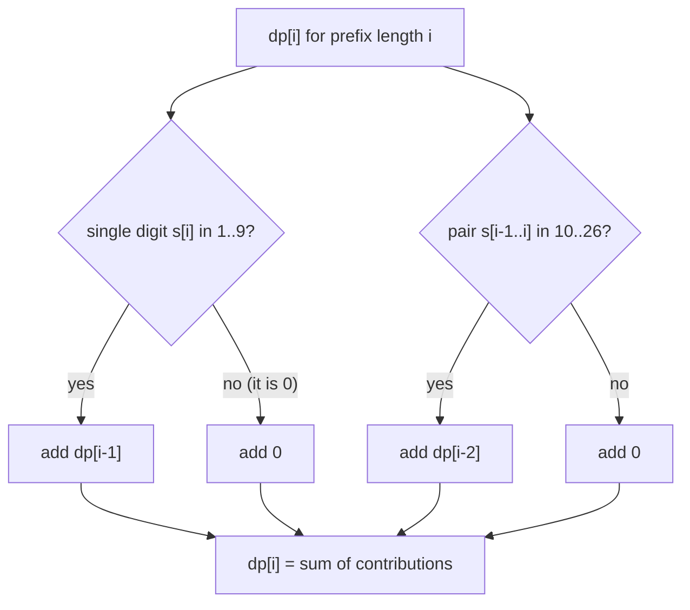
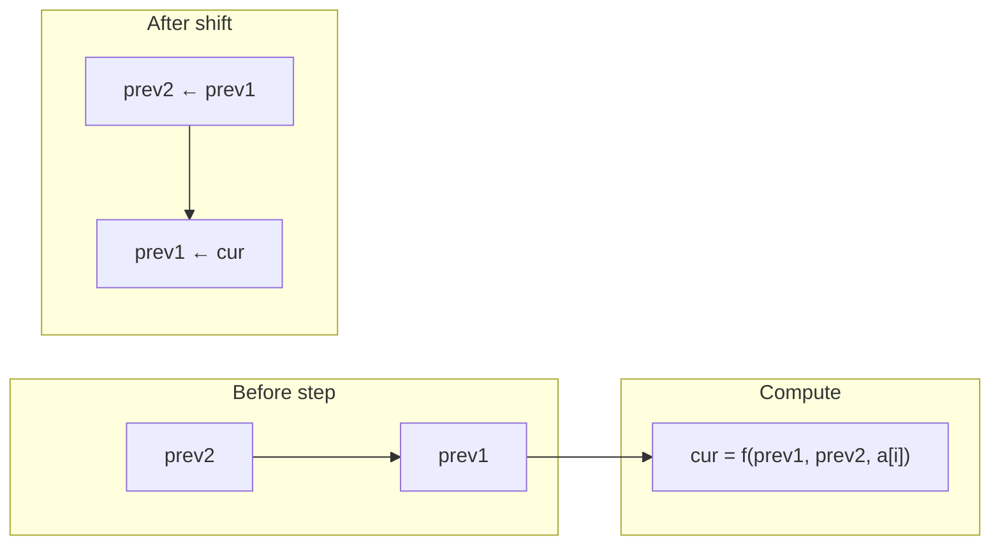
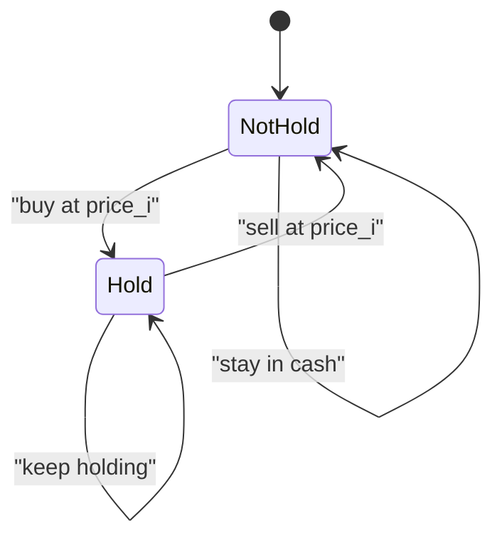

# Sequence / Array DP — Complete Guide (Beginner → Advanced)

> Many problems read a list left to right and ask for an optimum, a count, or a feasibility
> answer that depends only on **a constant number of recent states**. This is **1D DP on a
> sequence**: you define `dp[i]` as the answer for the prefix ending at (or considering)
> index `i`, and you build it from `dp[i-1]`, `dp[i-2]`, … using a tiny recurrence.
>
> The magic is that the *whole history* collapses into a few numbers. Kadane's maximum
> subarray, House Robber, Jump Game, and Decode Ways are all the same shape: scan once,
> keep a handful of rolling variables, output the accumulated best/count.
>
> This guide teaches you to (1) **set up `dp[i]`** so the recurrence is local, (2) derive
> the transition for **maximize / count / feasibility** flavours, (3) **roll** the array down
> to O(1) space, and (4) recognize when one number per index is not enough and you must add a
> **second state dimension** (e.g. *hold / not-hold*).

---

## Table of Contents
1. [The 1D DP Template](#1-the-1d-dp-template)
2. [Kadane — Maximum Subarray](#2-kadane--maximum-subarray)
3. [House Robber — Non-Adjacent Choice](#3-house-robber--non-adjacent-choice)
4. [Jump Game and Minimum Jumps](#4-jump-game-and-minimum-jumps)
5. [Decode Ways — Counting DP](#5-decode-ways--counting-dp)
6. [Constant-Space Rolling Variables](#6-constant-space-rolling-variables)
7. [Adding a Second Dimension (Hold / Not-Hold)](#7-adding-a-second-dimension-hold--not-hold)
8. [Complexity Summary](#complexity-summary)
9. [Common Pitfalls](#common-pitfalls)
10. [Patterns](#patterns)

---

## 1. The 1D DP Template

Pick a **definition** for `dp[i]` so that the value at index `i` depends only on a few
earlier entries. The classic shape is:

$$
dp[i] = f\big(dp[i-1],\; dp[i-2],\; \ldots,\; a[i]\big)
$$

where $f$ is `max`, `min`, or a `sum` depending on whether you optimize or count.



The dependency chain is literally a line of states pointing backward:



A generic skeleton:

```python
def sequence_dp(a):
    n = len(a)
    dp = [0] * n
    dp[0] = a[0]                 # base case
    for i in range(1, n):
        dp[i] = combine(dp[i - 1], a[i])   # local transition
    return dp[n - 1]
```

```cpp
long long sequence_dp(vector<int>& a) {
    int n = (int)a.size();
    vector<long long> dp(n, 0);
    dp[0] = a[0];                // base case
    for (int i = 1; i < n; ++i)
        dp[i] = combine(dp[i - 1], a[i]);  // local transition
    return dp[n - 1];
}
```

**Three flavours of `combine`** decide everything:

| Flavour | `combine` is | Example |
|---------|--------------|---------|
| Optimize | `max` / `min` | Maximum subarray, House Robber |
| Count | `+` (sum of ways) | Decode Ways, climbing stairs |
| Feasibility | `or` / reachability | Jump Game |

---

## 2. Kadane — Maximum Subarray

Define `best[i]` = max sum of a subarray that **ends exactly at index `i`**. At each step you
either **extend** the previous run or **restart** at `a[i]`:

$$
best[i] = \max\big(a[i],\; best[i-1] + a[i]\big), \qquad
\text{answer} = \max_{0 \le i < n} best[i]
$$



```python
def max_subarray(a):
    best = ans = a[0]
    for x in a[1:]:
        best = max(x, best + x)   # extend or restart
        ans = max(ans, best)
    return ans
```

```cpp
long long max_subarray(vector<int>& a) {
    long long best = a[0], ans = a[0];
    for (int i = 1; i < (int)a.size(); ++i) {
        best = max((long long)a[i], best + a[i]);
        ans = max(ans, best);
    }
    return ans;
}
```

Watch `best` rise and fall as the scan proceeds:



---

## 3. House Robber — Non-Adjacent Choice

You cannot take two adjacent elements. Define `dp[i]` = best loot from houses `0..i`. For each
house you either **skip** it (`dp[i-1]`) or **rob** it and add `dp[i-2]`:

$$
dp[i] = \max\big(dp[i-1],\; dp[i-2] + a[i]\big)
$$



```python
def rob(a):
    prev2 = prev1 = 0           # dp[i-2], dp[i-1]
    for x in a:
        prev2, prev1 = prev1, max(prev1, prev2 + x)
    return prev1
```

```cpp
long long rob(vector<int>& a) {
    long long prev2 = 0, prev1 = 0;   // dp[i-2], dp[i-1]
    for (int x : a) {
        long long cur = max(prev1, prev2 + x);
        prev2 = prev1;
        prev1 = cur;
    }
    return prev1;
}
```

The two trailing states slide forward each step:



---

## 4. Jump Game and Minimum Jumps

**Reachability (Jump Game I).** Track the farthest index reachable so far. If the scan ever
reaches an index beyond that reach, it is stuck.

$$
reach = \max(reach,\; i + a[i]), \qquad \text{feasible} \iff i \le reach\ \forall i
$$



```python
def can_jump(a):
    reach = 0
    for i, x in enumerate(a):
        if i > reach:
            return False
        reach = max(reach, i + x)
    return True
```

```cpp
bool can_jump(vector<int>& a) {
    long long reach = 0;
    for (int i = 0; i < (int)a.size(); ++i) {
        if (i > reach) return false;
        reach = max(reach, (long long)i + a[i]);
    }
    return true;
}
```

**Minimum jumps (Jump Game II).** A greedy BFS-by-level: expand the current window, and when
you exhaust it, spend one jump and jump to the farthest frontier reached.

```python
def min_jumps(a):
    jumps = end = farthest = 0
    for i in range(len(a) - 1):
        farthest = max(farthest, i + a[i])
        if i == end:            # end of current level
            jumps += 1
            end = farthest
    return jumps
```

```cpp
long long min_jumps(vector<int>& a) {
    long long jumps = 0, end = 0, farthest = 0;
    for (int i = 0; i + 1 < (int)a.size(); ++i) {
        farthest = max(farthest, (long long)i + a[i]);
        if (i == end) {         // end of current level
            ++jumps;
            end = farthest;
        }
    }
    return jumps;
}
```

---

## 5. Decode Ways — Counting DP

Map `1..26` to letters and count decodings of a digit string. Define `dp[i]` = number of ways
to decode the prefix of length `i`. Add the ways from a **single** valid digit and the ways
from a **valid two-digit** pair:

$$
dp[i] = \underbrace{dp[i-1] \cdot [s_i \neq 0]}_{\text{take one digit}}
      + \underbrace{dp[i-2] \cdot [10 \le \overline{s_{i-1}s_i} \le 26]}_{\text{take two digits}}
$$

with $dp[0] = 1$ (empty string has one decoding).



```python
def num_decodings(s):
    if not s or s[0] == '0':
        return 0
    prev2, prev1 = 1, 1         # dp[i-2], dp[i-1]
    for i in range(1, len(s)):
        cur = 0
        if s[i] != '0':
            cur += prev1
        if 10 <= int(s[i - 1:i + 1]) <= 26:
            cur += prev2
        prev2, prev1 = prev1, cur
    return prev1
```

```cpp
long long num_decodings(string s) {
    if (s.empty() || s[0] == '0') return 0;
    long long prev2 = 1, prev1 = 1;   // dp[i-2], dp[i-1]
    for (int i = 1; i < (int)s.size(); ++i) {
        long long cur = 0;
        if (s[i] != '0') cur += prev1;
        int two = (s[i - 1] - '0') * 10 + (s[i] - '0');
        if (two >= 10 && two <= 26) cur += prev2;
        prev2 = prev1;
        prev1 = cur;
    }
    return prev1;
}
```

---

## 6. Constant-Space Rolling Variables

If `dp[i]` only reaches back $k$ steps, you only need $k$ variables. Each iteration computes
the new value, then **shifts** the window forward. This is the difference between $O(n)$ and
$O(1)$ memory with **identical** time.



```python
def rolling(a):
    prev2 = prev1 = 0
    for x in a:
        cur = max(prev1, prev2 + x)   # any local recurrence
        prev2, prev1 = prev1, cur
    return prev1
```

```cpp
long long rolling(vector<int>& a) {
    long long prev2 = 0, prev1 = 0;
    for (int x : a) {
        long long cur = max(prev1, prev2 + x);
        prev2 = prev1;
        prev1 = cur;
    }
    return prev1;
}
```

> Rule of thumb: write the clear `dp[]` array version first, confirm it, **then** compress to
> rolling variables. Premature compression is a top source of off-by-one bugs.

---

## 7. Adding a Second Dimension (Hold / Not-Hold)

When one number per index cannot capture the decision, add a **state**. The canonical example
is buy/sell stock: at each day you are either **holding** a share or **not holding** one, and
the two states feed each other.

$$
hold[i] = \max(hold[i-1],\; notHold[i-1] - price_i)
$$
$$
notHold[i] = \max(notHold[i-1],\; hold[i-1] + price_i)
$$



```python
def max_profit(prices):
    hold, not_hold = float('-inf'), 0
    for p in prices:
        hold = max(hold, not_hold - p)      # buy or keep
        not_hold = max(not_hold, hold + p)  # sell or stay
    return not_hold
```

```cpp
long long max_profit(vector<int>& prices) {
    long long hold = LLONG_MIN / 2, not_hold = 0;
    for (int p : prices) {
        hold = max(hold, not_hold - (long long)p);
        not_hold = max(not_hold, hold + p);
    }
    return not_hold;
}
```

**Signal to add a dimension:** the optimal choice at `i` depends on *what kind of position*
you carried in, not just the best scalar so far. Encode that "kind" as the extra axis.

---

## Complexity Summary

| Problem | Recurrence | Time | Space (array) | Space (rolling) |
|---------|-----------|------|---------------|-----------------|
| Maximum subarray (Kadane) | $best[i]=\max(a_i, best[i-1]+a_i)$ | $O(n)$ | $O(1)$ | $O(1)$ |
| House Robber | $dp[i]=\max(dp[i-1], dp[i-2]+a_i)$ | $O(n)$ | $O(n)$ | $O(1)$ |
| Jump Game (reach) | $reach=\max(reach, i+a_i)$ | $O(n)$ | $O(1)$ | $O(1)$ |
| Min jumps | greedy levels | $O(n)$ | $O(1)$ | $O(1)$ |
| Decode Ways | $dp[i]=dp[i-1][\cdot]+dp[i-2][\cdot]$ | $O(n)$ | $O(n)$ | $O(1)$ |
| Hold / Not-Hold | two coupled states | $O(n)$ | $O(1)$ | $O(1)$ |

---

## Common Pitfalls
- **Wrong `dp[i]` definition.** "Ends at `i`" (Kadane) vs "considers `0..i`" (House Robber) give
  different answers. Decide first whether the answer is `dp[n-1]` or `max` over all `dp[i]`.
- **Base cases.** Decode Ways needs `dp[0] = 1`; an empty prefix has exactly one decoding.
- **Leading / interior zeros.** In Decode Ways, a `0` cannot stand alone and `30` is invalid.
- **Premature space compression.** Roll variables only after the array version is verified.
- **Integer overflow in C++.** Use `long long` for sums and counts that can grow large.
- **Restart vs extend mix-up.** Kadane uses `max(a[i], best+a[i])`, not `max(best, best+a[i])`.

---

## Patterns
- **Local recurrence:** if `dp[i]` depends on a constant window, it is sequence DP.
- **Optimize → `max`/`min`, Count → `+`, Feasible → reachability.**
- **Two trailing states** (`prev1`, `prev2`) cover most non-adjacent / pair recurrences.
- **Add a dimension** when a scalar cannot encode the carried-in decision (hold/not-hold).
- **Array first, roll second** — correctness before micro-optimization.
