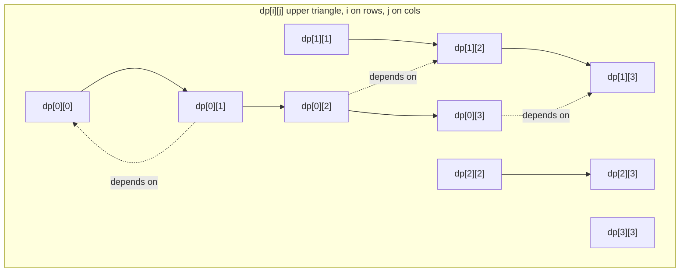
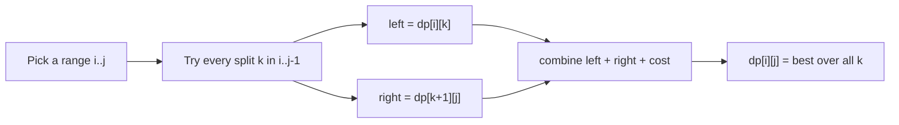
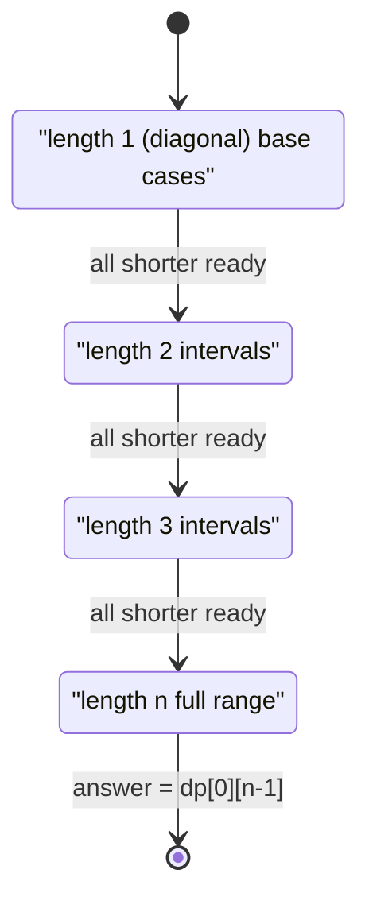
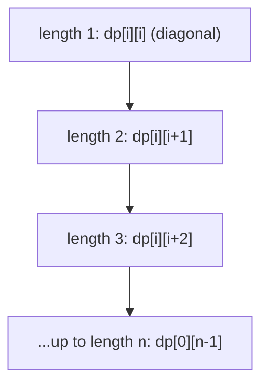
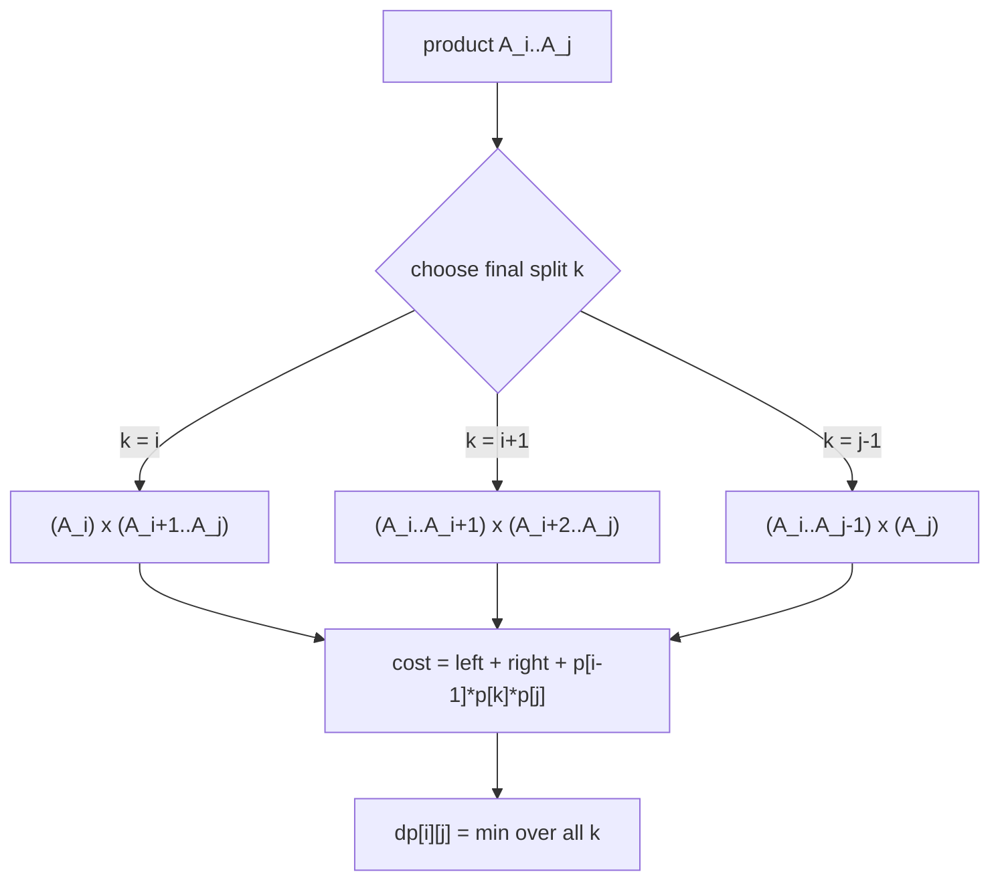
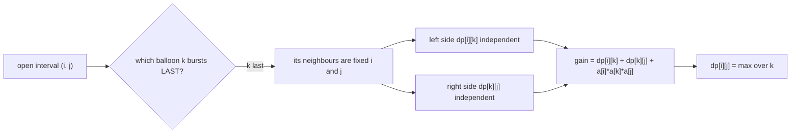
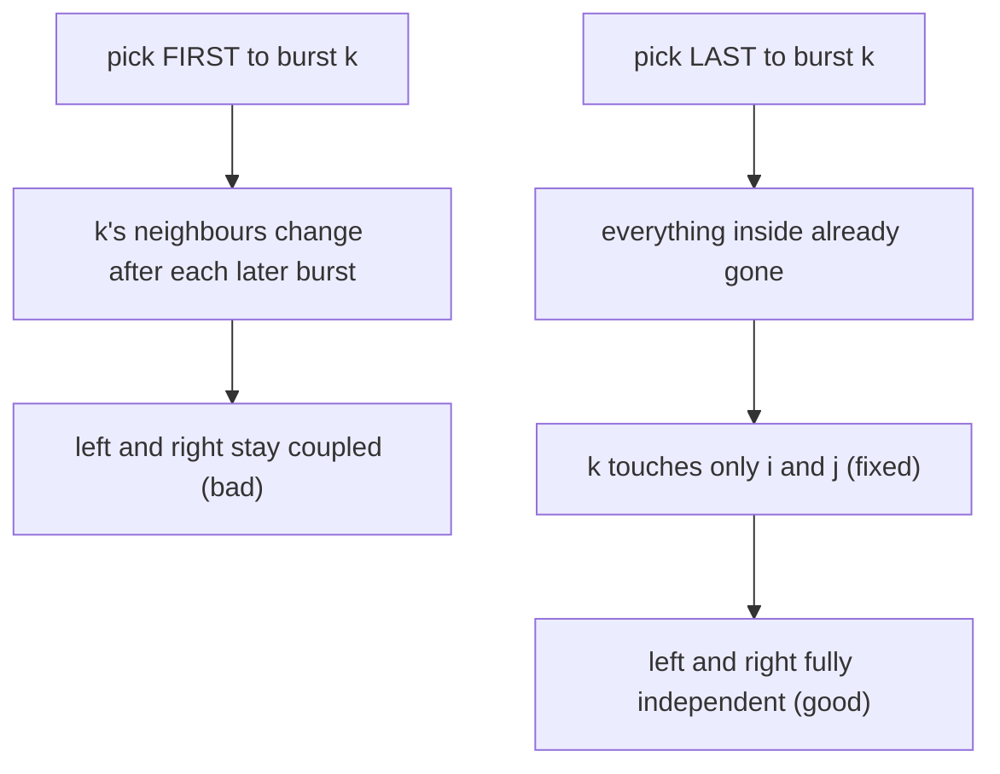
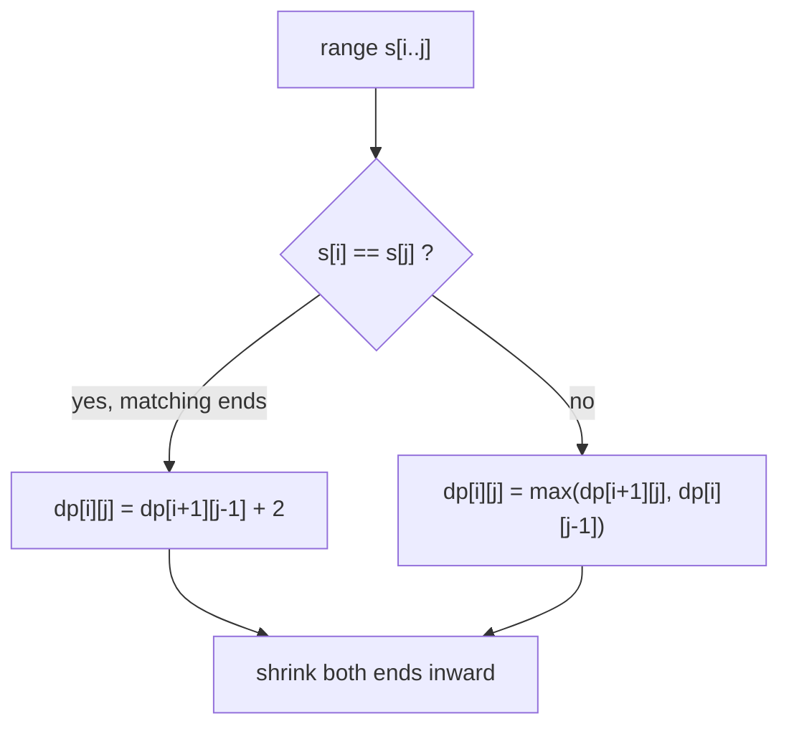
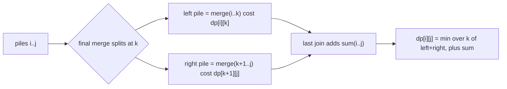
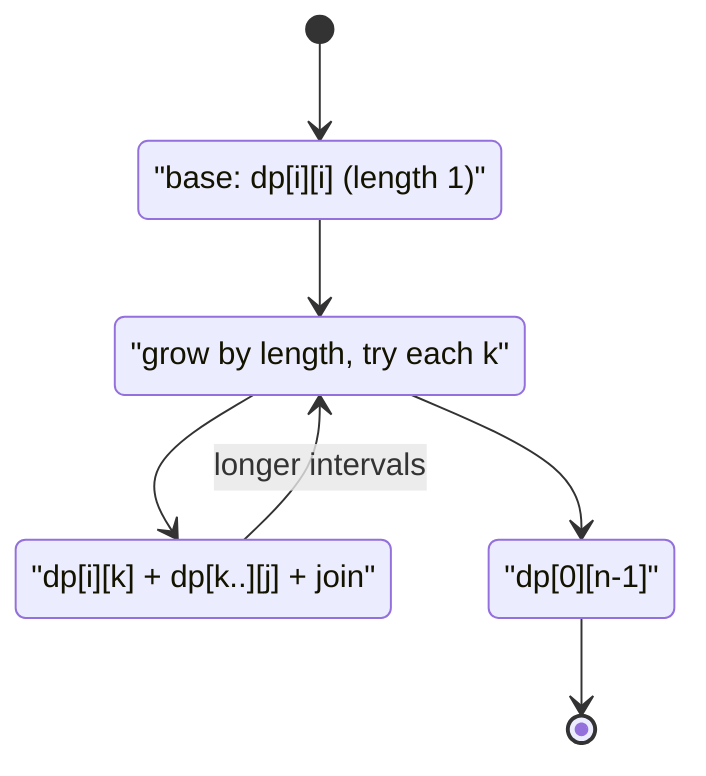

# Interval DP — Complete Guide (Beginner → Advanced)

> Some problems are defined on a **contiguous range** of a sequence, and the answer for a big
> range is built by **splitting it into two smaller ranges** at some inner point `k`. You solve
> every short range first, then every longer range that is glued together from already-solved
> pieces. This is **Interval DP**: the state is a pair `dp[i][j]` meaning *the optimal value for
> the sub-array from index `i` to index `j`*, and the transition tries every split point inside.
>
> Matrix-chain multiplication, Burst Balloons, stone-merge cost, and palindrome subsequence are
> all the same animal. The single most important habit is to **iterate by increasing interval
> length** so that when you compute `dp[i][j]`, every shorter interval it depends on is already
> final.
>
> A second, subtler habit (the one that makes Burst Balloons "click") is to choose the split
> element as the **last** thing processed in the range rather than the first — that fixes the
> boundaries so the two sides become independent.
>
> This guide teaches you to (1) **set up `dp[i][j]`** over a range, (2) **loop by length** and
> try every split `k`, (3) handle the *last-not-first* reframing, and (4) recognise the shared
> recurrence behind chain-cost, balloon, and palindrome problems.

---

## Table of Contents
1. [The Interval-DP Template](#1-the-interval-dp-template)
2. [Looping by Increasing Length](#2-looping-by-increasing-length)
3. [Matrix Chain Multiplication](#3-matrix-chain-multiplication)
4. [Burst Balloons — Think Last, Not First](#4-burst-balloons--think-last-not-first)
5. [Palindrome DP on a Range](#5-palindrome-dp-on-a-range)
6. [Stone Merge / Cost-Merge Problems](#6-stone-merge--cost-merge-problems)
7. [The General Recurrence Shape](#7-the-general-recurrence-shape)
8. [Complexity Summary](#complexity-summary)
9. [Common Pitfalls](#common-pitfalls)
10. [Patterns](#patterns)

---

## 1. The Interval-DP Template

Define `dp[i][j]` = the optimal answer for the sub-array covering indices `i..j`. A big range is
optimised by picking an inner **split point** `k` with $i \le k < j$ (or $i \le k \le j$,
depending on whether `k` is a *cut* or a *chosen element*) and combining the two halves:

$$
dp[i][j] = \operatorname*{opt}_{i \le k < j}\Big(\, dp[i][k] + dp[k+1][j] + \text{cost}(i,k,j) \,\Big)
$$

The state space is the upper triangle of an $n \times n$ table (only `i \le j` is meaningful):



The reason the diagonal (length-1 intervals) sits at the "bottom" of every dependency is that a
single element needs no split — it is a base case. Everything longer points back into shorter
ranges that live closer to the diagonal.



A generic skeleton (minimisation flavour):

```python
def interval_dp(n, base, cost):
    INF = float("inf")
    dp = [[0] * n for _ in range(n)]
    for length in range(2, n + 1):           # interval length
        for i in range(0, n - length + 1):   # left endpoint
            j = i + length - 1               # right endpoint
            dp[i][j] = INF
            for k in range(i, j):            # split point
                cand = dp[i][k] + dp[k + 1][j] + cost(i, k, j)
                dp[i][j] = min(dp[i][j], cand)
    return dp[0][n - 1]
```

```cpp
#include <bits/stdc++.h>
using namespace std;

long long interval_dp(int n, function<long long(int,int,int)> cost) {
    const long long INF = LLONG_MAX / 4;
    vector<vector<long long>> dp(n, vector<long long>(n, 0));
    for (int length = 2; length <= n; ++length) {      // interval length
        for (int i = 0; i + length - 1 < n; ++i) {     // left endpoint
            int j = i + length - 1;                    // right endpoint
            dp[i][j] = INF;
            for (int k = i; k < j; ++k) {              // split point
                long long cand = dp[i][k] + dp[k + 1][j] + cost(i, k, j);
                dp[i][j] = min(dp[i][j], cand);
            }
        }
    }
    return dp[0][n - 1];
}
```

---

## 2. Looping by Increasing Length

The order of the three loops is not negotiable. `dp[i][j]` reads `dp[i][k]` and `dp[k+1][j]`,
both of which span a **strictly shorter** range. So all shorter ranges must already be final.
Looping by increasing `length` guarantees exactly that.



Two equivalent loop orders both respect the dependency; pick whichever reads clearly:

```python
# Order A: by length (most common, easiest to reason about)
for length in range(2, n + 1):
    for i in range(0, n - length + 1):
        j = i + length - 1
        # fill dp[i][j]

# Order B: i descending, j ascending (same guarantee)
# for i in range(n - 1, -1, -1):
#     for j in range(i + 1, n):
#         # fill dp[i][j]
```

```cpp
// Order A: by length (most common, easiest to reason about)
for (int length = 2; length <= n; ++length) {
    for (int i = 0; i + length - 1 < n; ++i) {
        int j = i + length - 1;
        // fill dp[i][j]
    }
}
// Order B: i descending, j ascending (same guarantee)
// for (int i = n - 1; i >= 0; --i)
//     for (int j = i + 1; j < n; ++j)
//         // fill dp[i][j]
```

Why the table fills diagonal-outward:



---

## 3. Matrix Chain Multiplication

Given matrices $A_1, A_2, \ldots, A_n$ where $A_i$ has dimension $p_{i-1} \times p_i$, find the
parenthesisation minimising scalar multiplications. Multiplying a $p_{i-1}\times p_k$ block by a
$p_k \times p_j$ block costs $p_{i-1}\,p_k\,p_j$.

Let `dp[i][j]` = minimum cost to multiply $A_i \cdots A_j$. The **last** multiplication splits the
chain at some `k`, joining `(A_i..A_k)` with `(A_{k+1}..A_j)`:

$$
dp[i][j] = \min_{i \le k < j}\Big( dp[i][k] + dp[k+1][j] + p_{i-1}\,p_k\,p_j \Big)
$$



```python
def matrix_chain(p):
    # p has length n+1; matrix i is p[i-1] x p[i], i = 1..n
    n = len(p) - 1
    INF = float("inf")
    dp = [[0] * (n + 1) for _ in range(n + 1)]
    for length in range(2, n + 1):
        for i in range(1, n - length + 2):
            j = i + length - 1
            dp[i][j] = INF
            for k in range(i, j):
                cost = dp[i][k] + dp[k + 1][j] + p[i - 1] * p[k] * p[j]
                dp[i][j] = min(dp[i][j], cost)
    return dp[1][n]
```

```cpp
#include <bits/stdc++.h>
using namespace std;

long long matrix_chain(vector<long long>& p) {
    // p has size n+1; matrix i is p[i-1] x p[i], i = 1..n
    int n = (int)p.size() - 1;
    const long long INF = LLONG_MAX / 4;
    vector<vector<long long>> dp(n + 1, vector<long long>(n + 1, 0));
    for (int length = 2; length <= n; ++length) {
        for (int i = 1; i + length - 1 <= n; ++i) {
            int j = i + length - 1;
            dp[i][j] = INF;
            for (int k = i; k < j; ++k) {
                long long cost = dp[i][k] + dp[k + 1][j] + p[i - 1] * p[k] * p[j];
                dp[i][j] = min(dp[i][j], cost);
            }
        }
    }
    return dp[1][n];
}
```

---

## 4. Burst Balloons — Think Last, Not First

Balloons have values `a[0..n-1]`. Bursting balloon `i` earns `a[left] * a[i] * a[right]` where
`left`/`right` are the **current** neighbours. The neighbours keep changing, so reasoning about
the *first* balloon to burst is a nightmare — its neighbours depend on a future you have not
decided yet.

**The trick:** reason about the **last** balloon to burst in an open interval `(i, j)`. If `k` is
last, then by the time you burst it, every balloon strictly between `i` and `j` is already gone,
so `k`'s neighbours are exactly the fixed boundaries `i` and `j`. That makes the two sides
independent.

Pad the array with virtual `1`s at both ends. Let `dp[i][j]` = max coins from bursting all
balloons strictly inside the open interval `(i, j)`:

$$
dp[i][j] = \max_{i < k < j}\Big( dp[i][k] + dp[k][j] + a[i]\,a[k]\,a[j] \Big)
$$



Compare *first* vs *last* framing — only "last" decouples the halves:



```python
def max_coins(nums):
    a = [1] + nums + [1]
    n = len(a)
    dp = [[0] * n for _ in range(n)]
    for length in range(2, n):                 # gap between i and j
        for i in range(0, n - length):
            j = i + length
            for k in range(i + 1, j):          # k bursts last in (i, j)
                gain = dp[i][k] + dp[k][j] + a[i] * a[k] * a[j]
                dp[i][j] = max(dp[i][j], gain)
    return dp[0][n - 1]
```

```cpp
#include <bits/stdc++.h>
using namespace std;

long long max_coins(vector<int>& nums) {
    int m = (int)nums.size();
    vector<long long> a(m + 2, 1);
    for (int i = 0; i < m; ++i) a[i + 1] = nums[i];
    int n = m + 2;
    vector<vector<long long>> dp(n, vector<long long>(n, 0));
    for (int length = 2; length < n; ++length) {     // gap between i and j
        for (int i = 0; i + length < n; ++i) {
            int j = i + length;
            for (int k = i + 1; k < j; ++k) {        // k bursts last in (i, j)
                long long gain = dp[i][k] + dp[k][j] + a[i] * a[k] * a[j];
                dp[i][j] = max(dp[i][j], gain);
            }
        }
    }
    return dp[0][n - 1];
}
```

---

## 5. Palindrome DP on a Range

For the **longest palindromic subsequence**, let `dp[i][j]` = length of the longest palindromic
subsequence inside `s[i..j]`. The endpoints decide the recurrence:

$$
dp[i][j] =
\begin{cases}
dp[i+1][j-1] + 2 & \text{if } s[i] = s[j] \\[4pt]
\max\big(dp[i+1][j],\; dp[i][j-1]\big) & \text{if } s[i] \ne s[j]
\end{cases}
$$

with base case $dp[i][i] = 1$.



Here `k` is not a free split point; instead the range shrinks toward its centre. The dependency
still flows from shorter ranges, so the **length loop** is identical:

```python
def longest_palindrome_subseq(s):
    n = len(s)
    dp = [[0] * n for _ in range(n)]
    for i in range(n):
        dp[i][i] = 1                       # single char is a palindrome
    for length in range(2, n + 1):
        for i in range(0, n - length + 1):
            j = i + length - 1
            if s[i] == s[j]:
                dp[i][j] = dp[i + 1][j - 1] + 2
            else:
                dp[i][j] = max(dp[i + 1][j], dp[i][j - 1])
    return dp[0][n - 1]
```

```cpp
#include <bits/stdc++.h>
using namespace std;

long long longest_palindrome_subseq(const string& s) {
    int n = (int)s.size();
    vector<vector<long long>> dp(n, vector<long long>(n, 0));
    for (int i = 0; i < n; ++i) dp[i][i] = 1;     // single char is a palindrome
    for (int length = 2; length <= n; ++length) {
        for (int i = 0; i + length - 1 < n; ++i) {
            int j = i + length - 1;
            if (s[i] == s[j])
                dp[i][j] = dp[i + 1][j - 1] + 2;
            else
                dp[i][j] = max(dp[i + 1][j], dp[i][j - 1]);
        }
    }
    return dp[0][n - 1];
}
```

---

## 6. Stone Merge / Cost-Merge Problems

You have a row of piles `a[0..n-1]`. Merging two **adjacent** ranges costs the sum of all stones
involved. Repeatedly merge until one pile remains, minimising total cost. Let
`dp[i][j]` = min cost to merge piles `i..j` into one, and `sum(i, j)` = prefix-sum of that range:

$$
dp[i][j] = \min_{i \le k < j}\Big( dp[i][k] + dp[k+1][j] \Big) + \operatorname{sum}(i, j)
$$

The extra `sum(i, j)` is paid no matter where you split, because the final merge always touches
every stone in `i..j` exactly once.



```python
def merge_stones(a):
    n = len(a)
    pre = [0] * (n + 1)
    for i in range(n):
        pre[i + 1] = pre[i] + a[i]
    rng = lambda i, j: pre[j + 1] - pre[i]
    INF = float("inf")
    dp = [[0] * n for _ in range(n)]
    for length in range(2, n + 1):
        for i in range(0, n - length + 1):
            j = i + length - 1
            dp[i][j] = INF
            for k in range(i, j):
                dp[i][j] = min(dp[i][j], dp[i][k] + dp[k + 1][j])
            dp[i][j] += rng(i, j)
    return dp[0][n - 1]
```

```cpp
#include <bits/stdc++.h>
using namespace std;

long long merge_stones(vector<int>& a) {
    int n = (int)a.size();
    vector<long long> pre(n + 1, 0);
    for (int i = 0; i < n; ++i) pre[i + 1] = pre[i] + a[i];
    auto rng = [&](int i, int j) -> long long { return pre[j + 1] - pre[i]; };
    const long long INF = LLONG_MAX / 4;
    vector<vector<long long>> dp(n, vector<long long>(n, 0));
    for (int length = 2; length <= n; ++length) {
        for (int i = 0; i + length - 1 < n; ++i) {
            int j = i + length - 1;
            dp[i][j] = INF;
            for (int k = i; k < j; ++k)
                dp[i][j] = min(dp[i][j], dp[i][k] + dp[k + 1][j]);
            dp[i][j] += rng(i, j);
        }
    }
    return dp[0][n - 1];
}
```

---

## 7. The General Recurrence Shape

Strip away the problem-specific cost and every interval DP collapses to one mould: pick a split,
add the two solved halves, add a join cost, optimise over the split. The differences are only in
**what `k` means** and **what the join costs**.

| Problem | `k` is | Join cost | opt |
|---------|--------|-----------|-----|
| Matrix chain | a cut between matrices | $p_{i-1} p_k p_j$ | min |
| Burst balloons | the **last** balloon | $a_i a_k a_j$ | max |
| Stone merge | a cut between piles | $\operatorname{sum}(i,j)$ | min |
| Palindrome subseq | shrink ends (no free `k`) | $+2$ or none | max |

The shared engine:

$$
dp[i][j] = \operatorname*{opt}_{k}\Big( dp[i][k] \;\oplus\; dp[k\,(+1)][j] \;\oplus\; \text{join}(i,k,j) \Big)
$$



A reusable harness where you plug in `join` and `opt`:

```python
def general_interval_dp(n, join, want_max=False):
    NEG, POS = float("-inf"), float("inf")
    dp = [[0] * n for _ in range(n)]
    for length in range(2, n + 1):
        for i in range(0, n - length + 1):
            j = i + length - 1
            best = NEG if want_max else POS
            for k in range(i, j):
                cand = dp[i][k] + dp[k + 1][j] + join(i, k, j)
                best = max(best, cand) if want_max else min(best, cand)
            dp[i][j] = best
    return dp[0][n - 1]
```

```cpp
#include <bits/stdc++.h>
using namespace std;

long long general_interval_dp(int n, function<long long(int,int,int)> join, bool want_max = false) {
    const long long NEG = LLONG_MIN / 4, POS = LLONG_MAX / 4;
    vector<vector<long long>> dp(n, vector<long long>(n, 0));
    for (int length = 2; length <= n; ++length) {
        for (int i = 0; i + length - 1 < n; ++i) {
            int j = i + length - 1;
            long long best = want_max ? NEG : POS;
            for (int k = i; k < j; ++k) {
                long long cand = dp[i][k] + dp[k + 1][j] + join(i, k, j);
                best = want_max ? max(best, cand) : min(best, cand);
            }
            dp[i][j] = best;
        }
    }
    return dp[0][n - 1];
}
```

---

## Complexity Summary

| Problem | States | Transition | Time | Space |
|---------|--------|-----------|------|-------|
| Generic interval DP | $O(n^2)$ | $O(n)$ split | $O(n^3)$ | $O(n^2)$ |
| Matrix chain | $O(n^2)$ | $O(n)$ | $O(n^3)$ | $O(n^2)$ |
| Burst balloons | $O(n^2)$ | $O(n)$ | $O(n^3)$ | $O(n^2)$ |
| Stone merge | $O(n^2)$ | $O(n)$ | $O(n^3)$ | $O(n^2)$ |
| Longest palindromic subseq | $O(n^2)$ | $O(1)$ | $O(n^2)$ | $O(n^2)$ |

Many $O(n^3)$ interval DPs can be cut to $O(n^2)$ via the **Knuth–Yao** optimisation when the
cost satisfies the quadrangle inequality, but start with the clean cubic version first.

---

## Common Pitfalls

- **Wrong loop order.** Iterating `i` then `j` from the top-left fills cells before their shorter
  sub-ranges exist. Always loop by **increasing length** (or `i` descending / `j` ascending).
- **Off-by-one in the split range.** For *cut* problems use `k in [i, j-1]`; for Burst Balloons
  (`k` is an element of an **open** interval) use `k in [i+1, j-1]`.
- **Forgetting base cases.** Length-1 intervals (`dp[i][i]`) must be initialised — `1` for
  palindrome length, `0` for cost problems.
- **Thinking "first" in Burst Balloons.** The first-to-burst framing couples the halves. Always
  reframe as the **last** balloon so neighbours are the fixed boundaries.
- **Integer overflow.** Products like $p_{i-1} p_k p_j$ or $a_i a_k a_j$ overflow 32-bit; use
  `long long` throughout.
- **Padding mistakes.** Burst Balloons needs virtual `1`s on both ends; indexing the original
  array directly is a classic bug.

---

## Patterns

- **State = a range, answer = whole range.** Whenever the optimum over `i..j` is naturally built
  from optimums over `i..k` and `k..j`, reach for `dp[i][j]`.
- **Loop by length.** It is the canonical fill order for the upper-triangular table.
- **Split point `k`.** Try every inner partition; the cost added at the join is what varies
  between problems.
- **Last-not-first.** When neighbours/context change as you remove elements, fix the boundaries
  by choosing the element processed **last**.
- **Prefix sums for merge costs.** Range-sum joins (stone merge) need $O(1)$ `sum(i, j)` lookups.
- **Shrink-the-ends variant.** Palindrome-style DPs replace the free split with an endpoint
  comparison but keep the same length-loop skeleton.
