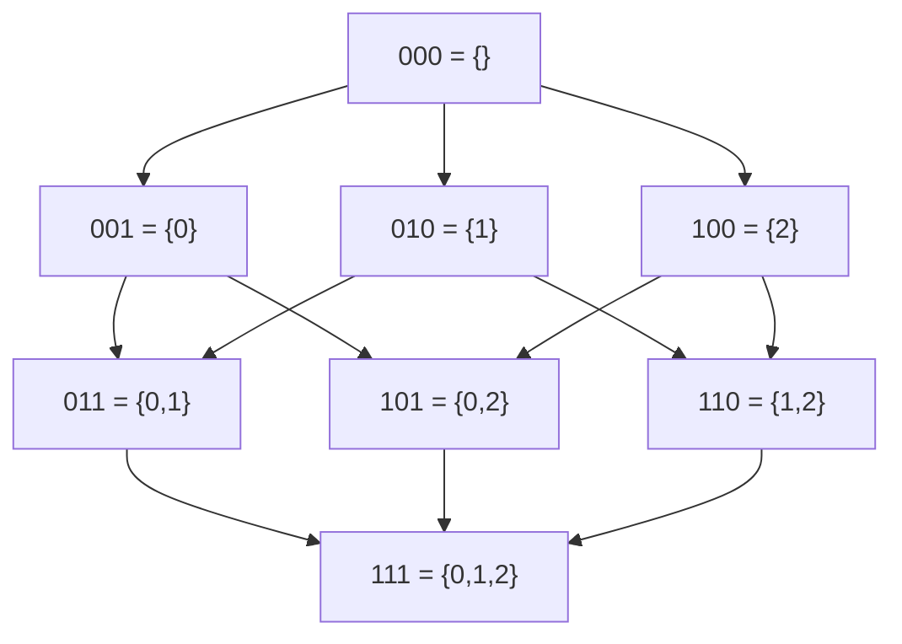
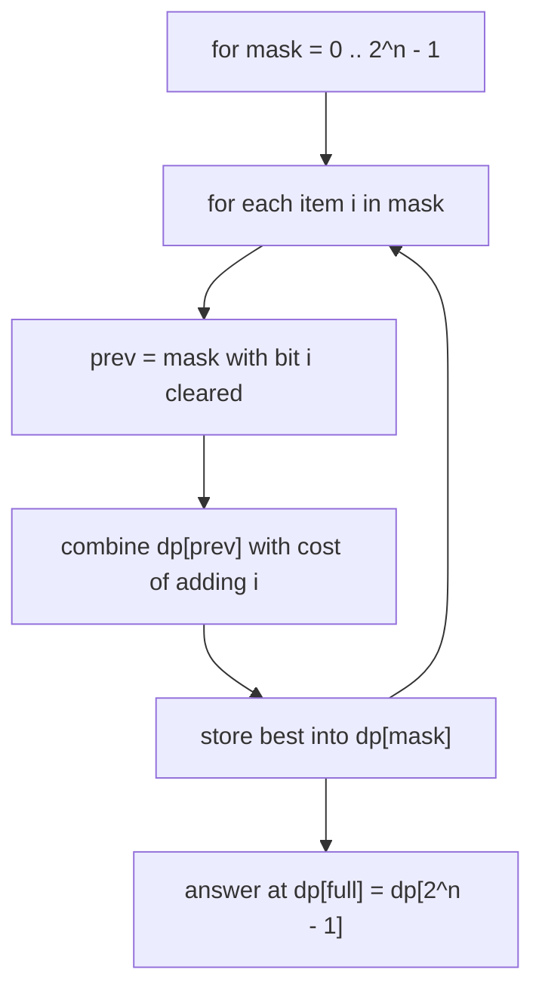
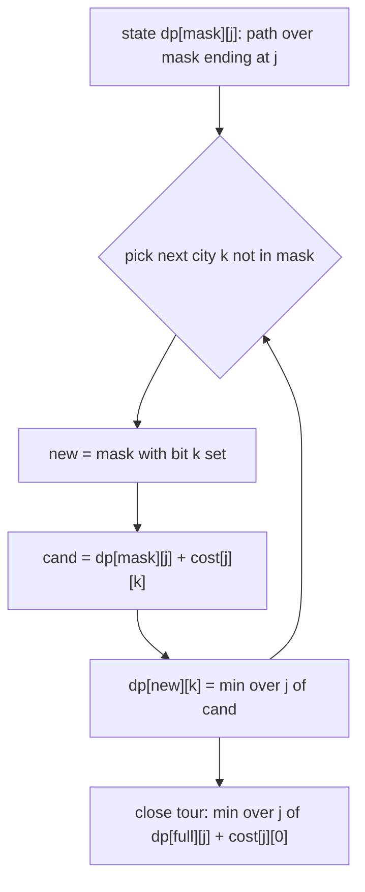
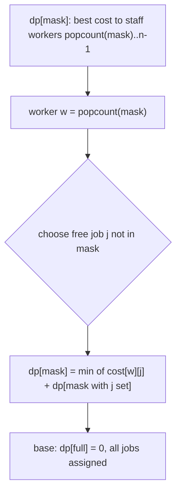
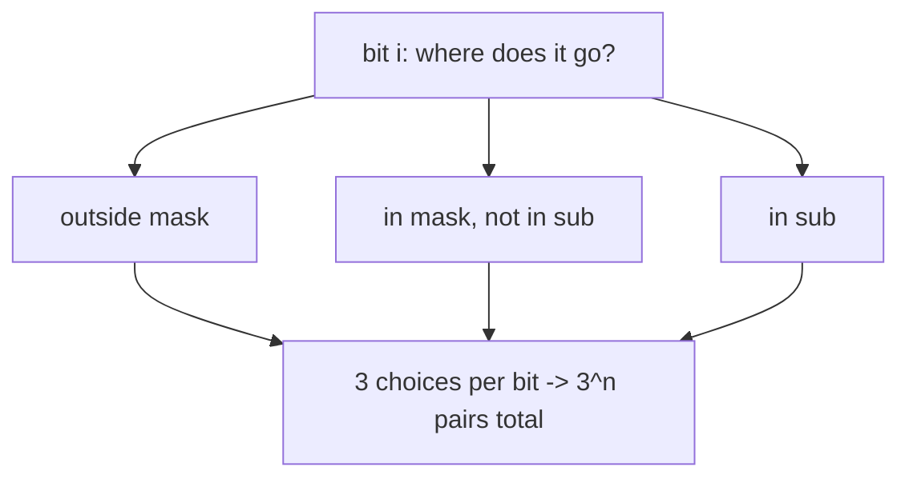
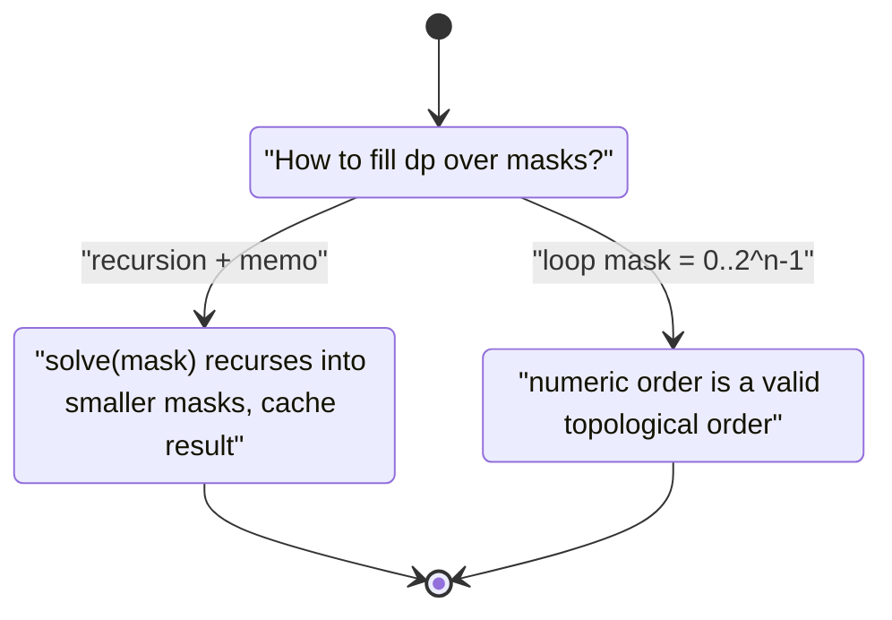

# Bitmask DP — Subset and TSP-Style Dynamic Programming (Beginner → Advanced)

> When the number of items is **small** (typically $n \le 20$), the *set of items already
> handled* is itself a tiny piece of state. We encode that set as an integer **bitmask**: bit
> `i` is `1` if item `i` is "used / visited / chosen", and `0` otherwise. A whole subset of up
> to 20 elements collapses into a single `int`.
>
> Once subsets are integers, a DP table indexed by mask becomes natural: `dp[mask]` (often with
> an extra coordinate such as "last city") answers a question about the items inside `mask`.
> The famous **Travelling Salesman Problem** in $O(2^n \cdot n^2)$, optimal **assignment**
> problems, and **partition-into-subsets** feasibility all share this skeleton.
>
> This guide teaches you to (1) **represent a subset as a mask**, (2) wield the **bit operations**
> for test/set/clear/lowest-bit/submask iteration, (3) build **DP over masks** both top-down and
> bottom-up, (4) derive the **TSP** recurrence, (5) solve **assignment** problems, and (6)
> iterate **all submasks of a mask** in the surprising total of $O(3^n)$.

---

## Table of Contents
1. [Representing a Subset as an Integer Bitmask](#1-representing-a-subset-as-an-integer-bitmask)
2. [Bit Operations Cheat Sheet](#2-bit-operations-cheat-sheet)
3. [DP Over Masks — The Core Idea](#3-dp-over-masks--the-core-idea)
4. [Travelling Salesman in O(2^n n^2)](#4-travelling-salesman-in-o2n-n2)
5. [Assignment Problems](#5-assignment-problems)
6. [Iterating All Submasks in O(3^n)](#6-iterating-all-submasks-in-o3n)
7. [Counting Set Bits](#7-counting-set-bits)
8. [Memoization vs Bottom-Up Over Masks](#8-memoization-vs-bottom-up-over-masks)
9. [Complexity Summary](#complexity-summary)
10. [Common Pitfalls](#common-pitfalls)
11. [Patterns](#patterns)

---

## 1. Representing a Subset as an Integer Bitmask

Number the items $0, 1, \ldots, n-1$. A subset $S \subseteq \{0, \ldots, n-1\}$ maps to the
integer

$$
\text{mask}(S) = \sum_{i \in S} 2^{i}.
$$

There are exactly $2^n$ subsets, so masks range over $0 \le \text{mask} < 2^n$. Bit $i$
("the $i$-th least-significant bit", weight $2^i$) records membership of item $i$.

For $n = 4$ the bit layout of the value `mask = 13` (binary `1101`) is:

| bit index $i$ | 3 | 2 | 1 | 0 |
|---------------|---|---|---|---|
| weight $2^i$  | 8 | 4 | 2 | 1 |
| bit value     | 1 | 1 | 0 | 1 |
| item in set?  | yes | yes | no | yes |

So `mask = 13` means the subset $\{0, 2, 3\}$.

The $2^n$ masks form a **lattice** ordered by inclusion. Each edge adds exactly one element:



Reading the lattice top-to-bottom is exactly the order a bottom-up DP fills masks: every mask
depends only on masks with **fewer** bits (or the same bits minus one).

```python
# Build the integer for a list of chosen items.
def to_mask(items):
    mask = 0
    for i in items:
        mask |= (1 << i)      # turn on bit i
    return mask

# Recover the list of items inside a mask.
def to_items(mask):
    items = []
    i = 0
    while (1 << i) <= mask:
        if mask & (1 << i):
            items.append(i)
        i += 1
    return items
```

```cpp
#include <bits/stdc++.h>
using namespace std;

// Build the integer for a list of chosen items.
int to_mask(const vector<int>& items) {
    int mask = 0;
    for (int i : items) mask |= (1 << i);   // turn on bit i
    return mask;
}

// Recover the list of items inside a mask.
vector<int> to_items(int mask) {
    vector<int> items;
    for (int i = 0; (1 << i) <= mask; ++i)
        if (mask & (1 << i)) items.push_back(i);
    return items;
}
```

---

## 2. Bit Operations Cheat Sheet

These five primitives cover almost every bitmask DP. In all of them `i` is a bit index and
`mask` is the current subset.

| Operation | Expression | Meaning |
|-----------|------------|---------|
| **Test** bit `i` | `mask &amp; (1 &lt;&lt; i)` | non-zero iff item `i` is in the set |
| **Set** bit `i` | `mask \| (1 &lt;&lt; i)` | add item `i` |
| **Clear** bit `i` | `mask &amp; ~(1 &lt;&lt; i)` | remove item `i` |
| **Lowest set bit** | `mask &amp; (-mask)` | isolate the smallest present item |
| **Drop lowest bit** | `mask &amp; (mask - 1)` | remove the smallest present item |

A picture of "clear bit 1 of `1101`":

```mermaid
stateDiagram-v2
    [*] --> Start
    Start: "mask = 1101"
    Start --> Build: "compute ~(1&lt;&lt;1) = 1101...1101"
    Build: "keep mask &amp; mask-without-bit-1"
    Build --> Done: "mask = 1101 (bit 1 already 0, unchanged)"
    Done --> [*]
```

Iterating the set bits one at a time using the *drop lowest bit* trick visits exactly
$\text{popcount}(\text{mask})$ items:

```python
def iterate_bits(mask):
    while mask:
        low = mask & (-mask)     # lowest set bit as a power of two
        i = low.bit_length() - 1 # its index
        yield i
        mask &= (mask - 1)       # drop that bit
```

```cpp
#include <bits/stdc++.h>
using namespace std;

void iterate_bits(int mask) {
    while (mask) {
        int low = mask & (-mask);          // lowest set bit
        int i = __builtin_ctz(mask);       // index of lowest set bit
        (void)low; (void)i;                // use i here
        mask &= (mask - 1);                // drop that bit
    }
}
```

---

## 3. DP Over Masks — The Core Idea

The recipe: pick a state `dp[mask]` (sometimes `dp[mask][extra]`) whose value summarizes
everything we need to know about the subset `mask`. Then express it from **smaller** masks —
masks that have one fewer bit set. Because every transition removes (or adds) a bit, the
acyclic dependency graph is exactly the subset lattice of section 1, so iterating masks in
increasing numeric order is a valid topological order:

$$
\text{mask}' < \text{mask} \quad\text{whenever}\quad \text{mask}' \subsetneq \text{mask}.
$$



A concrete tiny example — count subsets whose chosen weights sum to a target — shows the shape:

```python
def fill_example(n, weight, target):
    full = 1 << n
    dp = [0] * full
    dp[0] = 1                       # empty set: one way, sum 0
    best = [0] * full
    for mask in range(full):
        s = sum(weight[i] for i in range(n) if mask & (1 << i))
        best[mask] = s
    return best                     # best[mask] = sum of weights in mask
```

```cpp
#include <bits/stdc++.h>
using namespace std;

vector<long long> fill_example(int n, const vector<long long>& weight) {
    int full = 1 << n;
    vector<long long> best(full, 0);
    for (int mask = 0; mask < full; ++mask) {
        long long s = 0;
        for (int i = 0; i < n; ++i)
            if (mask & (1 << i)) s += weight[i];
        best[mask] = s;             // sum of weights in mask
    }
    return best;
}
```

---

## 4. Travelling Salesman in O(2^n n^2)

Given a complete weighted graph on $n$ cities, the **Travelling Salesman Problem** asks for the
cheapest tour that starts at city `0`, visits every city exactly once, and returns to `0`.

Define

$$
dp[\text{mask}][j] = \text{cheapest path that starts at } 0, \text{ visits exactly the cities in } \text{mask}, \text{ and ends at } j,
$$

with the invariants $0 \in \text{mask}$ and $j \in \text{mask}$. The transition extends the path
by one new city `k` not yet in `mask`:

$$
dp[\text{mask} \cup \{k\}][k] = \min_{j \in \text{mask}} \big(dp[\text{mask}][j] + \text{cost}[j][k]\big).
$$

The answer closes the tour back to the start:

$$
\text{best} = \min_{j} \big(dp[\text{full}][j] + \text{cost}[j][0]\big).
$$

There are $2^n \cdot n$ states and each scans $n$ predecessors, giving $O(2^n \cdot n^2)$ time
and $O(2^n \cdot n)$ space.



```python
def tsp(cost):
    n = len(cost)
    INF = float('inf')
    full = 1 << n
    dp = [[INF] * n for _ in range(full)]
    dp[1][0] = 0                                   # start at city 0, mask = {0}
    for mask in range(full):
        if not (mask & 1):                         # tours must include city 0
            continue
        for j in range(n):
            if dp[mask][j] == INF or not (mask & (1 << j)):
                continue
            for k in range(n):
                if mask & (1 << k):                # k already visited
                    continue
                nmask = mask | (1 << k)
                cand = dp[mask][j] + cost[j][k]
                if cand < dp[nmask][k]:
                    dp[nmask][k] = cand
    best = INF
    for j in range(n):
        if dp[full - 1][j] != INF:
            best = min(best, dp[full - 1][j] + cost[j][0])
    return best
```

```cpp
#include <bits/stdc++.h>
using namespace std;

long long tsp(const vector<vector<long long>>& cost) {
    int n = (int)cost.size();
    const long long INF = LLONG_MAX / 4;
    int full = 1 << n;
    vector<vector<long long>> dp(full, vector<long long>(n, INF));
    dp[1][0] = 0;                                  // start at city 0, mask = {0}
    for (int mask = 0; mask < full; ++mask) {
        if (!(mask & 1)) continue;                 // tours must include city 0
        for (int j = 0; j < n; ++j) {
            if (dp[mask][j] == INF || !(mask & (1 << j))) continue;
            for (int k = 0; k < n; ++k) {
                if (mask & (1 << k)) continue;     // k already visited
                int nmask = mask | (1 << k);
                long long cand = dp[mask][j] + cost[j][k];
                if (cand < dp[nmask][k]) dp[nmask][k] = cand;
            }
        }
    }
    long long best = INF;
    for (int j = 0; j < n; ++j)
        if (dp[full - 1][j] != INF)
            best = min(best, dp[full - 1][j] + cost[j][0]);
    return best;
}
```

---

## 5. Assignment Problems

Assign $n$ workers to $n$ jobs, one-to-one, minimizing total cost where `cost[w][j]` is the
price of giving job `j` to worker `w`. Process workers in order `0, 1, \ldots`; let `mask` be
the set of jobs **already taken**. Crucially $\text{popcount}(\text{mask})$ equals the index of
the next worker to place, so no extra coordinate is needed:

$$
dp[\text{mask}] = \min_{j \notin \text{mask}} \big(dp[\text{mask} \cup \{j\}] + \text{cost}[\,\text{popcount}(\text{mask})\,][j]\big),
$$

with $dp[\text{full}] = 0$. This is $O(2^n \cdot n)$ — strictly faster than TSP because the
"current worker" is implied by the bit count.



```python
def assignment(cost):
    n = len(cost)
    full = 1 << n
    full_mask = full - 1
    INF = float('inf')
    best = [INF] * full
    best[full_mask] = 0                            # all jobs taken: nothing left to pay
    # decreasing numeric order: a mask is filled after every mask with more bits
    for mask in range(full_mask - 1, -1, -1):
        w = bin(mask).count("1")                   # next worker = number of taken jobs
        for j in range(n):
            if mask & (1 << j):
                continue
            cand = cost[w][j] + best[mask | (1 << j)]
            if cand < best[mask]:
                best[mask] = cand
    return best[0]
```

```cpp
#include <bits/stdc++.h>
using namespace std;

long long assignment(const vector<vector<long long>>& cost) {
    int n = (int)cost.size();
    int full = 1 << n;
    int full_mask = full - 1;
    const long long INF = LLONG_MAX / 4;
    vector<long long> best(full, INF);
    best[full_mask] = 0;
    for (int mask = full_mask; mask >= 0; --mask) {
        if (mask == full_mask) { best[mask] = 0; continue; }
        int w = __builtin_popcount(mask);          // next worker = taken jobs
        for (int j = 0; j < n; ++j) {
            if (mask & (1 << j)) continue;
            long long cand = cost[w][j] + best[mask | (1 << j)];
            if (cand < best[mask]) best[mask] = cand;
        }
    }
    return best[0];
}
```

---

## 6. Iterating All Submasks in O(3^n)

Some DPs (partition into groups, Steiner-style splits) need, for every mask, every **submask**
$\text{sub} \subseteq \text{mask}$. The idiom `sub = (sub - 1) &amp; mask` walks all submasks in
decreasing order, ending at `0`:

```python
def iterate_submasks(mask):
    sub = mask
    while True:
        yield sub
        if sub == 0:
            break
        sub = (sub - 1) & mask
```

```cpp
#include <bits/stdc++.h>
using namespace std;

void iterate_submasks(int mask) {
    for (int sub = mask; ; sub = (sub - 1) & mask) {
        // process sub here
        if (sub == 0) break;
    }
}
```

**Why total work is $O(3^n)$, not $O(4^n)$.** A pair $(\text{mask}, \text{sub})$ with
$\text{sub} \subseteq \text{mask}$ assigns each of the $n$ bits to one of three buckets: *outside
mask*, *in mask but not in sub*, or *in sub*. Hence

$$
\sum_{\text{mask}} 2^{\text{popcount}(\text{mask})} = \sum_{m=0}^{n} \binom{n}{m} 2^{m} = (1 + 2)^n = 3^n.
$$



---

## 7. Counting Set Bits

The **population count** (`popcount`) — how many items a subset has — appears constantly: it is
the "current worker" in assignment, the "number visited" in path problems, and a validity check.

```python
def popcount(mask):
    count = 0
    while mask:
        mask &= (mask - 1)   # drop lowest set bit each step
        count += 1
    return count

# In real code prefer the builtin:
fast = lambda mask: bin(mask).count("1")
```

```cpp
#include <bits/stdc++.h>
using namespace std;

int popcount(int mask) {
    int count = 0;
    while (mask) {
        mask &= (mask - 1);  // drop lowest set bit each step
        count += 1;
    }
    return count;
}

// In real code prefer the builtin:
int fast(unsigned int mask) { return __builtin_popcount(mask); }
```

You can also precompute popcounts for all masks in $O(2^n)$ with the recurrence
$\text{pc}[\text{mask}] = \text{pc}[\text{mask} \gg 1] + (\text{mask} \,\&\, 1)$:

```python
def precompute_popcount(n):
    full = 1 << n
    pc = [0] * full
    for mask in range(1, full):
        pc[mask] = pc[mask >> 1] + (mask & 1)
    return pc
```

```cpp
#include <bits/stdc++.h>
using namespace std;

vector<int> precompute_popcount(int n) {
    int full = 1 << n;
    vector<int> pc(full, 0);
    for (int mask = 1; mask < full; ++mask)
        pc[mask] = pc[mask >> 1] + (mask & 1);
    return pc;
}
```

---

## 8. Memoization vs Bottom-Up Over Masks

Both styles fill the same lattice; pick whichever reads cleaner for the recurrence.



**Top-down** (memoized) — only reachable masks are computed, natural for sparse state spaces:

```python
import sys
from functools import lru_cache

def tsp_topdown(cost):
    n = len(cost)
    full = (1 << n) - 1
    sys.setrecursionlimit(1 << 20)

    @lru_cache(maxsize=None)
    def solve(mask, j):
        if mask == full:
            return cost[j][0]                  # close the tour
        best = float('inf')
        for k in range(n):
            if not (mask & (1 << k)):
                best = min(best, cost[j][k] + solve(mask | (1 << k), k))
        return best

    return solve(1, 0)
```

```cpp
#include <bits/stdc++.h>
using namespace std;

int N_;
vector<vector<long long>> COST_;
vector<vector<long long>> MEMO_;

long long solve(int mask, int j) {
    int full = (1 << N_) - 1;
    if (mask == full) return COST_[j][0];      // close the tour
    long long &cell = MEMO_[mask][j];
    if (cell != -1) return cell;
    long long best = LLONG_MAX / 4;
    for (int k = 0; k < N_; ++k)
        if (!(mask & (1 << k)))
            best = min(best, COST_[j][k] + solve(mask | (1 << k), k));
    return cell = best;
}

long long tsp_topdown(const vector<vector<long long>>& cost) {
    N_ = (int)cost.size();
    COST_ = cost;
    MEMO_.assign(1 << N_, vector<long long>(N_, -1));
    return solve(1, 0);
}
```

**Bottom-up** is the loop from section 4; it has no recursion overhead and a predictable order.
Use top-down when many masks are unreachable, bottom-up when essentially all states are visited.

---

## Complexity Summary

| Technique | Time | Space | Notes |
|-----------|------|-------|-------|
| Enumerate all subsets | $O(2^n)$ | $O(1)$ | iterate `mask = 0 .. 2^n - 1` |
| DP over masks (1 coordinate) | $O(2^n \cdot n)$ | $O(2^n)$ | assignment-style |
| TSP / path-ending-at-`j` | $O(2^n \cdot n^2)$ | $O(2^n \cdot n)$ | extra "last city" coordinate |
| All submasks of all masks | $O(3^n)$ | $O(2^n)$ | partition / split DP |
| Precompute popcounts | $O(2^n)$ | $O(2^n)$ | `pc[m] = pc[m>>1] + (m&amp;1)` |
| Test / set / clear one bit | $O(1)$ | $O(1)$ | the core primitives |

Practical ceiling: $n \le 20$ for $O(2^n n^2)$, up to $n \approx 16$ when an $O(3^n)$ submask
loop is involved.

---

## Common Pitfalls

- **Operator precedence.** `mask & (1 << i)` must be parenthesized — `&` binds *looser* than
  `==`, so `mask & 1 << i == 0` parses wrongly. Always wrap the shift and the test.
- **Comparing a masked bit to a boolean.** `mask & (1 << i)` yields $2^i$, not `1`. Compare with
  `!= 0`, never `== 1`.
- **Wrong topological order.** Bottom-up DP must visit a mask only after all its submasks. Plain
  increasing numeric order works because clearing a bit always lowers the value; reverse order
  (as in assignment, where you *add* bits) needs decreasing order instead.
- **Off-by-one in `full`.** The "all items" mask is `(1 << n) - 1`, while the count of masks is
  `1 << n`. Mixing them drops or doubles a state.
- **Signed shift overflow in C++.** For `n` near 31, `1 << n` overflows `int`; use `1LL << n`
  and `long long` masks.
- **Forgetting the start city in TSP.** Initialize `dp[1<<0][0] = 0` and require `mask & 1` so
  every tour anchors at city `0`; otherwise you count rotations multiple times.
- **Recomputing popcount in inner loops.** Precompute it once into an array when the same mask is
  queried repeatedly.

---

## Patterns

- **Small $n$ + "choose a subset / order"** $\Rightarrow$ encode the subset as a bitmask and DP
  over masks. The trigger is $n \le 20$ with factorial-looking brute force.
- **"Visit every node, minimize cost, last position matters"** $\Rightarrow$ add a *last element*
  coordinate: `dp[mask][last]`, the TSP/Hamiltonian template.
- **"Assign $n$ things to $n$ slots one-to-one"** $\Rightarrow$ single-coordinate `dp[mask]` where
  `popcount(mask)` names the current slot — $O(2^n n)$.
- **"Split the set into groups / partition"** $\Rightarrow$ iterate submasks with
  `sub = (sub - 1) & mask`, total $O(3^n)$.
- **Feasibility over subsets (can we exactly fill?)** $\Rightarrow$ boolean `dp[mask]` plus a
  derived quantity (running remainder) so each mask carries enough state — the K-equal-subsets
  pattern.
- **Reachability of states** $\Rightarrow$ when transitions are unit cost, replace DP with **BFS**
  over `(node, mask)` states for shortest path, as in "shortest path visiting all nodes".
