# Tree DP — Complete Guide (Beginner → Advanced)

> A **tree** is a connected acyclic graph: it has no cycles, so every node has a unique parent
> once you fix a root. That single fact unlocks a whole family of DP problems. Because there are
> no cycles, the answer for a subtree depends **only on the answers of its children** — never on
> a sibling or an ancestor. So you can compute everything in a single **post-order DFS**: solve
> the leaves first, combine upward, and the root holds the global answer.
>
> Tree DP is "interval DP without the interval" — instead of `dp[l][r]` over a range, you keep
> `dp[v][state]` for each node `v`, where `state` is a tiny label (e.g. *take / skip*,
> *covered / monitored / needs-cover*). The recurrence merges a node's children, and the only
> real difficulty is deciding **what to return from a subtree** so the parent can finish its job.
>
> This guide teaches you to (1) **root** a tree and run post-order DFS, (2) design the
> **return state(s)** a subtree must expose, (3) solve include/exclude (maximum independent set),
> tree **diameter**, and **minimum vertex cover / cameras**, (4) compute **subtree aggregates**,
> (5) apply **rerooting** to get an answer for *every* root in $O(n)$, and (6) convert recursion
> to an **iterative DFS** so large $n$ does not blow the stack.

---

## Table of Contents
1. [Rooting a Tree and Post-Order DFS](#1-rooting-a-tree-and-post-order-dfs)
2. [The "Return State for a Subtree" Pattern](#2-the-return-state-for-a-subtree-pattern)
3. [Include / Exclude — Maximum Independent Set](#3-include--exclude--maximum-independent-set)
4. [Tree Diameter via DP](#4-tree-diameter-via-dp)
5. [Subtree Aggregates](#5-subtree-aggregates)
6. [Rerooting — An Answer for Every Root in O(n)](#6-rerooting--an-answer-for-every-root-in-on)
7. [Minimum Vertex Cover and Cameras](#7-minimum-vertex-cover-and-cameras)
8. [Handling Large n with Iterative DFS](#8-handling-large-n-with-iterative-dfs)
9. [Complexity Summary](#complexity-summary)
10. [Common Pitfalls](#common-pitfalls)
11. [Patterns](#patterns)

---

## 1. Rooting a Tree and Post-Order DFS

A tree on $n$ nodes has exactly $n-1$ edges and is given as an undirected adjacency list. To do
DP you first pick any node as the **root** (node `0` is convenient). Rooting orients every edge
"parent → child", so each node has one parent and zero or more children.

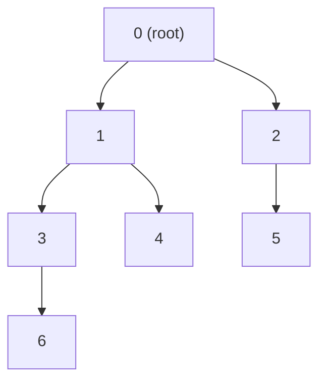

The whole engine is a **post-order** traversal: visit all children first, then combine their
results at the parent. If `f(v)` denotes the value computed for the subtree rooted at `v`, then

$$
f(v) = \text{combine}\big(\, a_v,\; \{\, f(c) : c \in \text{children}(v) \,\}\,\big)
$$

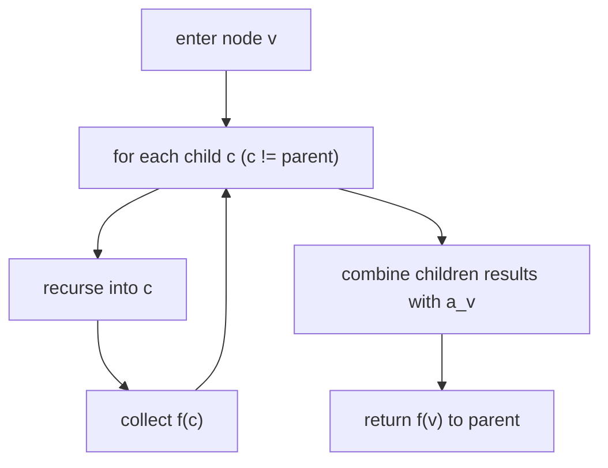

A minimal post-order skeleton that just sums subtree values:

```python
import sys
from collections import defaultdict

def build_and_sum(n, edges, value):
    g = defaultdict(list)
    for u, v in edges:
        g[u].append(v)
        g[v].append(u)

    def dfs(v, parent):
        total = value[v]
        for c in g[v]:
            if c != parent:           # do not walk back to the parent
                total += dfs(c, v)
        return total                  # f(v) = subtree sum

    return dfs(0, -1)
```

```cpp
#include <bits/stdc++.h>
using namespace std;

vector<vector<int>> g;
vector<long long> value;

long long dfs(int v, int parent) {
    long long total = value[v];
    for (int c : g[v]) {
        if (c != parent) {            // skip the edge back to the parent
            total += dfs(c, v);
        }
    }
    return total;                     // f(v) = subtree sum
}
```

The `parent` argument is what replaces a *visited* array on a tree: since there are no cycles,
"do not go back to where you came from" is enough to avoid revisiting nodes.

---

## 2. The "Return State for a Subtree" Pattern

The art of tree DP is choosing **what each subtree returns**. The parent must be able to finish
its decision using only the children's returned values — nothing else. When a single number is
not enough, return a **tuple of states**, one per possible "shape" the subtree can present to its
parent.

For example, in many problems a node can be in two relevant configurations:

- `dp[v][0]` — the best for `v`'s subtree assuming **`v` is NOT selected**.
- `dp[v][1]` — the best for `v`'s subtree assuming **`v` IS selected**.

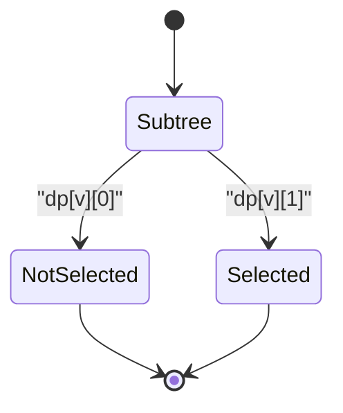

The parent then merges children by reading the child state that is **compatible** with the
parent's own choice. The general two-state recurrence looks like:

$$
dp[v][1] = a_v + \sum_{c \in \text{children}(v)} dp[c][0]
$$
$$
dp[v][0] = \sum_{c \in \text{children}(v)} \max\big(dp[c][0],\, dp[c][1]\big)
$$

Reading those two lines is the core skill: *if I take `v`, children must be in state 0; if I
skip `v`, children are free to be in their better state.*

```python
def two_state_dfs(v, parent, g, a):
    take = a[v]                 # dp[v][1]: v is selected
    skip = 0                    # dp[v][0]: v is not selected
    for c in g[v]:
        if c != parent:
            c_take, c_skip = two_state_dfs(c, v, g, a)
            take += c_skip                    # selected v forces child skipped
            skip += max(c_take, c_skip)       # free to pick child's best
    return take, skip
```

```cpp
#include <bits/stdc++.h>
using namespace std;

// returns {take, skip} = {dp[v][1], dp[v][0]}
pair<long long,long long> two_state_dfs(int v, int parent,
                                        vector<vector<int>>& g,
                                        vector<long long>& a) {
    long long take = a[v];      // dp[v][1]: v selected
    long long skip = 0;         // dp[v][0]: v not selected
    for (int c : g[v]) {
        if (c != parent) {
            auto [c_take, c_skip] = two_state_dfs(c, v, g, a);
            take += c_skip;                      // selected v forces child skipped
            skip += max(c_take, c_skip);         // free to pick child's best
        }
    }
    return {take, skip};
}
```

---

## 3. Include / Exclude — Maximum Independent Set

The **Maximum Weight Independent Set** on a tree is the textbook application of the two-state
pattern. An *independent set* is a set of nodes with no two adjacent; we want the maximum total
weight. The constraint "no two adjacent" maps exactly to "if I include `v`, I cannot include any
child of `v`".

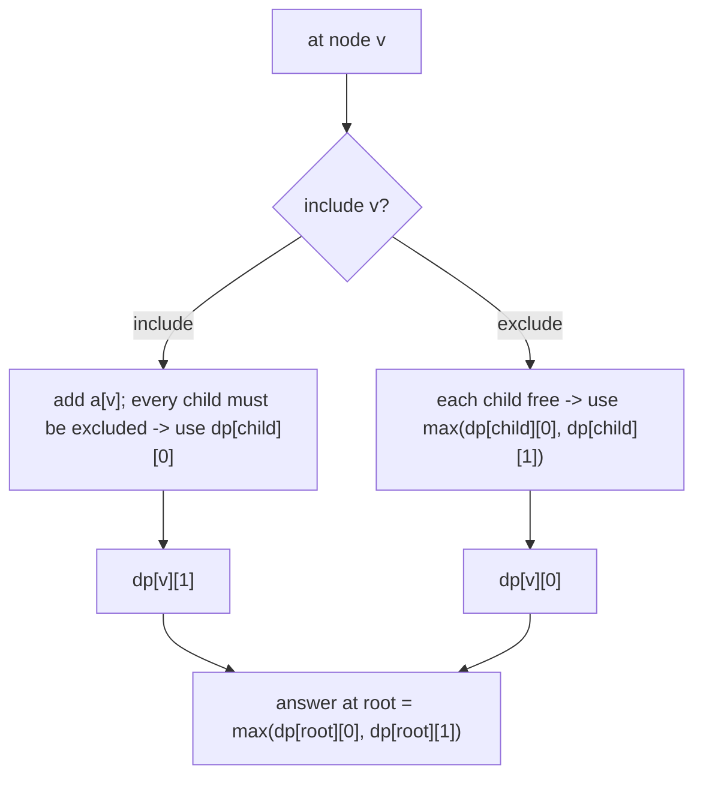

The recurrence is exactly the one from Section 2; the final answer is
$\max\big(dp[\text{root}][0], dp[\text{root}][1]\big)$.

```python
import sys

def max_weight_independent_set(n, edges, weight):
    sys.setrecursionlimit(1 << 25)
    g = [[] for _ in range(n)]
    for u, v in edges:
        g[u].append(v)
        g[v].append(u)

    def dfs(v, parent):
        take = weight[v]                  # include v
        skip = 0                          # exclude v
        for c in g[v]:
            if c != parent:
                c_take, c_skip = dfs(c, v)
                take += c_skip            # neighbour of included v must be excluded
                skip += max(c_take, c_skip)
        return take, skip

    a, b = dfs(0, -1)
    return max(a, b)
```

```cpp
#include <bits/stdc++.h>
using namespace std;

vector<vector<int>> g;
vector<long long> weight;

pair<long long,long long> dfs(int v, int parent) {
    long long take = weight[v];           // include v
    long long skip = 0;                   // exclude v
    for (int c : g[v]) {
        if (c != parent) {
            auto [c_take, c_skip] = dfs(c, v);
            take += c_skip;               // neighbour of included v excluded
            skip += max(c_take, c_skip);
        }
    }
    return {take, skip};
}

long long max_weight_independent_set(int n, vector<pair<int,int>>& edges,
                                     vector<long long>& w) {
    g.assign(n, {});
    weight = w;
    for (auto [u, v] : edges) {
        g[u].push_back(v);
        g[v].push_back(u);
    }
    auto [a, b] = dfs(0, -1);
    return max(a, b);
}
```

House Robber III (file [0337-house-robber-iii.md](../problems/0337-house-robber-iii.md)) is this
exact DP on a binary tree.

---

## 4. Tree Diameter via DP

The **diameter** of a tree is the number of edges on the longest path between any two nodes.
There are two famous methods: two BFS passes, and a single DFS with DP. The DP method is the one
that generalizes, so learn it well.

Key idea: for each node `v`, compute `down[v]` = the length of the longest **downward** path that
starts at `v` and goes into its subtree. A path that *peaks* at `v` is formed by gluing the two
deepest child branches together through `v`.

$$
\text{down}[v] = 1 + \max_{c \in \text{children}(v)} \text{down}[c]
$$

$$
\text{diameter} = \max_v \Big( \text{top two of } (1 + \text{down}[c]) \text{ summed} \Big)
$$

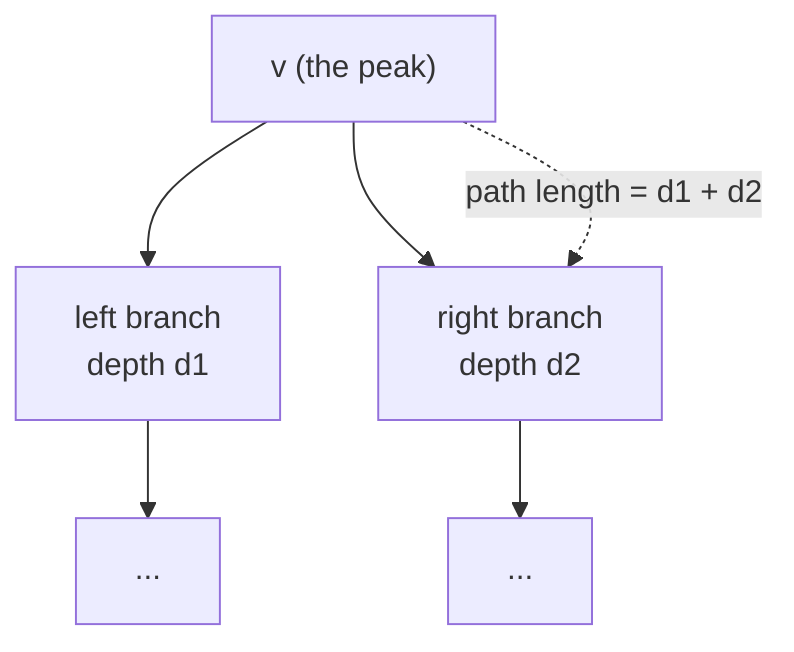

As the DFS unwinds, at each node we take the two largest child depths and try `best1 + best2` as
a candidate diameter, while returning `1 + best1` upward.

```python
def tree_diameter(n, edges):
    g = [[] for _ in range(n)]
    for u, v in edges:
        g[u].append(v)
        g[v].append(u)

    best = 0                                  # diameter in edges

    def dfs(v, parent):
        nonlocal best
        top1 = top2 = 0                       # two deepest downward depths
        for c in g[v]:
            if c != parent:
                d = dfs(c, v) + 1             # depth via child c
                if d > top1:
                    top2, top1 = top1, d
                elif d > top2:
                    top2 = d
        best = max(best, top1 + top2)         # path peaking at v
        return top1                           # longest downward path from v

    dfs(0, -1)
    return best
```

```cpp
#include <bits/stdc++.h>
using namespace std;

vector<vector<int>> g;
long long best = 0;                           // diameter in edges

long long dfs(int v, int parent) {
    long long top1 = 0, top2 = 0;             // two deepest downward depths
    for (int c : g[v]) {
        if (c != parent) {
            long long d = dfs(c, v) + 1;      // depth via child c
            if (d > top1) { top2 = top1; top1 = d; }
            else if (d > top2) { top2 = d; }
        }
    }
    best = max(best, top1 + top2);            // path peaking at v
    return top1;                              // longest downward path from v
}
```

The full worked problem is in [tree-diameter-dp.md](../problems/tree-diameter-dp.md).

---

## 5. Subtree Aggregates

Many queries reduce to computing, for every node, an **aggregate over its subtree**: the size,
the sum of weights, the count of marked nodes, the max value, and so on. These are pure
post-order accumulations and are the building blocks for harder DPs and for rerooting.

$$
\text{size}[v] = 1 + \sum_{c \in \text{children}(v)} \text{size}[c]
\qquad
\text{sum}[v] = a_v + \sum_{c \in \text{children}(v)} \text{sum}[c]
$$

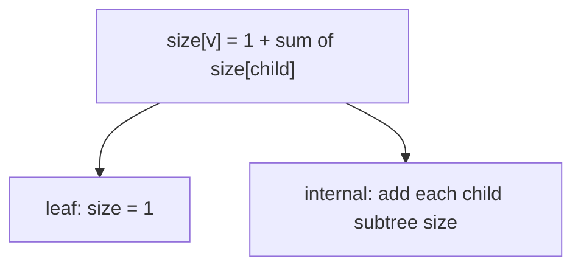

```python
def subtree_sizes(n, edges):
    g = [[] for _ in range(n)]
    for u, v in edges:
        g[u].append(v)
        g[v].append(u)
    size = [1] * n

    def dfs(v, parent):
        for c in g[v]:
            if c != parent:
                dfs(c, v)
                size[v] += size[c]            # accumulate child subtree size

    dfs(0, -1)
    return size
```

```cpp
#include <bits/stdc++.h>
using namespace std;

vector<vector<int>> g;
vector<long long> sz;

void dfs(int v, int parent) {
    sz[v] = 1;
    for (int c : g[v]) {
        if (c != parent) {
            dfs(c, v);
            sz[v] += sz[c];                   // accumulate child subtree size
        }
    }
}
```

Once you have `size[v]`, useful facts fall out for free: the number of nodes *outside* `v`'s
subtree is $n - \text{size}[v]$, which is the starting point of the rerooting trick.

---

## 6. Rerooting — An Answer for Every Root in O(n)

Sometimes you need an answer **for every node as if it were the root** — for example "for each
node, the sum of distances to all other nodes". The naive way runs a DFS from each node in
$O(n^2)$. **Rerooting** computes all $n$ answers in $O(n)$ with two passes.

- **Pass 1 (down):** a normal post-order DFS that computes each subtree aggregate as seen from the
  fixed root, e.g. `down[v]` and `size[v]`.
- **Pass 2 (up):** a pre-order DFS that pushes information from a parent *down into* a child,
  reusing the parent's already-finished answer to build the child's full-tree answer.

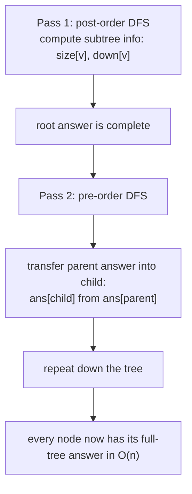

A diagram of the two directions of information flow:

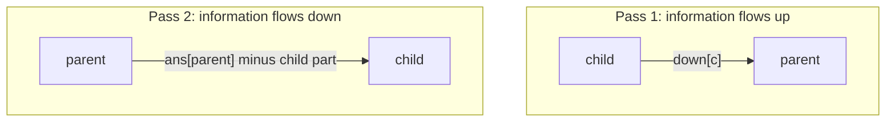

Concrete example: **sum of distances** from each node to all others. Let `down[v]` be the sum of
distances from `v` to nodes in its own subtree, and `size[v]` the subtree size. When we move the
root from a parent `p` to a child `c`, `size[c]` nodes get **one step closer** and the remaining
`n - size[c]` nodes get **one step farther**:

$$
\text{ans}[c] = \text{ans}[p] - \text{size}[c] + (n - \text{size}[c])
$$

```python
def sum_of_distances(n, edges):
    g = [[] for _ in range(n)]
    for u, v in edges:
        g[u].append(v)
        g[v].append(u)

    size = [1] * n
    down = [0] * n                            # sum of dist to own subtree

    def dfs_down(v, parent):
        for c in g[v]:
            if c != parent:
                dfs_down(c, v)
                size[v] += size[c]
                down[v] += down[c] + size[c]  # each subtree node is 1 farther

    ans = [0] * n

    def dfs_up(v, parent):
        for c in g[v]:
            if c != parent:
                # move root from v to c
                ans[c] = ans[v] - size[c] + (n - size[c])
                dfs_up(c, v)

    dfs_down(0, -1)
    ans[0] = down[0]
    dfs_up(0, -1)
    return ans
```

```cpp
#include <bits/stdc++.h>
using namespace std;

vector<vector<int>> g;
vector<long long> sz, down_, ans;
int N;

void dfs_down(int v, int parent) {
    sz[v] = 1;
    down_[v] = 0;
    for (int c : g[v]) {
        if (c != parent) {
            dfs_down(c, v);
            sz[v] += sz[c];
            down_[v] += down_[c] + sz[c];     // each subtree node is 1 farther
        }
    }
}

void dfs_up(int v, int parent) {
    for (int c : g[v]) {
        if (c != parent) {
            ans[c] = ans[v] - sz[c] + (N - sz[c]);   // reroot v -> c
            dfs_up(c, v);
        }
    }
}

vector<long long> sum_of_distances(int n, vector<pair<int,int>>& edges) {
    N = n;
    g.assign(n, {});
    sz.assign(n, 0);
    down_.assign(n, 0);
    ans.assign(n, 0);
    for (auto [u, v] : edges) {
        g[u].push_back(v);
        g[v].push_back(u);
    }
    dfs_down(0, -1);
    ans[0] = down_[0];
    dfs_up(0, -1);
    return ans;
}
```

The rerooting transition is always "remove the child's contribution to the parent answer, then
re-add the parent's contribution to the child answer" — derived per problem from how the
aggregate changes when the root shifts by one edge.

---

## 7. Minimum Vertex Cover and Cameras

A **vertex cover** is a set of nodes such that *every edge* has at least one endpoint in the set;
we want the minimum such set on a tree. This is the include/exclude pattern again, but now if you
**exclude** a node, *all* its children must be **included** to cover the connecting edges.

$$
dp[v][1] = 1 + \sum_{c} \min\big(dp[c][0],\, dp[c][1]\big)
$$
$$
dp[v][0] = \sum_{c} dp[c][1]
$$

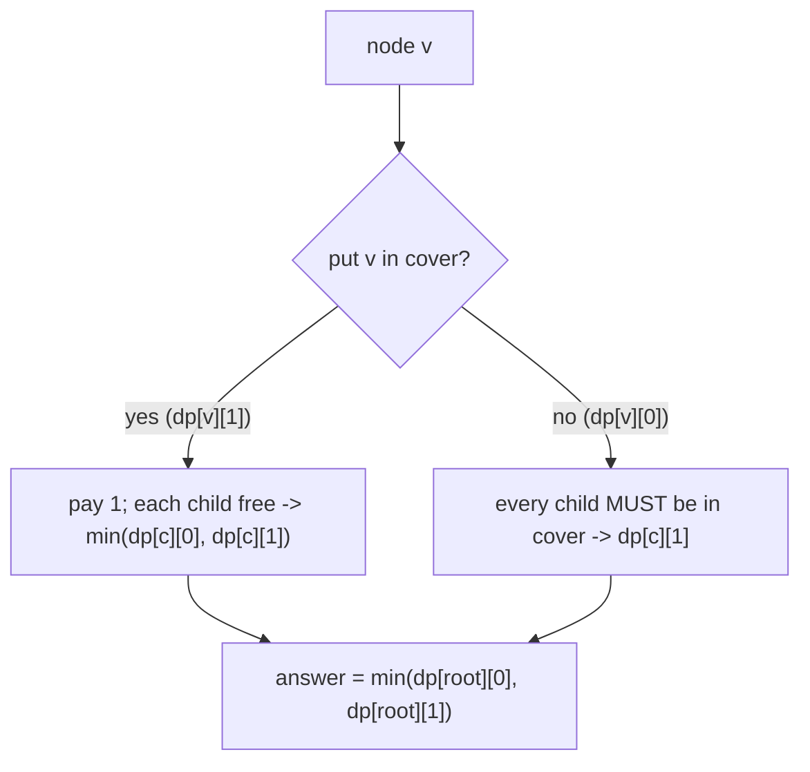

The closely related **Binary Tree Cameras** problem (LeetCode 968) tightens this to a
three-state machine — each node is *has a camera*, *covered by a child/parent*, or *not yet
covered* — and is solved greedily from the leaves up. A clean way to encode the three states:

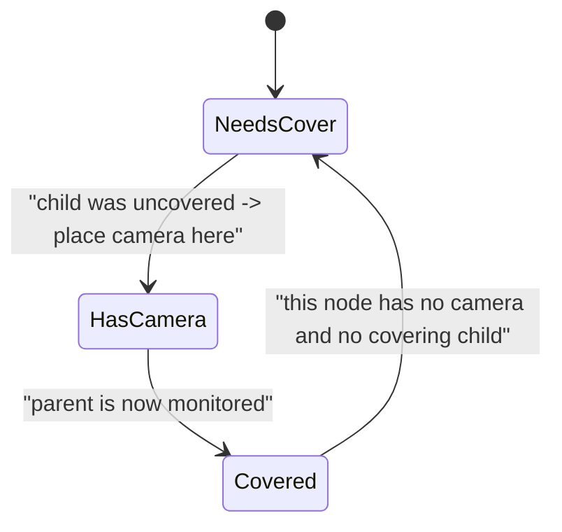

```python
def min_vertex_cover(n, edges):
    g = [[] for _ in range(n)]
    for u, v in edges:
        g[u].append(v)
        g[v].append(u)

    def dfs(v, parent):
        inc = 1                                # v in cover
        exc = 0                                # v not in cover
        for c in g[v]:
            if c != parent:
                c_inc, c_exc = dfs(c, v)
                inc += min(c_inc, c_exc)       # child free
                exc += c_inc                   # child must cover the edge
        return inc, exc

    a, b = dfs(0, -1)
    return min(a, b)
```

```cpp
#include <bits/stdc++.h>
using namespace std;

vector<vector<int>> g;

pair<long long,long long> dfs(int v, int parent) {
    long long inc = 1;                         // v in cover
    long long exc = 0;                         // v not in cover
    for (int c : g[v]) {
        if (c != parent) {
            auto [c_inc, c_exc] = dfs(c, v);
            inc += min(c_inc, c_exc);          // child free
            exc += c_inc;                      // child must cover the edge
        }
    }
    return {inc, exc};
}

long long min_vertex_cover(int n, vector<pair<int,int>>& edges) {
    g.assign(n, {});
    for (auto [u, v] : edges) {
        g[u].push_back(v);
        g[v].push_back(u);
    }
    auto [a, b] = dfs(0, -1);
    return min(a, b);
}
```

The full camera state machine is solved in
[0968-binary-tree-cameras.md](../problems/0968-binary-tree-cameras.md).

---

## 8. Handling Large n with Iterative DFS

Recursive DFS is clean, but a path-shaped tree of $n = 2 \times 10^5$ nodes recurses that deep
and overflows the default stack — in C++ you get a segmentation fault, in Python a
`RecursionError`. Two fixes:

1. In Python, raise the limit with `sys.setrecursionlimit(1 << 25)` (and on some judges run the
   real work on a worker thread with a larger stack).
2. In C++, rewrite the DFS **iteratively** with an explicit stack so depth is bounded only by
   heap memory.

The standard iterative post-order keeps an explicit stack of `(node, parent, child_index)` and
processes a node's combine step *after* its children are done.

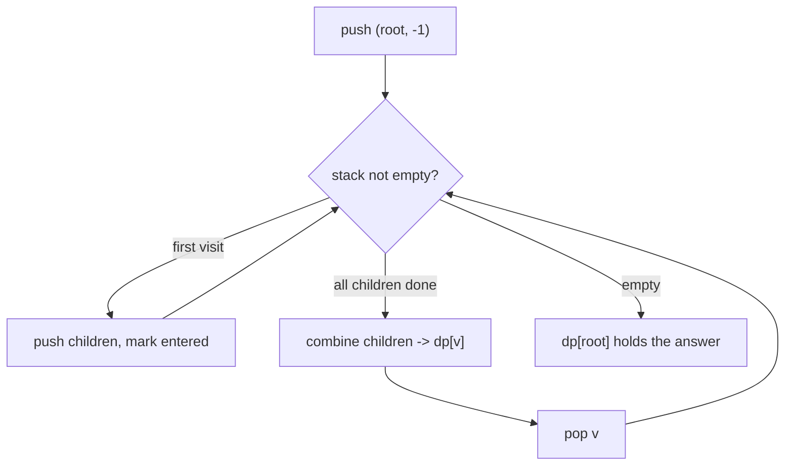

Python with a raised limit (clear and usually sufficient):

```python
import sys

def subtree_sum_iterative(n, edges, value):
    sys.setrecursionlimit(1 << 25)
    g = [[] for _ in range(n)]
    for u, v in edges:
        g[u].append(v)
        g[v].append(u)

    dp = [0] * n
    order, stack = [], [(0, -1)]
    parent_of = [-1] * n
    while stack:                               # iterative: collect an order
        v, p = stack.pop()
        parent_of[v] = p
        order.append(v)
        for c in g[v]:
            if c != p:
                stack.append((c, v))
    for v in reversed(order):                  # process leaves before parents
        dp[v] += value[v]
        if parent_of[v] != -1:
            dp[parent_of[v]] += dp[v]
    return dp[0]
```

```cpp
#include <bits/stdc++.h>
using namespace std;

// Iterative post-order: avoids stack overflow for deep / path-like trees.
long long subtree_sum_iterative(int n, vector<pair<int,int>>& edges,
                                vector<long long>& value) {
    vector<vector<int>> g(n);
    for (auto [u, v] : edges) {
        g[u].push_back(v);
        g[v].push_back(u);
    }
    vector<long long> dp(n, 0);
    vector<int> parent_of(n, -1), order;
    order.reserve(n);

    vector<pair<int,int>> st;                  // {node, parent}
    st.push_back({0, -1});
    while (!st.empty()) {                      // collect a valid order
        auto [v, p] = st.back();
        st.pop_back();
        parent_of[v] = p;
        order.push_back(v);
        for (int c : g[v]) {
            if (c != p) st.push_back({c, v});
        }
    }
    for (int i = (int)order.size() - 1; i >= 0; --i) {  // leaves first
        int v = order[i];
        dp[v] += value[v];
        if (parent_of[v] != -1) dp[parent_of[v]] += dp[v];
    }
    return dp[0];
}
```

The trick — push every node, record the visit order, then process it in **reverse** — guarantees
each node is combined only after all its descendants, with no recursion at all.

---

## Complexity Summary

| Problem | State / Return | Time | Space |
|---------|----------------|------|-------|
| Subtree aggregates (size, sum) | scalar per node | $O(n)$ | $O(n)$ |
| Max weight independent set | $dp[v][\text{take/skip}]$ | $O(n)$ | $O(n)$ |
| Tree diameter | two deepest child depths | $O(n)$ | $O(n)$ |
| Minimum vertex cover | $dp[v][\text{in/out}]$ | $O(n)$ | $O(n)$ |
| Binary tree cameras | 3-state per node | $O(n)$ | $O(h)$ |
| Sum of distances (rerooting) | down pass + up pass | $O(n)$ | $O(n)$ |
| Iterative subtree DP | explicit stack order | $O(n)$ | $O(n)$ |

---

## Common Pitfalls

- **Forgetting the `parent` guard.** On an undirected adjacency list you must skip the edge back
  to the parent, or the DFS loops between a node and its parent forever.
- **Returning too little state.** If the parent cannot finish its choice from what the child
  returns, you under-specified the state. Add a dimension (take/skip, covered/uncovered).
- **Mixing edges and nodes in diameter.** Decide up front whether the diameter is counted in
  edges or in nodes; the base case (`0` vs `1`) and the answer differ by one.
- **Recursion depth on a path graph.** A tree can be a straight line of $n$ nodes. Raise the
  Python recursion limit or go iterative in C++ for $n \gtrsim 10^5$.
- **Double counting in rerooting.** When transferring a parent's answer to a child, remove the
  child's own contribution *before* re-adding the parent side, or nodes get counted twice.
- **Using `int` for sums.** Subtree sums of $n$ weights up to $10^9$ overflow 32-bit; use
  `long long`.

---

## Patterns

- **Post-order = solve children first.** Any "value of a subtree" is a single DFS that combines
  child results at the parent.
- **State = the shapes a subtree can show its parent.** Pick the minimal label set so the parent
  can decide; usually two or three states.
- **Include/exclude is the workhorse.** Independent set, vertex cover, and House Robber III are
  the same `take` forces children one way, `skip` leaves them free recurrence.
- **Diameter = glue the two deepest branches at a peak node.** Return one branch up, test the sum
  of the top two as a candidate.
- **Rerooting = down pass then up pass.** Compute subtree answers once, then slide the root edge
  by edge, adjusting the aggregate by a constant-time formula.
- **Go iterative for big trees.** Record a visit order and process it in reverse to dodge the call
  stack entirely.
