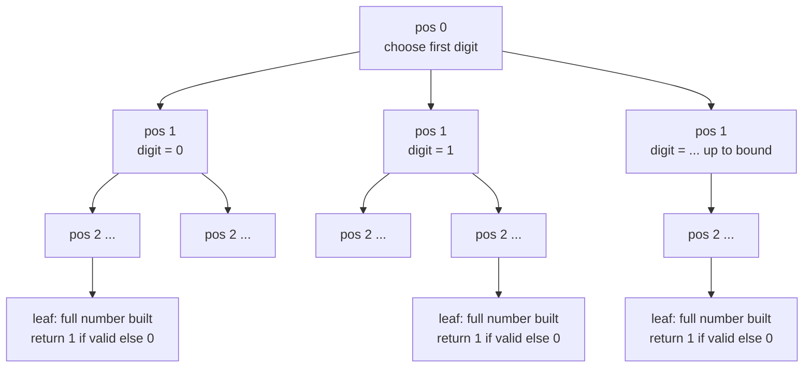
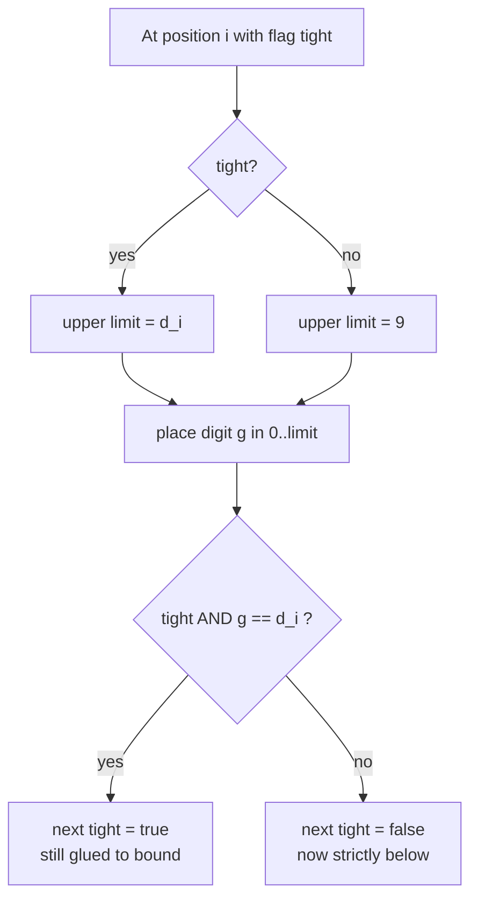
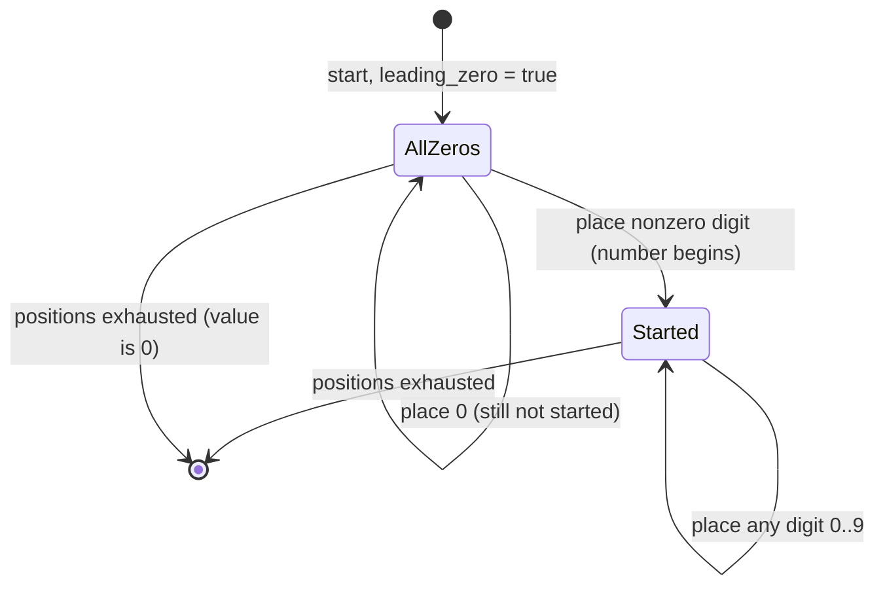
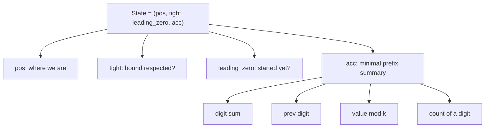
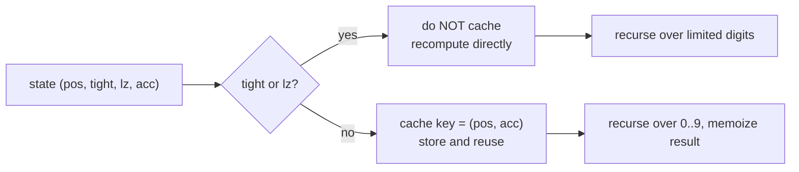
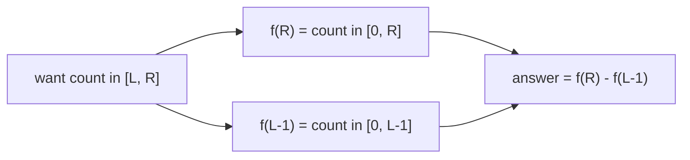
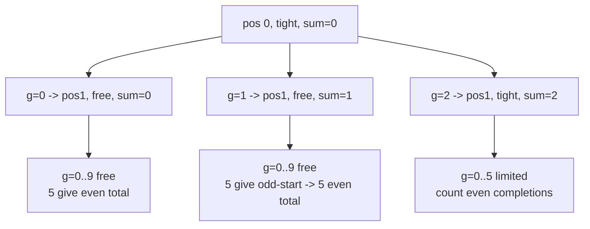

# Digit DP — Complete Guide (Beginner → Advanced)

> Some counting problems ask: *how many integers in $[0, N]$ (or $[L, R]$) satisfy a property
> about their **digits**?* The number $N$ can have $10^{18}$ as its value, so you cannot loop
> over every integer. **Digit DP** counts them by building the number **one digit at a time**,
> from the most significant digit to the least, while carrying a tiny amount of state.
>
> The whole idea rests on a single trick: a number is "valid so far" if, position by position,
> we have respected the upper bound $N$ and any digit constraint. We track whether we are still
> **glued to the prefix of $N$** (the `tight` flag), whether we have **only placed zeros so far**
> (the `leading_zero` flag), and a few **accumulators** specific to the property (a running digit
> sum, the previous digit, a remainder, a count of some digit, …).
>
> Once the recursion is `tight`-free it depends only on a handful of small numbers, so we
> **memoize** on `(position, accumulators)` and the whole count collapses to a polynomial in the
> number of digits. A range $[L, R]$ becomes $f(R) - f(L-1)$, where $f(X)$ counts valid numbers
> in $[0, X]$.

---

## Table of Contents
1. [The Core Idea: Build Digit by Digit](#1-the-core-idea-build-digit-by-digit)
2. [The `tight` (Bound) Flag](#2-the-tight-bound-flag)
3. [The `leading_zero` Flag](#3-the-leading_zero-flag)
4. [Designing the State](#4-designing-the-state)
5. [Memoization on Non-Tight States](#5-memoization-on-non-tight-states)
6. [Top-Down Recursion Template](#6-top-down-recursion-template)
7. [Counting Over a Range with f(R) − f(L−1)](#7-counting-over-a-range-with-fr--fl1)
8. [Worked Mini-Example](#8-worked-mini-example)
9. [Complexity Summary](#complexity-summary)
10. [Common Pitfalls](#common-pitfalls)
11. [Patterns](#patterns)

---

## 1. The Core Idea: Build Digit by Digit

Write $N$ as a string of digits $d_0 d_1 \ldots d_{m-1}$ (most significant first). Instead of
enumerating numbers, we enumerate **digit choices** at each position. At position $i$ we choose
a digit $g$, move to position $i+1$, and accumulate whatever the property needs. When we run out
of positions we have built one complete number — we return $1$ if it is valid, else $0$.

$$
f(N) = \#\{\, x : 0 \le x \le N,\ P(x) \text{ holds}\,\}
$$

The recursion tree branches on the digit placed at each position:



The key insight: **most subtrees are identical** once we drop the bound constraint, which is
exactly what makes memoization powerful.

---

## 2. The `tight` (Bound) Flag

While building digits we must never exceed $N$. The flag `tight` answers: *is the prefix we have
placed so far exactly equal to the corresponding prefix of $N$?*

- If `tight` is **true**, the current digit may range only from $0$ up to $d_i$ (the digit of $N$
  at this position). The upper limit is $d_i$.
- If `tight` is **false**, the prefix is already strictly smaller than $N$'s prefix, so the
  remaining digits are **free**: each may range over $0 \ldots 9$.

The transition rule for the next `tight`:

$$
\text{tight}' =
\begin{cases}
\text{true}  & \text{if tight and } g = d_i \\
\text{false} & \text{otherwise}
\end{cases}
$$



Only **one path** stays tight at every step — the path that copies $N$ digit for digit. Every
other path falls off the bound and becomes free, which is why we may share results across them.

---

## 3. The `leading_zero` Flag

Numbers do not have leading zeros: `7` is one digit, not `0007`. But while building a fixed-width
digit string we *do* place leading zeros for short numbers. The `leading_zero` flag marks: *have
we placed only zeros so far?* — i.e. the real number has not "started" yet.

This flag matters whenever the property depends on the **actual** digits, for example:

- Counting occurrences of a digit (a leading zero is not a real `0`).
- "No two adjacent equal digits" — a leading zero should not count as the previous digit.
- Counting numbers with a given number of digits.



Transition rule for the next `leading_zero`:

$$
\text{leadingZero}' = \text{leadingZero} \,\land\, (g = 0)
$$

That is: we are still "all zeros" only if we were before **and** we just placed another zero.

---

## 4. Designing the State

A digit-DP state is the **minimal information** the recursion needs to finish counting. It always
contains the building cursor and the two flags, plus problem-specific accumulators:

| State piece | Meaning | Always present? |
|-------------|---------|-----------------|
| `pos` | current digit index (0 = most significant) | yes |
| `tight` | still glued to the upper bound $N$ | yes |
| `leading_zero` | only zeros placed so far | usually |
| accumulator(s) | digit sum / previous digit / remainder / count | problem-specific |

Choosing accumulators is the art. Pick the *smallest* summary of the prefix that determines
whether each completion is valid:

- **Digit sum equals $S$** → carry the running sum (cap it; sums above $S$ are dead).
- **Divisible by $k$** → carry the running value $\bmod k$.
- **No two adjacent equal digits** → carry the previous digit.
- **Count of digit `1`** → carry the running count of ones.



The number of distinct $(pos, acc)$ pairs times $10$ (digit choices) is your time bound.

---

## 5. Memoization on Non-Tight States

Here is the central efficiency rule:

> **We memoize only states where `tight` is false (and usually `leading_zero` is false).**

Why? When `tight` is true the available digits depend on $N$'s specific prefix, so that state is
visited **at most once** along the single bound-hugging path — caching it gives nothing. When
`tight` is false, the subproblem "count completions from `pos` with accumulator `acc`" is the
**same** no matter how we arrived, so it is reused across the whole tree.

$$
\underbrace{f(pos, acc)}_{\text{cacheable}} = \sum_{g=0}^{9} f\big(pos+1,\ \text{update}(acc, g)\big)
$$



In code, the memo table is indexed by `(pos, acc)` and only **written/read** when `tight == false`.
Leading-zero states are likewise excluded if the accumulator's meaning differs before the number
"starts".

---

## 6. Top-Down Recursion Template

The canonical shape: convert $N$ to a digit list, recurse from `pos = 0` with `tight = true`,
`leading_zero = true`, empty accumulator, and a memo keyed on the cacheable dimensions.

```python
from functools import lru_cache

def count_upto(N):
    digits = list(map(int, str(N)))
    n = len(digits)

    @lru_cache(maxsize=None)
    def go(pos, acc, tight, leading_zero):
        if pos == n:
            return 1 if is_valid(acc, leading_zero) else 0
        limit = digits[pos] if tight else 9
        total = 0
        for g in range(0, limit + 1):
            ntight = tight and (g == limit)
            nlz = leading_zero and (g == 0)
            nacc = update(acc, g, leading_zero)
            total += go(pos + 1, nacc, ntight, nlz)
        return total

    return go(0, 0, True, True)
```

```cpp
#include <bits/stdc++.h>
using namespace std;

int digits[20], n;
long long memo[20][/*acc*/200][2];   // sized to the accumulator range
bool seen[20][200][2];

long long go(int pos, int acc, bool tight, bool leadingZero) {
    if (pos == n) return isValid(acc, leadingZero) ? 1 : 0;
    // memoize only when NOT tight (and not leadingZero if it changes meaning)
    if (!tight && !leadingZero && seen[pos][acc][0]) return memo[pos][acc][0];
    int limit = tight ? digits[pos] : 9;
    long long total = 0;
    for (int g = 0; g <= limit; ++g) {
        bool ntight = tight && (g == limit);
        bool nlz = leadingZero && (g == 0);
        int nacc = update(acc, g, leadingZero);
        total += go(pos + 1, nacc, ntight, nlz);
    }
    if (!tight && !leadingZero) { seen[pos][acc][0] = true; memo[pos][acc][0] = total; }
    return total;
}

long long count_upto(long long N) {
    string s = to_string(N);
    n = (int)s.size();
    for (int i = 0; i < n; ++i) digits[i] = s[i] - '0';
    memset(seen, 0, sizeof(seen));
    return go(0, 0, true, true);
}
```

Notice the C++ memo carries a third index for the flags but **only the non-tight slice is ever
stored** — the `if (!tight && !leadingZero)` guard enforces the rule from Section 5.

---

## 7. Counting Over a Range with f(R) − f(L−1)

Digit DP naturally counts over the **prefix range** $[0, X]$. To count over an arbitrary
$[L, R]$ we use the inclusion principle on prefixes:

$$
\#\{x : L \le x \le R,\ P(x)\} = f(R) - f(L-1)
$$

where $f(X) = \#\{x : 0 \le x \le X,\ P(x)\}$. Subtracting $f(L-1)$ removes everything below $L$.



Edge cases to respect:

- If $L = 0$, then $f(L-1) = f(-1) = 0$ (nothing below $0$).
- Recompute / reset the memo between the two calls if the bound's digit length differs, or key
  the memo on length-independent `(pos, acc)` (the standard setup already does this since `pos`
  counts from the most significant digit of each specific bound).

```python
def count_in_range(L, R):
    return count_upto(R) - (count_upto(L - 1) if L > 0 else 0)
```

```cpp
long long count_in_range(long long L, long long R) {
    return count_upto(R) - (L > 0 ? count_upto(L - 1) : 0);
}
```

---

## 8. Worked Mini-Example

Count integers in $[0, 25]$ whose digit sum is even. Here the accumulator is the running digit
sum's **parity**, the validity test is `acc % 2 == 0`, and `leading_zero` does not change parity
(adding a leading zero keeps the sum). The bound digits are `[2, 5]`.



The free subtree `pos1, sum parity p` is computed **once** and reused for both `g=0` and `g=1`
branches — that reuse is exactly the memoization payoff.

```python
def even_digit_sum_upto(N):
    digits = list(map(int, str(N)))
    n = len(digits)
    from functools import lru_cache

    @lru_cache(maxsize=None)
    def go(pos, parity, tight):
        if pos == n:
            return 1 if parity == 0 else 0
        limit = digits[pos] if tight else 9
        total = 0
        for g in range(limit + 1):
            total += go(pos + 1, (parity + g) & 1, tight and g == limit)
        return total

    return go(0, 0, True)
```

```cpp
#include <bits/stdc++.h>
using namespace std;

int dg[20], len;
long long mem[20][2];
bool vis[20][2];

long long go(int pos, int parity, bool tight) {
    if (pos == len) return parity == 0 ? 1 : 0;
    if (!tight && vis[pos][parity]) return mem[pos][parity];
    int limit = tight ? dg[pos] : 9;
    long long total = 0;
    for (int g = 0; g <= limit; ++g)
        total += go(pos + 1, (parity + g) & 1, tight && g == limit);
    if (!tight) { vis[pos][parity] = true; mem[pos][parity] = total; }
    return total;
}

long long even_digit_sum_upto(long long N) {
    string s = to_string(N);
    len = (int)s.size();
    for (int i = 0; i < len; ++i) dg[i] = s[i] - '0';
    memset(vis, 0, sizeof(vis));
    return go(0, 0, true);
}
```

---

## Complexity Summary

Let $m$ be the number of digits of $N$ (so $m \approx \log_{10} N$), $A$ the size of the
accumulator domain, and $B = 10$ the number of digit choices.

| Quantity | Value |
|----------|-------|
| Distinct cached states | $O(m \cdot A)$ |
| Work per state | $O(B) = O(10)$ |
| Time | $O(m \cdot A \cdot 10)$ |
| Space (memo) | $O(m \cdot A)$ |
| Range query $[L,R]$ | two prefix calls: still $O(m \cdot A \cdot 10)$ |

For a 64-bit bound, $m \le 19$, so even with $A$ in the hundreds the work is microscopic.

---

## Common Pitfalls

- **Caching tight states.** Never read/write the memo when `tight` is true — those states are
  bound-specific and visited once. Caching them corrupts other bounds.
- **Forgetting `leading_zero`.** Properties about *real* digits (digit counts, adjacency) break if
  leading zeros are treated as genuine digits. Add and respect the flag.
- **Wrong digit limit.** When `tight`, the upper digit is $d_{pos}$, **not** $9$. Mixing these up
  silently overcounts.
- **`f(L-1)` underflow.** When $L = 0$, do not call `count_upto(-1)`; treat it as $0$.
- **Accumulator blow-up.** Cap or fold the accumulator (parity, $\bmod k$, capped sum) so the
  state space stays small; an uncapped running value defeats memoization.
- **Memo not reset across bounds with different lengths.** If you index the memo by length-relative
  `pos`, reset it (or design it length-independent) between `f(R)` and `f(L-1)` calls.
- **Counting the number `0`.** Decide explicitly whether $0$ should count; the `leading_zero` leaf
  is where that decision lives.

---

## Patterns

- **Count in $[0, N]$ by digits** → recurse `(pos, tight, leading_zero, acc)`, memo on `(pos, acc)`.
- **Range $[L, R]$** → $f(R) - f(L-1)$.
- **Digit-sum constraint** → accumulator = running sum (capped) or its parity / residue.
- **Divisibility by $k$** → accumulator = running value $\bmod k$.
- **Adjacency / pattern constraint** → accumulator = previous digit, guarded by `leading_zero`.
- **Count occurrences of a digit** → accumulator = running count (and validity returns the count
  at the leaf, or sum contributions per position).
- **At-most / exactly / k-th** → digit DP gives "at most"; subtract or binary-search positions for
  "exactly" and "k-th smallest valid number".
