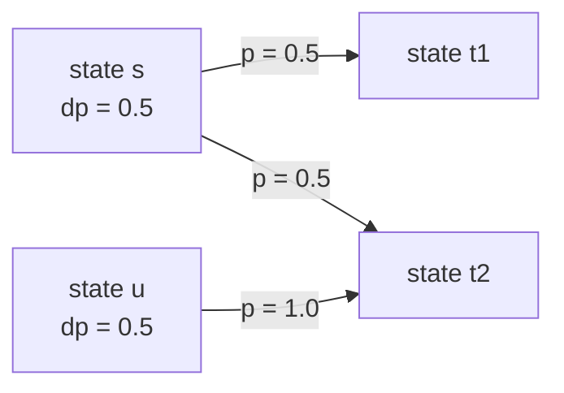
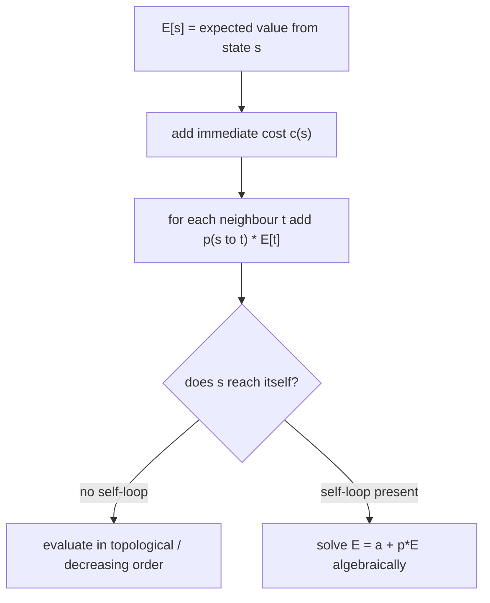
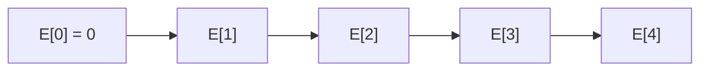
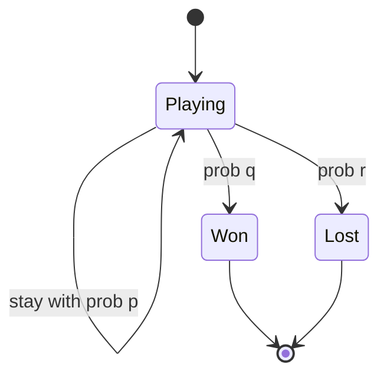
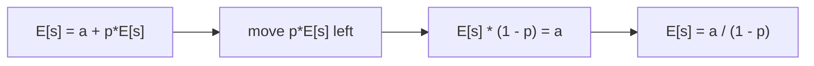
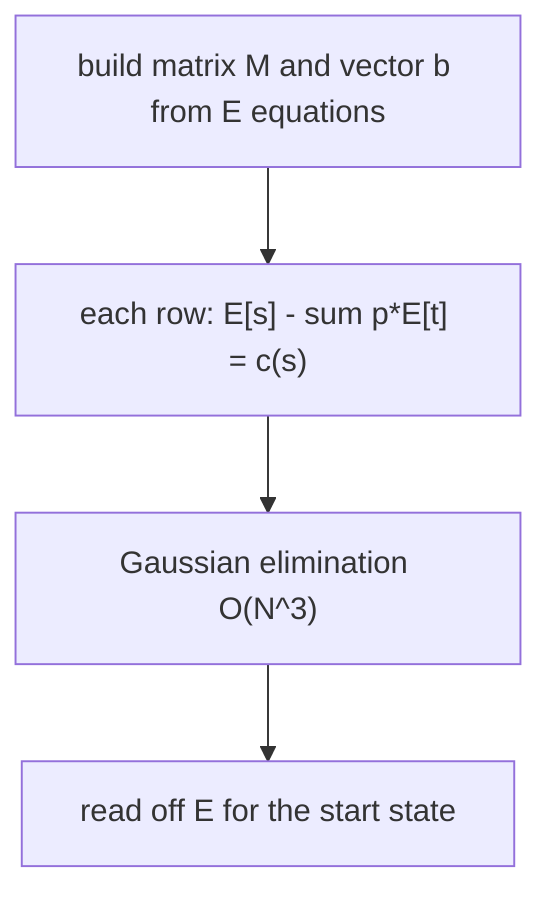

# Probability / Expected-Value DP — Complete Guide (Beginner → Advanced)

> Some problems do not ask for the *best* path or the *number* of paths — they ask
> **"what is the chance?"** or **"how many steps on average?"**. These are
> **probability DP** and **expected-value DP**. The state still collapses the history
> into a few numbers, but instead of `dp[state] = best cost`, we store
> `dp[state] = probability of being in that state` or `E[state] = expected value
> measured from that state onward`.
>
> Two ideas make the whole topic tractable. First, **probabilities of disjoint events
> add**, so a probability DP is just a weighted sum over transitions. Second,
> **linearity of expectation** lets us write `E[state]` as a local recurrence even
> when the underlying random walk is complicated. When a state can transition back to
> itself (a *self-loop*) the recurrence looks circular, but a one-line algebraic trick
> `E = a + p*E ⇒ E = a / (1 - p)` removes the loop.
>
> This guide teaches you to (1) **set up probability `dp`** as a forward push, (2)
> **set up `E[state]` recurrences** with linearity of expectation, (3) **break
> self-loops and handle absorbing states**, (4) apply a **sliding-window** speed-up
> when a transition sums a contiguous band of probabilities (New 21 Game), and (5)
> recognize when the equations form a **linear system** needing Gaussian elimination.

---

## Table of Contents
1. [Probability DP Basics](#1-probability-dp-basics)
2. [Expected Value DP and Linearity of Expectation](#2-expected-value-dp-and-linearity-of-expectation)
3. [Setting Up E[state] Recurrences](#3-setting-up-estate-recurrences)
4. [Self-Loops and Absorbing States](#4-self-loops-and-absorbing-states)
5. [Sliding-Window Optimization for Probability Sums](#5-sliding-window-optimization-for-probability-sums)
6. [When Answers Form a Linear System](#6-when-answers-form-a-linear-system)
7. [Complexity Summary](#complexity-summary)
8. [Common Pitfalls](#common-pitfalls)
9. [Patterns](#patterns)

---

## 1. Probability DP Basics

Define `dp[s]` = **probability that the process is currently in state `s`**. Because the
possible states at a given moment are mutually exclusive, the probabilities of disjoint
events add. If from state `s` you move to state `t` with probability `p(s → t)`, you
**push** mass forward:

$$
dp_{\text{next}}[t] \mathrel{+}= dp[s] \cdot p(s \to t)
$$

The total mass stays $1$ (or leaks into *absorbing* / terminal states). A simple random
walk on positions illustrates the push:



Here `t2` collects `0.5*0.5 + 0.5*1.0 = 0.75`. A canonical example: a fair coin walk of
`n` steps, where we want the distribution of net position. We push probability outward
step by step.

```python
def walk_distribution(n):
    # dp[pos] = probability of being at offset pos after current step
    dp = {0: 1.0}
    for _ in range(n):
        nxt = {}
        for pos, pr in dp.items():
            nxt[pos + 1] = nxt.get(pos + 1, 0.0) + pr * 0.5
            nxt[pos - 1] = nxt.get(pos - 1, 0.0) + pr * 0.5
        dp = nxt
    return dp
```

```cpp
#include <bits/stdc++.h>
using namespace std;

map<int, double> walk_distribution(int n) {
    // dp[pos] = probability of being at offset pos after current step
    map<int, double> dp;
    dp[0] = 1.0;
    for (int step = 0; step < n; ++step) {
        map<int, double> nxt;
        for (auto& [pos, pr] : dp) {
            nxt[pos + 1] += pr * 0.5;
            nxt[pos - 1] += pr * 0.5;
        }
        dp = move(nxt);
    }
    return dp;
}
```

**Two equivalent directions.** You can *push* (loop over current states, add to next) or
*pull* (loop over a target state, gather from predecessors). For probability, a pull at
state `s` reads:

$$
dp[s] = \sum_{\text{pred } r} dp[r] \cdot p(r \to s)
$$

The choice is a matter of which neighbours are easier to enumerate.

---

## 2. Expected Value DP and Linearity of Expectation

The **expected value** of a discrete random variable $X$ is

$$
\mathbb{E}[X] = \sum_{k} k \cdot \Pr[X = k].
$$

The property that makes DP work is **linearity of expectation**: for *any* random
variables (even dependent ones),

$$
\mathbb{E}[X + Y] = \mathbb{E}[X] + \mathbb{E}[Y].
$$

This lets us split "expected total steps" into "one step now" plus "expected steps from
wherever we land", weighted by transition probabilities. If from state `s` we pay a cost
`c(s)` and jump to neighbour `t` with probability `p(s → t)`, then

$$
\mathbb{E}[s] = c(s) + \sum_{t} p(s \to t)\,\mathbb{E}[t].
$$



A clean example: roll a fair die repeatedly; what is the expected number of rolls to see
the first `6`? From the single non-absorbing state we either finish (prob $1/6$) or stay
(prob $5/6$), each roll costing `1`:

$$
\mathbb{E} = 1 + \tfrac{5}{6}\,\mathbb{E} \;\Rightarrow\; \mathbb{E} = 6.
$$

```python
def expected_rolls_until_six():
    p_success = 1 / 6
    # E = 1 + (1 - p)*E  ->  E = 1 / p
    return 1 / p_success
```

```cpp
#include <bits/stdc++.h>
using namespace std;

double expected_rolls_until_six() {
    double p_success = 1.0 / 6.0;
    // E = 1 + (1 - p)*E  ->  E = 1 / p
    return 1.0 / p_success;
}
```

---

## 3. Setting Up E[state] Recurrences

When the state graph is a **DAG** (no cycles), `E[state]` can be filled directly by
visiting states in an order where every neighbour `t` is computed *before* `s`. Often the
state is a single integer (a position, a remaining target) and the natural order is
*decreasing* or *increasing*.

Consider climbing toward a target value `n`: each step adds a uniformly random amount in
`1..m`. The expected number of steps from a "remaining distance" of `r` is

$$
\mathbb{E}[r] = 1 + \frac{1}{m}\sum_{k=1}^{m} \mathbb{E}[\,\max(0, r-k)\,],
\qquad \mathbb{E}[0] = 0.
$$

Because every `E[r]` depends only on **smaller** remaining distances, we fill `r` from
`1` upward — a clean DAG order.



```python
def expected_steps_to_target(n, m):
    # E[r] = expected number of +1..+m moves to reduce remaining r to 0
    E = [0.0] * (n + 1)
    for r in range(1, n + 1):
        total = 0.0
        for k in range(1, m + 1):
            total += E[max(0, r - k)]
        E[r] = 1.0 + total / m
    return E[n]
```

```cpp
#include <bits/stdc++.h>
using namespace std;

double expected_steps_to_target(int n, int m) {
    // E[r] = expected number of +1..+m moves to reduce remaining r to 0
    vector<double> E(n + 1, 0.0);
    for (int r = 1; r <= n; ++r) {
        double total = 0.0;
        for (int k = 1; k <= m; ++k) total += E[max(0, r - k)];
        E[r] = 1.0 + total / m;
    }
    return E[n];
}
```

The inner sum over `k` is a sliding window of `E` values, so it can be reduced to $O(1)$
per state with a running total — see Section 5.

---

## 4. Self-Loops and Absorbing States

An **absorbing state** is one the process can enter but never leave (a goal, a death, a
sink). They are the *base cases* of expected-value DP: `E[absorbing] = 0` for "steps
remaining", or `dp[absorbing]` accumulates final probability mass.



A **self-loop** is a transition `s → s` with positive probability. Naively the recurrence
references the unknown on both sides:

$$
\mathbb{E}[s] = c(s) + p\,\mathbb{E}[s] + \sum_{t \ne s} p(s \to t)\,\mathbb{E}[t].
$$

Collect the value `a = c(s) + \sum_{t \ne s} p(s\to t)\,E[t]` (everything *not* the loop)
and solve algebraically:

$$
\mathbb{E}[s] = a + p\,\mathbb{E}[s]
\;\;\Longrightarrow\;\;
\mathbb{E}[s] = \frac{a}{1 - p}, \qquad p < 1.
$$



Example: a board square that with probability `p` makes you re-roll (stay), otherwise
advances you with known expected cost `a` to finish.

```python
def expected_with_self_loop(a, p):
    # E = a + p*E  ->  E = a / (1 - p)
    assert p < 1.0
    return a / (1.0 - p)
```

```cpp
#include <bits/stdc++.h>
using namespace std;

double expected_with_self_loop(double a, double p) {
    // E = a + p*E  ->  E = a / (1 - p)
    return a / (1.0 - p);
}
```

The same trick rescales probability DP: if mass `p` keeps cycling at `s`, the total mass
that ever resolves out of `s` per unit injected is `1 / (1 - p)`.

---

## 5. Sliding-Window Optimization for Probability Sums

Many probability and expectation recurrences contain a transition that **sums a contiguous
band** of earlier `dp` values:

$$
dp[i] = \frac{1}{w}\sum_{j=i-w}^{i-1} dp[j].
$$

Recomputing the band costs $O(w)$ per state, giving $O(nw)$ overall. A **running window
sum** keeps it at $O(1)$ amortized: when `i` advances, add the new term entering the
window and subtract the one leaving.


This is exactly the engine of **New 21 Game** (LeetCode 837): the chance of reaching score
`i` is the average chance over the previous `maxPts` reachable scores, but only while the
draw is still "in play" (score `< k`).

```python
def sliding_probability(n, k, maxPts):
    # dp[i] = probability of finishing with score exactly i
    if k == 0 or n >= k + maxPts - 1:
        return 1.0
    dp = [0.0] * (n + 1)
    dp[0] = 1.0
    window = 1.0          # running sum of dp[i-maxPts .. i-1] that are < k
    ans = 0.0
    for i in range(1, n + 1):
        dp[i] = window / maxPts
        if i < k:
            window += dp[i]    # still drawing from i
        else:
            ans += dp[i]       # absorbed: game stops at i
        if i - maxPts >= 0 and (i - maxPts) < k:
            window -= dp[i - maxPts]
    return ans
```

```cpp
#include <bits/stdc++.h>
using namespace std;

double sliding_probability(int n, int k, int maxPts) {
    // dp[i] = probability of finishing with score exactly i
    if (k == 0 || n >= k + maxPts - 1) return 1.0;
    vector<double> dp(n + 1, 0.0);
    dp[0] = 1.0;
    double window = 1.0;   // running sum of dp[i-maxPts .. i-1] that are < k
    double ans = 0.0;
    for (int i = 1; i <= n; ++i) {
        dp[i] = window / maxPts;
        if (i < k) window += dp[i];   // still drawing from i
        else ans += dp[i];            // absorbed: game stops at i
        if (i - maxPts >= 0 && (i - maxPts) < k) window -= dp[i - maxPts];
    }
    return ans;
}
```

---

## 6. When Answers Form a Linear System

If the state graph has **cycles among unknowns** that cannot be untangled by a single
self-loop trick, the recurrences become a genuine **system of linear equations**:

$$
\mathbb{E}[s] = c(s) + \sum_{t} p(s \to t)\,\mathbb{E}[t] \quad \text{for every } s.
$$

With $N$ unknown states this is $N$ equations in $N$ unknowns, solvable by **Gaussian
elimination** in $O(N^3)$. This appears in random walks on general graphs (expected
hitting time), Markov-chain absorption probabilities, and "snakes and ladders with
re-rolls" style boards where many squares reach each other.



A compact Gaussian-elimination solver:

```python
def gaussian_solve(M, b):
    # solve M x = b for x; M is N x N, b is length N
    n = len(b)
    for col in range(n):
        piv = max(range(col, n), key=lambda r: abs(M[r][col]))
        M[col], M[piv] = M[piv], M[col]
        b[col], b[piv] = b[piv], b[col]
        inv = 1.0 / M[col][col]
        for j in range(col, n):
            M[col][j] *= inv
        b[col] *= inv
        for r in range(n):
            if r != col and M[r][col] != 0.0:
                f = M[r][col]
                for j in range(col, n):
                    M[r][j] -= f * M[col][j]
                b[r] -= f * b[col]
    return b
```

```cpp
#include <bits/stdc++.h>
using namespace std;

vector<double> gaussian_solve(vector<vector<double>> M, vector<double> b) {
    // solve M x = b for x; M is N x N, b is length N
    int n = (int)b.size();
    for (int col = 0; col < n; ++col) {
        int piv = col;
        for (int r = col + 1; r < n; ++r)
            if (fabs(M[r][col]) > fabs(M[piv][col])) piv = r;
        swap(M[col], M[piv]);
        swap(b[col], b[piv]);
        double inv = 1.0 / M[col][col];
        for (int j = col; j < n; ++j) M[col][j] *= inv;
        b[col] *= inv;
        for (int r = 0; r < n; ++r) {
            if (r != col && M[r][col] != 0.0) {
                double f = M[r][col];
                for (int j = col; j < n; ++j) M[r][j] -= f * M[col][j];
                b[r] -= f * b[col];
            }
        }
    }
    return b;
}
```

Prefer the linear-system route only when no acyclic ordering and no single-loop algebra
applies; for most contest problems the DAG fill or `E = a / (1 - p)` trick suffices.

---

## Complexity Summary

| Technique | Time | Space | When to use |
|-----------|------|-------|-------------|
| Probability push/pull on DAG | $O(\text{states} \times \text{deg})$ | $O(\text{states})$ | Distribution over reachable states |
| Expected value fill on DAG | $O(\text{states} \times \text{deg})$ | $O(\text{states})$ | `E[s]` depends only on resolved neighbours |
| Self-loop algebra `E = a/(1-p)` | $O(1)$ per state | $O(1)$ | A state can re-roll to itself |
| Sliding-window probability sum | $O(n)$ | $O(n)$ or $O(\text{maxPts})$ | Transition averages a contiguous band |
| Gaussian elimination | $O(N^3)$ | $O(N^2)$ | Cyclic system of `N` unknown states |

---

## Common Pitfalls

- **Forgetting the immediate cost.** `E[s] = c(s) + …`; the `+1` (one step taken now) is
  the most commonly dropped term.
- **Dividing by zero on a sure self-loop.** `E = a/(1-p)` requires `p < 1`; if `p = 1`
  the state never escapes and the expectation is infinite.
- **Double-counting absorbed mass.** Once probability lands in an absorbing score, stop
  feeding it back into the active window (the New 21 Game `i < k` guard).
- **Wrong fill order.** Expected-value DP must visit a state *after* all states it depends
  on; mixing the direction silently reads zeros.
- **Float accumulation.** Long probability sums drift; keep a single running window total
  rather than re-summing, and compare with a tolerance, e.g. `1e-9`.
- **Boundary `max(0, r-k)`.** Overshooting a target should clamp to the absorbing state,
  not index out of range.

---

## Patterns

- **`dp[s] = probability`** ⇒ push mass forward, neighbours' contributions add.
- **`E[s] = c(s) + Σ p·E[t]`** ⇒ linearity of expectation turns a global average into a
  local recurrence.
- **Self-loop?** ⇒ isolate it: `E = a + p·E ⇒ E = a/(1-p)`.
- **Absorbing state?** ⇒ it is the base case: `E = 0` or a probability sink.
- **Transition sums a band?** ⇒ slide a running window for $O(1)$ per state.
- **Cycles among unknowns?** ⇒ assemble equations and run Gaussian elimination.
