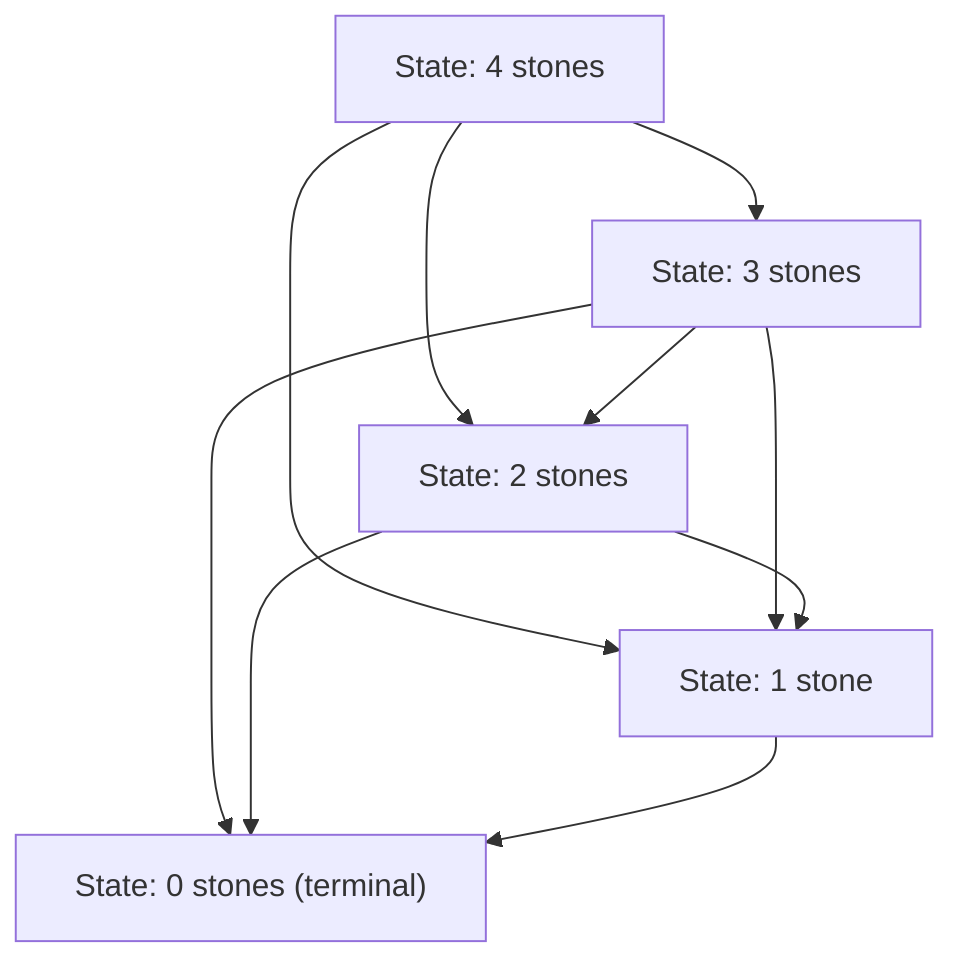
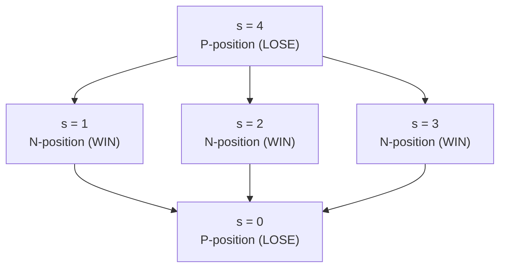
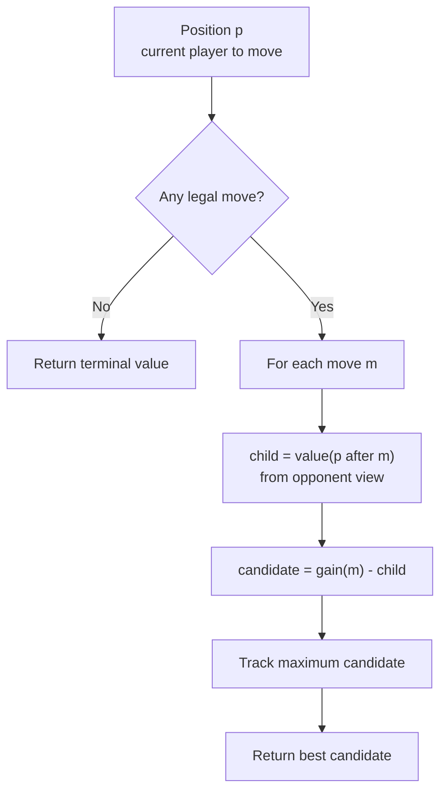
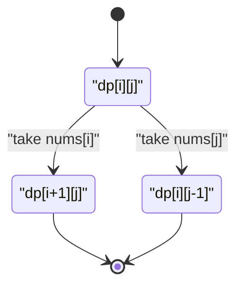
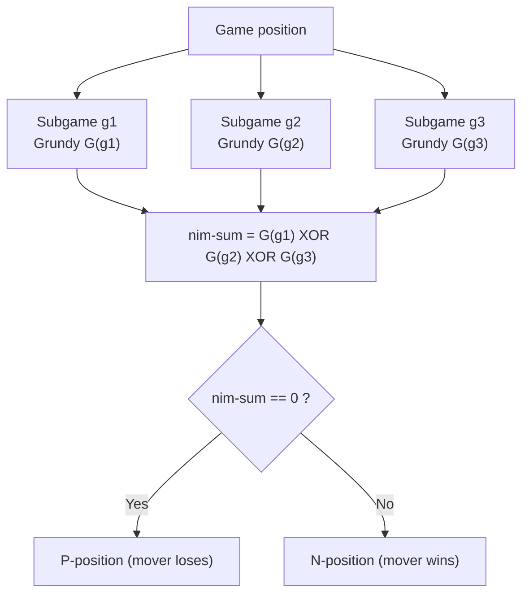
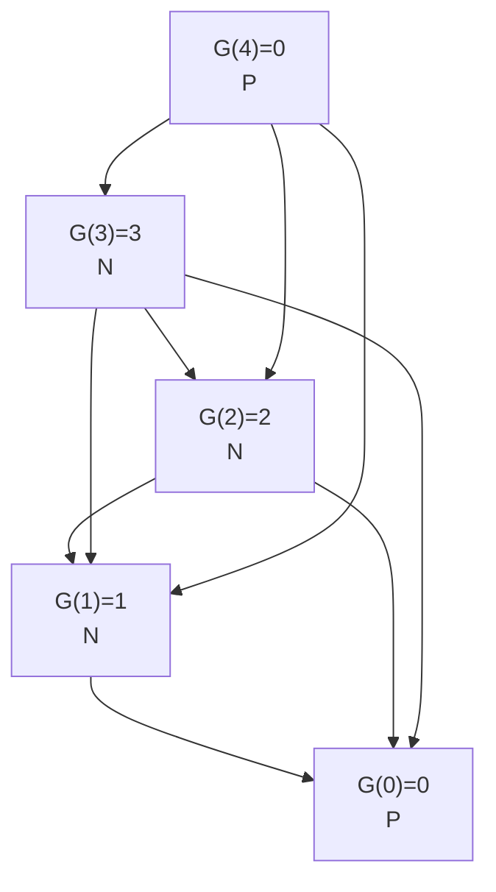
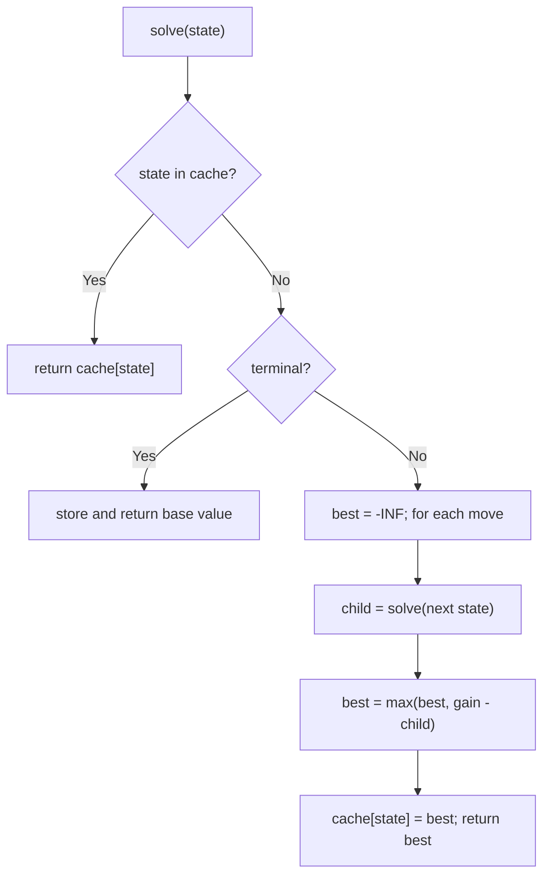

# Game DP (Win/Lose States)

> Two players, perfect information, no randomness, and both playing **optimally**. Game DP teaches you to reason backwards from terminal positions, label each state as a **win** or a **loss** for the player about to move, and — when a score is involved — to compute the best achievable **difference** under adversarial play.

---

## Table of Contents

1. [Combinatorial Game Theory Basics](#combinatorial-game-theory-basics)
2. [Winning vs Losing Positions (P/N)](#winning-vs-losing-positions-pn)
3. [Minimax and Optimal Play](#minimax-and-optimal-play)
4. [Score-Difference DP `dp[i][j]`](#score-difference-dp-dpij)
5. [Nim and Sprague–Grundy Theory](#nim-and-spraguegrundy-theory)
6. [Grundy Numbers via mex](#grundy-numbers-via-mex)
7. [Memoized Game DP](#memoized-game-dp)
8. [Complexity Summary](#complexity-summary)
9. [Common Pitfalls](#common-pitfalls)
10. [Patterns](#patterns)

---

## Combinatorial Game Theory Basics

A **combinatorial game** in the classic sense satisfies:

- **Two players** who move alternately.
- **Perfect information** — both see the entire state, nothing is hidden.
- **No chance** — no dice, no shuffles.
- **Finite** — the game must end; there is a terminal condition.
- **Normal play convention** — the player who *cannot* move **loses** (in misère play, the last to move loses instead).

The core object is the **state graph**: a directed graph where each node is a position and each edge is a legal move. Because the game is finite and acyclic (or made acyclic by a monotone potential like "stones remaining"), we can evaluate every node bottom-up.



Each edge above is "remove 1, 2, or 3 stones". The terminal node `0` is where the mover has no move and loses.

---

## Winning vs Losing Positions (P/N)

We classify every position from the perspective of the player **about to move**:

- **N-position** (*Next player wins*) — there exists at least one move leading to a **P-position**. This is a **winning** state.
- **P-position** (*Previous player wins*) — **every** move leads to an **N-position**. This is a **losing** state for the mover.

The recursive definitions, under normal play:

$$
\text{win}(s) = \bigvee_{s \to s'} \neg\,\text{win}(s')
$$

A state is a **win** iff *some* successor is a **loss** for the opponent. A state with no moves is a **loss** (you cannot move, you lose).



For the subtract-{1,2,3} game, multiples of 4 are **P-positions**: whatever the mover takes (1–3), the opponent restores the state to the next lower multiple of 4.

Computing P/N for a 1-D pile game:

```python
def compute_pn(n, moves):
    # win[s] = True if the player to move at state s wins
    win = [False] * (n + 1)
    for s in range(1, n + 1):
        for m in moves:
            if s - m >= 0 and not win[s - m]:
                win[s] = True   # found a move to a losing (P) state
                break
    return win

print(compute_pn(8, [1, 2, 3]))
# [False, True, True, True, False, True, True, True, False]
```

```cpp
#include <bits/stdc++.h>
using namespace std;

vector<bool> computePN(int n, const vector<int>& moves) {
    // win[s] = true if the player to move at state s wins
    vector<bool> win(n + 1, false);
    for (int s = 1; s <= n; ++s) {
        for (int m : moves) {
            if (s - m >= 0 && !win[s - m]) {
                win[s] = true;  // found a move to a losing (P) state
                break;
            }
        }
    }
    return win;
}

int main() {
    vector<bool> w = computePN(8, {1, 2, 3});
    for (bool b : w) cout << (b ? "T" : "F") << ' ';
    cout << "\n"; // F T T T F T T T F
    return 0;
}
```

---

## Minimax and Optimal Play

When the game has a **payoff** (a score) rather than just win/lose, the value of a position is defined by **minimax**: the mover **maximizes** their outcome while assuming the opponent will **minimize** it on their turn.

A clean trick for symmetric two-player games: track the **score difference** from the perspective of *the player to move*. Then both players "maximize their own relative advantage", and the recurrence is uniform — no separate min/max branches.



The `gain(m) - child` form encodes the *negamax* identity: what is good for me is exactly the negation of the opponent's best result from the resulting position.

$$
V(p) = \max_{p \to p'}\ \big(\text{gain}(p \to p') - V(p')\big)
$$

---

## Score-Difference DP `dp[i][j]`

The canonical **interval game**: a row of values, two players alternately take from one of the two ends, each wants to maximize their own total. Let `dp[i][j]` be the **maximum score difference** (current player total minus opponent total) achievable on the subarray `nums[i..j]` when it is the current player's turn.

Base case (single element):

$$
dp[i][i] = nums[i]
$$

Transition — pick the left end or the right end, then subtract the opponent's best on the remaining interval:

$$
dp[i][j] = \max\big(\,nums[i] - dp[i+1][j],\ \ nums[j] - dp[i][j-1]\,\big)
$$

The first player wins (or ties) iff `dp[0][n-1] >= 0`.



```python
def best_difference(nums):
    n = len(nums)
    dp = [[0] * n for _ in range(n)]
    for i in range(n):
        dp[i][i] = nums[i]
    # increasing interval length
    for length in range(2, n + 1):
        for i in range(0, n - length + 1):
            j = i + length - 1
            take_left = nums[i] - dp[i + 1][j]
            take_right = nums[j] - dp[i][j - 1]
            dp[i][j] = max(take_left, take_right)
    return dp[0][n - 1]

print(best_difference([1, 5, 233, 7]))  # 222 -> first player wins
```

```cpp
#include <bits/stdc++.h>
using namespace std;

long long bestDifference(const vector<long long>& nums) {
    int n = (int)nums.size();
    vector<vector<long long>> dp(n, vector<long long>(n, 0));
    for (int i = 0; i < n; ++i) dp[i][i] = nums[i];
    // increasing interval length
    for (int length = 2; length <= n; ++length) {
        for (int i = 0; i + length - 1 < n; ++i) {
            int j = i + length - 1;
            long long takeLeft = nums[i] - dp[i + 1][j];
            long long takeRight = nums[j] - dp[i][j - 1];
            dp[i][j] = max(takeLeft, takeRight);
        }
    }
    return dp[0][n - 1];
}

int main() {
    cout << bestDifference({1, 5, 233, 7}) << "\n"; // 222
    return 0;
}
```

---

## Nim and Sprague–Grundy Theory

**Nim**: several piles of stones; a move removes any positive number of stones from a single pile; the player who cannot move (all piles empty) loses.

The celebrated result: a Nim position with piles $a_1, a_2, \dots, a_k$ is a **losing** position (P-position) for the player to move **iff** the **xor** (nim-sum) is zero:

$$
a_1 \oplus a_2 \oplus \cdots \oplus a_k = 0 \iff \text{P-position}
$$

The **Sprague–Grundy theorem** generalizes this: *every* impartial game under normal play is equivalent to a single Nim pile whose size is the position's **Grundy number** (nimber). A sum of independent games has Grundy value equal to the **xor** of the components' Grundy values. So to analyze a compound game you compute each component's nimber and xor them.



```python
def nim_winner(piles):
    nim_sum = 0
    for p in piles:
        nim_sum ^= p
    # current player wins iff nim_sum != 0
    return "First" if nim_sum != 0 else "Second"

print(nim_winner([3, 4, 5]))  # First (3^4^5 = 2)
print(nim_winner([1, 1]))     # Second (1^1 = 0)
```

```cpp
#include <bits/stdc++.h>
using namespace std;

string nimWinner(const vector<long long>& piles) {
    long long nimSum = 0;
    for (long long p : piles) nimSum ^= p;
    // current player wins iff nimSum != 0
    return nimSum != 0 ? "First" : "Second";
}

int main() {
    cout << nimWinner({3, 4, 5}) << "\n"; // First
    cout << nimWinner({1, 1}) << "\n";    // Second
    return 0;
}
```

---

## Grundy Numbers via mex

The **Grundy number** (or nimber) of a position is:

$$
G(s) = \operatorname{mex}\ \{\, G(s') : s \to s' \,\}
$$

where **mex** (*minimum excludant*) of a set is the smallest non-negative integer **not** in the set. Intuition:

- $G(s) = 0$ ⟺ a **P-position** (losing for the mover) — consistent with "xor of zero".
- $G(s) > 0$ ⟺ an **N-position**, and the mover can always move to a position whose nimber is any value smaller than $G(s)$.

For the subtract-{1,2,3} game the Grundy values are periodic: $0,1,2,3,0,1,2,3,\dots$ — exactly $s \bmod 4$.



```python
def mex(values):
    s = set(values)
    m = 0
    while m in s:
        m += 1
    return m

def grundy(n, moves):
    g = [0] * (n + 1)
    for s in range(1, n + 1):
        reachable = [g[s - m] for m in moves if s - m >= 0]
        g[s] = mex(reachable)
    return g

print(grundy(8, [1, 2, 3]))
# [0, 1, 2, 3, 0, 1, 2, 3, 0]
```

```cpp
#include <bits/stdc++.h>
using namespace std;

int mex(const vector<int>& values) {
    set<int> s(values.begin(), values.end());
    int m = 0;
    while (s.count(m)) ++m;
    return m;
}

vector<int> grundy(int n, const vector<int>& moves) {
    vector<int> g(n + 1, 0);
    for (int s = 1; s <= n; ++s) {
        vector<int> reachable;
        for (int m : moves)
            if (s - m >= 0) reachable.push_back(g[s - m]);
        g[s] = mex(reachable);
    }
    return g;
}

int main() {
    vector<int> g = grundy(8, {1, 2, 3});
    for (int v : g) cout << v << ' ';
    cout << "\n"; // 0 1 2 3 0 1 2 3 0
    return 0;
}
```

---

## Memoized Game DP

When the state is not a simple integer (e.g. an interval `(i, j)`, a bitmask of taken items, or a tuple of remaining resources), a **top-down memoized** recursion is usually the most natural encoding. Define the value from the **current mover's** perspective and recurse with negamax-style negation or explicit min/max.



```python
from functools import lru_cache

def predict_winner(nums):
    n = len(nums)

    @lru_cache(maxsize=None)
    def solve(i, j):
        # best score difference for the player to move on nums[i..j]
        if i == j:
            return nums[i]
        take_left = nums[i] - solve(i + 1, j)
        take_right = nums[j] - solve(i, j - 1)
        return max(take_left, take_right)

    return solve(0, n - 1) >= 0

print(predict_winner([1, 5, 2]))      # False
print(predict_winner([1, 5, 233, 7])) # True
```

```cpp
#include <bits/stdc++.h>
using namespace std;

vector<long long> g_nums;
vector<vector<long long>> memo;
vector<vector<char>> seen;

long long solve(int i, int j) {
    // best score difference for the player to move on nums[i..j]
    if (i == j) return g_nums[i];
    if (seen[i][j]) return memo[i][j];
    long long takeLeft  = g_nums[i] - solve(i + 1, j);
    long long takeRight = g_nums[j] - solve(i, j - 1);
    seen[i][j] = 1;
    return memo[i][j] = max(takeLeft, takeRight);
}

bool predictWinner(const vector<long long>& nums) {
    g_nums = nums;
    int n = (int)nums.size();
    memo.assign(n, vector<long long>(n, 0));
    seen.assign(n, vector<char>(n, 0));
    return solve(0, n - 1) >= 0;
}

int main() {
    cout << boolalpha;
    cout << predictWinner({1, 5, 2}) << "\n";      // false
    cout << predictWinner({1, 5, 233, 7}) << "\n"; // true
    return 0;
}
```

---

## Complexity Summary

| Technique | State | Time | Space | Typical use |
|---|---|---|---|---|
| 1-D P/N table | pile size `s` | $O(n \cdot |M|)$ | $O(n)$ | subtract games |
| Nim xor | piles | $O(k)$ | $O(1)$ | classic Nim |
| Grundy + mex | pile size `s` | $O(n \cdot |M|)$ | $O(n)$ | impartial compound games |
| Interval score DP | `(i, j)` | $O(n^2)$ | $O(n^2)$ | take-from-ends games |
| Memoized game DP | arbitrary state | $O(\text{states} \cdot \text{branch})$ | $O(\text{states})$ | bitmask / interval games |

---

## Common Pitfalls

- **Wrong perspective.** Decide once whether `dp` is "current mover's score" or "score difference"; mixing the two flips signs. The difference formulation is the most bug-resistant for symmetric games.
- **Forgetting normal vs misère play.** "Cannot move ⇒ lose" is *normal* play. Misère (last move loses) changes the analysis, especially for Nim.
- **mex on the wrong set.** Grundy uses mex of the **successors' Grundy values**, not of the moves.
- **Xor-ing positions instead of Grundy numbers.** Only nimbers xor. For a non-Nim game, first reduce each component to its Grundy value.
- **Memoization key omits whose turn it is.** For the difference formulation the turn is implicit, but for asymmetric payoffs you must encode the player in the state.
- **Off-by-one in interval DP.** `dp[i+1][j]` and `dp[i][j-1]` require iterating by increasing length so subproblems are ready.
- **Integer overflow in C++.** Use `long long` for accumulated scores.

---

## Patterns

- **Backward induction:** evaluate terminal states first, propagate to earlier states via the win/loss recurrence.
- **Negamax / difference trick:** replace separate `max` (me) and `min` (opponent) branches with a single `gain - child` recurrence.
- **Interval games:** state `(i, j)`, transitions take from an end — `dp[i][j] = max(a[i] - dp[i+1][j], a[j] - dp[i][j-1])`.
- **Impartial games:** compute Grundy numbers with mex; combine independent subgames by xor; P-position ⟺ xor is 0.
- **Spot the closed form:** many subtract games are periodic (`s mod (max_move + 1)`); Nim collapses to a single xor — derive the DP first, then shortcut.
