# DP Optimization: Prefix-Sum &amp; Monotonic-Queue

> Many DP recurrences have the shape "the best value for state `i` equals some local cost plus the **best previous value inside a sliding window**." Naively scanning that window costs $O(n)$ per state, giving $O(n^2)$ overall. Two classic tools collapse that inner work to $O(1)$ amortized: the **prefix sum** (for range-sum transitions) and the **monotonic deque** (for sliding-window min/max of dp values). Together they turn quadratic DP into linear DP.

---

## Table of Contents

1. [Recognizing a Windowed Transition](#recognizing-a-windowed-transition)
2. [Prefix Sums: Collapsing Range-Sum Transitions](#prefix-sums-collapsing-range-sum-transitions)
3. [Monotonic Deque: Sliding-Window Min/Max of dp Values](#monotonic-deque-sliding-window-minmax-of-dp-values)
4. [Why the Deque Stores Indices](#why-the-deque-stores-indices)
5. [The General Windowed-Transition Template](#the-general-windowed-transition-template)
6. [Combining Prefix Sums with the Deque](#combining-prefix-sums-with-the-deque)
7. [Complexity Summary](#complexity-summary)
8. [Common Pitfalls](#common-pitfalls)
9. [Patterns](#patterns)

---

## Recognizing a Windowed Transition

The pattern to watch for is a recurrence where state `i` depends on the **extremum (min or max)** of earlier dp values restricted to a contiguous range of indices:

$$
dp[i] = base[i] + \max_{\,i-k \,\le\, j \,\le\, i-1} dp[j]
$$

Here `base[i]` is a per-state cost that does not depend on the window, and the window `[i-k, i-1]` slides forward by one as `i` advances. The same shape appears with `min` instead of `max`, or with a `+` cost folded inside.

The naive evaluation recomputes the window extremum from scratch for every `i`:

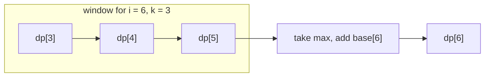

When `i` becomes `7`, the window shifts to `[4,6]`: index `3` leaves on the left, index `6` enters on the right. Because consecutive windows overlap heavily, recomputing the whole max each time wastes work — exactly the redundancy a monotonic deque removes.

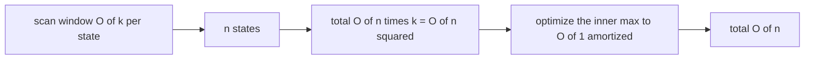

Key signals that a windowed optimization applies:

- The transition is a **single extremum** (min or max) or a **single range sum** over previous dp.
- The window endpoints are **monotonically non-decreasing** in `i` (the window only slides forward, it never jumps backward).
- `base[i]` is independent of which `j` is chosen.

---

## Prefix Sums: Collapsing Range-Sum Transitions

When the inner operation is a **sum** rather than an extremum, a prefix-sum array answers any range-sum in $O(1)$. Define

$$
P[0] = 0, \qquad P[i] = P[i-1] + a[i-1]
$$

so that the sum of `a[l..r-1]` (half-open) is the single subtraction $P[r] - P[l]$.

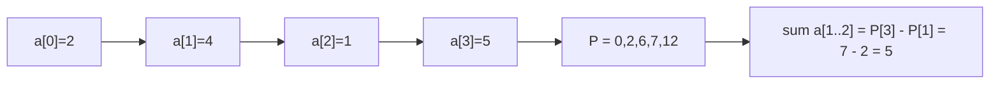

The before/after picture: a naive loop adds `r - l` numbers; the prefix-sum version subtracts two numbers.

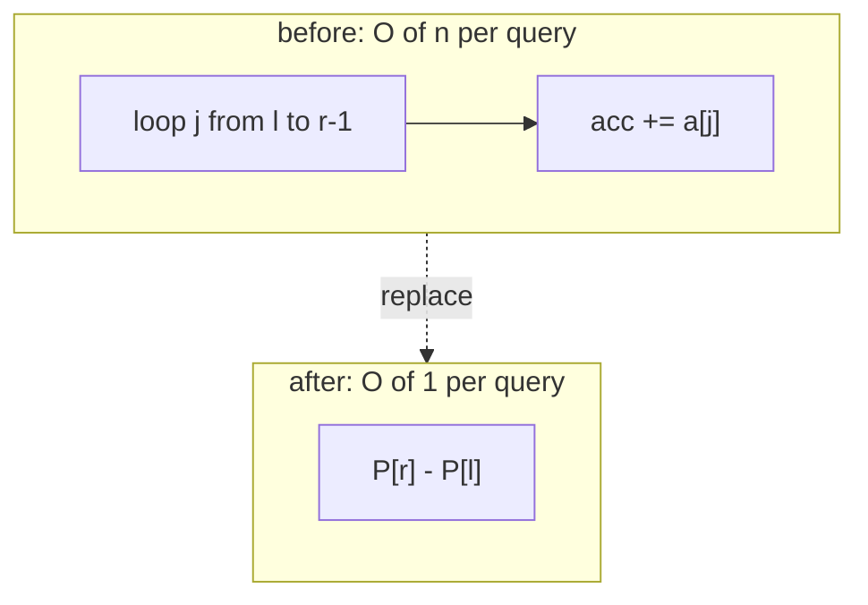

A DP transition like "`dp[i]` = best over `j` of `dp[j]` plus the sum of a block from `j` to `i`" can often be rewritten so the block sum becomes `P[i] - P[j]`. Crucially, `P[i]` is **constant** while we search over `j`, so maximizing `dp[j] + P[i] - P[j]` is the same as maximizing `dp[j] - P[j]` and then adding the constant `P[i]`. That algebraic split is what lets a deque maintain the window — we feed it the **derived quantity** `dp[j] - P[j]`, not `dp[j]` alone.

```python
def prefix(a):
    P = [0] * (len(a) + 1)
    for i, x in enumerate(a):
        P[i + 1] = P[i] + x
    return P  # range sum a[l..r-1] == P[r] - P[l]
```

```cpp
#include <bits/stdc++.h>
using namespace std;

vector<long long> prefix(const vector<long long>& a) {
    vector<long long> P(a.size() + 1, 0);
    for (size_t i = 0; i < a.size(); ++i)
        P[i + 1] = P[i] + a[i];   // range sum a[l..r-1] == P[r] - P[l]
    return P;
}
```

---

## Monotonic Deque: Sliding-Window Min/Max of dp Values

A **monotonic deque** maintains, in $O(1)$ amortized time per step, the extremum of a sliding window. For a window **maximum**, we keep the deque's stored values in **decreasing** order from front to back. The front is always the current window's maximum.

Three operations run as the window slides forward by one position:

1. **Pop expired front** — if the front index has fallen out of the window `[i-k, i-1]`, discard it.
2. **Push new value at the back** — before inserting the new candidate, pop from the back every element smaller than (or equal to) it, since those can never again be the maximum while the new, larger, more-recent element survives.
3. **Read the answer** — the front of the deque is the window maximum.

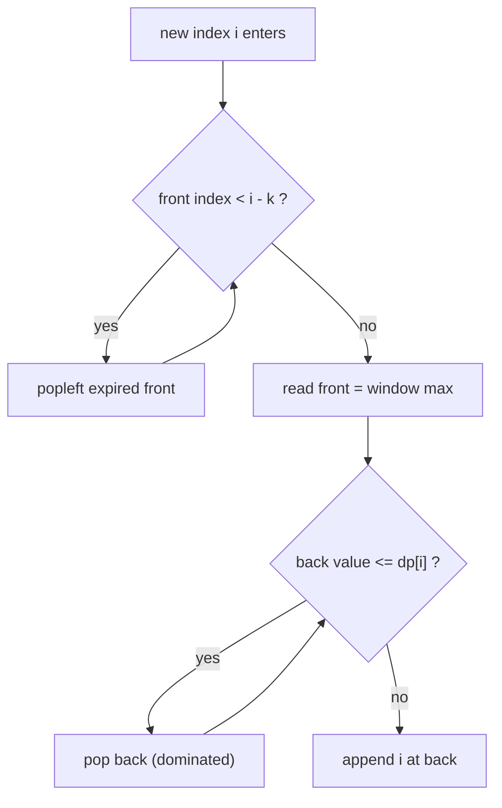

The deque is monotone, so each push restores the invariant by cleaning the back. Every index is appended once and removed once, giving the amortized $O(1)$ bound even though a single step might pop several elements.

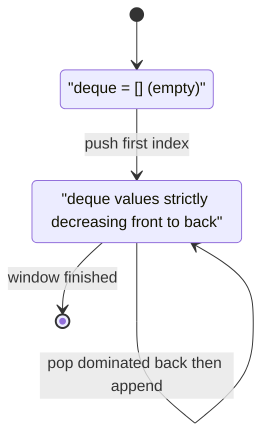

A concrete push/pop sequence on `dp = [1, 3, 2, 5]` with window size `k = 2` (storing indices, comparing `dp` values for a **max**):

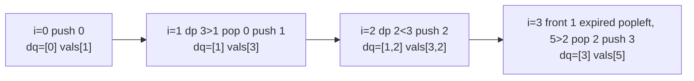

```python
from collections import deque

def sliding_window_max(values, k):
    dq = deque()          # holds indices, dp[dq] strictly decreasing
    out = []
    for i, v in enumerate(values):
        if dq and dq[0] <= i - k:     # front fell out of the window
            dq.popleft()
        while dq and values[dq[-1]] <= v:   # purge dominated tails
            dq.pop()
        dq.append(i)
        out.append(values[dq[0]])     # front is the current window max
    return out
```

```cpp
#include <bits/stdc++.h>
using namespace std;

vector<long long> sliding_window_max(const vector<long long>& values, int k) {
    deque<int> dq;        // holds indices, values[dq] strictly decreasing
    vector<long long> out;
    for (int i = 0; i < (int)values.size(); ++i) {
        if (!dq.empty() && dq.front() <= i - k)   // front fell out of window
            dq.pop_front();
        while (!dq.empty() && values[dq.back()] <= values[i])  // purge dominated
            dq.pop_back();
        dq.push_back(i);
        out.push_back(values[dq.front()]);        // front is current window max
    }
    return out;
}
```

---

## Why the Deque Stores Indices

The deque stores **indices, not raw values**, for one decisive reason: only an index tells us **when an element expires**. The front-popping step asks "is `dq[0] <= i - k`?" — a question about position, not value. If we stored bare values we could not detect that the maximum has slid out of the window.

Storing indices also lets us recover any associated data (`dp[j]`, or a derived `dp[j] - P[j]`) by a simple array lookup, while the monotonicity invariant is enforced on those looked-up values.

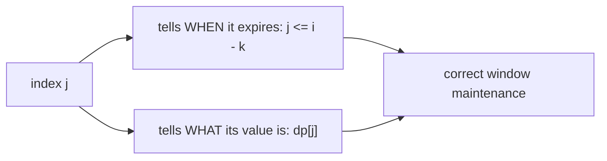

If two purposes — expiry and comparison — were split across two stored fields you would need a pair; the index alone serves both because the value is one array access away.

---

## The General Windowed-Transition Template

Putting the pieces together, the canonical $O(n)$ windowed DP for

$$
dp[i] = base[i] + \max_{\,i-k \,\le\, j \,\le\, i-1} dp[j]
$$

processes `i` in increasing order, evicts the expired front, reads the max from the front, computes `dp[i]`, then pushes `i` so it is available to future states.

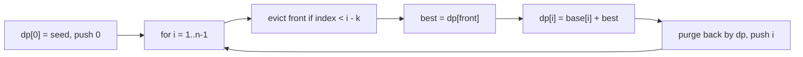

```python
from collections import deque

def windowed_dp(base, k, seed=0):
    n = len(base)
    dp = [0] * n
    dp[0] = seed
    dq = deque([0])                       # candidate indices, dp decreasing
    for i in range(1, n):
        while dq and dq[0] < i - k:       # drop indices outside [i-k, i-1]
            dq.popleft()
        dp[i] = base[i] + dp[dq[0]]       # front = max dp in the window
        while dq and dp[dq[-1]] <= dp[i]: # keep deque monotone decreasing
            dq.pop()
        dq.append(i)
    return dp
```

```cpp
#include <bits/stdc++.h>
using namespace std;

vector<long long> windowed_dp(const vector<long long>& base, int k, long long seed = 0) {
    int n = (int)base.size();
    vector<long long> dp(n, 0);
    dp[0] = seed;
    deque<int> dq;
    dq.push_back(0);                        // candidate indices, dp decreasing
    for (int i = 1; i < n; ++i) {
        while (!dq.empty() && dq.front() < i - k)   // drop out-of-window indices
            dq.pop_front();
        dp[i] = base[i] + dp[dq.front()];           // front = max dp in window
        while (!dq.empty() && dp[dq.back()] <= dp[i])  // keep monotone decreasing
            dq.pop_back();
        dq.push_back(i);
    }
    return dp;
}
```

The order of operations matters: **evict, then read, then assign, then push**. Pushing before reading would let `dp[i]` see itself; reading before evicting would let an expired element pollute the answer.

---

## Combining Prefix Sums with the Deque

The most powerful version appears when the transition mixes a **range sum** with a **previous-dp extremum**. Suppose

$$
dp[i] = \max_{\,i-k \,\le\, j \,\le\, i-1}\big(dp[j] + (P[i] - P[j])\big)
$$

Since `P[i]` is constant across the inner search, factor it out:

$$
dp[i] = P[i] + \max_{\,i-k \,\le\, j \,\le\, i-1}\big(dp[j] - P[j]\big)
$$

Now the quantity the deque must track is the **derived key** $g[j] = dp[j] - P[j]$, and the constant $P[i]$ is added after the deque returns its front. This is the recurring trick: **isolate the part of the expression that depends only on `j`, feed that to the deque, and add the `i`-only part afterward.**

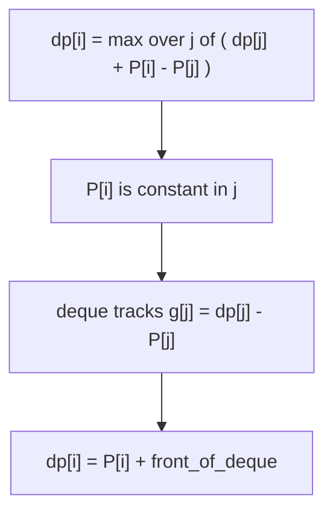

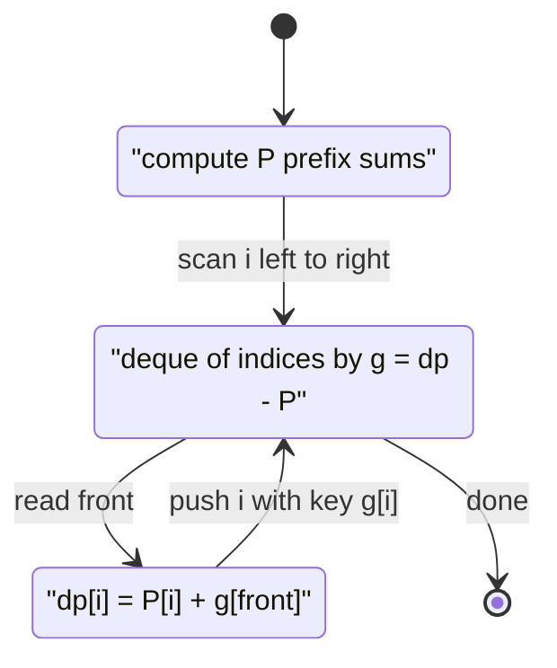

```python
from collections import deque

def windowed_range_sum_dp(a, k):
    n = len(a)
    P = [0] * (n + 1)
    for i in range(n):
        P[i + 1] = P[i] + a[i]
    dp = [0] * (n + 1)            # dp[i] best using prefix ending at i
    g = lambda j: dp[j] - P[j]    # key the deque orders by
    dq = deque([0])
    for i in range(1, n + 1):
        while dq and dq[0] < i - k:
            dq.popleft()
        dp[i] = P[i] + g(dq[0])
        while dq and g(dq[-1]) <= g(i):
            dq.pop()
        dq.append(i)
    return dp[n]
```

```cpp
#include <bits/stdc++.h>
using namespace std;

long long windowed_range_sum_dp(const vector<long long>& a, int k) {
    int n = (int)a.size();
    vector<long long> P(n + 1, 0), dp(n + 1, 0);
    for (int i = 0; i < n; ++i) P[i + 1] = P[i] + a[i];
    auto g = [&](int j) -> long long { return dp[j] - P[j]; };  // deque key
    deque<int> dq;
    dq.push_back(0);
    for (int i = 1; i <= n; ++i) {
        while (!dq.empty() && dq.front() < i - k) dq.pop_front();
        dp[i] = P[i] + g(dq.front());
        while (!dq.empty() && g(dq.back()) <= g(i)) dq.pop_back();
        dq.push_back(i);
    }
    return dp[n];
}
```

---

## Complexity Summary

| Technique | Inner transition | Naive | Optimized | Extra space |
|-----------|------------------|-------|-----------|-------------|
| Prefix sum | range **sum** over previous values | $O(n)$ per state | $O(1)$ per state | $O(n)$ array |
| Monotonic deque | sliding-window **min/max** of dp | $O(k)$ per state | $O(1)$ amortized | $O(k)$ deque |
| Prefix + deque | range sum **plus** dp extremum | $O(nk)$ total | $O(n)$ total | $O(n)$ |
| Windowed DP template | `dp[i] = base[i] + ext window dp` | $O(n^2)$ | $O(n)$ | $O(n)$ |

Each deque element is pushed once and popped once, so across the whole scan the deque work is $O(n)$ even though one step may pop several entries — the amortized cost per state is $O(1)$.

---

## Common Pitfalls

- **Pushing before reading.** Append index `i` only *after* computing `dp[i]`, otherwise the state reads its own value.
- **Wrong eviction bound.** The window `[i-k, i-1]` excludes `i` itself; evict with `dq[0] < i - k` (or `<=` depending on whether endpoints are inclusive). Off-by-one here silently widens or narrows the window.
- **Storing values instead of indices.** Bare values cannot expire; you lose the ability to detect that the front slid out of the window.
- **Wrong monotonic direction.** For a window **max** the deque must be **decreasing**; for a window **min** it must be **increasing**. Mixing them returns the opposite extremum.
- **Forgetting the `i`-only term.** When combining with prefix sums, the deque tracks `dp[j] - P[j]`; you must add the constant `P[i]` back after reading the front.
- **Strict vs non-strict back-pop.** Using `<=` when purging the back keeps the deque shorter and is safe for extrema; using `<` leaves equal-valued duplicates that waste space but still give correct answers.

---

## Patterns

- **Windowed maximum/minimum DP** — `dp[i] = base[i] + max/min over a sliding window of dp`: monotonic deque, $O(n)$. (Jump Game VI.)
- **Bounded-length subarray objective** — "best subarray with length `<= k`": prefix sum to turn the objective into `P[i] - min P[j]` over a window, then deque the prefix minima.
- **Range-sum transition** — any `dp` that adds a contiguous block sum: precompute prefix sums and rewrite as two array subtractions.
- **Constant-extraction trick** — split the transition into an `i`-only part and a `j`-only part; feed the `j`-only key to the deque and add the `i`-only part afterward.
- **Circular array reductions** — a wrap-around objective often splits into "non-wrapping case" (standard windowed/Kadane DP) and "wrapping case" (total minus the best interior min), each solvable with the linear tools above.
