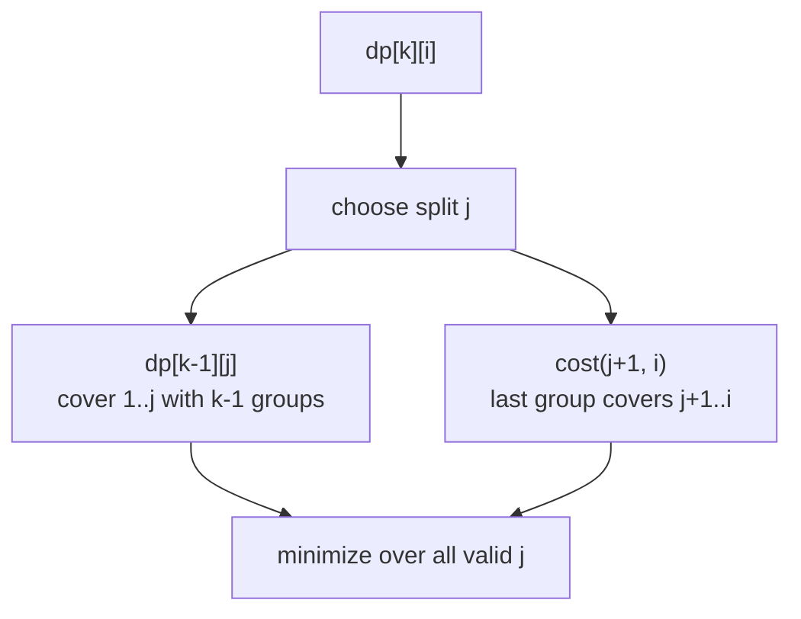
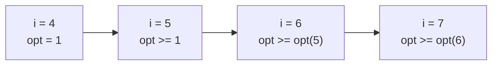
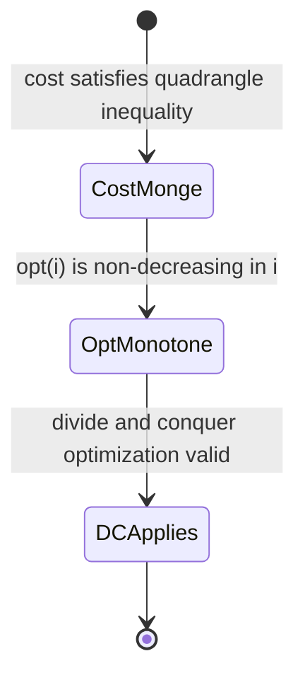
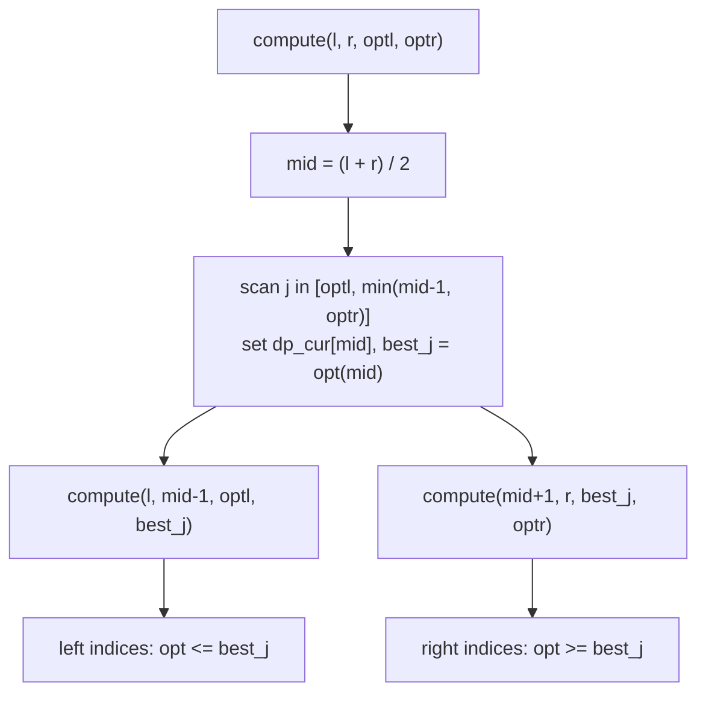
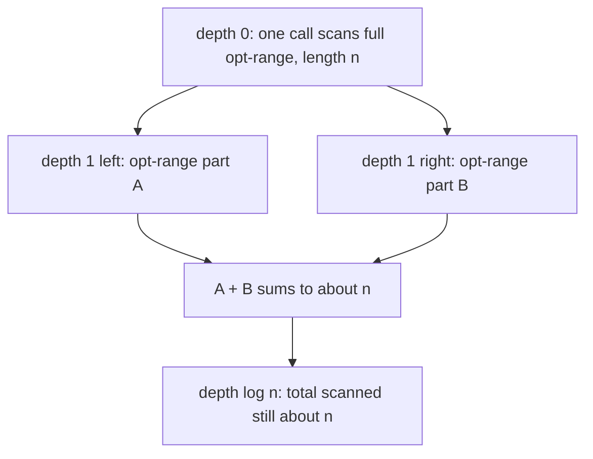
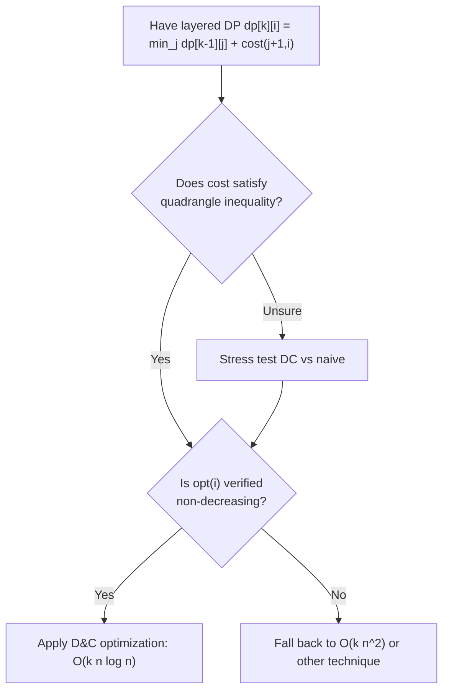

# DP Optimization: Divide and Conquer Optimization

> Divide and Conquer (D&C) optimization speeds up a class of layered dynamic programs of the form `dp[k][i] = min over j of dp[k-1][j] + cost(j+1, i)`. When the optimal split point is **monotonic** in `i`, we can compute each layer in $O(n \log n)$ instead of $O(n^2)$, turning an $O(k n^2)$ DP into $O(k n \log n)$.

## Table of Contents

- [The Layered DP Form](#the-layered-dp-form)
- [The Optimal Split Point and Its Monotonicity](#the-optimal-split-point-and-its-monotonicity)
- [The Quadrangle / Monge Condition](#the-quadrangle--monge-condition)
- [The Naive O(k n^2) Baseline](#the-naive-o-k-n2-baseline)
- [The Divide and Conquer Routine](#the-divide-and-conquer-routine)
- [Why the Complexity Drops to O(k n log n)](#why-the-complexity-drops-to-o-k-n-log-n)
- [When the Monotonicity Holds](#when-the-monotonicity-holds)
- [Contrast with Knuth Optimization](#contrast-with-knuth-optimization)
- [Complexity Summary](#complexity-summary)
- [Common Pitfalls](#common-pitfalls)
- [Patterns](#patterns)

## The Layered DP Form

D&C optimization applies to recurrences that build a solution in **layers** `k = 1, 2, ..., K`, where each state `dp[k][i]` represents "the best cost of splitting the prefix of length `i` into exactly `k` groups":

$$
dp[k][i] = \min_{0 \le j < i} \Big( dp[k-1][j] + \text{cost}(j+1, i) \Big)
$$

Here:

- `i` is the right endpoint of the current prefix.
- `j` is the **split point**: groups `1..k-1` cover the prefix `1..j`, and group `k` covers the segment `j+1..i`.
- `cost(a, b)` is the cost of putting elements `a..b` into a single group.

The base case is `dp[0][0] = 0` and `dp[0][i] = +\infty` for `i > 0` (you cannot cover a non-empty prefix with zero groups).



Computed directly, each `dp[k][i]` scans all `j`, giving $O(n)$ per state, $O(n^2)$ per layer, and $O(k n^2)$ overall. D&C optimization removes one factor of `n` per layer (down to $O(n \log n)$).

## The Optimal Split Point and Its Monotonicity

For each state `dp[k][i]`, define the **optimal split point**:

$$
\text{opt}(i) = \arg\min_{0 \le j < i} \Big( dp[k-1][j] + \text{cost}(j+1, i) \Big)
$$

(If several `j` tie, pick the smallest, say.) The entire optimization rests on a single property:

> **Monotonicity of the optimal split:** within a fixed layer `k`, if `i1 < i2` then `opt(i1) <= opt(i2)`.

Intuitively: as the right endpoint `i` moves rightward, the best place to cut the last group never moves leftward. This lets us **bound the search range** for `opt(i)` using already-known optimal points of its neighbors.



## The Quadrangle / Monge Condition

The monotonicity above is *guaranteed* when the cost function satisfies the **quadrangle inequality** (also called the Monge condition). For all `a <= b <= c <= d`:

$$
\text{cost}(a, c) + \text{cost}(b, d) \le \text{cost}(a, d) + \text{cost}(b, c)
$$

In words: "crossing intervals" cost no less than "nested intervals". A complementary requirement is **monotonicity on intervals** (the cost of a sub-interval does not exceed the cost of a containing interval):

$$
\text{cost}(b, c) \le \text{cost}(a, d) \quad \text{for } a \le b \le c \le d
$$

When `cost` obeys the quadrangle inequality, the function `dp[k-1][j] + cost(j+1, i)` is what is called *totally monotone*, and the row minima (the `opt(i)` values) are non-decreasing — exactly the property D&C optimization needs.



A useful concrete family: if `cost(a, b)` is built from a **convex** quantity over the segment (for example sum of pairwise distances, or `prefix`-based convex penalties), the quadrangle inequality typically holds. Always verify on your specific cost.

## The Naive O(k n^2) Baseline

Before optimizing, it helps to have the straightforward layered DP. We compute layer `k` entirely from layer `k-1`.

```python
def partition_naive(n, K, cost):
    INF = float("inf")
    # dp_prev[j] = best cost of covering prefix 1..j with (k-1) groups
    dp_prev = [INF] * (n + 1)
    dp_prev[0] = 0

    for k in range(1, K + 1):
        dp_cur = [INF] * (n + 1)
        for i in range(1, n + 1):
            best = INF
            # j ranges over all valid split points
            for j in range(0, i):
                if dp_prev[j] == INF:
                    continue
                cand = dp_prev[j] + cost(j + 1, i)
                if cand < best:
                    best = cand
            dp_cur[i] = best
        dp_prev = dp_cur

    return dp_prev[n]
```

```cpp
#include <bits/stdc++.h>
using namespace std;

const long long INF = 1e18;

// cost is a callable: cost(a, b) -> long long, 1-indexed inclusive segment
long long partition_naive(int n, int K, function<long long(int,int)> cost) {
    vector<long long> dp_prev(n + 1, INF);
    dp_prev[0] = 0;

    for (int k = 1; k <= K; ++k) {
        vector<long long> dp_cur(n + 1, INF);
        for (int i = 1; i <= n; ++i) {
            long long best = INF;
            // j ranges over all valid split points
            for (int j = 0; j < i; ++j) {
                if (dp_prev[j] == INF) continue;
                long long cand = dp_prev[j] + cost(j + 1, i);
                if (cand < best) best = cand;
            }
            dp_cur[i] = best;
        }
        dp_prev = dp_cur;
    }

    return dp_prev[n];
}
```

This is correct but spends $O(n^2)$ per layer. D&C optimization replaces the inner `for j` loop with a recursive range search.

## The Divide and Conquer Routine

The key routine is `compute(l, r, optl, optr)`. It fills `dp_cur[i]` for every `i` in `[l, r]`, **knowing in advance** that the optimal split point for each of those `i` lies within `[optl, optr]`.

The recursion:

1. Pick the middle index `mid = (l + r) / 2`.
2. Brute-force search `j` over `[optl, min(mid - 1, optr)]` to find `dp_cur[mid]` and record its optimal split `best_j = opt(mid)`.
3. By monotonicity:
   - For all `i < mid`, we have `opt(i) <= opt(mid)`, so recurse on the **left** half `(l, mid - 1, optl, best_j)`.
   - For all `i > mid`, we have `opt(i) >= opt(mid)`, so recurse on the **right** half `(mid + 1, r, best_j, optr)`.



Each layer starts with one call: `compute(1, n, 0, n - 1)` (every `opt` lives in `[0, n-1]`).

```python
def partition_dc(n, K, cost):
    INF = float("inf")
    dp_prev = [INF] * (n + 1)
    dp_prev[0] = 0

    for k in range(1, K + 1):
        dp_cur = [INF] * (n + 1)

        # Fill dp_cur[l..r] knowing opt(i) lies in [optl, optr].
        def compute(l, r, optl, optr):
            if l > r:
                return
            mid = (l + r) // 2
            best = INF
            best_j = optl
            # search only within the bounded opt-range
            hi = min(mid - 1, optr)
            for j in range(optl, hi + 1):
                if dp_prev[j] == INF:
                    continue
                cand = dp_prev[j] + cost(j + 1, mid)
                if cand < best:
                    best = cand
                    best_j = j
            dp_cur[mid] = best
            # left indices use opt in [optl, best_j]
            compute(l, mid - 1, optl, best_j)
            # right indices use opt in [best_j, optr]
            compute(mid + 1, r, best_j, optr)

        compute(1, n, 0, n - 1)
        dp_prev = dp_cur

    return dp_prev[n]
```

```cpp
#include <bits/stdc++.h>
using namespace std;

const long long INF = 1e18;

long long partition_dc(int n, int K, function<long long(int,int)> cost) {
    vector<long long> dp_prev(n + 1, INF);
    dp_prev[0] = 0;

    vector<long long> dp_cur(n + 1, INF);

    // Fill dp_cur[l..r] knowing opt(i) lies in [optl, optr].
    function<void(int,int,int,int)> compute = [&](int l, int r, int optl, int optr) {
        if (l > r) return;
        int mid = (l + r) / 2;
        long long best = INF;
        int best_j = optl;
        // search only within the bounded opt-range
        int hi = min(mid - 1, optr);
        for (int j = optl; j <= hi; ++j) {
            if (dp_prev[j] == INF) continue;
            long long cand = dp_prev[j] + cost(j + 1, mid);
            if (cand < best) {
                best = cand;
                best_j = j;
            }
        }
        dp_cur[mid] = best;
        // left indices use opt in [optl, best_j]
        compute(l, mid - 1, optl, best_j);
        // right indices use opt in [best_j, optr]
        compute(mid + 1, r, best_j, optr);
    };

    for (int k = 1; k <= K; ++k) {
        fill(dp_cur.begin(), dp_cur.end(), INF);
        compute(1, n, 0, n - 1);
        dp_prev = dp_cur;
    }

    return dp_prev[n];
}
```

## Why the Complexity Drops to O(k n log n)

Consider a single layer. The recursion tree on the index range `[1, n]` has **depth $O(\log n)$**, because each call splits its index range in half (`l..mid-1` and `mid+1..r`).

Now count the work at one depth level. The calls at a fixed depth partition the index range `[1, n]` into disjoint pieces, and — crucially — their `opt`-search ranges `[optl, optr]` **overlap only at endpoints**. So the total length of all `opt`-ranges scanned at one depth is $O(n)$.



- Work per depth level: $O(n)$.
- Number of depth levels: $O(\log n)$.
- Work per layer: $O(n \log n)$.
- Layers: `K`.

Total: $O(K \, n \log n)$, versus the naive $O(K \, n^2)$. For `n` around `10^5` and modest `K`, this is the difference between feasible and hopeless.

A subtlety: this analysis assumes `cost(a, b)` is $O(1)$. Achieve that with prefix sums, or with an **add/remove pointer ("SMAWK-free" / Mo-like)** cost maintained as the segment endpoints move. If `cost` itself is $O(\log n)$, multiply accordingly.

## When the Monotonicity Holds

The optimal-split monotonicity `opt(i1) <= opt(i2)` for `i1 < i2` is the *only* correctness requirement. It is guaranteed when:

- The cost function satisfies the **quadrangle inequality** (Monge condition) shown above, and
- The cost is monotone over interval inclusion.

Common cost functions that satisfy it:

- `cost(a, b) = (prefix-sum-based convex penalty)` such as `(sum of segment)^2` style separable convex costs.
- Sum of pairwise interaction within a segment when the interaction is convex in distance.
- The classic "sum of absolute deviations to the segment median" cost (used in clustering on a line).

If you are unsure, **stress test**: compare `partition_dc` against `partition_naive` on random small inputs. A mismatch means the monotonicity (and hence the quadrangle inequality) fails for your cost.



## Contrast with Knuth Optimization

D&C optimization and **Knuth optimization** are cousins; both rely on the quadrangle inequality, but they target different recurrence shapes (forward reference — Knuth optimization is covered in a later guide).

| Aspect | Divide and Conquer Opt | Knuth Opt |
| --- | --- | --- |
| Recurrence shape | Layered: `dp[k][i] = min_j dp[k-1][j] + cost(j+1,i)` | Interval: `dp[i][j] = min_{i<=m<j} dp[i][m] + dp[m+1][j] + cost(i,j)` |
| Key property | `opt(i)` monotone within a layer | `opt[i][j-1] <= opt[i][j] <= opt[i+1][j]` |
| Per-layer / per-state work | $O(n \log n)$ per layer | amortized $O(1)$ per state |
| Total | $O(k n \log n)$ | $O(n^2)$ |
| Needs explicit layer index `k` | Yes | No (interval DP) |
| Typical use | "split array into k parts" | optimal BST, matrix-chain-like merging |

Rule of thumb: if your DP has an explicit "number of groups `k`" dimension and splits a **prefix**, reach for D&C optimization. If it merges **two adjacent intervals**, reach for Knuth optimization.

## Complexity Summary

| Approach | Time | Space | Notes |
| --- | --- | --- | --- |
| Naive layered DP | $O(k n^2)$ | $O(n)$ rolling | Simple, correct, slow |
| D&C optimization | $O(k n \log n)$ | $O(n)$ rolling | Needs `opt` monotonicity |
| D&C with $O(\log n)$ cost | $O(k n \log^2 n)$ | $O(n)$ | If cost not $O(1)$ |
| Knuth optimization (interval form) | $O(n^2)$ | $O(n^2)$ | Different recurrence shape |

Cost evaluation `cost(a, b)` is assumed $O(1)$ via prefix sums unless stated otherwise.

## Common Pitfalls

- **Forgetting the `opt` bound `min(mid - 1, optr)`.** The split `j` must satisfy `j < mid`; never let `j` reach `mid`. Clamp `hi = min(mid - 1, optr)`.
- **Recursing with the wrong opt-range.** Left half uses `[optl, best_j]`; right half uses `[best_j, optr]`. Swapping these breaks both correctness and complexity.
- **Initializing `best_j` carelessly.** If the scan range is empty (e.g., `mid` very small), `dp_cur[mid]` should stay `INF` and `best_j` should default to `optl` so recursion ranges stay valid.
- **Applying it without verifying the quadrangle inequality.** If `opt` is not monotone, the answer is silently wrong. Always stress test against the naive DP.
- **Non-$O(1)$ cost without accounting for it.** A heavy `cost` multiplies the whole bound; precompute prefix sums.
- **Overflow.** Use `long long` and `const long long INF = 1e18`; summed costs over large arrays overflow 32-bit easily.
- **Off-by-one between 0-indexed arrays and 1-indexed `dp`.** Keep `dp[*][i]` meaning "first `i` elements"; have `cost(a, b)` take 1-indexed inclusive bounds.

## Patterns

- **"Split an array into exactly `k` contiguous groups minimizing total group cost"** — the canonical D&C optimization target.
- **Clustering points on a line into `k` clusters** (minimize sum of within-cluster deviation) — cost is the median/mean deviation, satisfies the quadrangle inequality.
- **`k`-th layer rolling array** — only `dp_prev` and `dp_cur` are needed; never store all `k` layers unless you must reconstruct the partition.
- **Reconstruction** — store `opt(i)` per layer in a 2D table `where[k][i]` to backtrack the actual cuts (then space becomes $O(k n)$).
- **Stress-test harness** — keep `partition_naive` around as an oracle; it is the fastest way to catch a broken monotonicity assumption.
- **Convex cost detection** — if the per-segment penalty is a convex function of a prefix-sum quantity, the quadrangle inequality usually holds; prove or stress-test before trusting it.
