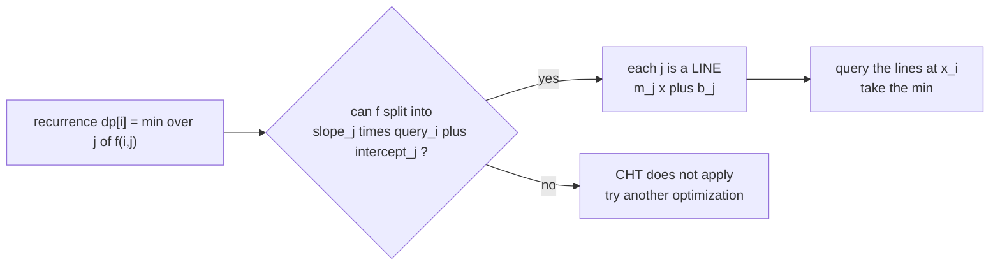
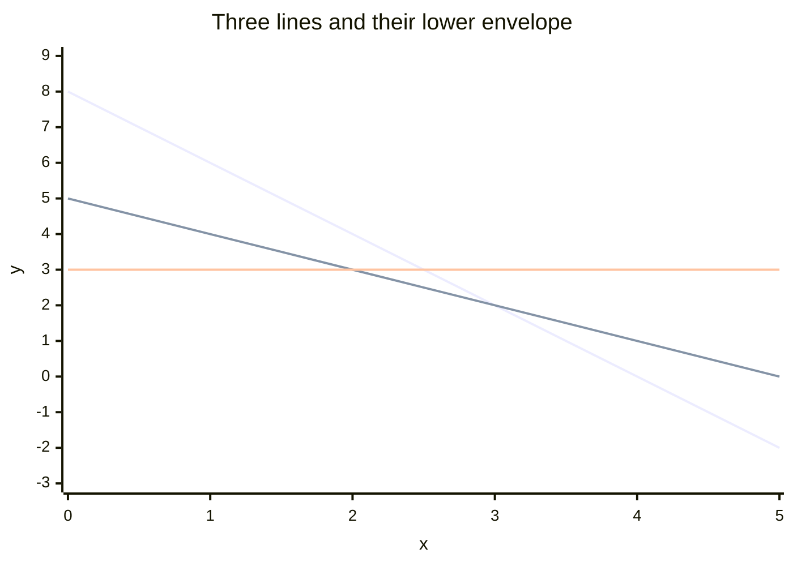
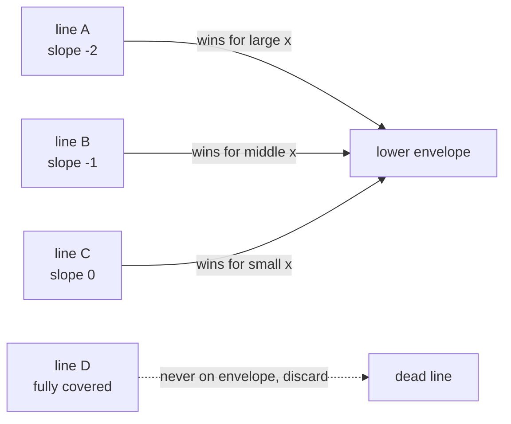
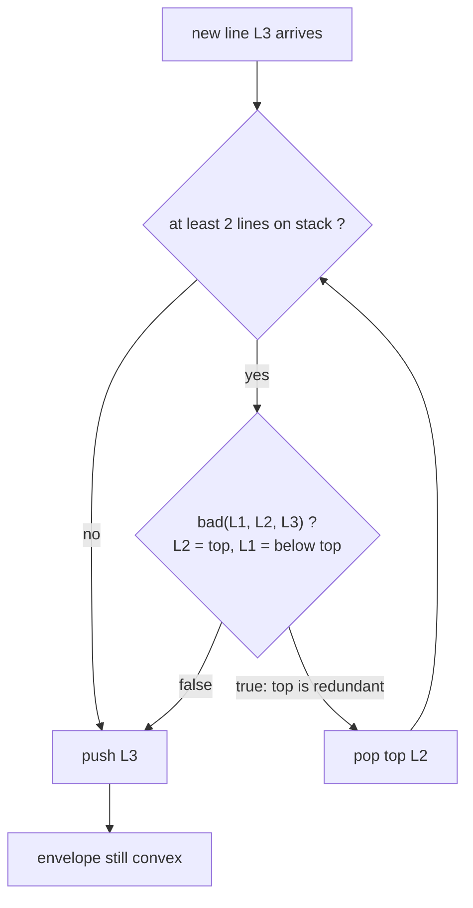
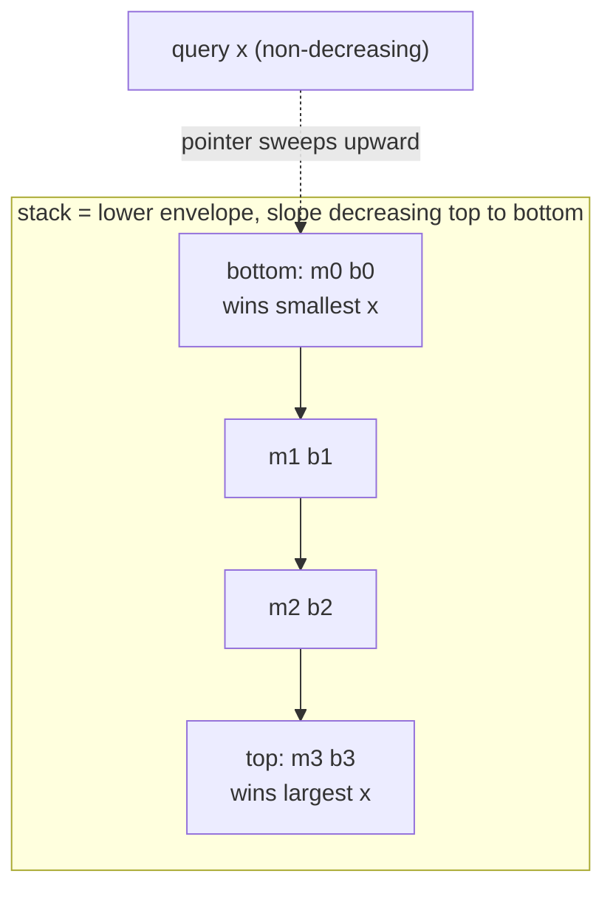
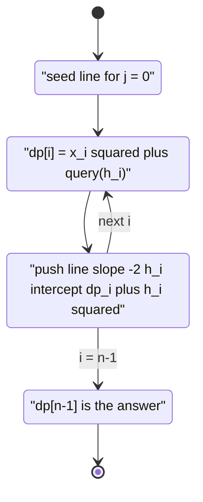
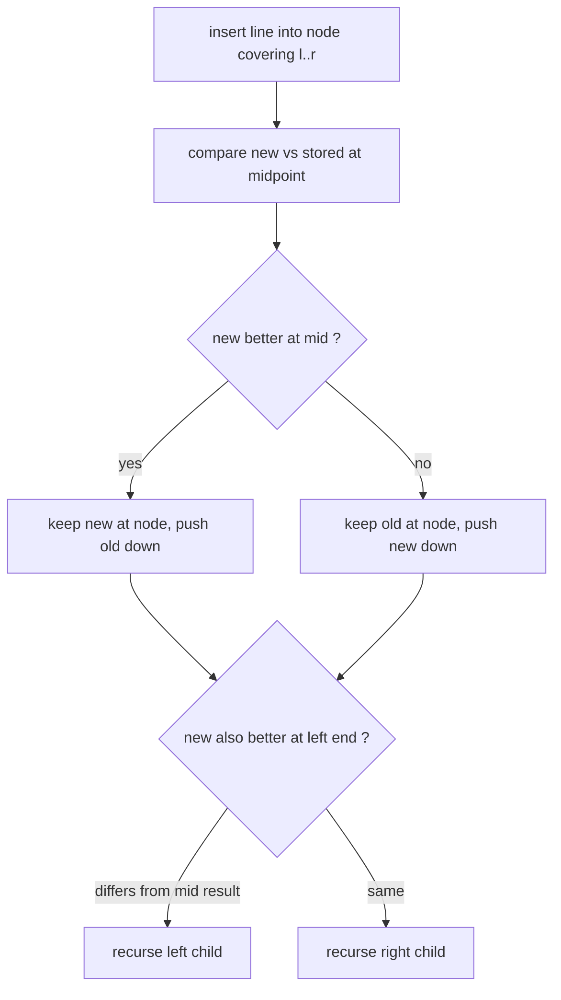

# DP Optimization: Convex Hull Trick (CHT) — Complete Guide

> Many DP recurrences have the shape *"the cost of state `i` is the best, over all earlier states
> `j`, of a **straight line** evaluated at a point that depends on `i`"*. Concretely
> $dp[i] = \min_j\big(m_j \cdot x_i + b_j\big)$, where each earlier state `j` contributes a line
> $y = m_j x + b_j$ and the new state `i` queries those lines at $x = x_i$. Computed naively that
> is $O(n^2)$: for every `i` you scan every `j`.
>
> The **Convex Hull Trick** turns that into (near) linear time by noticing that, out of all the
> lines, only the ones forming the **lower envelope** can ever be the minimum. Lines that are
> "covered" everywhere by two neighbours are useless and can be discarded. If slopes are added in
> monotone order and queries arrive in monotone order, a humble **stack of lines** plus a moving
> pointer answers everything in **amortized $O(1)$**. When slopes or queries are arbitrary, a
> **Li Chao tree** keeps the same envelope idea at $O(\log V)$ per operation.
>
> This guide teaches you to (1) **recognise** the line-min/line-max transition, (2) **see** it as a
> lower/upper envelope of lines, (3) **implement** the monotonic-stack container with the
> cross-product `bad()` test, (4) **handle** maximum vs minimum, and (5) **fall back** to a Li Chao
> tree when monotonicity is lost.

---

## Table of Contents
1. [The Transition Shape](#1-the-transition-shape)
2. [The Geometric Idea: Envelope of Lines](#2-the-geometric-idea-envelope-of-lines)
3. [Naive Evaluation and Why It Is Slow](#3-naive-evaluation-and-why-it-is-slow)
4. [The Monotonic CHT Container](#4-the-monotonic-cht-container)
5. [Adding a Line, Querying, and a Full DP](#5-adding-a-line-querying-and-a-full-dp)
6. [Maximum vs Minimum Envelope](#6-maximum-vs-minimum-envelope)
7. [The Li Chao Tree Alternative](#7-the-li-chao-tree-alternative)
8. [Complexity Summary](#complexity-summary)
9. [Common Pitfalls](#common-pitfalls)
10. [Patterns](#patterns)

---

## 1. The Transition Shape

The trick applies whenever the recurrence can be massaged into a **line evaluated at a query
point**. The canonical form is

$$
dp[i] = \min_{0 \le j < i}\big(\, m_j \cdot x_i + b_j \,\big) \;\; (+\, \text{terms depending only on } i)
$$

where each earlier index `j` defines a line with **slope** $m_j$ and **intercept** $b_j$, and the
new index `i` supplies the **query point** $x_i$. The slope and intercept must depend *only on `j`*,
and the query must depend *only on `i`* — separating the two is the whole game.

A very common source is a squared-distance cost. If
$dp[i] = \min_j\big(dp[j] + (a_i - a_j)^2\big)$, expand the square:

$$
dp[i] = a_i^2 + \min_{j}\Big(\underbrace{-2a_j}_{m_j}\cdot \underbrace{a_i}_{x_i} + \underbrace{dp[j] + a_j^2}_{b_j}\Big)
$$

The $a_i^2$ leaves the minimisation (it depends only on `i`), and what remains is exactly a set of
lines $m_j x + b_j$ queried at $x_i = a_i$.



---

## 2. The Geometric Idea: Envelope of Lines

Picture every line $y = m_j x + b_j$ drawn on the plane. Asking for $\min_j(m_j x_i + b_j)$ is
asking: *standing at $x = x_i$, which line is lowest?* The set of "lowest points" across all $x$ is
the **lower envelope** — a convex, piecewise-linear curve. Only lines that touch this envelope can
ever win a query; every other line is dominated everywhere and is dead weight.



For the **minimum** envelope, as the query $x$ increases the winning line's slope only ever
**decreases** (steeper-downhill lines take over on the right). That monotone hand-off is what lets a
pointer sweep forward without ever backtracking.



A line is **on the envelope** only between the two intersection points with its envelope
neighbours. If those two intersection points cross over each other, the line has *zero* width on
the envelope and must be removed — that is precisely the `bad()` test of the next section.

---

## 3. Naive Evaluation and Why It Is Slow

Before optimising, here is the brute-force transition. For each `i`, scan every earlier line and
keep the minimum. Correct, simple, and $O(n^2)$.

```python
def naive_line_min(slopes, intercepts, queries):
    # dp-style: for each i, min over all j < i of slopes[j]*queries[i] + intercepts[j]
    n = len(slopes)
    INF = float("inf")
    ans = [0] * n
    for i in range(n):
        best = INF
        for j in range(i + 1):                       # every earlier line
            best = min(best, slopes[j] * queries[i] + intercepts[j])
        ans[i] = best
    return ans
```

```cpp
#include <bits/stdc++.h>
using namespace std;

vector<long long> naive_line_min(vector<long long>& slopes,
                                 vector<long long>& intercepts,
                                 vector<long long>& queries) {
    // dp-style: for each i, min over all j <= i of slopes[j]*queries[i] + intercepts[j]
    int n = (int)slopes.size();
    const long long INF = 1e18;
    vector<long long> ans(n, 0);
    for (int i = 0; i < n; ++i) {
        long long best = INF;
        for (int j = 0; j <= i; ++j)                 // every earlier line
            best = min(best, slopes[j] * queries[i] + intercepts[j]);
        ans[i] = best;
    }
    return ans;
}
```

With $n$ up to $10^5$ or $10^6$ this quadratic scan is far too slow. The lines, however, are highly
redundant — most never win any query. CHT exploits exactly that.

---

## 4. The Monotonic CHT Container

Assume (the easy, most common case) that lines are **added with strictly decreasing slopes** and
queries arrive with **non-decreasing $x$**. We keep lines on a stack representing the lower
envelope. When a new line arrives, the top line may become useless: it is squeezed out if the new
line covers it everywhere it used to win. That condition is the **`bad()` test**.

Given three consecutive lines $L_1, L_2, L_3$ (by slope), $L_2$ is redundant when the intersection
of $L_1$ and $L_3$ lies to the **left** of the intersection of $L_1$ and $L_2$. The intersection of
$(m_1,b_1)$ and $(m_2,b_2)$ sits at $x = \dfrac{b_2 - b_1}{m_1 - m_2}$. Comparing two such
fractions and cross-multiplying (carefully, since slope differences are positive) gives a clean,
division-free, integer-safe test:

$$
\text{bad}(L_1, L_2, L_3) \iff (b_3 - b_1)\,(m_1 - m_2)\ \le\ (b_2 - b_1)\,(m_1 - m_3)
$$



The container also answers queries with a **moving pointer** `ptr`. Because queries are
non-decreasing, the winning line index never moves backward, so the pointer only marches forward
across the whole run — that is the amortized $O(1)$.

```python
class CHTMin:
    """Lower envelope for MINIMUM queries.
    Precondition: lines added with strictly decreasing slopes,
    queries asked with non-decreasing x."""
    def __init__(self):
        self.lines = []     # list of (m, b), forming the lower envelope
        self.ptr = 0        # pointer for monotone queries

    @staticmethod
    def _bad(l1, l2, l3):
        # is l2 made redundant by l1 and l3? (cross-product, no division)
        m1, b1 = l1
        m2, b2 = l2
        m3, b3 = l3
        return (b3 - b1) * (m1 - m2) <= (b2 - b1) * (m1 - m3)

    def add(self, m, b):
        line = (m, b)
        while len(self.lines) >= 2 and self._bad(self.lines[-2], self.lines[-1], line):
            self.lines.pop()
        self.lines.append(line)

    def query(self, x):
        if self.ptr >= len(self.lines):
            self.ptr = len(self.lines) - 1
        while self.ptr + 1 < len(self.lines):
            m1, b1 = self.lines[self.ptr]
            m2, b2 = self.lines[self.ptr + 1]
            if m2 * x + b2 <= m1 * x + b1:           # next line is better here
                self.ptr += 1
            else:
                break
        m, b = self.lines[self.ptr]
        return m * x + b
```

```cpp
#include <bits/stdc++.h>
using namespace std;

struct CHTMin {
    // Lower envelope for MINIMUM queries.
    // Precondition: lines added with strictly decreasing slopes,
    // queries asked with non-decreasing x.
    vector<long long> M, B;     // slopes and intercepts on the envelope
    int ptr = 0;                // pointer for monotone queries

    static bool bad(long long m1, long long b1, long long m2, long long b2,
                    long long m3, long long b3) {
        // cross-product test, no division: is the middle line redundant?
        return (b3 - b1) * (m1 - m2) <= (b2 - b1) * (m1 - m3);
    }

    void add(long long m, long long b) {
        while (M.size() >= 2 &&
               bad(M[M.size() - 2], B[M.size() - 2], M.back(), B.back(), m, b)) {
            M.pop_back();
            B.pop_back();
        }
        M.push_back(m);
        B.push_back(b);
    }

    long long query(long long x) {
        if (ptr >= (int)M.size()) ptr = (int)M.size() - 1;
        while (ptr + 1 < (int)M.size() &&
               M[ptr + 1] * x + B[ptr + 1] <= M[ptr] * x + B[ptr]) {
            ptr++;                                    // next line is better here
        }
        return M[ptr] * x + B[ptr];
    }
};
```

The stack literally *is* the envelope, ordered by slope:



---

## 5. Adding a Line, Querying, and a Full DP

The container only becomes a *DP optimization* when each computed `dp[j]` is fed back as a new
line. The pattern is a tight loop: **query** for `dp[i]`, then **add** the line that state `i`
contributes for future states. Here is the canonical squared-distance DP
$dp[i] = \min_{j<i}\big(dp[j] + (h_i - h_j)^2\big)$ with $dp[0] = 0$, assuming `h` is
non-decreasing (so slopes $-2h_j$ decrease and queries $h_i$ increase).

```python
def cht_dp(h):
    # dp[i] = min_{j<i} ( dp[j] + (h[i]-h[j])^2 ), dp[0] = 0, h non-decreasing
    n = len(h)
    dp = [0] * n
    cht = CHTMin()
    cht.add(-2 * h[0], dp[0] + h[0] * h[0])           # line for j = 0
    for i in range(1, n):
        best = cht.query(h[i])                        # min over all earlier lines
        dp[i] = h[i] * h[i] + best
        cht.add(-2 * h[i], dp[i] + h[i] * h[i])       # contribute line for future i
    return dp[n - 1]
```

```cpp
#include <bits/stdc++.h>
using namespace std;

// (CHTMin from section 4 is assumed available here)
long long cht_dp(vector<long long>& h) {
    // dp[i] = min_{j<i} ( dp[j] + (h[i]-h[j])^2 ), dp[0] = 0, h non-decreasing
    int n = (int)h.size();
    vector<long long> dp(n, 0);
    CHTMin cht;
    cht.add(-2 * h[0], dp[0] + h[0] * h[0]);          // line for j = 0
    for (int i = 1; i < n; ++i) {
        long long best = cht.query(h[i]);             // min over all earlier lines
        dp[i] = h[i] * h[i] + best;
        cht.add(-2 * h[i], dp[i] + h[i] * h[i]);      // contribute line for future i
    }
    return dp[n - 1];
}
```



---

## 6. Maximum vs Minimum Envelope

Everything above builds the **lower** envelope for *minimum* queries. For **maximum** queries you
want the **upper** envelope. Two equivalent options:

1. **Mirror the structure** — flip every inequality (`<=` becomes `>=`) in `bad()` and `query()`,
   and add lines with **increasing** slopes.
2. **Negate** — keep the exact min container, but feed lines as $(-m, -b)$ and negate the answer,
   because $\max_j(m_j x + b_j) = -\min_j(-m_j x - b_j)$.

The negation trick is the least error-prone: you reuse a single tested container.

```python
def cht_max_via_negation(slopes, intercepts, queries):
    # max over lines, reusing the MIN container by negating
    cht = CHTMin()                                    # min structure
    out = []
    for m, b, x in zip(slopes, intercepts, queries):
        cht.add(-m, -b)                               # feed negated line
        out.append(-cht.query(x))                     # negate back to a maximum
    return out
```

```cpp
#include <bits/stdc++.h>
using namespace std;

// (CHTMin from section 4 is assumed available here)
vector<long long> cht_max_via_negation(vector<long long>& slopes,
                                       vector<long long>& intercepts,
                                       vector<long long>& queries) {
    // max over lines, reusing the MIN container by negating
    CHTMin cht;                                       // min structure
    vector<long long> out;
    for (size_t k = 0; k < slopes.size(); ++k) {
        cht.add(-slopes[k], -intercepts[k]);          // feed negated line
        out.push_back(-cht.query(queries[k]));        // negate back to a maximum
    }
    return out;
}
```

Whichever you pick, keep the slope-ordering precondition consistent: a min container expects
decreasing slopes; after negation those become increasing slopes in the original problem.

---

## 7. The Li Chao Tree Alternative

The monotonic stack needs **both** monotone slopes and monotone queries. When heights are unsorted
(slopes $-2h_j$ jump around) or queries are arbitrary, that assumption breaks. A **Li Chao tree**
maintains the same lower envelope over a bounded query domain $[lo, hi]$ and supports **any** insert
order and **any** query at $O(\log V)$ each, where $V$ is the domain size. (For very large or
floating domains, see the segment-tree / dynamic structures in the `ds_advanced` module; the idea
generalises directly.)

Each tree node owns the single line that is best at its segment **midpoint**; inserting a new line
keeps the better-at-mid line at the node and recurses into the half where the other line might still
win.



```python
class LiChaoMin:
    """Li Chao tree: lower envelope over integer domain [lo, hi].
    Arbitrary insert order and arbitrary query points allowed."""
    def __init__(self, lo, hi):
        self.lo, self.hi = lo, hi
        self.tree = {}                                # node id -> (m, b)

    @staticmethod
    def _f(line, x):
        return line[0] * x + line[1]

    def add(self, m, b, node=1, l=None, r=None):
        if l is None:
            l, r = self.lo, self.hi
        new = (m, b)
        cur = self.tree.get(node)
        if cur is None:
            self.tree[node] = new
            return
        mid = (l + r) // 2
        if self._f(new, mid) < self._f(cur, mid):     # new wins at midpoint
            self.tree[node] = new
            new, cur = cur, new                       # demote the loser
        if l == r:
            return
        if self._f(new, l) < self._f(cur, l):         # loser may still win on the left
            self.add(new[0], new[1], node * 2, l, mid)
        else:
            self.add(new[0], new[1], node * 2 + 1, mid + 1, r)

    def query(self, x, node=1, l=None, r=None):
        if l is None:
            l, r = self.lo, self.hi
        cur = self.tree.get(node)
        res = float("inf") if cur is None else self._f(cur, x)
        if l == r:
            return res
        mid = (l + r) // 2
        if x <= mid:
            return min(res, self.query(x, node * 2, l, mid))
        return min(res, self.query(x, node * 2 + 1, mid + 1, r))
```

```cpp
#include <bits/stdc++.h>
using namespace std;
const long long INF = 1e18;

struct LiChaoMin {
    // Li Chao tree: lower envelope over integer domain [lo, hi].
    // Arbitrary insert order and arbitrary query points allowed.
    struct Line { long long m = 0, b = INF; };        // default = "plus infinity"
    long long lo, hi;
    vector<Line> tree;
    LiChaoMin(long long lo_, long long hi_) : lo(lo_), hi(hi_) {
        tree.assign(4 * (hi - lo + 1) + 4, Line{});
    }
    static long long f(const Line& ln, long long x) { return ln.m * x + ln.b; }

    void add(long long m, long long b, int node, long long l, long long r) {
        Line nw{m, b};
        long long mid = (l + r) >> 1;
        if (f(nw, mid) < f(tree[node], mid)) swap(tree[node], nw);   // new wins at mid
        if (l == r) return;
        if (f(nw, l) < f(tree[node], l)) add(nw.m, nw.b, node * 2, l, mid);
        else add(nw.m, nw.b, node * 2 + 1, mid + 1, r);
    }
    void add(long long m, long long b) { add(m, b, 1, lo, hi); }

    long long query(long long x, int node, long long l, long long r) {
        long long res = f(tree[node], x);
        if (l == r) return res;
        long long mid = (l + r) >> 1;
        if (x <= mid) return min(res, query(x, node * 2, l, mid));
        return min(res, query(x, node * 2 + 1, mid + 1, r));
    }
    long long query(long long x) { return query(x, 1, lo, hi); }
};
```

Use the **monotonic stack** when the problem hands you sorted slopes and queries (it is faster and
simpler); reach for the **Li Chao tree** the moment either monotonicity is lost.

---

## Complexity Summary

| Approach | Add line | Query | Total over `n` ops | Notes |
|----------|----------|-------|--------------------|-------|
| Naive scan | — | $O(n)$ | $O(n^2)$ | baseline, always correct |
| Monotonic CHT (stack + pointer) | amortized $O(1)$ | amortized $O(1)$ | $O(n)$ | needs monotone slopes **and** queries |
| Monotonic CHT + binary search | amortized $O(1)$ | $O(\log n)$ | $O(n \log n)$ | monotone slopes, **arbitrary** queries |
| Li Chao tree | $O(\log V)$ | $O(\log V)$ | $O(n \log V)$ | **any** slopes, **any** queries, bounded domain |

Here $V = hi - lo + 1$ is the size of the query domain for the Li Chao tree.

---

## Common Pitfalls

- **Mixing `i`-terms into the line.** Only $m_j, b_j$ may depend on `j`; only $x_i$ may depend on
  `i`. Anything depending on both (or on `i` alone) must be pulled *outside* the min, like the
  $a_i^2$ term.
- **Wrong slope order.** The simple stack assumes a fixed monotone slope order. Feeding slopes in
  the wrong direction silently produces wrong answers — sort, or switch to Li Chao.
- **Non-monotone queries with the pointer.** A moving pointer only works for monotone queries. For
  arbitrary queries on a monotone stack, binary-search the envelope instead of advancing a pointer.
- **Min vs max confusion.** A min container queried for a max gives garbage. Either mirror all
  comparisons or use the negation trick consistently.
- **Integer overflow.** Slopes times queries (e.g. $-2h_j \cdot h_i$) and squared terms overflow
  32-bit fast. Use `long long`, and `const long long INF = 1e18` for "no line yet".
- **Division in `bad()`.** Computing intersections with floating-point division invites precision
  bugs. Cross-multiply into the integer form $(b_3-b_1)(m_1-m_2) \le (b_2-b_1)(m_1-m_3)$.
- **Li Chao domain too small.** Queries outside $[lo, hi]$ are undefined; size the domain to cover
  every possible query point.

---

## Patterns

- **Spot the line.** Whenever $dp[i] = \min_j(\text{something}_j \cdot \text{something}_i +
  \text{something}_j)$, you almost certainly have a CHT.
- **Expand the square.** Costs like $(a_i - a_j)^2$ are the number-one trigger; expand and collect
  the cross term $-2a_j a_i$ as slope $\times$ query.
- **Query then add.** The DP loop computes `dp[i]` by querying the envelope, then *adds the line
  state `i` contributes* for later states — never the other way around.
- **Monotone first, Li Chao second.** Check whether slopes and queries are monotone; if yes, the
  $O(n)$ stack is ideal. If not, the $O(n \log V)$ Li Chao tree handles the general case.
- **Negate for maxima.** Reuse one min container for maximum problems by negating lines and the
  answer.
- **Forward-reference heavier structures.** For dynamic/offline variants and 2D extensions, the
  `ds_advanced` module covers Li Chao on segment trees and Kinetic Segment Trees.
```
