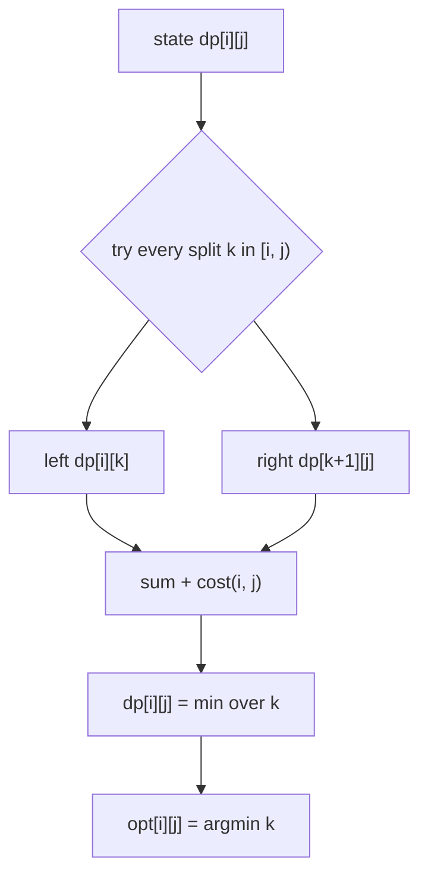
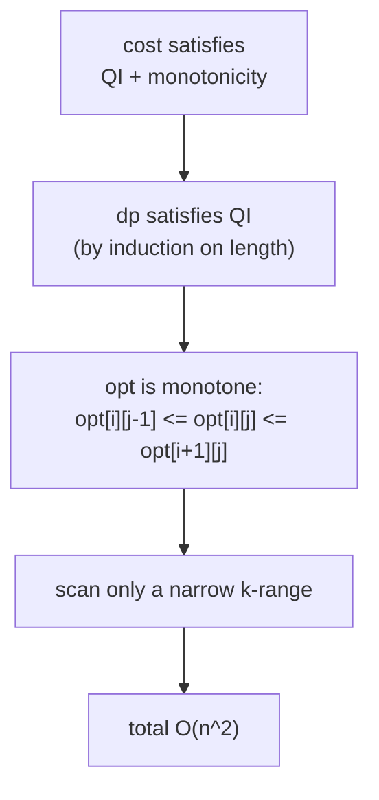
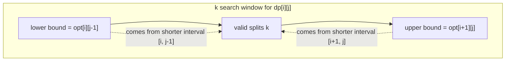
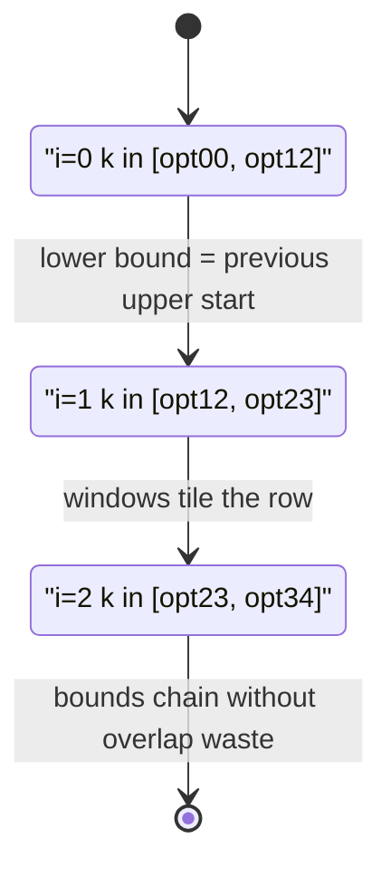
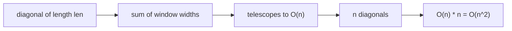
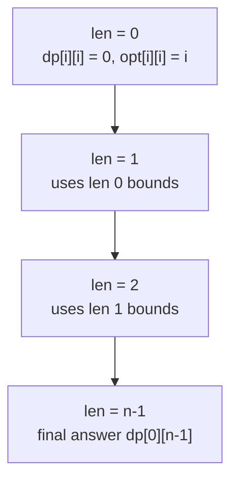
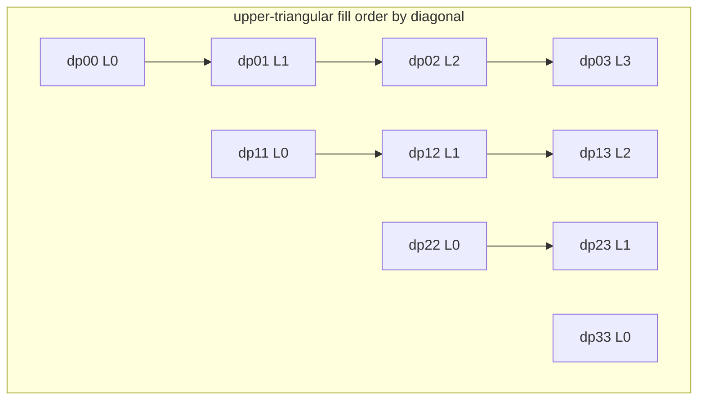
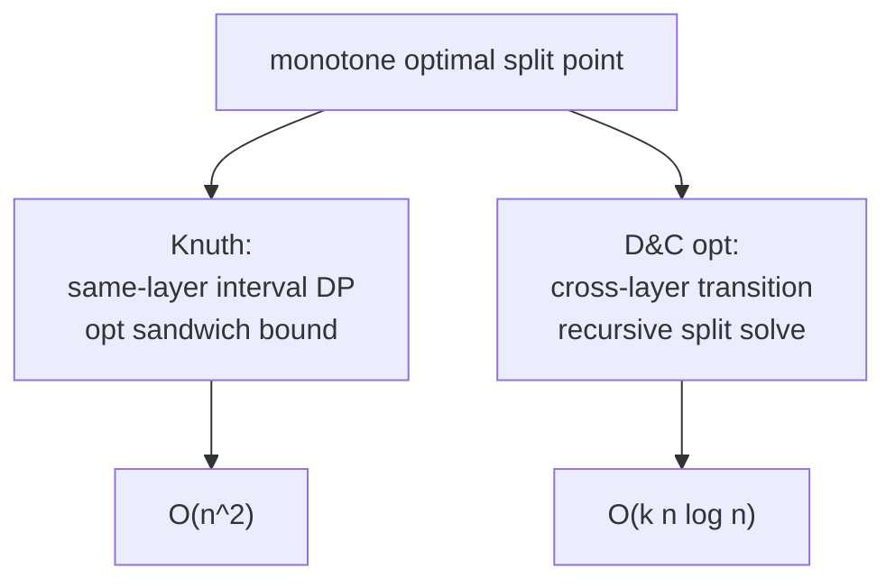

# DP Optimization — Knuth Optimization (Complete Guide)

> Some interval-DP recurrences have the shape
> `dp[i][j] = min over i <= k < j of ( dp[i][k] + dp[k+1][j] ) + cost(i, j)`.
> Naively this costs $O(n^3)$: there are $O(n^2)$ states and each scans $O(n)$ split points.
> **Knuth optimization** (also called the Knuth–Yao speedup) shrinks this to $O(n^2)$ by
> proving that the *best* split point moves **monotonically**. If you record the optimal split
> `opt[i][j]` for every state, then for a fixed problem the optimal split of a slightly larger
> interval can only sit *between* the optimal splits of its two immediate sub-intervals:
>
> $$ opt[i][j-1] \le opt[i][j] \le opt[i+1][j]. $$
>
> Instead of scanning all of `[i, j)` you only scan `[opt[i][j-1], opt[i+1][j]]`, and a
> telescoping-sum argument shows the **total** work across every interval of a fixed length is
> $O(n)$, giving $O(n^2)$ overall.
>
> This guide shows (1) the exact recurrence Knuth applies to, (2) the **quadrangle inequality**
> (Monge condition) plus cost monotonicity that justify it, (3) the monotonic-split lemma and
> why it telescopes, (4) the $O(n^2)$ implementation with an `opt` table, (5) how to verify the
> conditions, and (6) how Knuth relates to divide-and-conquer optimization.

---

## Table of Contents
1. [The Target Recurrence](#1-the-target-recurrence)
2. [The Quadrangle Inequality and Monotonicity](#2-the-quadrangle-inequality-and-monotonicity)
3. [The Monotonic Split Lemma](#3-the-monotonic-split-lemma)
4. [Why It Becomes O(n^2)](#4-why-it-becomes-on2)
5. [Iteration Order — By Interval Length](#5-iteration-order--by-interval-length)
6. [The O(n^2) Knuth Implementation](#6-the-on2-knuth-implementation)
7. [Verifying the Conditions](#7-verifying-the-conditions)
8. [Relationship to Divide-and-Conquer Optimization](#8-relationship-to-divide-and-conquer-optimization)
9. [Complexity Summary](#complexity-summary)
10. [Common Pitfalls](#common-pitfalls)
11. [Patterns](#patterns)

---

## 1. The Target Recurrence

Knuth optimization applies to interval DP of the canonical form

$$
dp[i][j] = \min_{i \le k < j}\Big(\, dp[i][k] + dp[k+1][j] \,\Big) + \text{cost}(i, j),
$$

with base case `dp[i][i] = 0` (a single element needs no split). The crucial structural fact is
that `cost(i, j)` depends **only on the endpoints** `i` and `j`, *not* on the split `k`. Classic
instances:

- **Optimal Binary Search Tree** — `cost(i, j)` is the sum of access frequencies in `[i, j]`.
- **Stone / file merging** — `cost(i, j)` is the sum of pile weights in `[i, j]`.
- **Matrix-chain-like grouping** where the merge penalty is a range prefix sum.

The optimal split that achieves the minimum is recorded as `opt[i][j]`:



The whole speedup hinges on one observation: **`opt[i][j]` is monotone**, so we never need to
look at every `k`.

---

## 2. The Quadrangle Inequality and Monotonicity

Knuth's theorem requires two properties of the cost function. Let $a \le b \le c \le d$ be any
indices.

**(A) Quadrangle Inequality (QI / Monge condition):**

$$
\text{cost}(a, c) + \text{cost}(b, d) \le \text{cost}(a, d) + \text{cost}(b, c).
$$

Read it as: *"crossing" pairs cost no more than "nested" pairs.* Intuitively, widening an
interval has diminishing extra cost.

**(B) Monotonicity on the lattice of intervals:**

$$
\text{cost}(b, c) \le \text{cost}(a, d) \quad \text{whenever } a \le b \le c \le d,
$$

i.e. an inner interval costs no more than an interval that contains it.

When `cost(i, j)` is a **prefix-sum of non-negative weights** (frequencies, pile sizes), both (A)
and (B) hold automatically — in fact (A) holds with equality. A central theorem (Yao) states:

> If `cost` satisfies QI and monotonicity, then `dp` itself satisfies QI, and therefore the
> optimal split `opt[i][j]` is monotone in both arguments.



The inequalities are written with escaped `&lt;=` so they render literally inside the diagram.

---

## 3. The Monotonic Split Lemma

The payoff lemma. For every interval with `i < j`:

$$
opt[i][j-1] \le opt[i][j] \le opt[i+1][j].
$$

Meaning: the best split of `[i, j]` is **sandwiched** between the best split of its left-shrunk
neighbour `[i, j-1]` and its right-shrunk neighbour `[i+1, j]`. Picture the bounding box of `k`:



Because both bounds were computed for **shorter** intervals (length `len-1`), they are already
final by the time we process length `len`. The shrinking window as we slide `i` rightward across
a fixed length:



---

## 4. Why It Becomes O(n^2)

Fix an interval length `len`. As `i` ranges over a full diagonal, the work for state `[i, i+len]`
is proportional to

$$
\big(opt[i+1][i+len] - opt[i][i+len-1] + 1\big).
$$

Summing over all `i` on that diagonal **telescopes**: consecutive upper and lower bounds cancel,
leaving roughly $opt[\text{last}] - opt[\text{first}] + n = O(n)$. There are $n$ distinct
lengths, so the grand total is

$$
\sum_{len=1}^{n} O(n) = O(n^2).
$$



The space stays $O(n^2)$ for the `dp` and `opt` tables.

---

## 5. Iteration Order — By Interval Length

Exactly as in plain interval DP: process **shortest intervals first**. The base diagonal
(`len = 0`) is `dp[i][i] = 0`. Then for each `len = 1, 2, ..., n-1`, slide `i` and set
`j = i + len`. The `opt[i][j-1]` and `opt[i+1][j]` bounds come from length `len-1`, already done.



A small interval-triangle picture of which cells are filled (rows = `i`, cols = `j`):



---

## 6. The O(n^2) Knuth Implementation

`w` is the cost function — here `cost(i, j) = prefix[j+1] - prefix[i]`, a range sum of
non-negative weights, which automatically satisfies QI and monotonicity.

```python
def knuth(weight):
    n = len(weight)
    # prefix sums so cost(i, j) = pre[j + 1] - pre[i]
    pre = [0] * (n + 1)
    for i in range(n):
        pre[i + 1] = pre[i] + weight[i]

    INF = float("inf")
    dp = [[0] * n for _ in range(n)]
    opt = [[0] * n for _ in range(n)]

    # length 0: single element, no merge cost, split index is itself
    for i in range(n):
        dp[i][i] = 0
        opt[i][i] = i

    # iterate by increasing interval length
    for length in range(1, n):
        for i in range(0, n - length):
            j = i + length
            lo = opt[i][j - 1]            # lower bound on k
            hi = opt[i + 1][j]            # upper bound on k
            best = INF
            arg = lo
            cost = pre[j + 1] - pre[i]    # cost(i, j), independent of k
            for k in range(lo, hi + 1):
                cand = dp[i][k] + dp[k + 1][j] + cost
                if cand < best:
                    best = cand
                    arg = k
            dp[i][j] = best
            opt[i][j] = arg

    return dp[0][n - 1]
```

```cpp
#include <bits/stdc++.h>
using namespace std;

long long knuth(const vector<long long>& weight) {
    int n = (int)weight.size();
    const long long INF = 1e18;

    // prefix sums so cost(i, j) = pre[j + 1] - pre[i]
    vector<long long> pre(n + 1, 0);
    for (int i = 0; i < n; i++) pre[i + 1] = pre[i] + weight[i];

    vector<vector<long long>> dp(n, vector<long long>(n, 0));
    vector<vector<int>> opt(n, vector<int>(n, 0));

    // length 0: single element, no merge cost, split index is itself
    for (int i = 0; i < n; i++) {
        dp[i][i] = 0;
        opt[i][i] = i;
    }

    // iterate by increasing interval length
    for (int length = 1; length < n; length++) {
        for (int i = 0; i + length < n; i++) {
            int j = i + length;
            int lo = opt[i][j - 1];               // lower bound on k
            int hi = opt[i + 1][j];               // upper bound on k
            long long best = INF;
            int arg = lo;
            long long cost = pre[j + 1] - pre[i]; // cost(i, j), independent of k
            for (int k = lo; k <= hi; k++) {
                long long cand = dp[i][k] + dp[k + 1][j] + cost;
                if (cand < best) {
                    best = cand;
                    arg = k;
                }
            }
            dp[i][j] = best;
            opt[i][j] = arg;
        }
    }

    return dp[0][n - 1];
}
```

The only differences from the $O(n^3)$ version are the two lines `lo = opt[i][j-1]` and
`hi = opt[i+1][j]` plus storing `opt`. Everything else is identical.

---

## 7. Verifying the Conditions

Before trusting Knuth on a new problem, confirm the cost satisfies QI. Two practical routes:

1. **Prove it algebraically.** A prefix sum of non-negative values always satisfies the
   quadrangle inequality with equality, so any "sum of the range" cost qualifies immediately.
2. **Brute-force check on small random inputs.** Compare the $O(n^3)$ answer against the
   $O(n^2)$ Knuth answer; if they ever differ, QI fails for your cost.

```python
import random

def cost_is_monge(cost, n):
    # cost(a, b) must satisfy cost(a,c)+cost(b,d) <= cost(a,d)+cost(b,c)
    for a in range(n):
        for b in range(a, n):
            for c in range(b, n):
                for d in range(c, n):
                    if cost(a, c) + cost(b, d) > cost(a, d) + cost(b, c):
                        return False
    return True
```

```cpp
#include <bits/stdc++.h>
using namespace std;

bool cost_is_monge(const function<long long(int,int)>& cost, int n) {
    // cost(a, b) must satisfy cost(a,c)+cost(b,d) <= cost(a,d)+cost(b,c)
    for (int a = 0; a < n; a++)
        for (int b = a; b < n; b++)
            for (int c = b; c < n; c++)
                for (int d = c; d < n; d++)
                    if (cost(a, c) + cost(b, d) > cost(a, d) + cost(b, c))
                        return false;
    return true;
}
```

If the check passes for many random instances and a direct algebraic argument exists, Knuth is
safe to apply.

---

## 8. Relationship to Divide-and-Conquer Optimization

Both speedups exploit **monotone optimal splits**, but they target different DP shapes:

| Aspect | Knuth optimization | Divide-and-conquer (D&C) optimization |
|--------|--------------------|----------------------------------------|
| DP shape | interval `dp[i][j]`, split over the *same* layer | layered `dp[t][j] = min_k dp[t-1][k] + cost(k, j)` |
| Monotone fact | `opt[i][j-1] <= opt[i][j] <= opt[i+1][j]` | `opt[t][j]` non-decreasing in `j` |
| Per-layer cost | one table, $O(n^2)$ total | $O(n \log n)$ per layer |
| Condition | quadrangle inequality on `cost(i, j)` | quadrangle / concavity on `cost(k, j)` |



In short: when the recurrence is the single-layer interval form with endpoint-only cost, reach
for Knuth; when it is a multi-layer "partition into groups" recurrence, reach for D&C
optimization.

---

## Complexity Summary

| Approach | Time | Space | Notes |
|----------|------|-------|-------|
| Naive interval DP | $O(n^3)$ | $O(n^2)$ | scan every split `k` |
| Knuth optimization | $O(n^2)$ | $O(n^2)$ | scan only `[opt[i][j-1], opt[i+1][j]]` |
| Monge check (debug only) | $O(n^4)$ | $O(1)$ | verify QI on small `n` |

---

## Common Pitfalls

- **Applying Knuth when cost depends on `k`.** The recurrence must put `cost(i, j)` *outside* the
  `min`; if the merge penalty changes with the split, QI can fail.
- **Wrong bounds.** It is `opt[i][j-1]` (lower) and `opt[i+1][j]` (upper). Swapping them or using
  `j` instead of `j-1` silently produces wrong answers without crashing.
- **Forgetting to fill `opt` on the base diagonal.** Set `opt[i][i] = i`, otherwise the first real
  length reads garbage bounds.
- **Wrong iteration order.** You must go by increasing length so both bound cells are finalized.
- **Assuming QI holds.** Always justify it (prefix sum of non-negatives) or stress-test against the
  $O(n^3)$ baseline.
- **Off-by-one in `cost`.** With `cost(i, j) = pre[j+1] - pre[i]`, the range is inclusive `[i, j]`.

---

## Patterns

- **Endpoint-only cost + min-split interval DP** → Knuth, drop $O(n^3)$ to $O(n^2)$.
- **Cost = range sum of non-negative weights** → QI is free, no proof needed.
- **Store `opt` while you compute `dp`** → reuse it as the search window for larger intervals.
- **Stress-test new costs** → compare Knuth vs naive on random inputs before trusting it.
- **Multi-layer partition recurrence** → use D&C optimization instead, same monotonicity idea.
