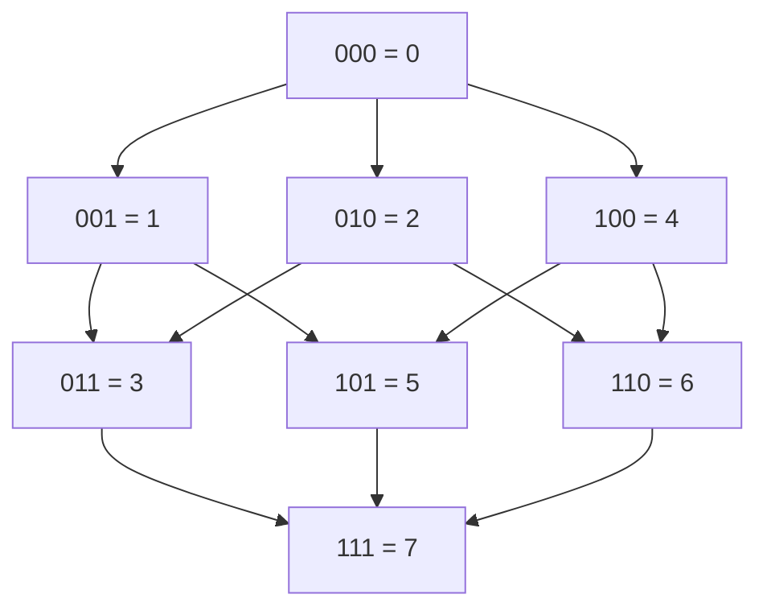
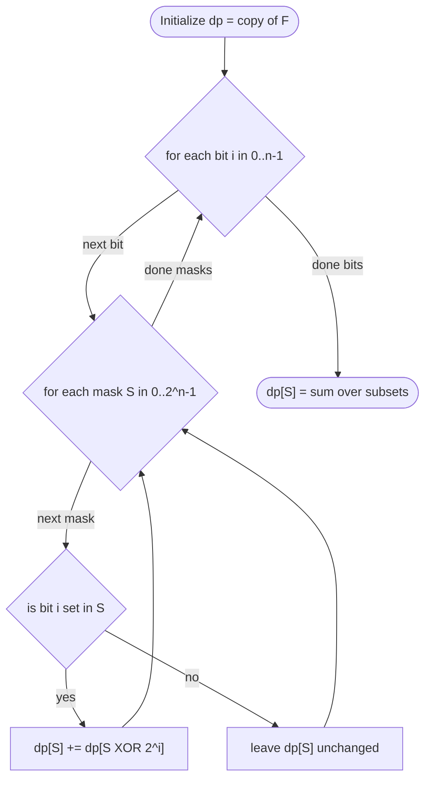
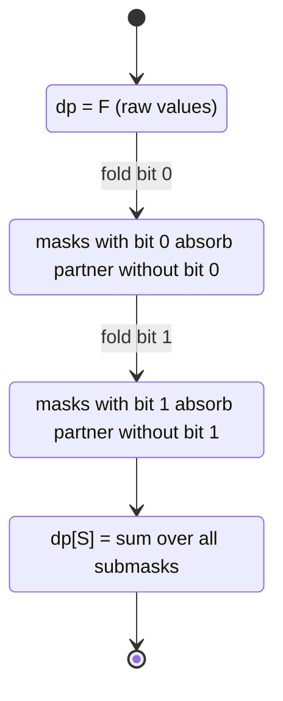
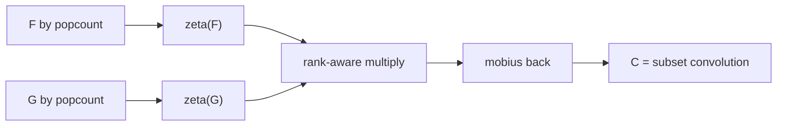

# SOS DP (Sum Over Subsets)

> Sum Over Subsets (SOS) DP is a technique to compute, for **every** bitmask, an aggregate of a function over **all of its submasks**, in $O(n \cdot 2^n)$ time instead of the naive $O(3^n)$. It is the discrete analogue of a *zeta transform* on the subset lattice, and it underpins subset convolution, AND/OR pair counting, and many bitmask DP optimizations.

---

## Table of Contents

1. [The Problem](#the-problem)
2. [Naive Submask Enumeration O(3^n)](#naive-submask-enumeration-o3n)
3. [The SOS DP Algorithm O(n 2^n)](#the-sos-dp-algorithm-on-2n)
4. [Sum Over Supersets (Dual)](#sum-over-supersets-dual)
5. [Connection to Zeta and Mobius Transforms](#connection-to-zeta-and-mobius-transforms)
6. [Applications](#applications)
7. [Complexity Summary](#complexity-summary)
8. [Common Pitfalls](#common-pitfalls)
9. [Patterns](#patterns)

---

## The Problem

We are given a function $F$ defined over all $2^n$ bitmasks of an $n$-bit universe. We want to compute a new function $G$ where, **for every mask** $S$, we aggregate $F$ over **all submasks** of $S$:

$$
G[S] = \sum_{T \subseteq S} F[T]
$$

Here $T \subseteq S$ means every set bit of $T$ is also a set bit of $S$ (bitwise: $T \mathbin{\&} S = T$). The aggregation operator is usually sum, but it can be any commutative monoid (min, max, XOR, OR, count).

Concretely, if $n = 3$ and $S = 101_2 = 5$, then the submasks are:

$$
T \in \{\, 000,\ 001,\ 100,\ 101 \,\} = \{0, 1, 4, 5\}
$$

so $G[5] = F[0] + F[1] + F[4] + F[5]$.

The subset relation forms a lattice. Each node points "up" to masks that contain one extra bit:



$G[S]$ sums $F$ over every node reachable by walking **downward** (removing bits) from $S$, including $S$ itself.

---

## Naive Submask Enumeration O(3^n)

The classic trick to enumerate all submasks of a mask $S$ is:

```python
def sos_naive(F, n):
    size = 1 << n
    G = [0] * size
    for S in range(size):
        sub = S
        while True:
            G[S] += F[sub]
            if sub == 0:
                break
            sub = (sub - 1) & S
    return G
```

```cpp
#include <bits/stdc++.h>
using namespace std;

vector<long long> sos_naive(const vector<long long>& F, int n) {
    int size = 1 << n;
    vector<long long> G(size, 0);
    for (int S = 0; S < size; ++S) {
        int sub = S;
        while (true) {
            G[S] += F[sub];
            if (sub == 0) break;
            sub = (sub - 1) & S;
        }
    }
    return G;
}
```

**Why is this $O(3^n)$?** A mask with $k$ set bits has $2^k$ submasks. Summing over all masks:

$$
\sum_{k=0}^{n} \binom{n}{k} 2^k = (1 + 2)^n = 3^n
$$

by the binomial theorem. For $n = 20$ that is $\approx 3.5 \times 10^9$ — too slow. We need a smarter decomposition.

---

## The SOS DP Algorithm O(n 2^n)

The key idea: process one **bit at a time**. After processing bit $i$, the partial DP value $dp_i[S]$ equals the sum of $F[T]$ over all submasks $T$ that **agree with $S$ on bits $> i$** and are **free to differ on bits $\le i$**. We build this up bit by bit.

Define the recurrence over bit index $i = 0 \ldots n-1$:

$$
dp_i[S] =
\begin{cases}
dp_{i-1}[S] & \text{if bit } i \text{ of } S \text{ is } 0 \\[4pt]
dp_{i-1}[S] + dp_{i-1}[S \oplus 2^i] & \text{if bit } i \text{ of } S \text{ is } 1
\end{cases}
$$

with base case $dp_{-1}[S] = F[S]$. The final answer is $G[S] = dp_{n-1}[S]$.

Intuitively: when bit $i$ is set in $S$, we "fold in" the contribution from the otherwise-identical mask that has bit $i$ **cleared** ($S \oplus 2^i$, i.e. the subset *missing* that bit). This single transfer captures every submask that could differ at bit $i$.

### The two nested loops



The canonical implementation — the $n \cdot 2^n$ double loop:

```python
def sos_dp(F, n):
    dp = F[:]                       # dp[S] starts as F[S]
    for i in range(n):              # one bit at a time
        bit = 1 << i
        for S in range(1 << n):     # every mask
            if S & bit:             # bit i is set in S
                dp[S] += dp[S ^ bit]
    return dp                       # dp[S] = sum over submasks of S
```

```cpp
#include <bits/stdc++.h>
using namespace std;

vector<long long> sos_dp(vector<long long> dp, int n) {
    for (int i = 0; i < n; ++i) {        // one bit at a time
        int bit = 1 << i;
        for (int S = 0; S < (1 << n); ++S) {  // every mask
            if (S & bit) {                // bit i is set in S
                dp[S] += dp[S ^ bit];
            }
        }
    }
    return dp;                            // dp[S] = sum over submasks of S
}
```

### Why each submask is counted exactly once

Take a submask $T \subseteq S$. The bits where they differ are exactly $D = S \oplus T$ (all of which are set in $S$ but cleared in $T$). The algorithm transfers $F[T]$'s contribution into $G[S]$ by flipping those differing bits **on** one at a time, in increasing bit order. Because each differing bit is folded in at its own dedicated layer $i$, there is exactly **one** monotone path from $T$ up to $S$, so $F[T]$ is added precisely once.

### Worked layer table for n = 2

Start with $F = [F_0, F_1, F_2, F_3]$ indexed by mask $00, 01, 10, 11$.

| Mask | Start (F) | After bit 0 | After bit 1 (final G) |
| :--- | :--- | :--- | :--- |
| `00` | $F_0$ | $F_0$ | $F_0$ |
| `01` | $F_1$ | $F_0 + F_1$ | $F_0 + F_1$ |
| `10` | $F_2$ | $F_2$ | $F_0 + F_2$ |
| `11` | $F_3$ | $F_2 + F_3$ | $F_0 + F_1 + F_2 + F_3$ |

Notice `11` correctly accumulates all four submasks $\{00, 01, 10, 11\}$.



---

## Sum Over Supersets (Dual)

The dual problem aggregates $F$ over all **supersets** instead of submasks:

$$
H[S] = \sum_{T \supseteq S} F[T]
$$

where $T \supseteq S$ means $S \mathbin{\&} T = S$. The fix is tiny: when bit $i$ is **clear** in $S$, fold in the partner that has bit $i$ **set** ($S \mid 2^i$).

```python
def sos_superset(F, n):
    dp = F[:]
    for i in range(n):
        bit = 1 << i
        for S in range(1 << n):
            if not (S & bit):           # bit i is clear in S
                dp[S] += dp[S | bit]    # add the superset partner
    return dp                           # dp[S] = sum over supersets of S
```

```cpp
#include <bits/stdc++.h>
using namespace std;

vector<long long> sos_superset(vector<long long> dp, int n) {
    for (int i = 0; i < n; ++i) {
        int bit = 1 << i;
        for (int S = 0; S < (1 << n); ++S) {
            if (!(S & bit)) {                // bit i is clear in S
                dp[S] += dp[S | bit];        // add the superset partner
            }
        }
    }
    return dp;                               // dp[S] = sum over supersets of S
}
```

By symmetry, the superset transform on $F$ equals the subset transform on the **bit-complemented** index space: $H[S] = G'[\bar S]$ where $G'$ is the subset transform of $F$ re-indexed by complement. This is why "count pairs with `AND == 0`" reduces to an SOS over complements (see [count-pairs-and-zero](../problems/count-pairs-and-zero.md)).

---

## Connection to Zeta and Mobius Transforms

The subset-sum operation is exactly the **zeta transform** $\zeta$ on the boolean lattice ordered by inclusion:

$$
(\zeta F)[S] = \sum_{T \subseteq S} F[T] = G[S]
$$

Its inverse is the **Mobius transform** $\mu$, which recovers $F$ from $G$. The Mobius step is the same double loop with a **subtraction**:

```python
def mobius_subset(G, n):
    F = G[:]
    for i in range(n):
        bit = 1 << i
        for S in range(1 << n):
            if S & bit:
                F[S] -= F[S ^ bit]      # invert the zeta fold
    return F                            # recovers original F
```

```cpp
#include <bits/stdc++.h>
using namespace std;

vector<long long> mobius_subset(vector<long long> F, int n) {
    for (int i = 0; i < n; ++i) {
        int bit = 1 << i;
        for (int S = 0; S < (1 << n); ++S) {
            if (S & bit) {
                F[S] -= F[S ^ bit];     // invert the zeta fold
            }
        }
    }
    return F;                           // recovers original F
}
```

The Mobius function on the subset lattice has the closed form $\mu(T, S) = (-1)^{|S| - |T|}$ for $T \subseteq S$, so the inversion formula reads:

$$
F[S] = \sum_{T \subseteq S} (-1)^{|S| - |T|}\, G[T]
$$

Because $\zeta$ and $\mu$ are inverse, applying SOS then Mobius is the identity, which lets us multiply functions "pointwise in zeta space" — the basis of subset convolution.

---

## Applications

### 1. Subset convolution (intro)

We want $C[S] = \sum_{A \cup B = S,\ A \cap B = \varnothing} F[A]\, G[B]$ (disjoint union). The trick: split by popcount, run SOS over each popcount layer, multiply in zeta space, then Mobius back. This computes the convolution in $O(n^2 2^n)$ — far better than $O(3^n)$.



### 2. Counting pairs with AND / OR conditions

- **Count pairs with `a[i] AND a[j] == 0`**: build $F[m]$ = frequency of value $m$, compute subset sums over **complements**, then for each $a[i]$ the number of valid partners lives in the SOS table. See the dedicated problem file.
- **Count pairs with `a[i] OR a[j] == full`**: a superset-sum mirror.
- **For each mask, how many array elements are submasks of it**: a direct SOS over a frequency array.

### 3. Bitmask DP speedups

Any DP whose transition reads "best over all subsets of the current mask" can replace an inner $O(2^{|S|})$ submask loop with a precomputed SOS table, turning $O(3^n)$ into $O(n 2^n)$.

---

## Complexity Summary

| Approach | Time | Space | Notes |
| :--- | :--- | :--- | :--- |
| Naive submask enumeration | $O(3^n)$ | $O(2^n)$ | simple but exponentially slower |
| SOS DP (subset zeta) | $O(n \cdot 2^n)$ | $O(2^n)$ | in-place double loop |
| SOS DP (superset zeta) | $O(n \cdot 2^n)$ | $O(2^n)$ | flip the bit test |
| Mobius inverse | $O(n \cdot 2^n)$ | $O(2^n)$ | same loop, subtract |
| Subset convolution | $O(n^2 \cdot 2^n)$ | $O(n \cdot 2^n)$ | popcount-layered SOS |

The crossover: SOS wins decisively for $n$ up to about $20$–$22$, where $2^n$ fits in memory and $n \cdot 2^n$ fits in time.

---

## Common Pitfalls

- **Updating in the wrong direction.** For subsets you add `dp[S ^ bit]` only when the bit is **set**; for supersets you add `dp[S | bit]` only when the bit is **clear**. Swapping these silently computes the wrong transform.
- **Mutating the input.** `dp = F[:]` (Python) or passing by value (C++) avoids clobbering the original array, which you may still need.
- **Integer overflow.** With counts or large weights, the aggregate can exceed 32-bit range. Use `long long` in C++ (Python ints are unbounded).
- **Iterating bits inside the mask loop.** The bit loop must be the **outer** loop. Reversing the loop order breaks the "one bit per layer" invariant and double-counts.
- **Memory blowup.** $2^n$ longs at $n = 25$ is $\approx 256$ MB. Confirm $n \le 22$ before allocating.
- **Confusing submask vs subset-value.** SOS aggregates over **submasks** (bitwise subsets), not over numerically smaller indices.

---

## Patterns

- **"For every mask, aggregate over its subsets"** $\Rightarrow$ subset SOS.
- **"For every mask, aggregate over its supersets"** $\Rightarrow$ superset SOS.
- **"Count pairs whose AND is zero / OR is full"** $\Rightarrow$ SOS over complements or supersets.
- **"Disjoint-union convolution of two set functions"** $\Rightarrow$ popcount-layered SOS (subset convolution).
- **"Recover original values from accumulated subset sums"** $\Rightarrow$ Mobius (SOS with subtraction).
- **Replace any $O(3^n)$ submask inner loop** with a precomputed $O(n 2^n)$ SOS table when the transition is an associative aggregate.

> **Mental model:** SOS DP is just $n$ rounds of "each mask absorbs its neighbor across one bit." Pick the bit-test direction, decide add vs subtract, and the same six-line double loop solves subset sums, superset sums, and their inverses.
