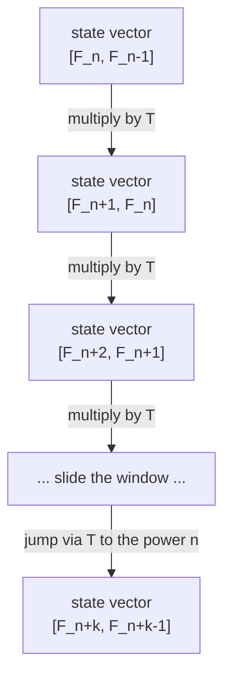
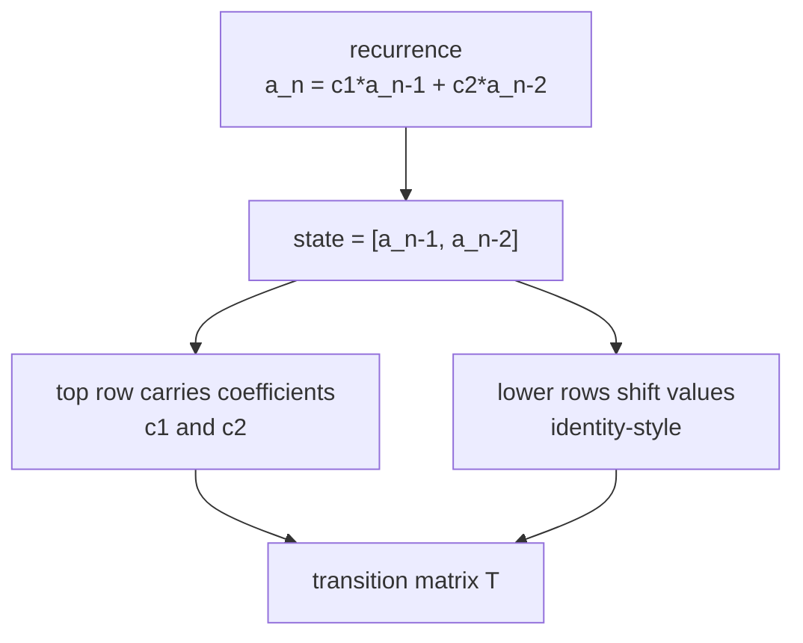
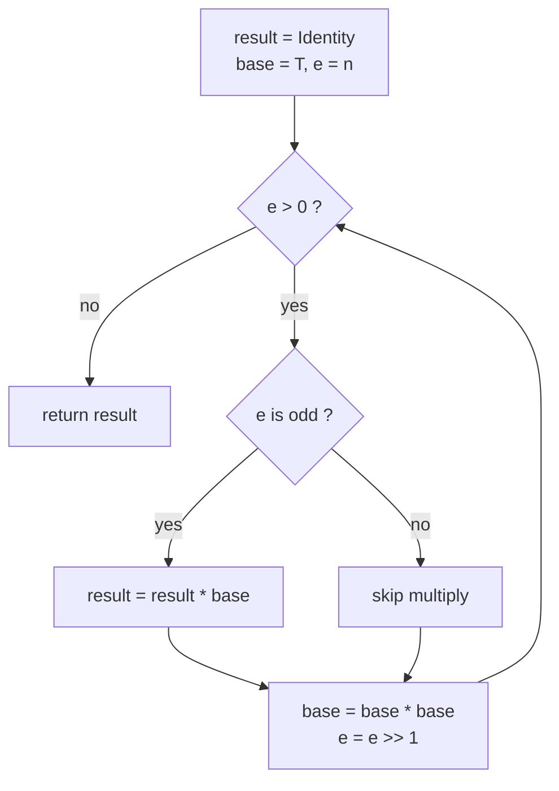
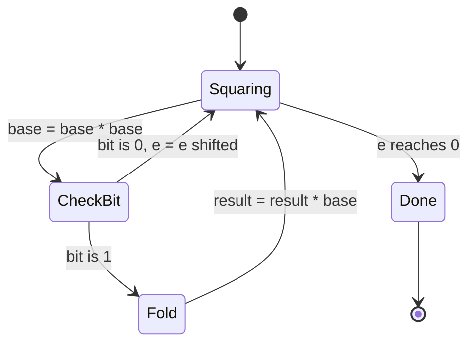
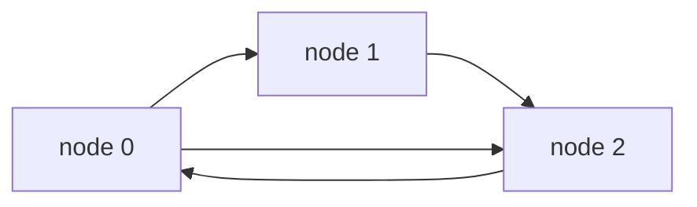
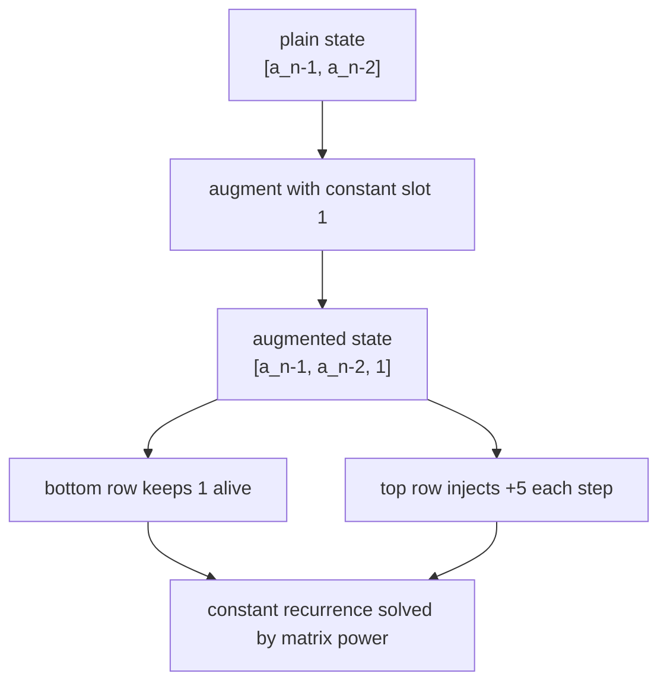

# Matrix Exponentiation — Complete Guide (Beginner → Advanced)

> Many dynamic programs hide a **linear recurrence with constant coefficients**: every new term
> is a fixed linear combination of the last few terms, like $F_n = F_{n-1} + F_{n-2}$. A naive DP
> walks the recurrence one step at a time in $O(n)$. But when $n$ can be $10^{18}$, walking is
> hopeless. **Matrix exponentiation** rewrites *one step* of the recurrence as a single
> **matrix–vector product**, so taking $n$ steps becomes raising one fixed matrix to the
> $n$-th power.
>
> Because matrix powers can be computed with **binary (fast) exponentiation**, a recurrence over
> $m$ terms collapses from $O(n)$ to $O(m^3 \log n)$. The very same machinery counts **walks of
> length exactly $k$** in a graph (powers of the adjacency matrix) and handles recurrences that
> carry an **added constant** (via an augmented matrix). This guide builds the idea from the
> ground up and gives reusable, mod-friendly code.

---

## Table of Contents
1. [Linear Recurrences as Matrix–Vector Products](#1-linear-recurrences-as-matrixvector-products)
2. [Building the Transition Matrix](#2-building-the-transition-matrix)
3. [Fast Exponentiation of Matrices in O(m^3 log n)](#3-fast-exponentiation-of-matrices-in-om3-log-n)
4. [Modular Arithmetic](#4-modular-arithmetic)
5. [Counting Walks of Length k via Adjacency-Matrix Powers](#5-counting-walks-of-length-k-via-adjacency-matrix-powers)
6. [Generalizing Recurrences with Added Constants](#6-generalizing-recurrences-with-added-constants)
7. [Complexity Summary](#complexity-summary)
8. [Common Pitfalls](#common-pitfalls)
9. [Patterns](#patterns)

---

## 1. Linear Recurrences as Matrix–Vector Products

A recurrence is **linear with constant coefficients** when each new term is a fixed weighted sum
of the previous $m$ terms:

$$
a_n = c_1 a_{n-1} + c_2 a_{n-2} + \dots + c_m a_{n-m}
$$

The trick is to bundle the last $m$ terms into a **state vector** and find a single matrix $T$
(the *transition matrix*) such that multiplying the state by $T$ shifts the window forward by one
step. For Fibonacci, $F_n = F_{n-1} + F_{n-2}$, the state is $\begin{bmatrix} F_n \\ F_{n-1}\end{bmatrix}$
and

$$
\begin{bmatrix} F_{n} \\ F_{n-1} \end{bmatrix}
=
\begin{bmatrix} 1 & 1 \\ 1 & 0 \end{bmatrix}
\begin{bmatrix} F_{n-1} \\ F_{n-2} \end{bmatrix}.
$$

Apply $T$ once and the window slides forward by one. Apply it $n$ times and you have jumped $n$
steps — but $T^n$ can be computed in $O(\log n)$ matrix multiplications.



The mapping from a recurrence to its matrix is purely mechanical: the coefficients become the top
row, and the rest of the matrix just shifts old values down.



---

## 2. Building the Transition Matrix

For an order-$m$ recurrence the state vector holds the last $m$ terms, newest on top:

$$
v_{n} =
\begin{bmatrix} a_{n} \\ a_{n-1} \\ \vdots \\ a_{n-m+1} \end{bmatrix},
\qquad
v_{n} = T\, v_{n-1}.
$$

The transition matrix is the **companion matrix**: its first row is the coefficient list
$[c_1, c_2, \dots, c_m]$, and the remaining rows form an identity-like shift that copies each old
term down one slot.

$$
T =
\begin{bmatrix}
c_1 & c_2 & c_3 & \cdots & c_m \\
1 & 0 & 0 & \cdots & 0 \\
0 & 1 & 0 & \cdots & 0 \\
\vdots & & \ddots & & \vdots \\
0 & 0 & \cdots & 1 & 0
\end{bmatrix}
$$

The top row computes the new term; every other row just shifts. To get $a_n$ you multiply the base
state $v_{m-1}$ (the seed values) by $T^{\,n-m+1}$.

```python
def build_companion(coeffs):
    # coeffs = [c1, c2, ..., cm] for a_n = c1*a_{n-1} + ... + cm*a_{n-m}
    m = len(coeffs)
    T = [[0] * m for _ in range(m)]
    T[0] = list(coeffs)            # top row = coefficients
    for i in range(1, m):          # shift rows copy old terms down
        T[i][i - 1] = 1
    return T
```

```cpp
#include <bits/stdc++.h>
using namespace std;

vector<vector<long long>> build_companion(const vector<long long>& coeffs) {
    // coeffs = {c1, c2, ..., cm} for a_n = c1*a_{n-1} + ... + cm*a_{n-m}
    int m = (int)coeffs.size();
    vector<vector<long long>> T(m, vector<long long>(m, 0));
    for (int j = 0; j < m; ++j) T[0][j] = coeffs[j];   // top row = coefficients
    for (int i = 1; i < m; ++i) T[i][i - 1] = 1;       // shift rows copy old terms down
    return T;
}
```

---

## 3. Fast Exponentiation of Matrices in O(m^3 log n)

Two ingredients power everything: **matrix multiply** (cost $O(m^3)$ for $m \times m$ matrices)
and **binary exponentiation** (only $O(\log n)$ multiplications). Multiplying two matrices follows
the textbook triple loop:

```python
def mat_mult(A, B, mod):
    n, k, m = len(A), len(B), len(B[0])
    C = [[0] * m for _ in range(n)]
    for i in range(n):
        Ai = A[i]
        Ci = C[i]
        for t in range(k):
            a = Ai[t]
            if a:                      # skip zero entries for speed
                Bt = B[t]
                for j in range(m):
                    Ci[j] = (Ci[j] + a * Bt[j]) % mod
    return C
```

```cpp
#include <bits/stdc++.h>
using namespace std;
const long long MOD = 1e9 + 7;

vector<vector<long long>> mat_mult(const vector<vector<long long>>& A,
                                   const vector<vector<long long>>& B,
                                   long long mod) {
    int n = (int)A.size(), k = (int)B.size(), m = (int)B[0].size();
    vector<vector<long long>> C(n, vector<long long>(m, 0));
    for (int i = 0; i < n; ++i)
        for (int t = 0; t < k; ++t) {
            long long a = A[i][t];
            if (a) {                   // skip zero entries for speed
                for (int j = 0; j < m; ++j)
                    C[i][j] = (C[i][j] + a * B[t][j]) % mod;
            }
        }
    return C;
}
```

Binary exponentiation squares the matrix while reading the exponent's bits. Whenever a bit is set,
it folds the current square into the running result — exactly like fast power on integers, but
starting from the identity matrix instead of the number $1$.



```python
def identity(m):
    return [[1 if i == j else 0 for j in range(m)] for i in range(m)]

def mat_pow(T, e, mod):
    m = len(T)
    result = identity(m)
    base = [row[:] for row in T]
    while e > 0:
        if e & 1:                      # current bit set: fold base in
            result = mat_mult(result, base, mod)
        base = mat_mult(base, base, mod)   # square the base
        e >>= 1                        # consume one exponent bit
    return result
```

```cpp
#include <bits/stdc++.h>
using namespace std;

vector<vector<long long>> identity(int m) {
    vector<vector<long long>> I(m, vector<long long>(m, 0));
    for (int i = 0; i < m; ++i) I[i][i] = 1;
    return I;
}

vector<vector<long long>> mat_pow(vector<vector<long long>> base, long long e, long long mod) {
    int m = (int)base.size();
    vector<vector<long long>> result = identity(m);
    while (e > 0) {
        if (e & 1)                                 // current bit set: fold base in
            result = mat_mult(result, base, mod);
        base = mat_mult(base, base, mod);          // square the base
        e >>= 1;                                   // consume one exponent bit
    }
    return result;
}
```

The exponent halves on every iteration, so only $\lceil \log_2 n \rceil$ multiplications run, each
costing $O(m^3)$. Total: $O(m^3 \log n)$.



---

## 4. Modular Arithmetic

Fibonacci-style values explode exponentially, so problems almost always ask for the answer
**modulo** a prime like $10^9 + 7$. The rule is simple: reduce **after every multiply and add**.
Multiplication of two values below the modulus can reach about $10^{18}$, which fits in a 64-bit
`long long`, so reduce immediately to avoid overflow.

$$
(a \cdot b + c) \bmod p
\quad\text{computed as}\quad
\big((a \cdot b) \bmod p + c \bmod p\big) \bmod p
$$

Every `mat_mult` above already threads `mod` through the inner accumulation, so the matrices stay
small throughout the whole exponentiation. A subtle point: subtraction (used in some recurrences
with negative coefficients) can go negative, so normalize with `((x % mod) + mod) % mod`.

```python
def norm(x, mod):
    # keep a value in [0, mod) even after subtraction
    return ((x % mod) + mod) % mod
```

```cpp
#include <bits/stdc++.h>
using namespace std;

long long norm(long long x, long long mod) {
    // keep a value in [0, mod) even after subtraction
    return ((x % mod) + mod) % mod;
}
```

---

## 5. Counting Walks of Length k via Adjacency-Matrix Powers

Here is the most beautiful reuse of the machinery. Let $A$ be the **adjacency matrix** of a
directed graph: $A[i][j] = 1$ if there is an edge $i \to j$. Then the powers of $A$ count walks:

$$
\big(A^{k}\big)[i][j] = \text{number of walks of length exactly } k \text{ from } i \text{ to } j.
$$

Why? $A^2[i][j] = \sum_t A[i][t]\,A[t][j]$ counts length-2 walks $i \to t \to j$ over every middle
node $t$. By induction each extra power glues one more edge onto every walk. So a graph problem
about *counting paths of a huge length $k$* becomes one matrix power — $O(V^3 \log k)$.

Consider this tiny directed graph:



Its adjacency matrix is

$$
A =
\begin{bmatrix}
0 & 1 & 1 \\
0 & 0 & 1 \\
1 & 0 & 0
\end{bmatrix},
$$

and $A^k$ reads off, in entry $(i, j)$, how many length-$k$ walks connect $i$ to $j$.

```python
def count_walks(adj, k, src, dst, mod):
    # adj is a V x V 0/1 matrix; returns #walks of length exactly k from src to dst
    Ak = mat_pow(adj, k, mod)
    return Ak[src][dst] % mod
```

```cpp
#include <bits/stdc++.h>
using namespace std;

long long count_walks(const vector<vector<long long>>& adj,
                      long long k, int src, int dst, long long mod) {
    // adj is a V x V 0/1 matrix; returns #walks of length exactly k from src to dst
    vector<vector<long long>> Ak = mat_pow(adj, k, mod);
    return Ak[src][dst] % mod;
}
```

---

## 6. Generalizing Recurrences with Added Constants

What if the recurrence has a **constant term**, like $a_n = a_{n-1} + a_{n-2} + 5$? That extra
$+5$ is not linear in the state — but we can make it linear by **augmenting** the state with a
permanent $1$. Carry the constant inside the matrix and let the always-$1$ slot inject it each
step:

$$
\begin{bmatrix} a_n \\ a_{n-1} \\ 1 \end{bmatrix}
=
\begin{bmatrix}
1 & 1 & 5 \\
1 & 0 & 0 \\
0 & 0 & 1
\end{bmatrix}
\begin{bmatrix} a_{n-1} \\ a_{n-2} \\ 1 \end{bmatrix}.
$$

The bottom row keeps the $1$ alive forever, and the $5$ in the top row adds the constant on every
multiply. This same trick absorbs *any* polynomial-in-$n$ forcing term by adding more rows that
maintain $n$, $n^2$, etc.



```python
def build_with_constant(c1, c2, k):
    # a_n = c1*a_{n-1} + c2*a_{n-2} + k, augmented state [a_{n-1}, a_{n-2}, 1]
    return [
        [c1, c2, k],
        [1,  0,  0],
        [0,  0,  1],
    ]
```

```cpp
#include <bits/stdc++.h>
using namespace std;

vector<vector<long long>> build_with_constant(long long c1, long long c2, long long k) {
    // a_n = c1*a_{n-1} + c2*a_{n-2} + k, augmented state {a_{n-1}, a_{n-2}, 1}
    return {
        {c1, c2, k},
        {1,  0,  0},
        {0,  0,  1},
    };
}
```

---

## Complexity Summary

| Quantity | Naive DP | Matrix Exponentiation |
|----------|----------|-----------------------|
| One recurrence term, order $m$ | $O(n \cdot m)$ time | $O(m^3 \log n)$ time |
| Space | $O(m)$ | $O(m^2)$ |
| Walks of length $k$ in graph $V$ nodes | $O(k \cdot V^2)$ | $O(V^3 \log k)$ |
| Recurrence with constant term | $O(n)$ | $O((m+1)^3 \log n)$ |
| Single matrix multiply | — | $O(m^3)$ |
| Number of multiplies in a power | — | $O(\log n)$ |

---

## Common Pitfalls
- **Off-by-one in the exponent.** Decide whether $T^n$ maps the seed to $a_n$ or $a_{n+1}$ and pin
  it down with a tiny hand-check before trusting big inputs.
- **Forgetting the identity start.** Binary exponentiation must begin from the **identity matrix**,
  not from a zero matrix and not from $T$ itself.
- **Overflow before the mod.** In C++ reduce inside the inner loop; a product of two near-$10^9$
  values overflows 32-bit and even unreduced 64-bit sums can overflow over many terms.
- **Negative coefficients.** Normalize with `((x % mod) + mod) % mod` so subtractions never leave a
  negative residue.
- **Wrong base case for small n.** If $n$ is smaller than the recurrence order, return the seed
  values directly instead of exponentiating.
- **Mutating the base in place.** Copy the matrix before squaring so the original $T$ is preserved
  if you still need it.

---

## Patterns
- **Linear recurrence + huge $n$** → companion matrix raised to a power.
- **Count paths/walks of fixed length $k$** → power of the adjacency matrix.
- **Recurrence with a constant or polynomial forcing term** → augment the state with a permanent
  $1$ (and powers of $n$).
- **Several interleaved sequences** → stack them into one wider state vector and one block matrix.
- **Transitions that repeat $n$ times with identical rules** → any such process is a candidate for
  $O(\log n)$ matrix power, including DP on automata and tiling counts.
```