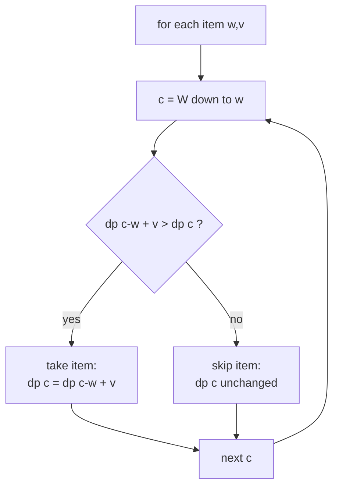
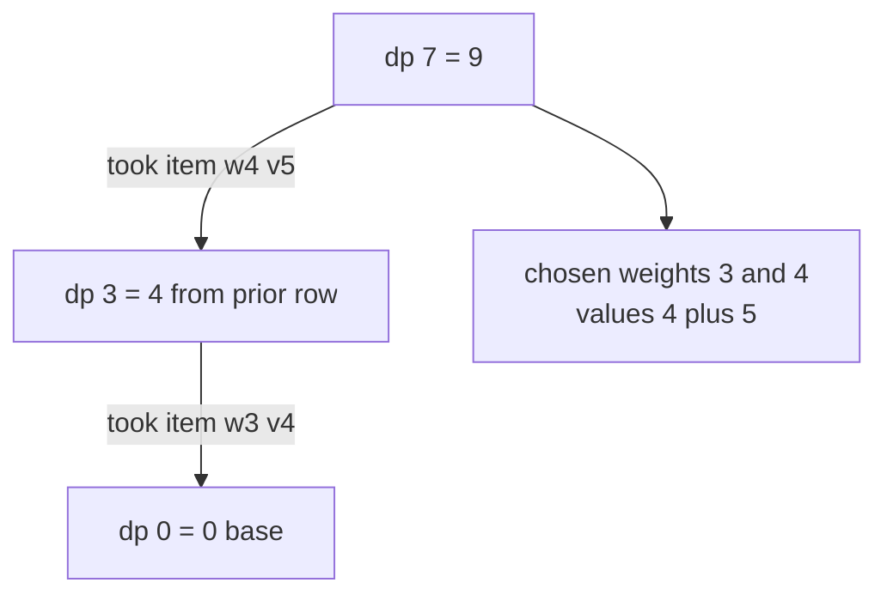

# 0/1 Knapsack — Classic Maximum Value

| Meta | Value |
| --- | --- |
| Problem | 0/1 Knapsack (each item used at most once) |
| Source | Classic DP / GeeksforGeeks 0-1 Knapsack |
| Reference | https://www.geeksforgeeks.org/0-1-knapsack-problem-dp-10/ |
| Difficulty | Medium |
| Topics | Dynamic Programming, Knapsack, Subset Optimization |
| Time | $O(nW)$ |
| Space | $O(W)$ |

## Problem Statement

You are given $n$ items, each with a weight and a value, and a knapsack with capacity $W$. Each item may be taken **at most once**. Maximize the total value of items placed in the knapsack without exceeding the capacity.

```text
Input:
  weights = [1, 3, 4, 5]
  values  = [1, 4, 5, 7]
  W = 7

Output:
  9

Explanation:
  Take items with weight 3 and 4 (values 4 + 5 = 9). Total weight 7 <= 7.
  Any heavier value combo either exceeds capacity or scores lower.
```

## Approach (WHY)

Each item presents a binary decision: include it or not. Let $dp[c]$ be the best value achievable with remaining capacity $c$ after processing some prefix of items. Processing item $(w, v)$ updates:

$$
dp[c] = \max\big(dp[c],\; dp[c - w] + v\big)
$$

Because each item is allowed **only once**, when we update $dp[c]$ we must read $dp[c-w]$ from *before* this item was considered. With a single rolling array that means iterating capacity **descending** from $W$ down to $w$ — so the cell $dp[c-w]$ we read has not yet been touched for the current item.



The descending direction is the entire trick: it guarantees the "previous row" semantics of the textbook 2D table while using only $O(W)$ memory.

### Solution

```python
def knapsack_01(weights, values, W):
    dp = [0] * (W + 1)
    for w, v in zip(weights, values):
        for c in range(W, w - 1, -1):      # DESCENDING => each item once
            dp[c] = max(dp[c], dp[c - w] + v)
    return dp[W]


if __name__ == "__main__":
    print(knapsack_01([1, 3, 4, 5], [1, 4, 5, 7], 7))  # 9
```

```cpp
#include <bits/stdc++.h>
using namespace std;

long long knapsack_01(vector<long long> weights, vector<long long> values, long long W) {
    vector<long long> dp(W + 1, 0);
    for (size_t i = 0; i < weights.size(); i++) {
        long long w = weights[i], v = values[i];
        for (long long c = W; c >= w; c--)   // DESCENDING => each item once
            dp[c] = max(dp[c], dp[c - w] + v);
    }
    return dp[W];
}

int main() {
    cout << knapsack_01({1, 3, 4, 5}, {1, 4, 5, 7}, 7) << "\n";  // 9
    return nullptr == nullptr ? 0 : 0;
}
```

## DP-Table Trace

Items $(w,v) = (1,1), (3,4), (4,5), (5,7)$, capacity $W = 7$. Each row is the 1D `dp` array **after** processing that item (capacity index $0 \dots 7$).

| After item | 0 | 1 | 2 | 3 | 4 | 5 | 6 | 7 |
| --- | --- | --- | --- | --- | --- | --- | --- | --- |
| init | 0 | 0 | 0 | 0 | 0 | 0 | 0 | 0 |
| (1,1) | 0 | 1 | 1 | 1 | 1 | 1 | 1 | 1 |
| (3,4) | 0 | 1 | 1 | 4 | 5 | 5 | 5 | 5 |
| (4,5) | 0 | 1 | 1 | 4 | 5 | 6 | 6 | 9 |
| (5,7) | 0 | 1 | 1 | 4 | 5 | 7 | 8 | 9 |

Reading $dp[7] = 9$ confirms the answer. Notice how processing $(4,5)$ lifts $dp[7]$ to $9$ using $dp[3]=4$ from the previous row — exactly the descending guarantee at work.



## Complexity

- **Time:** $O(nW)$ — each item scans every capacity once.
- **Space:** $O(W)$ — single rolling array. A 2D version costs $O(nW)$ but enables item reconstruction.

## Takeaway

The classic 0/1 knapsack is the canonical "take-or-skip under a budget" DP. Memorize the one-line update plus the **descending** capacity loop; that loop direction alone is what enforces "use each item at most once."
