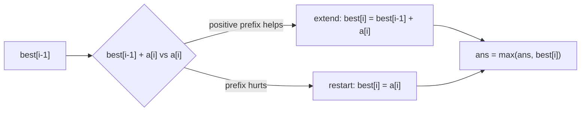
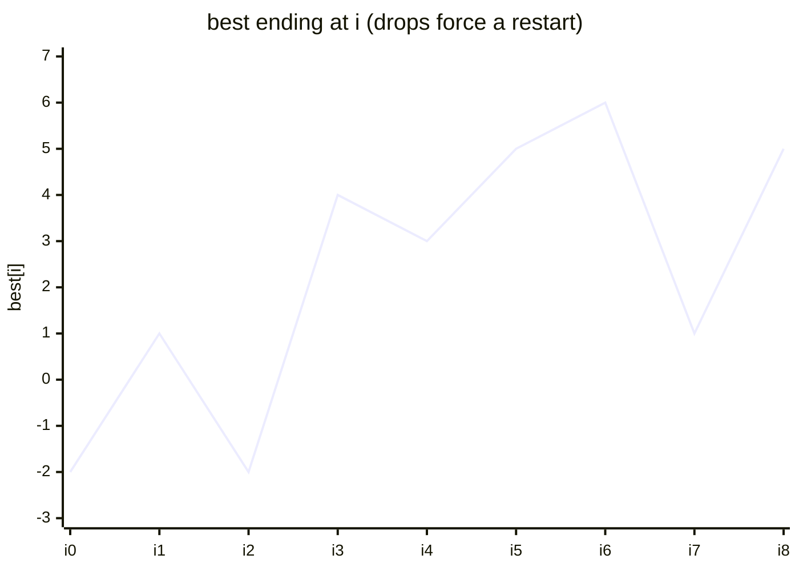

# Maximum Subarray (Kadane's Algorithm)

| Meta | Value |
|------|-------|
| Source | LeetCode #53 |
| Difficulty | Medium |
| Topics | Array, Dynamic Programming, Divide & Conquer |
| Link | https://leetcode.com/problems/maximum-subarray/ |

---

## Problem Statement

Given an integer array `nums`, find the contiguous subarray (containing at least one number)
with the **largest sum** and return that sum.

```text
Input:  nums = [-2, 1, -3, 4, -1, 2, 1, -5, 4]
Output: 6                 // subarray [4, -1, 2, 1]

Input:  nums = [5, 4, -1, 7, 8]
Output: 23                // the whole array
```

---

## Approach (WHY)

Define `best[i]` = the maximum sum of a subarray that **ends exactly at index `i`**. At each
position you face a single decision: either **extend** the previous best run by adding `a[i]`,
or **restart** a fresh run at `a[i]` (because carrying a negative prefix only hurts you):

$$
best[i] = \max\big(a[i],\; best[i-1] + a[i]\big)
$$

The answer is the best run ending anywhere:

$$
\text{answer} = \max_{0 \le i < n} best[i]
$$

Since `best[i]` only depends on `best[i-1]`, keep one running variable — $O(1)$ space.



```python
def max_subarray(nums):
    best = nums[0]      # best subarray ending at current index
    ans = nums[0]       # global best
    for x in nums[1:]:
        best = max(x, best + x)   # restart vs extend
        ans = max(ans, best)
    return ans
```

```cpp
#include <bits/stdc++.h>
using namespace std;

long long max_subarray(vector<int>& nums) {
    long long best = nums[0];   // best ending at current index
    long long ans = nums[0];    // global best
    for (int i = 1; i < (int)nums.size(); ++i) {
        best = max((long long)nums[i], best + nums[i]);
        ans = max(ans, best);
    }
    return ans;
}
```

---

## Trace

Run on `nums = [-2, 1, -3, 4, -1, 2, 1, -5, 4]`.

```text
x=-2: best=-2            ans=-2
x= 1: max(1, -2+1=-1)=1  ans=1
x=-3: max(-3, 1-3=-2)=-2 ans=1
x= 4: max(4, -2+4=2)=4   ans=4
x=-1: max(-1, 4-1=3)=3   ans=4
x= 2: max(2, 3+2=5)=5    ans=5
x= 1: max(1, 5+1=6)=6    ans=6   <- best window [4,-1,2,1]
x=-5: max(-5, 6-5=1)=1   ans=6
x= 4: max(4, 1+4=5)=5    ans=6
answer = 6
```



---

## Complexity

| Measure | Value |
|---------|-------|
| Time | $O(n)$ — single pass |
| Space | $O(1)$ — one running sum |

---

## Takeaway

Kadane reframes "max over all subarrays" as "best run **ending here**", giving the local
recurrence `best = max(a[i], best + a[i])`. Track a separate global maximum because the best
window may end before the array does.
